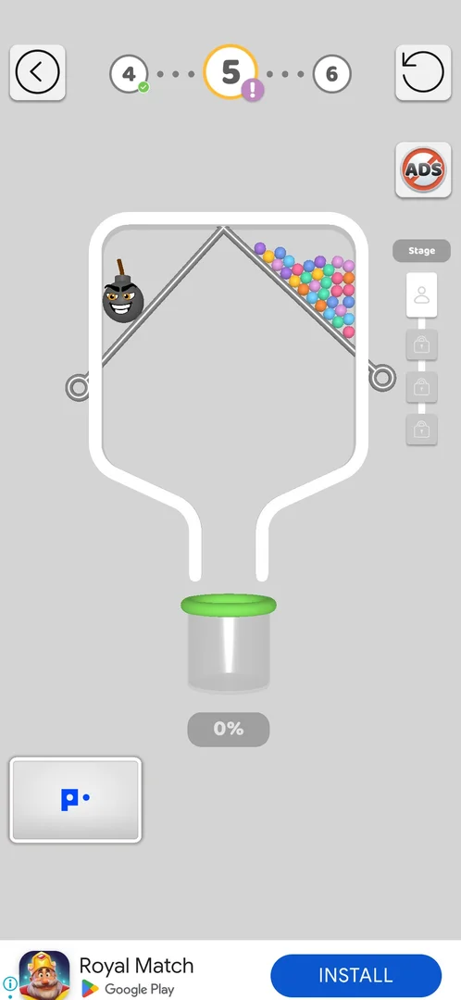
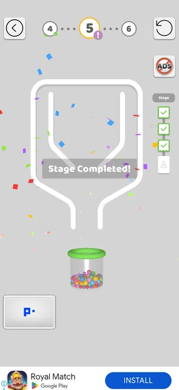
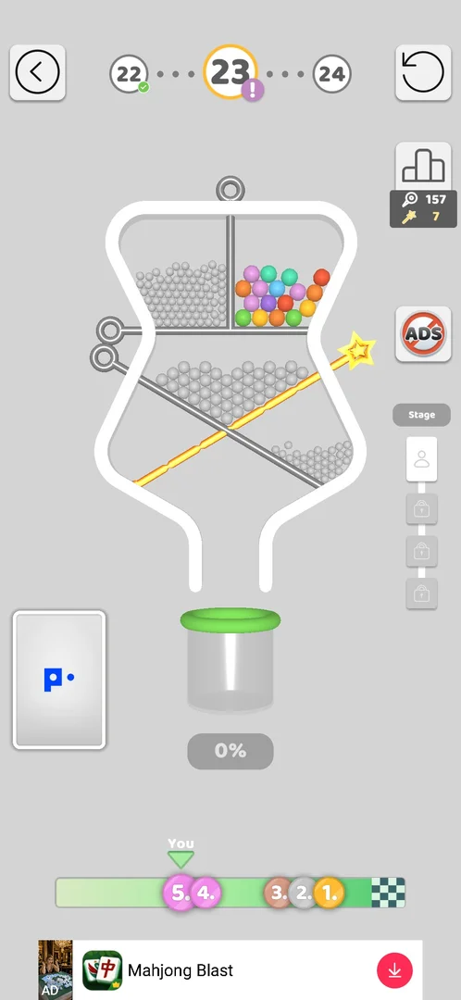
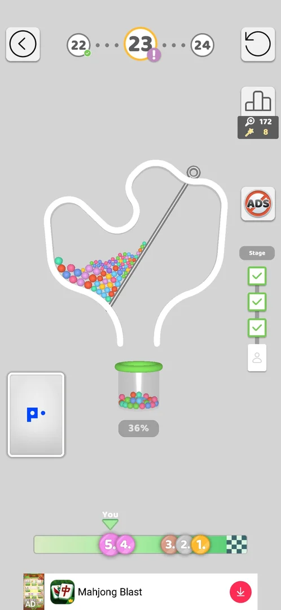
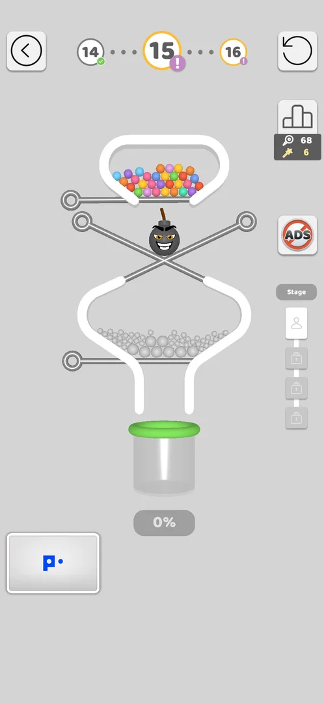
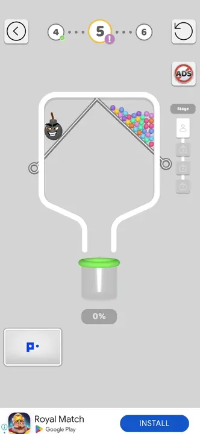
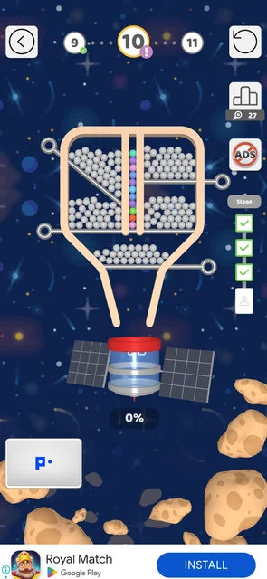
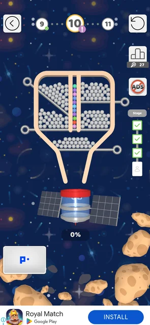

# Multi Stage Level

A level made of several pin-pull boards in a row. Levels 5, 10, 15 and 23 had four stages each [^s4]
[^s8] [^s14] [^s19]; each board is solved on its own,
a "Stage Completed!" banner follows, and the level counts as won after the last stage [^s4] [^s6]. On the map
these levels have a yellow ring, a ! badge and a "Multi Stage Level" label [^s5].

## Why it appeared

Level 5 (4 stages), map label on L5/L6/L10 [^s1].

## Where to find it

The map: a level node with a yellow ring and a purple ! badge, with a "Multi Stage Level" speech bubble beside
it (levels 5, 10, 15, 16) [^s5] [^s2]. It has no entry of its own: it is played with **Play!** like any
level [^s3] [^s10]. At level 10 the map's only "Multi Stage Level" bubble sat by level 16, not level 15 [^s10].

 [^s2]
*The map before level 4: levels 5 and 10 with a yellow ring and a ! badge, "Multi Stage Level" labels beside them*

 [^s18]
*The map at level 20 (version 241.5.2): the next "Multi Stage Level" bubble is by level 23; levels 21, 22 and 23 carry the yellow ring and ! badge*

On the map at level 24 the next "Multi Stage Level" bubble is by level 31, under the key box [^s22] (frame on
the [Keys on the map](map-keys.md) page).

## What it looks like

 [^s3]
*Level 5, stage 1: the level number with a yellow ring and ! badge; the Stage column at the right edge*

The level screen of a usual level, plus a **Stage** column at the right edge under the ADS button: one icon
per stage, the current stage as a figure, the next stages with locks [^s3]. The level number in the top bar
carries the same yellow ring and ! badge as on the map [^s3]. Done stages turn into green ticks; the last
stage's box shows a figure, inferred to be a boss stage [^s11].

 [^s7]
*Level 5 after stage 3: "Stage Completed!" over the board, three green ticks in the Stage column, stage 4 next*

 [^s19]
*Level 23 at stage 1 (version 241.5.2): the same Stage column, one current stage and three locked; this board has a golden star pin*

## What you can do

| Tab or button | What it does |
|---|---|
| [Stage column](#stage-column) | Shows the stages of the level: done (green tick), current (a figure), locked (a padlock); not a button |

### Stage column

 [^s20]
*Level 23 at stage 4: stages 1 to 3 ticked, stage 4 current*

On level 23 each won stage turned its box into a green tick; at stage 4 the column showed three ticks and
the figure [^s20]. Nothing in the column was tapped.

## How it works

Version 241.5.1.

- Level 5 had four stages, each a separate board with its own pins and cup [^s4] [^s6].
- When a stage's balls are in the cup the banner "Stage Completed!" shows, the stage's icon turns into a green
  tick and the next board comes [^s7].
- The whole level took 147 s; all four stages were solved on the first try [^s4].
- Level 10 had four stages too, all won on the first try in 306 s, including two interstitial video ads
  that came after stages 1 and 3 [^s8] (see
  [Interstitial video ad](interstitial.md)).
- The number of stages of a level is not fixed: level 10 was known with three stages from an earlier
  play and had four this time, in version 241.5.1
  [^s8]. The Stage column on the level screen shows the count.
- Stage progress is kept: a restart reloads only the current stage, and a quit to the map or an app exit
  keeps the stages already done; level 10 reopened at stage 4 with stages 1-3 ticked each time [^s11] [^s12]
  [^s13].
- No loss was seen, so what a lost stage costs (the stage or the whole level) is unknown.

Version 241.5.2, where it comes up: levels 5, 10 and 15 were Multi Stage levels; level 20 is not (it is a
Color Bucket level), and on the map at level 20 the next "Multi Stage Level" bubble is by level 23 [^s18]. The
guess "every 5th level" does not hold; no rule is known. So far: levels 5, 10, 15, 23, and the bubble by
level 31 on the map at level 24 [^s22].

Version 241.5.2, level 23.

- Level 23 has four stages, all won on the first try, in 296 s in total [^s21].
- An interstitial video ad played between stage 2 and stage 3. Its end card stood still for about 55 s with
  no close; the phone's Back key closed it and the level went on at stage 3, with stages 1 and 2 still
  ticked [^s21]. See [Interstitial video ad](interstitial.md).
- Stage 1 had a golden star pin; the golden pins counter went from 7 to 8 during the level and the pins
  counter from 157 to 172 by stage 4 [^s19] [^s20].
- After stage 4 the usual win flow came: the Silver League board with pins 173, golden pins 8 and a video
  button for +5 golden pins or **Next Level!**, then **Level completed!** with the win streak dial, the
  streak prize and the coins [^s21]. See [Win streak meter](win-streak.md).

Version 241.5.2, level 15.

- Level 15 has four stages: the Stage column shows four boxes, stage 1 current and three locked
  [^s15]. Stages 1 and 2 were played, each won on the first try
  [^s14] [^s16].
- A stage win is lost when the game is closed during the interstitial that follows it. Twice the ad after a
  stage win became a playable with no working close and the game was restarted; both times level 15 reopened
  at stage 1 with no ticked stage (once after stage 1, once after stage 2) [^s15]
  [^s17]. The pins counter by the league button kept what the stage gave (64 to
  68) [^s15]. On level 10 (version 241.5.1) an app exit at a stage, with no ad
  open, kept the stages done [^s13]. Inferred: a stage win is saved only after the ad that follows it ends.
  See [Interstitial video ad](interstitial.md#dead-playable).

 [^s15]
*Level 15 after the game was restarted during the ad that followed the stage 1 win: stage 1 again, no stage ticked*

 [^s6]
*Clip 3.7 s · [original on YouTube from 3:37](https://youtu.be/cirqlD7KGWI?t=217); stage 1 solved with one pin*

## Outcomes

| Outcome | As the base or what differs | Frame |
|---|---|---|
| win <!-- case:under-win --> | Differs: the usual "Level completed!" screen after the last stage (+23 coins, gift bar 62%), plus the x2-x5 video coin multiplier, first seen here [^s4]; after level 10 the flow was Puzzle Piece Found, the Bronze League leaderboard, then "Incredible! Level completed!" (+19 coins) with the multiplier again [^s8] [^s9]; after level 23 (version 241.5.2) the league board, then Level completed! with the streak dial, no multiplier bar seen [^s21] |  |
| restart <!-- case:under-restart --> | Differs: the base's "You can do better!" popup and interstitial, then only the current stage reloads; earlier stages stay ticked (level 10, stage 4) [^s11] |  |
| quit <!-- case:under-quit --> | As the base (the back arrow, map at once, no cost), plus: Play! reopens the level at the same stage, stages done kept [^s12] |  |
| exit app <!-- case:under-exit-app --> | Stage progress survives: level 10, left at stage 4 in the previous session, opened at stage 4 with stages 1-3 ticked after the app was closed and relaunched [^s13] |  |
| colours mixed <!-- case:under-colour-mix --> | not verified: the colour-mix fail applies only on a board with colour cups; no Multi Stage level with colour cups seen | — |
| balls fell out <!-- case:under-balls-out --> | not verified: the "Balls fell out of the level!" loss was seen so far only on level 11, an ordinary level (see [Pin-pull level](core-level.md#level-failed)) | — |

## Cases

| Case | What was done | Result | Source |
|---|---|---|---|
| Map node with a yellow ring, a ! badge and a 'Multi Stage Level' speech bubble (L5, L10, L15, L16) <!-- case:chk-announce --> | Looked at the map | ✅ Seen | [^s5] |
| Several boards in a row in one level (L5: 4 stages), each solved separately; the level is won after the last stage <!-- case:chk-differs --> | Played level 5 | ✅ Four stages | [^s4] |
| Same 'Level completed' screen after the last stage; L5 win +23 coins with the x2-x5 video multiplier offer <!-- case:chk-win --> | Won level 5 | ✅ As the base plus the multiplier | [^s4] |
| Why it appeared <!-- case:chk-appeared --> | Won level 4 | ✅ Level 5 | [^s1] |
| No own entry: a map node with a yellow ring and a 'Multi Stage Level' bubble, opened by Play! <!-- case:chk-entry --> | Played levels 5 and 10 from Play! | ✅ The marked node on the map | [^s10] |
| Level screen with a Stage column on the right (ticked stages, the last one a boss) <!-- case:chk-screen --> | Played levels 5 and 10 | ✅ The Stage column, frames above | [^s11] |
| Map tooltip 'Multi Stage Level' next to L16 (not L15) <!-- case:map-label-l16 --> | Looked at the map at level 10 | ✅ The bubble by level 16; the every-5th-level guess may be wrong | [^s10] |
| L10 had 4 stages this time (the board library had 3 for it): the stage count of a level is not fixed between installs or versions <!-- case:stage-count-varies --> | Played level 10 | ✅ Four stages | [^s8] |
| L15 is a multi stage level with 4 stages (Stage column: 4 slots); library boards L15-s1 and L15-s2 won by the solver <!-- case:l15-four-stages --> | Played level 15 stages 1 and 2 | ✅ Four stages; stages 1 and 2 won | [^s14] |
| Stage progress is lost when the app is closed during the between-stage interstitial <!-- case:stage-lost-in-ad --> | Restarted the game twice during a stuck ad after a stage win | ✅ Level 15 reopened at stage 1 both times; the pins counter kept 68 | [^s15] |
| Each loss <!-- case:chk-loss --> | — | not verified: no stage lost |  |
| Retry and continue offers <!-- case:chk-retry --> | — | not verified |  |
| All four stages of level 23 won <!-- case:win-all-stages --> | Played level 23 | ✅ Four stages in a row, each ticked in the Stage column; after stage 4 the usual league board and Next Level! flow (pins 157 to 173, golden pins 7 to 8) | [^s21] |
| An ad between stages <!-- case:between-stage-ad --> | Played level 23 | ✅ An interstitial video after stage 2; Back on its frozen end card returned to stage 3, stages kept | [^s21] |
| Where and how often it comes up <!-- case:chk-frequency --> | Looked at the map at level 20 | ✅ Not every 5th level: levels 5, 10 and 15 were Multi Stage, level 20 is not (a Color Bucket level); the next Multi Stage Level bubble is by level 23 | [^s18] |

## Not verified

- Each loss: the fail screen and whether a lost stage costs the whole level <!-- case:chk-loss -->
- Retry and continue offers after a lost stage; whether a retry starts at the same stage <!-- case:chk-retry -->
- Whether the coin multiplier comes with every Multi Stage win (levels 5 and 10: yes).
- What decides a level's stage count (level 10: three stages before, four now).
- Balls fell out under a Multi Stage level: as the base, or what differs <!-- case:under-balls-out -->
- Colours mixed (the Color Bucket fail) under a Multi Stage level, if a stage has colour cups <!-- case:under-colour-mix -->

[^s1]: session 20261003-203702-chrono-2FYKPJ, step 19 — [video at 6:01](https://youtu.be/cirqlD7KGWI?t=361)
[^s2]: session 20261003-203702-chrono-2FYKPJ, step 7 — [video at 2:10](https://youtu.be/cirqlD7KGWI?t=130)
[^s3]: session 20261003-203702-chrono-2FYKPJ, step 12 — [video at 3:24](https://youtu.be/cirqlD7KGWI?t=204)
[^s4]: session 20261003-203702-chrono-2FYKPJ, step 18 — [video at 5:47](https://youtu.be/cirqlD7KGWI?t=347)
[^s5]: session 20261003-203702-chrono-2FYKPJ, step 5 — [video at 1:43](https://youtu.be/cirqlD7KGWI?t=103)
[^s6]: session 20261003-203702-chrono-2FYKPJ, step 13 — [video at 3:40](https://youtu.be/cirqlD7KGWI?t=220)
[^s7]: session 20261003-203702-chrono-2FYKPJ, step 17 — [video at 5:11](https://youtu.be/cirqlD7KGWI?t=311)

[^s8]: session 20261003-211035-chrono-2FYKPJ, step 14 — [video at 6:19](https://youtu.be/Mpfk4cqdltQ?t=379)
[^s9]: session 20261003-211035-chrono-2FYKPJ, step 16 — [video at 6:59](https://youtu.be/Mpfk4cqdltQ?t=419)
[^s10]: session 20261003-214021-chrono-2FYKPJ, step 30 — [video at 7:39](https://youtu.be/siJO2QCuGxI?t=459)
[^s11]: session 20261003-214021-chrono-2FYKPJ, step 29 — [video at 7:04](https://youtu.be/siJO2QCuGxI?t=424)
[^s12]: session 20261003-214021-chrono-2FYKPJ, step 24 — [video at 5:37](https://youtu.be/siJO2QCuGxI?t=337)
[^s13]: session 20261003-214021-chrono-2FYKPJ, step 21 — [video at 4:51](https://youtu.be/siJO2QCuGxI?t=291)

[^s14]: session 20261005-141756-chrono-2FYKPJ, step 17 — [video at 4:21](https://youtu.be/pvvfGQcAObg?t=261)
[^s15]: session 20261005-141756-chrono-2FYKPJ, step 13 — [video at 3:55](https://youtu.be/pvvfGQcAObg?t=235)
[^s16]: session 20261005-141756-chrono-2FYKPJ, step 21 — [video at 4:55](https://youtu.be/pvvfGQcAObg?t=295)
[^s17]: session 20261005-141756-chrono-2FYKPJ, step 22 — [video at 5:58](https://youtu.be/pvvfGQcAObg?t=358)

[^s18]: session 20261005-235042-chrono-2FYKPJ, step 30 — [video at 11:02](https://youtu.be/PZ3ujKA8euo?t=662)

[^s19]: session 20261006-033538-chrono-2FYKPJ, step 31 — [video at 11:59](https://youtu.be/j9sNlnJxE4Y?t=719)
[^s20]: session 20261006-033538-chrono-2FYKPJ, step 48 — [video at 16:14](https://youtu.be/j9sNlnJxE4Y?t=974)
[^s21]: session 20261006-033538-chrono-2FYKPJ, step 49 — [video at 16:33](https://youtu.be/j9sNlnJxE4Y?t=993)
[^s22]: session 20261006-033538-chrono-2FYKPJ, step 55 — [video at 20:02](https://youtu.be/j9sNlnJxE4Y?t=1202)
