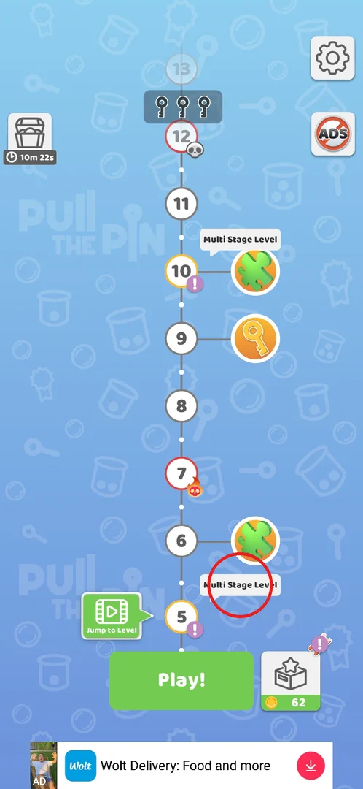
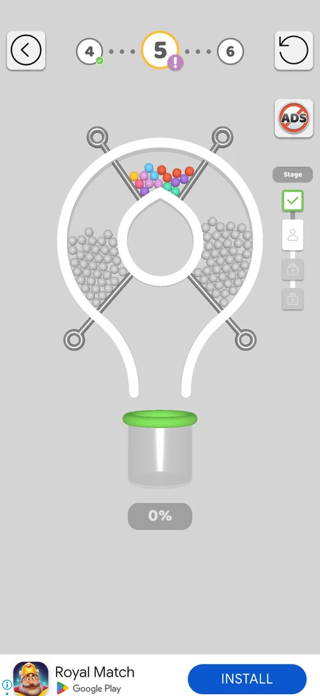
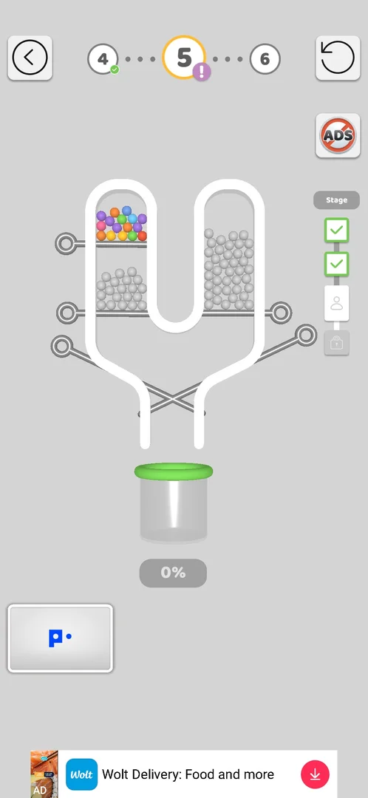
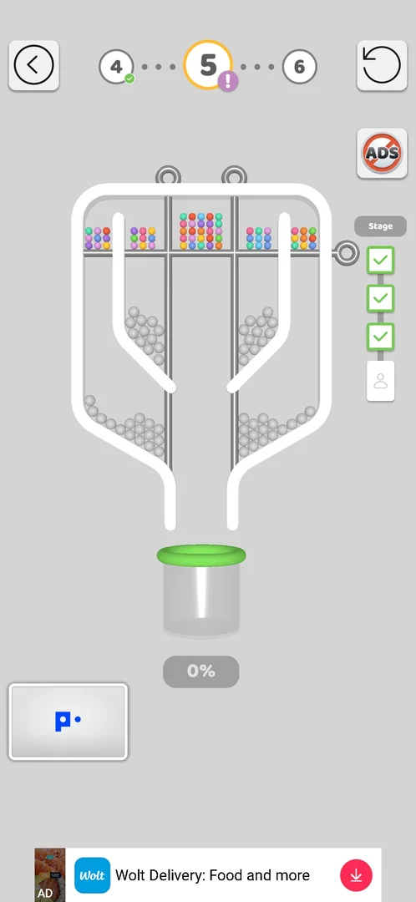
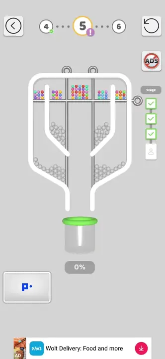
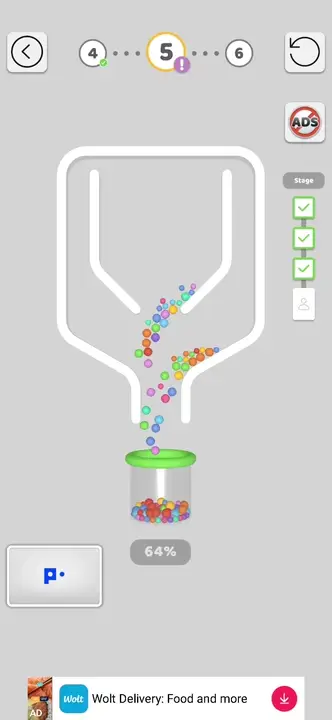
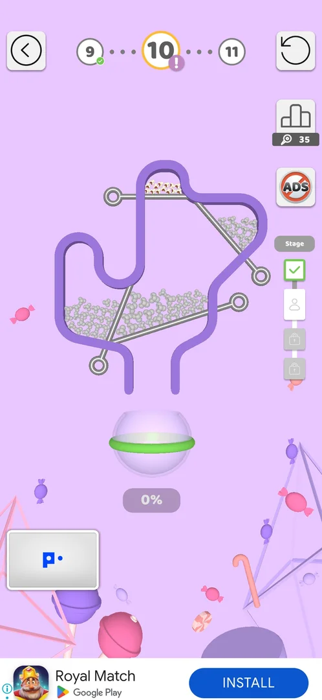
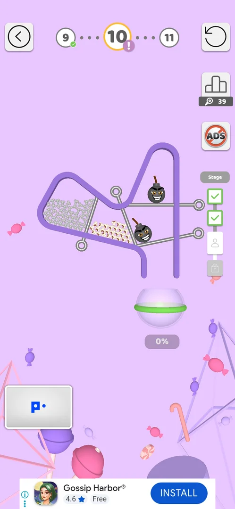
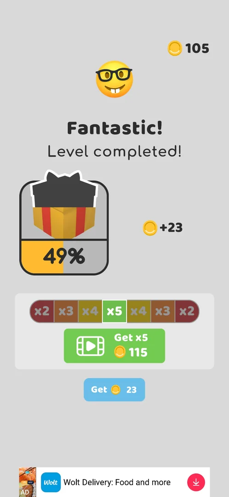

# Multi Stage levels

A Multi Stage level is an ordinary pin-pull level split into several boards played one after another:
clearing a board checks off a cell on the Stage panel and loads the next board, and the level counts as
won only after the last stage [^s3] [^s8]. Level 5 had 4 stages [^s2]; level 10 also has a 4-cell Stage
panel [^s6]. It has no screen or button of its own: the level type is marked on the level map and played
from the usual Play! button.

## Where to find it

On the level map, a white label **"Multi Stage Level"** hangs over the level that is multi-stage; the
level number also carries a purple "!" until it is played [^s1]. Labels were seen over levels 5 and 10
[^s1] and over level 15 [^s9]; that every fifth level is multi-stage is an inference from these three.
When the marked level is the current one, the green **Play!** button at the bottom of the map starts it [^s2].

 [^s1]

> ⚠️ Previously (v241.3.1, 2026-09-30): "Levels with a puzzle icon on the map (5, 10, 15)". The frames show
> the green puzzle-piece icons next to levels 6, 10 and 14, not 5 and 15 [^s1] [^s9]; the multi-stage
> mark is the "Multi Stage Level" label. What the puzzle piece means (a reward for the puzzle collection
> is the likely reading) is not verified here.

## What it looks like

The level screen is the normal one: back arrow to the map at the top left, the level strip
(previous · current · next) at the top, restart at the top right, the cup and its fill percentage at the
bottom [^s2]. What is new is the **Stage** panel on the right edge: a column of cells, the active stage
shown with a person icon, finished stages with a green check, later stages with a padlock [^s2] [^s3].
On level 5 a small Popcore widget sat at the bottom left (likely cross-promotion, not verified) [^s2].

 [^s2]

## What you can do

The only controls are those of a normal level (pull pins, back, restart); the sections below are the
stages in the order the player meets them.

| Tab or button | What it does |
|---|---|
| [Stage 2](#stage-2) | After stage 1, the panel checks it off and a new board loads |
| [Stage 3](#stage-3) | Third board of level 5, two cells checked |
| [Stage 4](#stage-4) | Final board of level 5; clearing it wins the level |
| [Ad between stages](#ad-between-stages) | Level 10: an interstitial ad plays between stage 1 and stage 2 |
| [Level 10, stage 3](#level-10-stage-3) | Level 10, stage 3: bombs in the right column |

### Stage 2

Stage 1 of level 5 was cleared with a single pull of the right pin: the balls rolled into the cup and the
bomb stayed behind [^s3]. The panel then showed a check for stage 1 and opened stage 2, a light-bulb shaped
board with coloured balls on two top pins and grey piles on two lower ones [^s3].

 [^s3]

### Stage 3

Third board of level 5: coloured balls over a grey pile in the left column, grey balls in the right one,
crossed pins over the cup [^s4].

 [^s4]

### Stage 4

The final board of level 5: one horizontal pin under five compartments of coloured balls and two vertical
dividers [^s5]. Pulling the horizontal pin and then both dividers sent everything into the cup and ended
the level with "Fantastic!" [^s8].

 [^s5]

*Clip 16 s · [original on YouTube from 15:00](https://youtu.be/BVqoYRE5kRU?t=900)*

*Clip 16 s · [original on YouTube from 15:16](https://youtu.be/BVqoYRE5kRU?t=916)*

### Ad between stages

On level 10 (v241.5.1) an interstitial video ad played between stage 1 and stage 2, in the middle of the
level; after it the Stage panel showed stage 1 checked and the stage 2 board [^s6].

 [^s6]

### Level 10, stage 3

Stages 1 and 2 of level 10 took 2 and 4 pulls; the session stopped at stage 3 for its budget, not for
difficulty [^s7]. Stage 3 has two bombs in the right column, grey balls on the left and popcorn in the
middle [^s7].

 [^s7]

### Result

After the last stage of level 5 the usual win screen came: +23 coins, the gift bar from 41% to 49% [^s8].
This was also the first win screen with the reward multiplier: a sliding x2–x5 bar, "Get x5" for a video
(115 coins) or "Get 23" without one [^s8].

 [^s8]

## How it works

- The Stage panel has one cell per stage; level 5 had 4 stages (v241.3.1) [^s2], level 10 shows 4 cells (v241.5.1) [^s6].
- Clearing a board (balls in the cup) checks off its cell and loads the next board within the same level [^s3].
- The win screen and the reward come once, after the last stage: level 5 gave +23 coins and +8% gift (v241.3.1) [^s8].
- An interstitial ad can play between stages (level 10, v241.5.1) [^s6].
- Stages can contain bombs, as in normal levels: level 5 stage 1 [^s2], level 10 stage 3 [^s7].

## Cases

| Case | What was done | Result | Source |
|---|---|---|---|
| Play a multi-stage level | Played level 5 through all 4 stages | Won with "Fantastic!", +23 coins | [^s8] |
| Partial multi-stage level | Played level 10, stages 1–2, stopped at stage 3 | Stages 1–2 cleared in 2 and 4 pulls | [^s7] |
| Interstitial between stages: does stage progress survive a restart | — | not verified | [^s7] |

## Not verified

- Whether stage progress survives leaving the level or restarting the app mid-level (e.g. after the interstitial between stages) [^s7].
- Whether every fifth level is multi-stage (seen: 5, 10, 15) and whether all of them have 4 stages.
- Whether the restart button restarts the current stage or the whole level.
- What the green puzzle-piece icons on the map mean.

[^s1]: session 20260930-192115-chrono-2FYKPJ, step 28 — [video at 5:21](https://youtu.be/BVqoYRE5kRU?t=321)
[^s2]: session 20260930-192115-chrono-2FYKPJ, step 59 — [video at 13:30](https://youtu.be/BVqoYRE5kRU?t=810)
[^s3]: session 20260930-192115-chrono-2FYKPJ, step 60 — [video at 13:47](https://youtu.be/BVqoYRE5kRU?t=827)
[^s4]: session 20260930-192115-chrono-2FYKPJ, step 64 — [video at 14:39](https://youtu.be/BVqoYRE5kRU?t=879)
[^s5]: session 20260930-192115-chrono-2FYKPJ, step 69 — [video at 15:22](https://youtu.be/BVqoYRE5kRU?t=922)
[^s6]: session 20261001-054205-chrono-2FYKPJ, step 60
[^s7]: session 20261001-054205-chrono-2FYKPJ, step 64
[^s8]: session 20260930-192115-chrono-2FYKPJ, step 72 — [video at 15:49](https://youtu.be/BVqoYRE5kRU?t=949)
[^s9]: session 20261001-054205-chrono-2FYKPJ, step 56
