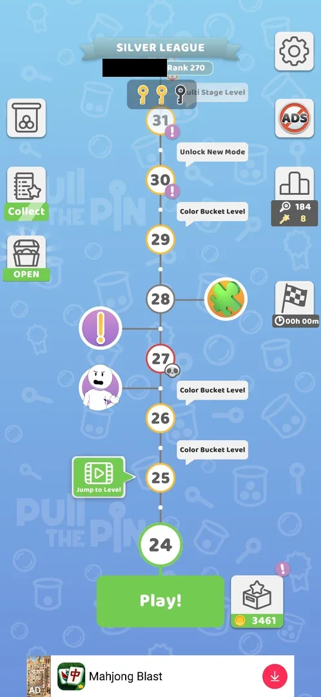
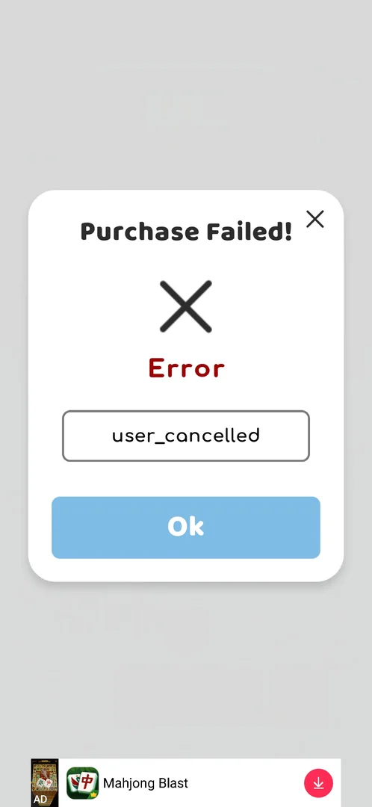

# Remove Ads

A button marked with the word ADS crossed out by a red prohibition sign, on the level screen and on the map
[^s1] [^s5]. A tap on it opens the Google Play payment sheet at once: the game has no Remove Ads screen, no
pack list and no price of its own [^s4]. The game shows banner ads at the bottom of the level, win and
Settings screens from level 1 [^s2] [^s1].

## Why it appeared

Always on the level screen, ADS button top right, from level 1 [^s1]; on the map it is in the right-hand
column of buttons (seen at level 24) [^s5].

## Where to find it

The map: the square crossed-out **ADS** button in the right-hand column, under the settings gear [^s5].

 [^s5]
*The map: the crossed-out ADS button under the settings gear, top right*

The level screen: the same button under the restart button, top right; it is there from level 1 [^s1] [^s3].

 [^s1]
*The crossed-out ADS button under restart, top right of the level screen*

## What it looks like

<!-- no-screen: the game has no Remove Ads screen; the ADS button opens the Google Play payment sheet, another app, which is not shown -->
There is no screen in the game: the tap on the map's ADS button brought up the Google Play payment sheet
directly [^s4]. The sheet (with the product's name and price) belongs to Google Play and is not shown here;
the session closed it without buying [^s4]. What the purchase removes (banners, full-screen ads or both) is
not shown anywhere in the game. Hypothesis: it removes the banner and full-screen ads, not verified.

## What you can do

| Tab or button | What it does |
|---|---|
| [Purchase Failed!](#purchase-failed) | The game's popup after the payment sheet is cancelled |

### Purchase Failed!

 [^s4]
*After cancelling the payment sheet: Purchase Failed!, Error, user_cancelled, Ok*

Cancelling the payment sheet brings up **Purchase Failed!**: a large X, **Error** in red, the code
**user_cancelled** in a box, a blue **Ok** button and an X close button at the top right [^s4]. **Ok** closed
it and returned to the map, with nothing else following; the banner ad was still shown [^s5].

## How it works

Version 241.5.2.

- One product behind one button: the ADS button goes straight to the Google Play payment sheet; there is no
  in-game offer, pack list or price [^s4].
- No timer or limit: the button is permanent on the map and the level screen [^s5].
- Banner ads were seen on the level screen from the first pin pull, on the win screens and in Settings
  (version 241.5.1) [^s2] [^s1]; a full-screen video ad also followed leaving a Merge Balls level
  (see [Merge Balls](mode-merge-balls.md)).

## Cases

| Case | What was done | Result | Source |
|---|---|---|---|
| Where to find it <!-- case:chk-entry --> | Looked at the level screen and the map | ✅ The crossed-out ADS button under restart on the level screen, and in the map's right-hand column | [^s1] [^s5] |
| Why it appeared <!-- case:chk-appeared --> | First launch | ✅ On the level screen from level 1 | [^s1] |
| What it looks like: its screen <!-- case:chk-screen --> | Tapped the ADS button on the map | ✅ No screen of its own: the Google Play payment sheet opens at once; cancelling shows Purchase Failed! user_cancelled | [^s4] |
| Contents and price <!-- case:chk-contents --> | Tapped the ADS button on the map | ✅ No pack list in the game: one product; its price is only on the Google Play sheet | [^s4] |
| How often it comes up by itself <!-- case:chk-frequency --> | — | not verified: no offer came up by itself |  |
| Its timer or limit <!-- case:chk-timer --> | Looked at the map and the level screen | ✅ Does not apply: a permanent button, no timer or limit | [^s5] |
| The way to buy, up to the price button <!-- case:chk-buy-path --> | Tapped the ADS button | ✅ One tap: ADS button, then the Google Play payment sheet; no price shown in the game | [^s4] |
| Closing it <!-- case:chk-close --> | Dismissed the payment sheet, tapped Ok | ✅ No game screen to close: after the sheet is dismissed the game shows Purchase Failed! with Ok and X; Ok returns to the map, nothing else follows | [^s5] |
| Cancelling the purchase <!-- case:cancel-purchase --> | Closed the payment sheet without buying | ✅ Purchase Failed! user_cancelled with Ok; ads still shown afterwards | [^s4] [^s5] |

## Not verified

- How often it comes up by itself (after a level, a loss, a session start) and whether it comes back <!-- case:chk-frequency -->

[^s1]: session 20261003-193015-chrono-2FYKPJ, step 5 — [video at 1:53](https://youtu.be/JjeHh2uiLgE?t=113)
[^s2]: session 20261003-193015-chrono-2FYKPJ, step 3 — [video at 1:22](https://youtu.be/JjeHh2uiLgE?t=82)
[^s3]: session 20261003-193015-chrono-2FYKPJ, step 2 — [video at 0:55](https://youtu.be/JjeHh2uiLgE?t=55)
[^s4]: session 20261006-060944-chrono-2FYKPJ, step 8 — [video at 3:13](https://youtu.be/QrD_qekwXHQ?t=193)
[^s5]: session 20261006-060944-chrono-2FYKPJ, step 9 — [video at 4:00](https://youtu.be/QrD_qekwXHQ?t=240)
