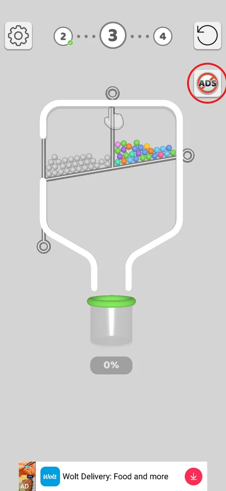
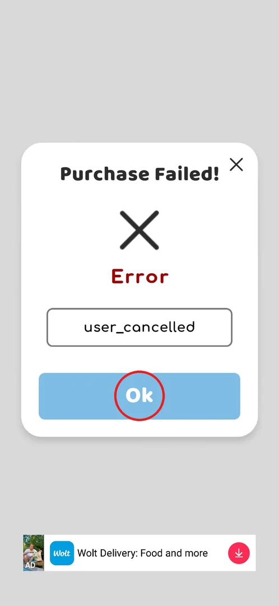
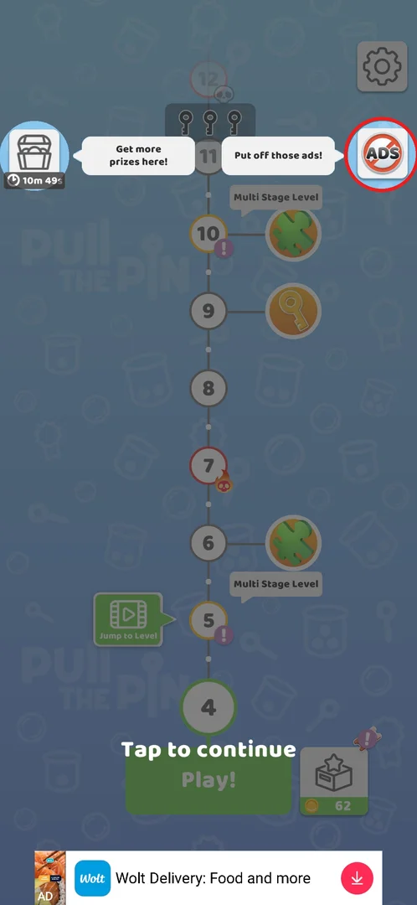

# Remove ads (No ADS)

> Recheck on v241.5.1: documented on 241.3.1; Google Play has 241.5.1.

No ADS is the game's paid offer to remove ads: a round button with a crossed-out "ADS" that sits on the
level screen and on the level map. Tapping it opens the Google Play payment sheet "Remove Ads" for
RSD 999 directly, with no in-game offer screen in between [^s2]. Backing out of the sheet only shows a
"Purchase Failed!" popup; nothing is bought [^s3].

## Where to find it

On any level screen: the No ADS button at the top right, just under the restart button [^s2].

 [^s1]

The same button is also on the level map, at the top right (see [No ADS on the map](#no-ads-on-the-map)) [^s4].

## What it looks like

<!-- no-screen: the feature has no in-game screen; the No ADS button opens the Google Play payment sheet "Remove Ads" directly, and that sheet is a Google Play screen, not the game's, so it is not published -->

The game shows nothing of its own between the button and the payment: the Google Play sheet "Remove
Ads" comes up with the price RSD 999 and a 1-tap buy button [^s2]. The only screen of the game that
belongs to the feature is the popup after cancelling ([Purchase Failed!](#purchase-failed)).

## What you can do

| Tab or button | What it does |
|---|---|
| [Purchase Failed!](#purchase-failed) | Backing out of the Google Play sheet shows "Purchase Failed! Error: user_cancelled"; Ok returns to the level |
| [No ADS on the map](#no-ads-on-the-map) | The same No ADS button on the level map, with the hint "Put off those ads!" |

### Purchase Failed!

After back on the payment sheet the game shows a popup "Purchase Failed!" with a red "Error" and the raw
error code `user_cancelled` in a box — the code is shown to the player as is. Ok (circled) or the cross
closes it and returns to level 3; nothing is bought [^s3].

 [^s3]

### No ADS on the map

On the level map that appears after a level is won, the No ADS button (circled) is at the top right,
highlighted, with the speech bubble "Put off those ads!"; opposite it on the left is the timed chest with
"Get more prizes here!" [^s4]. That it opens the same payment sheet is inferred, not tapped.

 [^s4]

## How it works

- Price: RSD 999 for "Remove Ads" on Google Play (v241.3.1) [^s3].
- One tap on No ADS goes straight to the payment sheet with 1-tap buy — a real purchase is one more tap
  away [^s2].

## Cases

| Case | What was done | Result | Source |
|---|---|---|---|
| Open the offer | Tapped No ADS on level 3 | Straight to the Google Play payment sheet "Remove Ads", RSD 999, with 1-tap buy; no in-game screen first | [^s2] [^s3] |
| Cancel | Backed out of the sheet | Popup "Purchase Failed! Error: user_cancelled" (the raw error code is shown to the player); nothing bought | [^s3] |

## Not verified

- What removing ads covers (banner, interstitials, rewarded videos) — never bought.
- Whether the map button opens the same sheet.
- Prices in other currencies and on v241.5.1.

[^s1]: session 20260930-192115-chrono-2FYKPJ, step 20 — [video at 3:38](https://youtu.be/BVqoYRE5kRU?t=218)
[^s2]: session 20260930-192115-chrono-2FYKPJ, step 21 — [video at 3:46](https://youtu.be/BVqoYRE5kRU?t=226)
[^s3]: session 20260930-192115-chrono-2FYKPJ, step 22 — [video at 3:54](https://youtu.be/BVqoYRE5kRU?t=234)
[^s4]: session 20260930-192115-chrono-2FYKPJ, step 26 — [video at 4:49](https://youtu.be/BVqoYRE5kRU?t=289)
