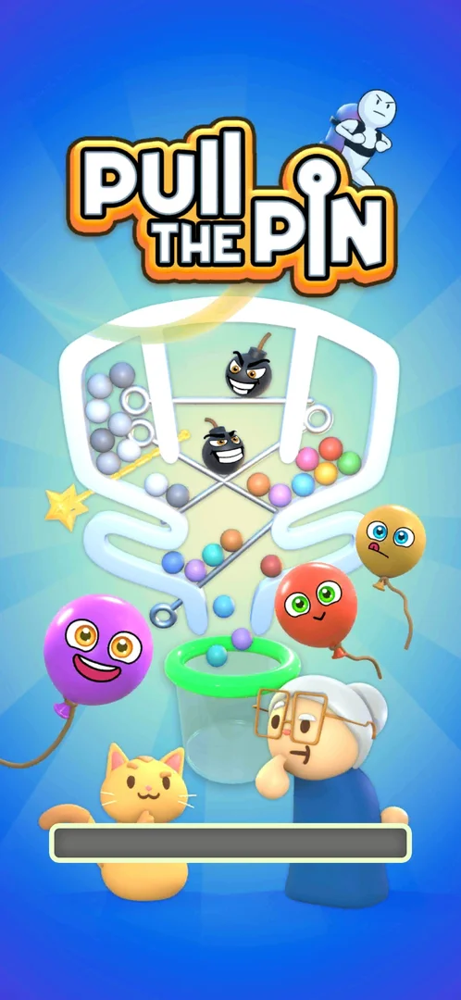
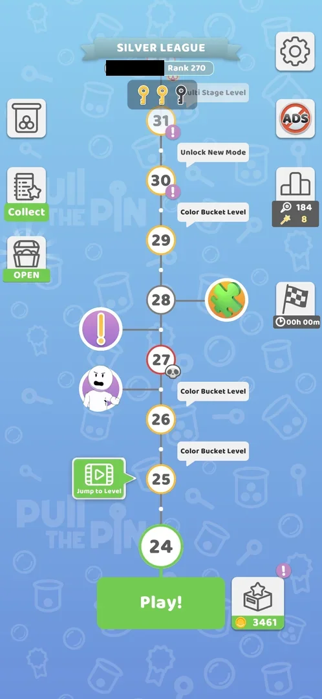

# Notification permission prompt

The Android system dialog that asks whether Pull the Pin may send notifications. It came once, at the first
launch, after the splash screen and before the intro comic, with two answers, Allow and Don't allow [^s1] [^s2].
Don't allow was taken; on every later start, including a cold start three days later, the game went from the
splash straight to the map and the prompt did not come back [^s3] [^s4].

## Why it appeared

First launch, before the intro comic: Android notification prompt [^s1].

## Where to find it

No control opens it: it comes by itself on the first launch of the installed game, over the splash screen with
its loading bar [^s1].

 [^s1]
*The splash screen of the first launch; the notification prompt came right after it, before the intro comic*

## What it looks like

<!-- no-screen: the prompt is an Android system dialog (another app, the permission controller); its frames are not the game's -->

The standard Android 13+ permission dialog drawn by the system, not by the game: a question whether Pull the Pin
may send notifications, and two buttons, **Allow** and **Don't allow** [^s1] [^s2]. The game shows no screen of
its own before or after it explaining the request [^s2].

## What you can do

| Tab or button | What it does |
|---|---|
| [Allow](#allow) | Not taken: by the system's rule, grants the permission |
| [Don't allow](#dont-allow) | Closes the dialog; the intro comic and level 1 follow; the prompt does not come back [^s2] [^s3] |

### Allow

<!-- no-frame: a system dialog, and Allow was not taken -->

Not taken (the project never grants the permission). By Android's rule it lets the game post notifications.

### Don't allow

<!-- no-frame: the dialog is a system dialog (another app); what follows is shown under How it works -->

Closed the dialog; the intro comic followed, then level 1 [^s2]. The prompt did not come back on later starts
or on a cold start [^s3] [^s4].

## How it works

Version 241.5.1 (first launch) and 241.5.2 (later starts).

- Shown once, on the first launch, before the intro comic [^s1].
- After Don't allow, the starts of later days showed the splash and then the map with no prompt (6 October,
  shots of the splash and the map) [^s4].
- A force-stop and relaunch three days after Don't allow: splash, then the map at level 24; no prompt [^s3].

 [^s3]
*After a cold start three days after Don't allow: straight to the map, no notification prompt (the player's name blacked out)*

## Cases

| Case | What was done | Result | Source |
|---|---|---|---|
| Why it appeared <!-- case:chk-appeared --> | Installed and launched the game | ✅ The prompt at the first launch | [^s1] |
| Where to find it <!-- case:chk-entry --> | First launch | ✅ Comes by itself, no control opens it | [^s1] |
| What it looks like <!-- case:chk-screen --> | First launch | ✅ The Android system dialog with Allow and Don't allow | [^s1] |
| Links <!-- case:chk-links --> | First launch | ✅ Does not apply: a system dialog with no links | [^s1] |
| The answers <!-- case:chk-options --> | Tapped Don't allow | ✅ Two answers, Allow and Don't allow | [^s2] |
| What each answer does <!-- case:chk-answers --> | Don't allow on the first launch; later starts and a cold start | ✅ Allow not taken; after Don't allow the prompt does not come back | [^s3] |
| No return on a normal start <!-- case:no-return-relaunch --> | Started a session three days after Don't allow | ✅ Splash, then the map; no prompt | [^s4] |
| No return on a cold start <!-- case:no-return-cold-start --> | Force-stopped the game and launched it again | ✅ Splash, then the map at level 24; no prompt | [^s3] |

## Not verified

- Allow: whether the game then sends notifications, and what they say (Allow is not taken, by the project's rule)

[^s1]: session 20261003-193015-chrono-2FYKPJ, step 0 — [video at 0:00](https://youtu.be/JjeHh2uiLgE?t=0)
[^s2]: session 20261003-193015-chrono-2FYKPJ, step 1 — [video at 0:32](https://youtu.be/JjeHh2uiLgE?t=32)
[^s3]: session 20261006-061608-chrono-2FYKPJ, step 1 — [video at 0:50](https://youtu.be/OfYU2WgEiQU?t=50)
[^s4]: session 20261006-061608-chrono-2FYKPJ, step 0 — [video at 0:00](https://youtu.be/OfYU2WgEiQU?t=0)
