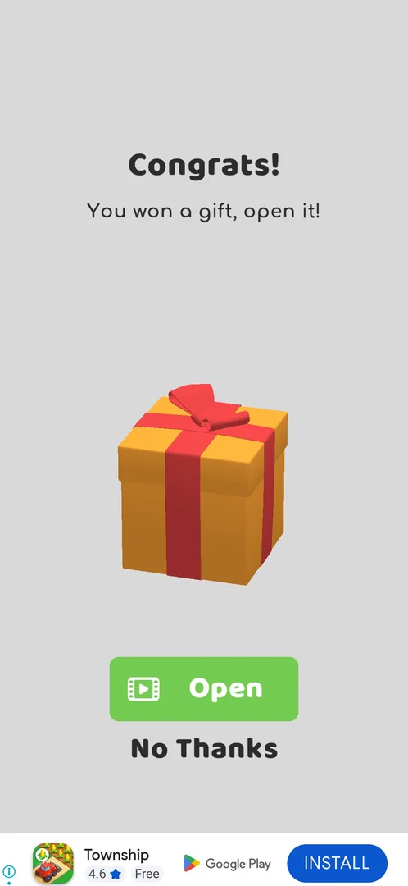
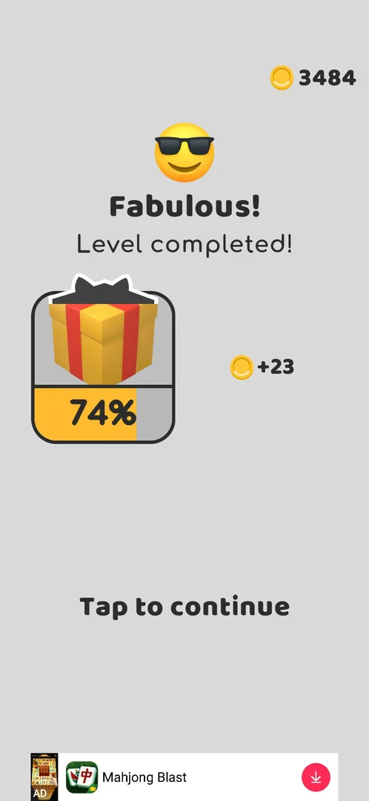
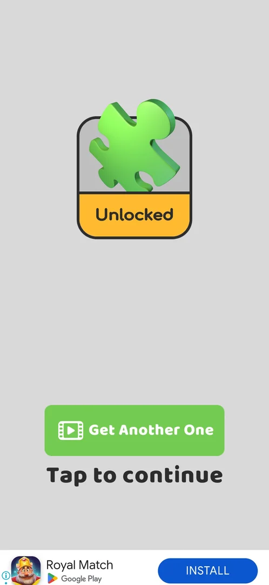
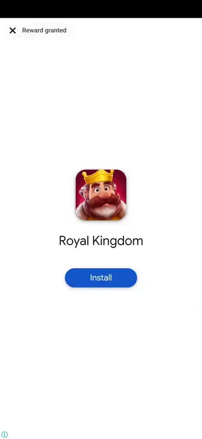
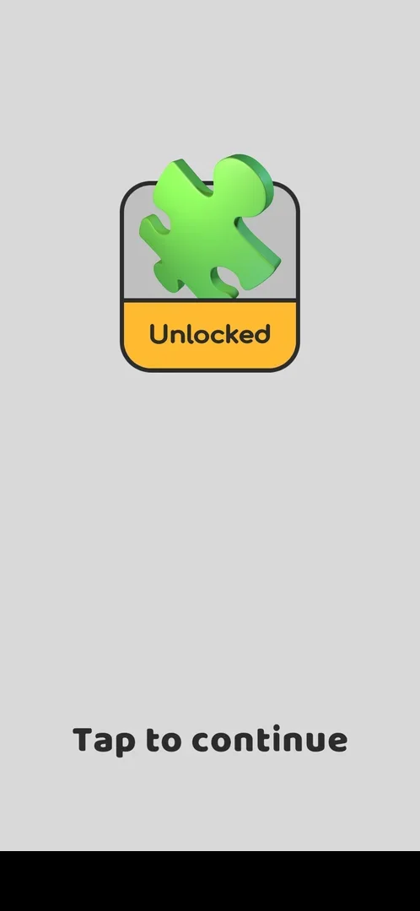
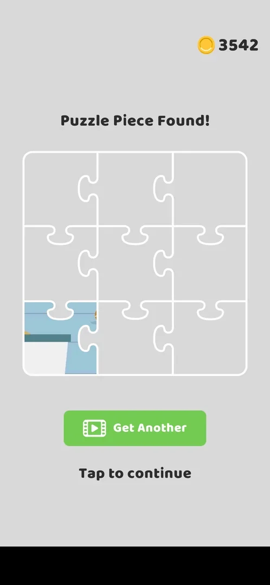

# Post-win gift meter

The gift that the win screen's gift meter pays out. Each main-level win fills a gift card on the
**Level completed!** screen; when it is full, a screen "Congrats! You won a gift, open it!" offers a gift box
that opens only for a video, with **No Thanks** as the other choice [^s1] [^s5]. Opened, the box gives a puzzle
piece for the 3x3 picture of **Puzzle Piece Found!**, and a second video gives one more piece [^s6] [^s7] [^s8].
Declined, the gift is gone: the card reads **Lost**, the level's coins are still paid, and the meter starts
again from the next win [^s3] [^s2]. Nine main-level wins fill the meter [^s6]. The meter itself, and the first
gift (the cup skin Space at level 9), are on [Gift unlock progress bar](unlock-progress.md).

## Why it appeared

After the L18 win: the gift meter on the Level completed screen filled and 'Congrats! You won a gift, open
it!' offered a box (Open by video / No Thanks) [^s1].

## Where to find it

No button opens it. It sits in the win flow of a main level: after the board is cleared, the
**Level completed!** screen shows the gift card left of the coins earned, and when the card's bar is full the
gift box screen comes before the coins [^s1] [^s2]. In version 241.5.2 the order after a win is: the league
board, **Next Level**, the win-streak gauge, then **Level completed!** with the gift card [^s4].

 [^s2]
*The Level completed! screen after level 19: the gift card on the left, its bar back at 12% after the gift of level 18*

## What it looks like

 [^s5]
*The gift screen after the level 27 win, the meter at 100%: Open for a video, or No Thanks*

A grey screen with **Congrats!** and "You won a gift, open it!" at the top, a large orange gift box with a red
ribbon in the middle, a green **Open** button with a video icon and a plain **No Thanks** under it; a banner ad
at the bottom [^s1] [^s5]. It comes after "Level completed!" of the winning level has shown, before the coin
count [^s1].

## What you can do

| Tab or button | What it does |
|---|---|
| [Gift card](#gift-card) | The meter on Level completed!, filled by wins |
| [Open](#open) | A rewarded video, then the box opens to a puzzle piece |
| [Get Another One](#get-another-one) | A second video, a second puzzle piece; once per box |
| [No Thanks](#no-thanks) | Gives the gift up: the card reads Lost, the coins are still paid |

### Gift card

 [^s4]
*The gift card after the level 24 win: 74%; the level's +23 coins at the right*

The card shows a wrapped box over a yellow bar with the percentage, the level's coins at its right and
**Tap to continue** under them [^s4].

### Open

 [^s6]
*Open: after the rewarded video the box gives a green puzzle piece marked Unlocked; Get Another One (video) and Tap to continue*

 [^s6]
*Clip 3.7 s · [original on YouTube from 14:52](https://youtu.be/OfYU2WgEiQU?t=892)*

**Open** plays a rewarded video of about 60 s; its **Reward granted** close button returns to the game, where the
box opens and a green puzzle piece rises from it with the label **Unlocked** [^s6]. Under it: **Get Another One**
(video) and **Tap to continue** [^s6].

### Get Another One

 [^s7]
*After Get Another One: a second piece Unlocked; the button is gone, only Tap to continue (a local banner ad blacked out)*

Another rewarded video of about 60 s, then a second piece marked **Unlocked**; the button does not come back, so a
box gives at most two pieces [^s7]. **Tap to continue** then shows **Puzzle Piece Found!**: a 3x3 puzzle with
the coin balance, **Get Another** (video) and **Tap to continue** [^s8].

 [^s8]
*Puzzle Piece Found! after the two pieces: only one of nine places filled (a local banner ad blacked out)*

After two pieces marked Unlocked the puzzle showed one place of nine filled [^s8]. Whether the second piece was
lost or went elsewhere is not known (an open experiment on [Puzzle pieces](puzzle-pieces.md)). The next
**Level completed!** screen showed the piece card, marked Unlocked, in place of the meter, with the level's +18
coins (3542) [^s9].

### No Thanks

 [^s3]
*After No Thanks: the gift card reads Lost; the +21 coins of level 18 are paid all the same*

Back on **Level completed!**: the gift card shows the box with a yellow **Lost** strip, and the level's
**+21** coins fly to the counter (1789) [^s3]. Tap to continue went on as after any win [^s3].

## How it works

Version 241.5.2.

- The gift card fills with main-level wins; at 100% the gift screen comes in the win flow (after the level 18
  and level 27 wins) [^s1] [^s5].
- After the level 18 gift the meter read: level 19 12%, level 24 74%, level 25 85%, level 26 94%, level 27 100%:
  nine main wins per box (levels 19 to 27); the step shrinks near the top: +11, +9, +6 [^s2] [^s4] [^s6].
- Opening the gift costs a rewarded video of about 60 s; the box gives a puzzle piece [^s6]. Get Another One
  costs a second video and gives a second piece, once per box [^s7].
- The only item seen from the box is a puzzle piece (one box opened, level 27) [^s8].
- No Thanks loses the gift; the level's coins are not affected (+21 on level 18) [^s3].
- After the gift the meter starts again: 12% after the next win, level 19 (+16 coins) [^s2]. On
  [Gift unlock progress bar](unlock-progress.md) the meter took 9 wins (levels 1-9, about 11-12% each) to fill
  the first time.

## Cases

| Case | What was done | Result | Source |
|---|---|---|---|
| Why it appeared <!-- case:chk-appeared --> | Won level 18 | ✅ The gift screen in the win flow, the meter full | [^s1] |
| No own entry: the gift card on the Level completed screen; at 100% the gift screen follows <!-- case:chk-entry --> | Won levels 18 and 19 | ✅ Only in the win flow | [^s2] |
| Gift screen 'Congrats! You won a gift, open it!': gift box, Open (video) and No Thanks <!-- case:chk-screen --> | Won levels 18 and 27 | ✅ Seen | [^s1] [^s5] |
| Declined <!-- case:declined --> | Tapped No Thanks | ✅ The card reads Lost; +21 coins still paid (1789) | [^s3] |
| The meter after the gift <!-- case:meter --> | Won level 19 | ✅ Started again: 12% after the next win | [^s2] |
| How it is earned <!-- case:chk-earn --> | Won levels 18 and 19 | ✅ Main-level wins fill the meter (12% for the first win after the reset); the box comes at 100% | [^s2] |
| Progress <!-- case:chk-progress --> | Won level 19 | ✅ The silhouette card on Level completed!, 12% after the reset | [^s2] |
| Wins per box <!-- case:wins-per-box --> | Won levels 24 to 27 | ✅ 74%, 85%, 94%, 100%: nine main wins per box (levels 19-27), steps +11, +9, +6 near the top | [^s4] [^s6] |
| Open by video <!-- case:open-video --> | Tapped Open on the level 27 gift screen | ✅ A rewarded video of about 60 s with a Reward granted close button, then the box opens to a green puzzle piece marked Unlocked, with Get Another One (video) and Tap to continue | [^s6] |
| Get Another One <!-- case:get-another --> | Tapped Get Another One | ✅ A second video of about 60 s, a second piece Unlocked; the button gone after it: at most two pieces per box | [^s7] |
| The items <!-- case:chk-items --> | Opened the level 27 box | ✅ One kind seen: a puzzle piece for the 3x3 puzzle of Puzzle Piece Found! | [^s8] |
| Using an item <!-- case:chk-use --> | Opened the box, Tap to continue | ✅ The piece goes onto the Puzzle Piece Found! board; the next Level completed! shows the piece in place of the meter | [^s9] |
| Completing the bar: the reward <!-- case:chk-complete --> | Won level 27 at 94% | ✅ 100% gives the box screen; the reward is one puzzle piece, one more for a second video | [^s6] |

## Not verified

- Whether a box can hold anything other than a puzzle piece (one box opened)
- Why Puzzle Piece Found! showed one piece of nine after two pieces were Unlocked
- Whether the first gift (level 9) also needed a video

[^s1]: session 20261005-235042-chrono-2FYKPJ, step 6 — [video at 1:15](https://youtu.be/PZ3ujKA8euo?t=75)
[^s2]: session 20261005-235042-chrono-2FYKPJ, step 27 — [video at 9:04](https://youtu.be/PZ3ujKA8euo?t=544)
[^s3]: session 20261005-235042-chrono-2FYKPJ, step 7 — [video at 1:44](https://youtu.be/PZ3ujKA8euo?t=104)
[^s4]: session 20261006-061608-chrono-2FYKPJ, step 7 — [video at 2:32](https://youtu.be/OfYU2WgEiQU?t=152)
[^s5]: session 20261006-061608-chrono-2FYKPJ, step 26 — [video at 12:12](https://youtu.be/OfYU2WgEiQU?t=732)
[^s6]: session 20261006-061608-chrono-2FYKPJ, step 28 — [video at 14:55](https://youtu.be/OfYU2WgEiQU?t=895)
[^s7]: session 20261006-061608-chrono-2FYKPJ, step 30 — [video at 16:44](https://youtu.be/OfYU2WgEiQU?t=1004)
[^s8]: session 20261006-061608-chrono-2FYKPJ, step 31 — [video at 17:01](https://youtu.be/OfYU2WgEiQU?t=1021)
[^s9]: session 20261006-061608-chrono-2FYKPJ, step 32 — [video at 17:29](https://youtu.be/OfYU2WgEiQU?t=1049)
