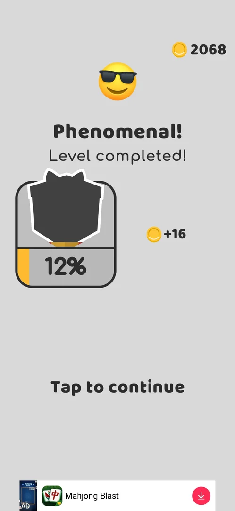
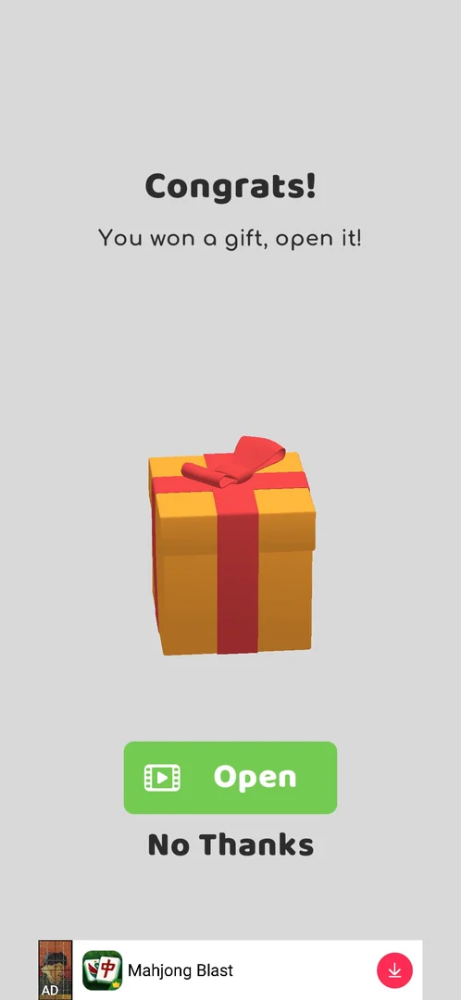
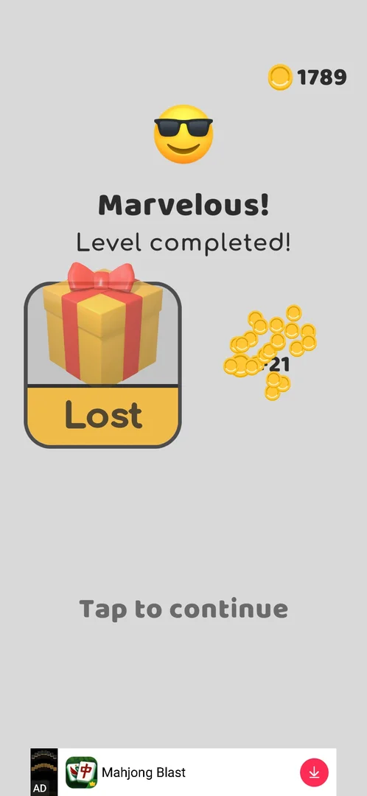

# Post-win gift meter

The gift that the win screen's gift meter pays out. Each main-level win fills a gift card on the
**Level completed!** screen; when it is full, a screen "Congrats! You won a gift, open it!" offers a gift box
that opens only for a video, with **No Thanks** as the other choice [^s1]. Declined, the gift is gone: the
card reads **Lost**, the level's coins are still paid, and the meter starts again from the next win
[^s3] [^s2]. The meter itself, and the first gift (the cup skin Space at level 9), are on
[Gift unlock progress bar](unlock-progress.md).

## Why it appeared

After the L18 win: the gift meter on the Level completed screen filled and 'Congrats! You won a gift, open
it!' offered a box (Open by video / No Thanks) [^s1].

## Where to find it

No button opens it. It sits in the win flow of a main level: after the board is cleared, the
**Level completed!** screen shows the gift card left of the coins earned, and when the card's bar is full the
gift box screen comes before the coins [^s1] [^s2].

 [^s2]
*The Level completed! screen after level 19: the gift card on the left, its bar back at 12% after the gift of level 18*

## What it looks like

 [^s1]
*The gift screen after the level 18 win: Open for a video, or No Thanks*

A grey screen with **Congrats!** and "You won a gift, open it!" at the top, a large orange gift box with a red
ribbon in the middle, a green **Open** button with a video icon and a plain **No Thanks** under it; a banner ad
at the bottom [^s1]. It came after "Marvelous! Level completed!" of level 18 showed, before the coin count
[^s1].

## What you can do

| Tab or button | What it does |
|---|---|
| [Open](#open) | A video, then the gift; not tapped |
| [No Thanks](#no-thanks) | Gives the gift up: the card reads Lost, the coins are still paid |

### Open

<!-- no-frame: Open was not tapped; the button is on the gift screen frame above -->

The green button with a video icon on the gift screen [^s1]. Not tapped: the video and what the gift holds
were not seen.

### No Thanks

 [^s3]
*After No Thanks: the gift card reads Lost; the +21 coins of level 18 are paid all the same*

Back on **Level completed!**: the gift card shows the box with a yellow **Lost** strip, and the level's
**+21** coins fly to the counter (1789) [^s3]. Tap to continue went on as after any win [^s3].

## How it works

Version 241.5.2.

- The gift card fills with main-level wins; at 100% the gift screen comes in the win flow (here after the
  level 18 win) [^s1].
- Opening the gift costs a video (the Open button has a video icon); what this gift held was not seen
  [^s1].
- No Thanks loses the gift; the level's coins are not affected (+21 on level 18) [^s3].
- After the gift the meter starts again: 12% after the next win, level 19 (+16 coins) [^s2]. On
  [Gift unlock progress bar](unlock-progress.md) the meter took 9 wins (levels 1-9, about 11-12% each) to fill
  the first time.

## Cases

| Case | What was done | Result | Source |
|---|---|---|---|
| Why it appeared <!-- case:chk-appeared --> | Won level 18 | ✅ The gift screen in the win flow, the meter full | [^s1] |
| No own entry: the gift card on the Level completed screen; at 100% the gift screen follows <!-- case:chk-entry --> | Won levels 18 and 19 | ✅ Only in the win flow | [^s2] |
| Gift screen 'Congrats! You won a gift, open it!': gift box, Open (video) and No Thanks <!-- case:chk-screen --> | Won level 18 | ✅ Seen | [^s1] |
| Declined <!-- case:declined --> | Tapped No Thanks | ✅ The card reads Lost; +21 coins still paid (1789) | [^s3] |
| The meter after the gift <!-- case:meter --> | Won level 19 | ✅ Started again: 12% after the next win | [^s2] |
| How it is earned <!-- case:chk-earn --> | Won levels 18 and 19 | ✅ Main-level wins fill the meter (12% for the first win after the reset); the box comes at 100% | [^s2] |
| Progress <!-- case:chk-progress --> | Won level 19 | ✅ The silhouette card on Level completed!, 12% after the reset | [^s2] |
| The items <!-- case:chk-items --> | — | not verified: the gift was declined; the first gift (level 9) was the cup skin Space |  |
| Using an item <!-- case:chk-use --> | — | not verified |  |
| Completing the bar: the reward <!-- case:chk-complete --> | Declined the gift | not verified: what Open gives after the video |  |

## Not verified

- The items: what a gift can hold besides the cup skin Space <!-- case:chk-items -->
- Using an item: whether the gift's item is equipped at once or goes to Collections <!-- case:chk-use -->
- Completing the bar: what Open gives after the video; whether the first gift (level 9) also needed a video <!-- case:chk-complete -->

[^s1]: session 20261005-235042-chrono-2FYKPJ, step 6 — [video at 1:15](https://youtu.be/PZ3ujKA8euo?t=75)
[^s2]: session 20261005-235042-chrono-2FYKPJ, step 27 — [video at 9:04](https://youtu.be/PZ3ujKA8euo?t=544)
[^s3]: session 20261005-235042-chrono-2FYKPJ, step 7 — [video at 1:44](https://youtu.be/PZ3ujKA8euo?t=104)
