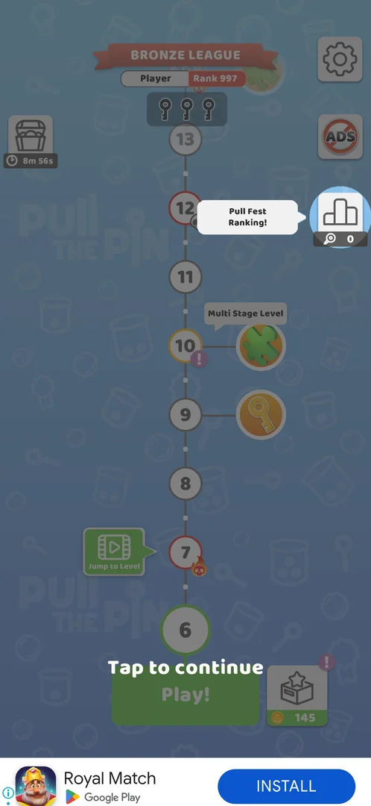
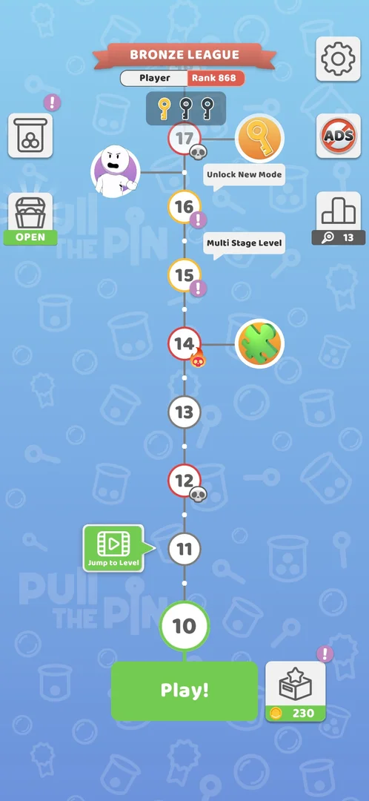
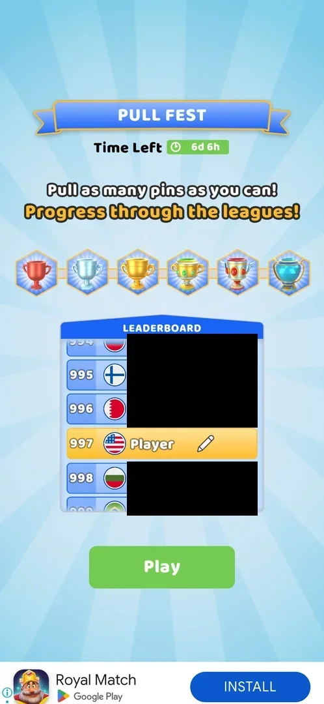
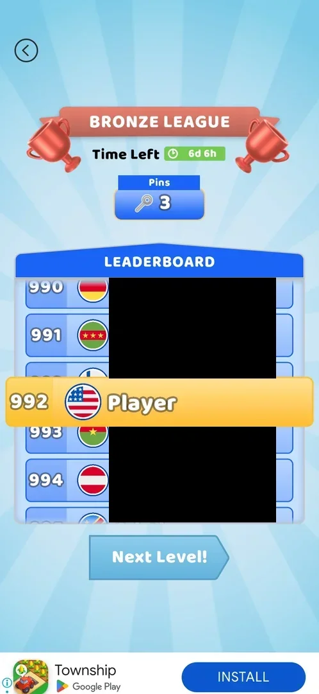
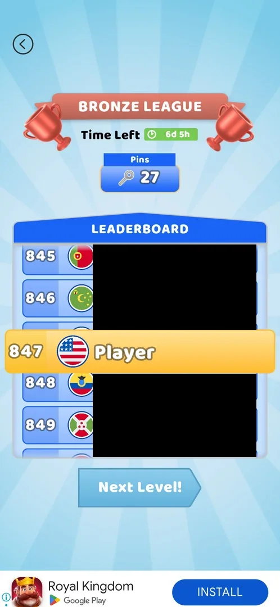
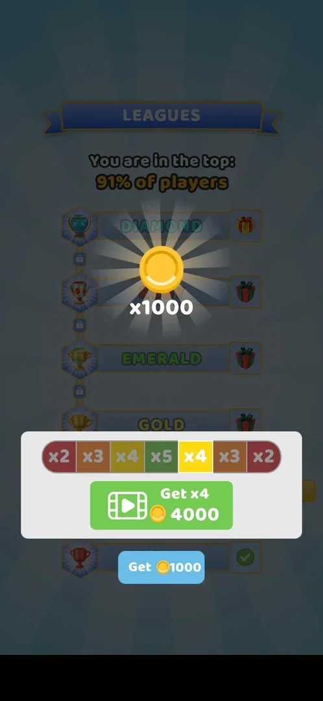
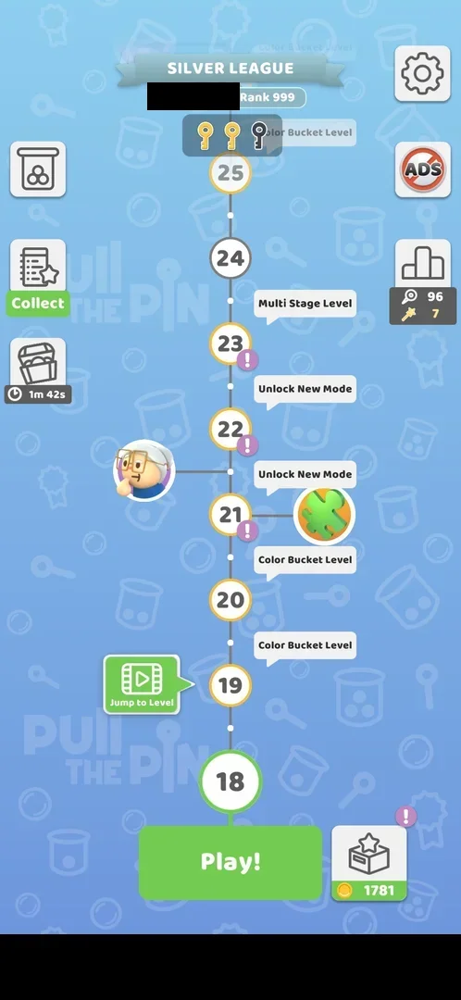

# Pull Fest Ranking (Bronze League)

A timed leaderboard event: every pin pulled in a won level is a point, and the player climbs a leaderboard in
leagues (six league cups, the first is Bronze) [^s2] [^s3]. It opened after the level 5 win; from then on
the leaderboard shows after every won level, before the "Level completed!" screen [^s1] [^s4]. On version
241.5.2, after the level 17 win, a **LEAGUES** screen paid 1000 coins and the map's banner turned from Bronze
League to **Silver League** [^s14] [^s16].

## Why it appeared

After the level 5 win: map overlay 'Pull Fest Ranking!' with Bronze League banner, rank 997, icon right of map with 0 points [^s1].

## Where to find it

- The map: a podium button at the right edge with a magnifier and the pin count under it (0 at first, 13
  after level 9), and a red **Bronze League** banner at the top with the player's name and rank [^s1]
  [^s5].
- The level screen: the same podium button with the pin count, right of the level path
  [^s6].
- After each won level, by itself [^s3].

 [^s1]
*The map after the level 5 win: the "Pull Fest Ranking!" tooltip at the new podium button (0), the Bronze League banner with rank 997 at the top*

 [^s12]
*The map at level 10, the next session: the BRONZE LEAGUE banner at the top with Player and Rank 868, the podium button at the right edge with 13 pins*

## What it looks like

 [^s2]
*Pull Fest: Time Left 6d 6h, six league cups, the leaderboard with the player at 997 (other names blacked out)*

The first **Play!** after the unlock opened the Pull Fest screen instead of the level: the title **PULL
FEST**, "Time Left 6d 6h", the lines "Pull as many pins as you can! Progress through the leagues!", a row of
six league cups (bronze, silver, gold and three more), a scrolling leaderboard with rank, flag and name, and
**Play** [^s2]. The player's row is yellow, named "Player" with a pencil icon to edit the name [^s2]. Its
**Play** started level 6 [^s2].

### Result

 [^s3]
*After the level 6 win: Bronze League, Pins 3; the player's row moves up to 992; Next Level! (other names blacked out)*

After a win: a back arrow at the top left, the **BRONZE LEAGUE** ribbon between two bronze cups with Time
Left, the **Pins** counter, the **LEADERBOARD** list with rank, flag and name, the player's row in yellow
sliding up to its new rank, and **Next Level!**, which leads on to "Level completed!" [^s3] [^s4] [^s8]. This
board is the Pull Fest leaderboard, not a separate feature: the same Time Left, the same Pins score and the
same rank as the map's Bronze League banner (868 on the map before level 10, 847 on the board after it)
[^s8] [^s12]. After the level 10 win it came after Puzzle Piece Found and before the coin screen: Time Left
6d 5h, Pins 27, the player's row at 847 (868 before the level) [^s8].

 [^s8]
*After the level 10 win: Time Left 6d 5h, Pins 27, the player's row at 847 (other names blacked out)*

### Leagues

 [^s14]
*After the level 17 win (241.5.2): the LEAGUES ladder behind the prize x1000 coins; the multiplier bar with the video button (Get x4, 4000) and Get 1000 (a local banner ad blacked out)*

After the level 17 board (Pins 96, Golden Pins 7, Total Score 131, the player's row at 89, Time Left 4d 11h)
a **LEAGUES** screen came: the line "You are in the top: 91% of players" and a ladder of league rows with a
cup on the left and a gift box on the right, locks between them: Diamond at the top, then a red cup whose
name was hidden behind the prize, Emerald, Gold, and at the bottom a row with a bronze cup and a green tick
[^s14]. Over it a prize: **x1000** coins, a bar of multipliers x2 to x5 with one lit cell moving, a green
video button **Get xN** (Get x2 2000, Get x4 4000) and a blue **Get 1000** [^s14]. Get 1000 was taken: the
coins rose from 766 to 1781 together with the +15 of Level completed! [^s20]. Back on the map the banner read
**SILVER LEAGUE** with rank 999 [^s16].

 [^s16]
*The map at level 18: the Silver League banner with rank 999 (the player's name and a local banner ad blacked out)*

## How it works

Version 241.5.1.

| After the win of | Pins (total) | Rank |
|---|---|---|
| Level 5 (unlock) | 0 | 997 [^s1] |
| Level 6 (3 pins pulled) | 3 | 992 [^s3] |
| Level 7 | 6 | 955, then 937 as the row slid up [^s7] |
| Level 9 | 13 | 868 [^s5] |
| Level 10 (14 pins pulled over four stages) | 27 | 847 [^s8] |
| Level 10 win reverted by a force-stop | 27 | 728 on the map after the relaunch [^s9] |

- One point per pin pulled in a won level (level 6: 3 pins, 3 points) [^s3].
- The counter counts pins as they are pulled, inside the level: during level 10 the podium button on the
  level screen read 15 at stage 2 and 23 at stage 4, before the level was won [^s10] [^s11].
- Pins stay counted when the win is lost: a force-stop during level 10's win flow reverted the win (the map
  back at level 10), but the map still showed 27 pins [^s9]. The rank on the map's banner then read 728
  [^s9]; what moved it from 847 is not known.
- The event's timer read 6d 6h on the first day, 6d 5h after level 10 in the next session [^s2] [^s8], and
  4d 11h on 5 October at 15:20 [^s21]. From the 3 October reading (about 20:45) that is about 43 hours off in
  about 42.5 hours: inferred, the event clock runs while the game is closed.
- The win flow from level 6 on: Puzzle Piece Found (on a puzzle level) → Pull Fest leaderboard → Level
  completed → interstitial ad → map [^s4].
- The leaderboard after a win is titled Bronze League; it is the same league, the first of the six cups
  [^s8] [^s12].
- Golden pins: from level 12 on, the board shows **Golden Pins** and **Total Score** next to Pins; Total
  Score = Pins + 5 × Golden Pins: 45 + 5 = 50 after level 12 [^s13], 90 + 35 = 125 after level 16 [^s21] and
  96 + 35 = 131 after level 17 [^s14] on 241.5.2. See [Golden pins](golden-pins.md).
- Version 241.5.2, 5 October, Bronze League: rank 187 on the map at 76 pins (session start) [^s19], 110 after
  level 15, 124 on the board after level 16 (Total Score 125), 89 after level 17 (Total Score 131) [^s21]
  [^s14] [^s18].
- Promotion: after the level 17 win, at rank 89 and "top 91%", the LEAGUES screen paid 1000 coins and the
  league became Silver, rank 999 [^s14] [^s16]. After level 16, at rank 124, there was no LEAGUES screen
  [^s21]. Hypothesis: a rank threshold (top 100) triggers the promotion during the event, not the end of
  the period; not verified.
- The other names on the leaderboard are first names with country flags; inferred: generated opponents, not
  verified.

## Cases

| Case | What was done | Result | Source |
|---|---|---|---|
| Pull Fest: Time Left 6d 6h, 'pull as many pins', 6 league cups, leaderboard (Player rank 997, editable name), Play <!-- case:chk-screen --> | Tapped Play! after the unlock | ✅ The Pull Fest screen | [^s2] |
| One point per pin pulled in a won level (L6: 3 pins); rank 997 -> 992 after L6, 868 with 13 pins after L9 <!-- case:chk-points --> | Won levels 6-9 | ✅ Pins = points | [^s3] |
| Why it appeared <!-- case:chk-appeared --> | Won level 5 | ✅ Opened after the level 5 win | [^s1] |
| Bronze League screen comes after the puzzle-piece screen on a win (L10): Time Left 6d 5h, Pins 27, leaderboard list with the player at 847 (868 before), Next Level! button, back arrow top left; this is the same league as Pull Fest <!-- case:post-win-screen --> | Won level 10 | ✅ The same league | [^s8] |
| The 'Bronze League' board after a win (Time Left 6d 5h, Pins 27, rank 868 -> 847, Next Level!) is this leaderboard <!-- case:bronze-league-is-league --> | Compared the board after the level 10 win with the map's banner | ✅ The same league: the separate Bronze League page was merged here | [^s8] [^s12] |
| Pins scored in the post-win flow were kept (27) when a force-stop reverted the L10 win itself <!-- case:pins-kept-on-revert --> | Force-stopped during the level 10 win flow, relaunched | ✅ Pins 27 kept, the win lost | [^s9] |
| After the L17 win: LEAGUES ladder reward 1000 coins (top 91%), then the map banner turned SILVER LEAGUE, rank 999 <!-- case:promoted-silver --> | Won level 17 at rank 89, took Get 1000 | ✅ 1000 coins, Silver League, rank 999 | [^s14] [^s16] |
| Where to find it <!-- case:chk-entry --> | — | not verified: the podium button was not tapped by itself | [^s1] |
| The board <!-- case:chk-board --> | Watched the leaderboard | not verified: the number of players is not shown (ranks near 1000) |  |
| The period and its timer <!-- case:chk-period --> | Read Time Left over three days | not verified: 6d 6h, 6d 5h, 4d 11h left; the reset not seen | [^s21] |
| Rewards per rank <!-- case:chk-rewards --> | Won level 17 | not verified: one reward seen, 1000 coins on the promotion out of Bronze; the gift boxes of the higher leagues not opened | [^s14] |
| The end of a period <!-- case:chk-end --> | — | not verified: needs a session after the timer ends |  |

## Not verified

- Where to find it: what the map's podium button opens when tapped <!-- case:chk-entry -->
- The board: how many players a league holds <!-- case:chk-board -->
- The period: when the 6-day event resets and whether a new one starts <!-- case:chk-period -->
- Rewards per rank: what the higher leagues' gift boxes hold; what promotes (a rank threshold or the end of the period) and whether there is relegation <!-- case:chk-rewards -->
- The video Get xN on the 1000-coin prize
- The end of a period: the results screen and the reward <!-- case:chk-end -->
- Whether pins pulled in a lost level count.

[^s1]: session 20261003-203702-chrono-2FYKPJ, step 19 — [video at 6:01](https://youtu.be/cirqlD7KGWI?t=361)
[^s2]: session 20261003-203702-chrono-2FYKPJ, step 22 — [video at 7:20](https://youtu.be/cirqlD7KGWI?t=440)
[^s3]: session 20261003-203702-chrono-2FYKPJ, step 25 — [video at 8:40](https://youtu.be/cirqlD7KGWI?t=520)
[^s4]: session 20261003-203702-chrono-2FYKPJ, step 26 — [video at 8:53](https://youtu.be/cirqlD7KGWI?t=533)
[^s5]: session 20261003-203702-chrono-2FYKPJ, step 52 — [video at 20:59](https://youtu.be/cirqlD7KGWI?t=1259)
[^s6]: session 20261003-203702-chrono-2FYKPJ, step 31 — [video at 10:59](https://youtu.be/cirqlD7KGWI?t=659)
[^s7]: session 20261003-203702-chrono-2FYKPJ, step 32 — [video at 11:36](https://youtu.be/cirqlD7KGWI?t=696)

[^s8]: session 20261003-211035-chrono-2FYKPJ, step 15 — [video at 6:40](https://youtu.be/Mpfk4cqdltQ?t=400)
[^s9]: session 20261003-211035-chrono-2FYKPJ, step 23 — [video at 11:41](https://youtu.be/Mpfk4cqdltQ?t=701)
[^s10]: session 20261003-211035-chrono-2FYKPJ, step 8 — [video at 3:07](https://youtu.be/Mpfk4cqdltQ?t=187)
[^s11]: session 20261003-211035-chrono-2FYKPJ, step 13 — [video at 5:43](https://youtu.be/Mpfk4cqdltQ?t=343)
[^s12]: session 20261003-211035-chrono-2FYKPJ, step 0 — [video at 0:00](https://youtu.be/Mpfk4cqdltQ?t=0)

[^s13]: session 20261004-005453-chrono-2FYKPJ, step 9 — [video at 8:17](https://youtu.be/rH_NzK3D4WA?t=497)

[^s14]: session 20261005-151039-chrono-2FYKPJ, step 33 — [video at 14:22](https://youtu.be/r5lFTdFC8_s?t=862)
[^s16]: session 20261005-151039-chrono-2FYKPJ, step 37 — [video at 18:05](https://youtu.be/r5lFTdFC8_s?t=1085)
[^s18]: session 20261005-151039-chrono-2FYKPJ, step 17 — [video at 5:51](https://youtu.be/r5lFTdFC8_s?t=351)
[^s19]: session 20261005-151039-chrono-2FYKPJ, step 0 — [video at 0:00](https://youtu.be/r5lFTdFC8_s?t=0)

[^s20]: session 20261005-151039-chrono-2FYKPJ, step 34 — [video at 15:10](https://youtu.be/r5lFTdFC8_s?t=910)
[^s21]: session 20261005-151039-chrono-2FYKPJ, step 26 — [video at 9:36](https://youtu.be/r5lFTdFC8_s?t=576)
