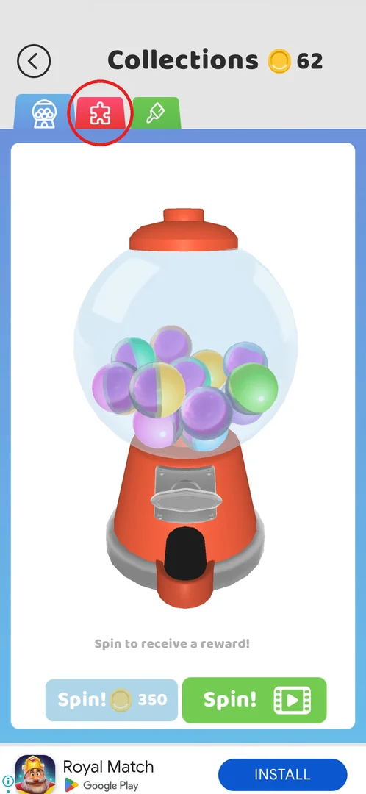
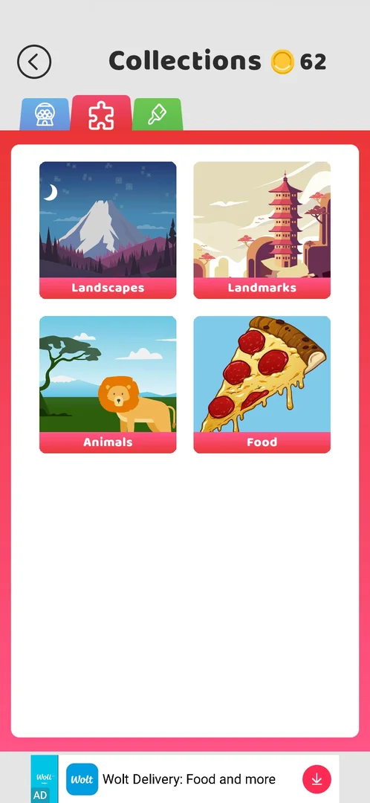
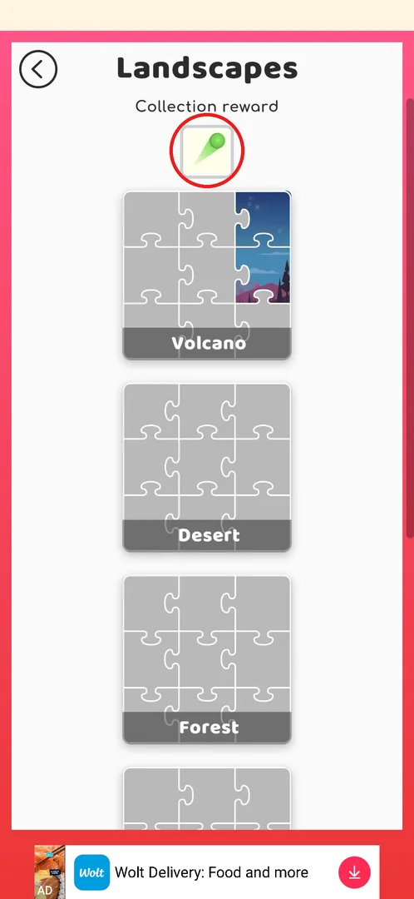
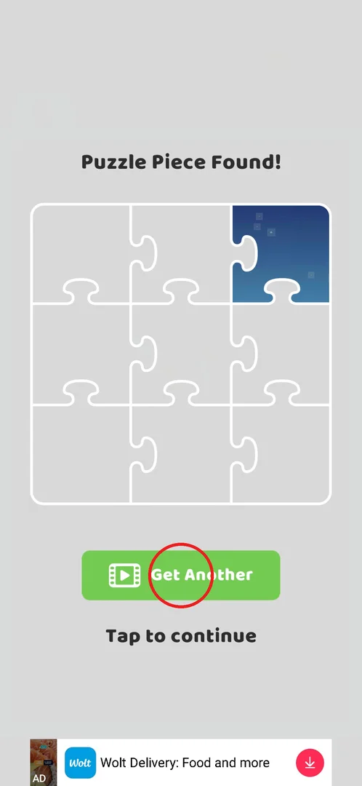
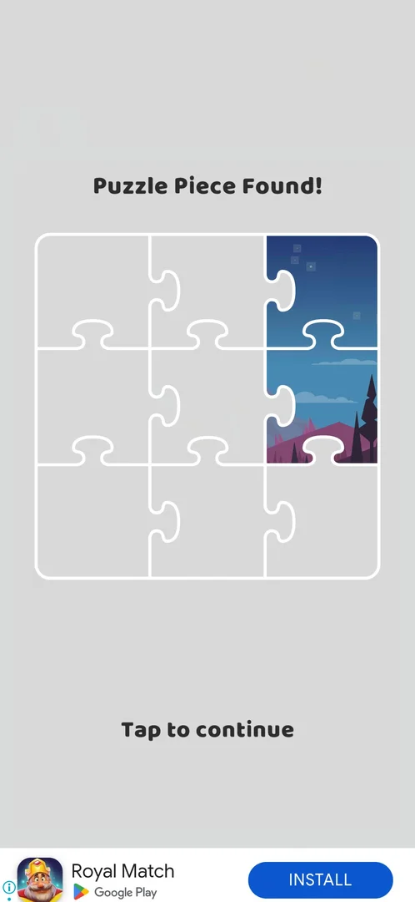
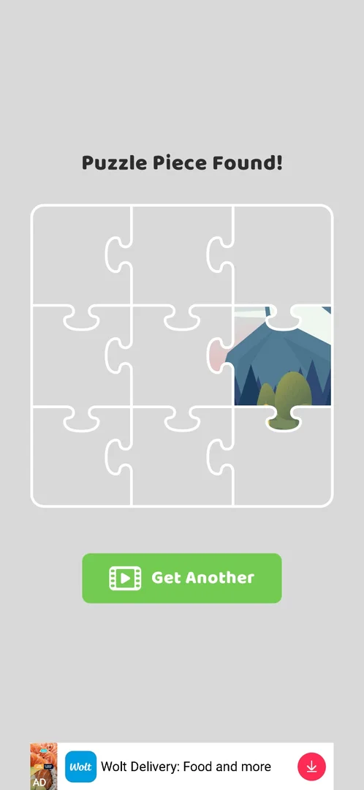
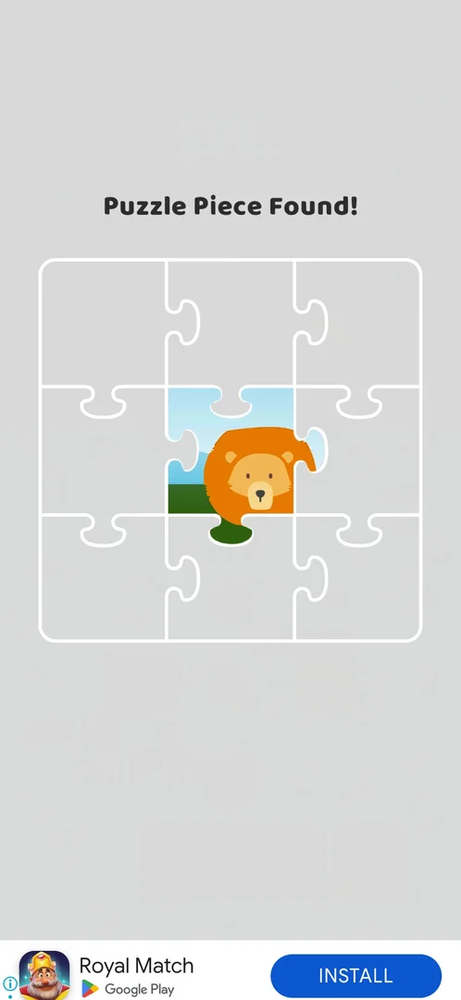

# Collections: puzzles tab

> Recheck on v241.5.1: documented on 241.3.1; Google Play has 241.5.1.

The puzzle collection is a set of picture puzzles the player fills in piece by piece outside the
levels. Each puzzle is a 3×3 picture (9 pieces); puzzles are grouped into 4 albums — Landscapes,
Landmarks, Animals, Food — and a full album gives a reward (for Landscapes, a ball trail) [^s2] [^s4]
[^s8]. Pieces drop from the gacha machine, from levels with a puzzle icon on the map and from the
timed chest [^s3] [^s5] [^s6].

## Where to find it

Level map → the box button right of **Play!** opens [Collections](collections.md) [^s9] [^s10]; in
Collections, the red tab with a puzzle piece (circled) opens the albums [^s2]. In the first session
Collections had three tabs (gacha, puzzles, skins) and the puzzle tab was the second [^s1]; from the
next session a trophy tab appeared and the puzzle tab moved to the third place [^s11].

 [^s1]

## What it looks like

A white card on a red background under the Collections header (back arrow, coin balance) with four
album tiles in a 2×2 grid: Landscapes, Landmarks, Animals, Food, each shown by its full picture [^s2].
A banner ad sits at the bottom [^s2]. A piece, wherever it comes from, is shown in a full-screen
**Puzzle Piece Found!** popup: the 3×3 grid of its puzzle with the collected pieces filled in [^s3]
[^s5] [^s6].

 [^s2]

## What you can do

| Tab or button | What it does |
|---|---|
| [Album page](#album-page) | Tap an album tile: its puzzles with their progress and the album reward |
| [Get Another](#get-another) | In the Puzzle Piece Found! popup: one more piece for a video, once |
| [Piece from a level](#piece-from-a-level) | Win a level with a puzzle icon on the map: a piece |
| [Piece from the chest](#piece-from-the-chest) | Open the timed chest on the map: it can give a piece |

### Album page

The album page has a back arrow (to the album list) and the title; under it, **Collection reward**
with its icon — for Landscapes a green ball with a trail [^s4] [^s12]. Below is a scrolling list of
the album's puzzles, grey with the collected pieces shown in colour. Landscapes holds 6 puzzles:
Volcano, Desert, Forest, Beach, House, River [^s4] [^s8]; at that moment Volcano had 2 of 9 pieces
and the others none [^s4]. That is 54 pieces for the album (inferred: 6 × 9) [^s8].

 [^s4]

### Get Another

After the first, free gacha spin the machine gave a puzzle piece: "Congrats! You get a new puzzle
piece!", **Collect**, then the Puzzle Piece Found! popup with 1 of 9 pieces of Volcano, a green
**Get Another** button with a video icon and **Tap to continue** [^s3]. Get Another plays a video ad
(about 30 s, Skip after about 25 s, "Reward granted") and adds a second piece; after it Get Another is
no longer offered, only Tap to continue [^s7].

 [^s3]

 [^s7]

### Piece from a level

Levels with a puzzle icon on the map give a piece when won: after level 6 the popup showed a piece
of a puzzle other than Volcano (mountains and forest), again with Get Another for a video [^s5].

 [^s5]

### Piece from the chest

The second timed chest on the level map (about 15 min) gave one puzzle piece; it went to the centre
of the lion puzzle, its first piece. This popup had no Get Another button, and an interstitial ad
followed after closing it [^s6].

 [^s6]

## How it works

On v241.3.1 [^s2] [^s8]:

- A puzzle is 3×3 = 9 pieces; an album has several puzzles (Landscapes: 6) and one album reward
  [^s4] [^s8].
- Sources of pieces seen: the gacha spin (the first one is free) [^s3], levels with a puzzle icon on
  the map [^s5], the timed chest [^s6]. Which puzzle a piece goes to was not chosen by the player:
  the gacha piece went to Volcano, the level-6 piece to another puzzle, the chest piece to the lion
  puzzle [^s3] [^s5] [^s6].
- Get Another for a video: +1 piece, offered once per popup; it was offered after the gacha and the
  level piece, not after the chest piece [^s7] [^s5] [^s6].

## Cases

| Case | What was done | Result | Source |
|---|---|---|---|
| Get Another | Video after a piece from the gacha | +1 piece; offered once | [^s7] |
| Piece from a level | Won level 6 (puzzle icon) | A piece of another puzzle | [^s5] |
| Piece from a chest | Opened the second timed chest | A piece of the lion puzzle, no Get Another | [^s6] |
| Full puzzle | Collect all 9 pieces of a puzzle | not verified |  |

## Not verified

- The reward for a full puzzle (9 pieces); whether one puzzle gives one trail.
- What the album reward needs: all 6 puzzles of the album, or fewer.
- Whether Get Another is offered once per popup or has a daily limit.
- The other three albums' puzzles and rewards were not opened.

[^s1]: session 20260930-192115-chrono-2FYKPJ, step 35 — [video at 8:07](https://youtu.be/BVqoYRE5kRU?t=487)
[^s2]: session 20260930-192115-chrono-2FYKPJ, step 37 — [video at 8:26](https://youtu.be/BVqoYRE5kRU?t=506)
[^s3]: session 20260930-192115-chrono-2FYKPJ, step 31 — [video at 6:05](https://youtu.be/BVqoYRE5kRU?t=365)
[^s4]: session 20260930-192115-chrono-2FYKPJ, step 38 — [video at 8:35](https://youtu.be/BVqoYRE5kRU?t=515)
[^s5]: session 20260930-192115-chrono-2FYKPJ, step 84 — [video at 19:08](https://youtu.be/BVqoYRE5kRU?t=1148)
[^s6]: session 20260930-201034-chrono-2FYKPJ, step 74 — [video at 23:45](https://youtu.be/JGEX3-Rfkdw?t=1425)
[^s7]: session 20260930-192115-chrono-2FYKPJ, step 34 — [video at 7:51](https://youtu.be/BVqoYRE5kRU?t=471)
[^s8]: session 20260930-192115-chrono-2FYKPJ, step 39 — [video at 8:46](https://youtu.be/BVqoYRE5kRU?t=526)
[^s9]: session 20260930-192115-chrono-2FYKPJ, step 28 — [video at 5:21](https://youtu.be/BVqoYRE5kRU?t=321)
[^s10]: session 20260930-192115-chrono-2FYKPJ, step 29 — [video at 5:32](https://youtu.be/BVqoYRE5kRU?t=332)
[^s11]: session 20260930-201034-chrono-2FYKPJ, step 5 — [video at 1:54](https://youtu.be/JGEX3-Rfkdw?t=114)
[^s12]: session 20260930-192115-chrono-2FYKPJ, step 40 — [video at 8:55](https://youtu.be/BVqoYRE5kRU?t=535)
