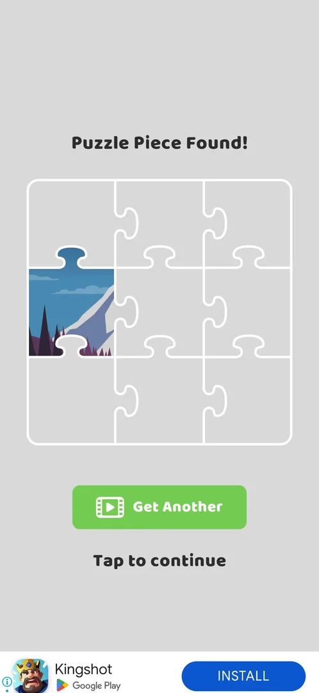
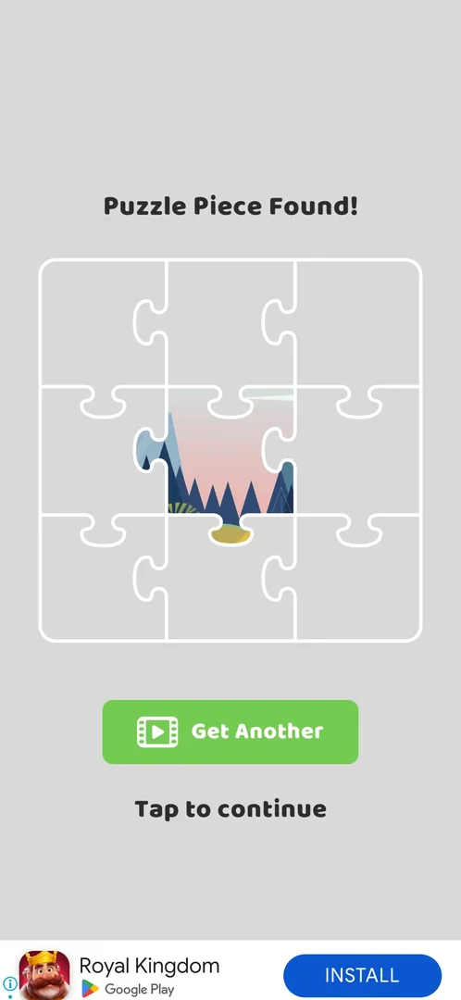

# Puzzle piece collection

Picture puzzles filled one piece at a time: some level nodes on the map carry a green puzzle-piece badge, and
winning such a level shows "Puzzle Piece Found!" with a 3x3 picture and the new piece in place [^s2] [^s1].
The puzzles are grouped in four albums in Collections [^s3].

## Why it appeared

After winning level 6 (the puzzle-piece node on the map): 'Puzzle Piece Found!' 3x3 picture, 1 piece [^s1].

## Where to find it

- The map: a round green badge with a puzzle piece beside a level node (levels 6, 10 and 14) [^s2]
  [^s4].
- Collections (the box button on the map), the red puzzle tab [^s3].

 [^s2]
*The map after the level 3 win: green puzzle-piece badges beside levels 6 and 10*

## What it looks like

 [^s3]
*Collections, the puzzle tab: four albums, Landscapes, Landmarks, Animals, Food*

The puzzle tab of Collections shows four album cards with a picture and a name: **Landscapes**,
**Landmarks**, **Animals**, **Food** [^s3]. No count of pieces is shown on the cards [^s3].

### Popup

 [^s1]
*After the level 6 win: "Puzzle Piece Found!", a 3x3 jigsaw with one piece (a mountain) in place, Get Another (video)*

After the level 6 win, before the Pull Fest leaderboard and the win screen: "Puzzle Piece Found!", a 3x3
jigsaw outline with one piece showing part of a mountain, a green **Get Another** button with a video icon
and **Tap to continue** [^s1]. Tap to continue was used; Get Another was not tapped [^s1].

### Result

 [^s5]
*After the level 10 win: "Puzzle Piece Found!", one piece in the centre cell, from another picture (pink sky, dark trees); Get Another and Tap to continue*

The level 10 win (a Multi Stage level with the puzzle badge) brought the same screen first in the win flow,
before the Bronze League leaderboard and the coin screen [^s5]
[^s6]. Again one piece of nine was in place, but in the centre cell and from a
different picture than after level 6 (a pink sky with trees instead of a blue sky with a snowy mountain)
[^s5] [^s1]. There was no coin multiplier on this screen
[^s5].

## How it works

Version 241.5.1.

- A level with the puzzle badge gives one piece when won (level 6: 1 of 9; level 10: 1 of 9)
  [^s1] [^s5].
- The level 10 piece belonged to another picture than the level 6 piece [^s5].
  Inferred: each puzzle level starts or fills a different picture, or the screen shows only the newest
  piece; not verified.
- The picture is 3x3, so nine pieces make one picture [^s1].
- **Get Another** offers a second piece for a video; not tried [^s1].
- Inferred from the mountain on the piece: the first picture belongs to the Landscapes album; not verified.

## Cases

| Case | What was done | Result | Source |
|---|---|---|---|
| Why it appeared <!-- case:chk-appeared --> | Won level 6 | ✅ Puzzle Piece Found! | [^s1] |
| The L10 multi stage win gives 'Puzzle Piece Found' 1/9 with a Get Another (video) button and Tap to continue, before the league and coin screens <!-- case:after-l10 --> | Won level 10 | ✅ One piece of a second picture | [^s5] |
| Where to find it <!-- case:chk-entry --> | Opened the puzzle tab in Collections | not verified: the albums were not opened | [^s3] |
| What it looks like <!-- case:chk-screen --> | — | not verified: an album's inside not seen |  |
| The progress <!-- case:chk-progress --> | Won level 6 | not verified: 1 of 9 pieces in the first picture | [^s1] |
| The items <!-- case:chk-items --> | Looked at the puzzle tab | not verified: four albums, their pictures not counted | [^s3] |
| How a piece is earned <!-- case:chk-earn --> | Won level 6 | not verified: a puzzle-badge level gives one; the video not tried | [^s1] |
| Using an item <!-- case:chk-use --> | — | not verified |  |
| Completing a picture: the reward <!-- case:chk-complete --> | — | not verified |  |

## Not verified

- Where to find it: open an album in the puzzle tab <!-- case:chk-entry -->
- What it looks like: the album's screen with the picture and its pieces <!-- case:chk-screen -->
- The progress: where the piece count shows; why level 10's piece is in another picture than level 6's <!-- case:chk-progress -->
- The items: how many pictures each album holds <!-- case:chk-items -->
- How a piece is earned: Get Another for a video; any other source <!-- case:chk-earn -->
- Using an item: whether a finished picture does anything <!-- case:chk-use -->
- Completing a picture or an album: the reward <!-- case:chk-complete -->

[^s1]: session 20261003-203702-chrono-2FYKPJ, step 24 — [video at 8:17](https://youtu.be/cirqlD7KGWI?t=497)
[^s2]: session 20261003-203702-chrono-2FYKPJ, step 5 — [video at 1:43](https://youtu.be/cirqlD7KGWI?t=103)
[^s3]: session 20261003-203702-chrono-2FYKPJ, step 58 — [video at 23:18](https://youtu.be/cirqlD7KGWI?t=1398)
[^s4]: session 20261003-203702-chrono-2FYKPJ, step 52 — [video at 20:59](https://youtu.be/cirqlD7KGWI?t=1259)

[^s5]: session 20261003-211035-chrono-2FYKPJ, step 14 — [video at 6:19](https://youtu.be/Mpfk4cqdltQ?t=379)
[^s6]: session 20261003-211035-chrono-2FYKPJ, step 15 — [video at 6:40](https://youtu.be/Mpfk4cqdltQ?t=400)
