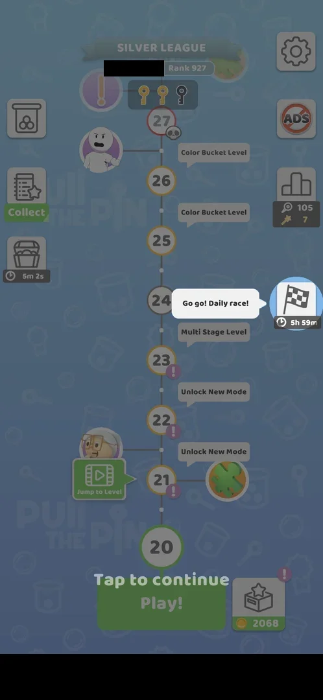
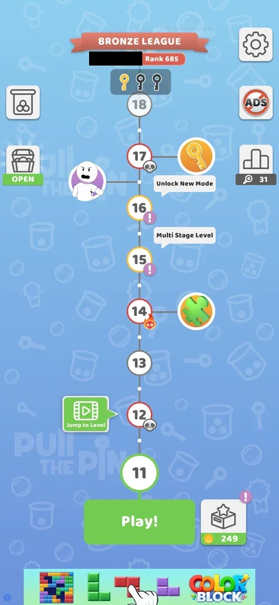
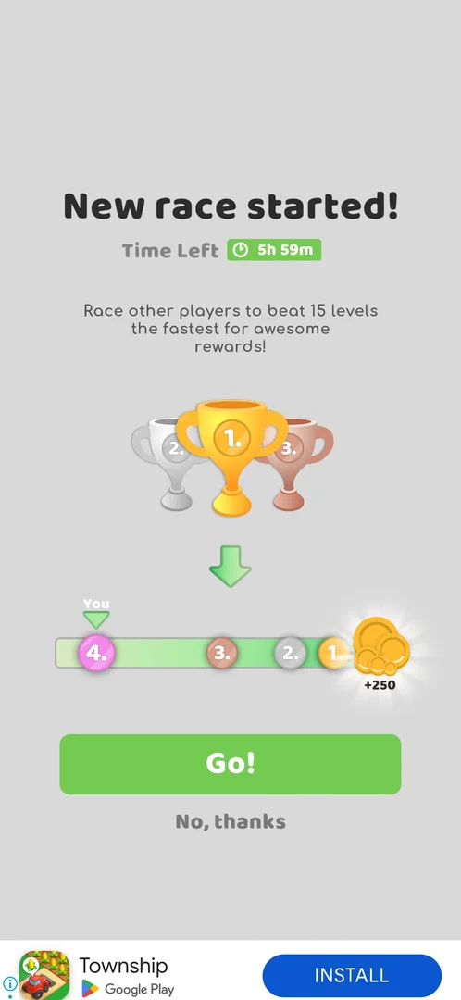
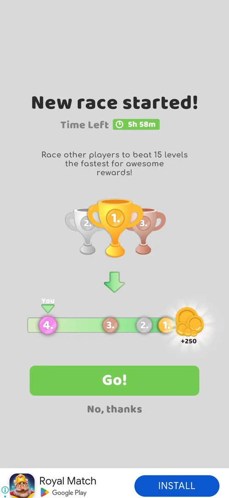
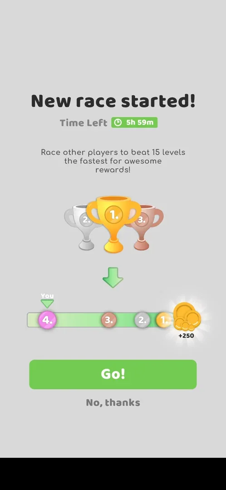
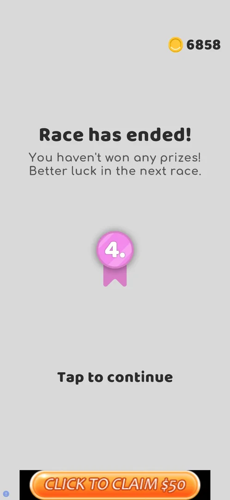
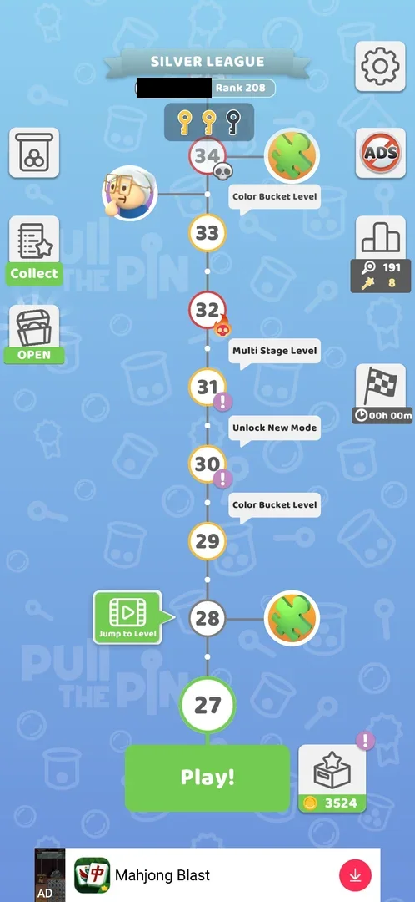

# Level race

A timed event offered in a popup before a level: the player races three other players to be the first to
beat 15 levels, within a time limit (5 h 59 min left when offered); first place shows a reward of +250
coins [^s1]. The player can join with **Go!** or decline with **No, thanks** [^s1]. Declined twice [^s3] [^s5],
it was joined the third time, at level 20: a race button with the timer then sits on the map ("Daily race"), and
a race bar runs under the board of a level [^s6] [^s7]. The race's own screen was not seen. The
race ended with a "Race has ended!" screen: the player 4th, no prize [^s21].

## Why it appeared

The popup "New race started!" came on tapping **Play!** for level 11, right after the level 10 win; it was
the first time the player's progress reached level 11 [^s1]. Inferred: the event unlocks at level 11 (or
after the level 10 win); whether it is tied to the level or to a schedule is not verified. In version 241.5.2
the same popup came again, a day later, on leaving the level 13 screen with its back arrow after level 13 was
skipped with [Jump to Level](jump-to-level.md) [^s4]. The third offer came on **Play!** for level 20, after the
level 18 and 19 wins, again with 5h 59m left [^s8].

## Where to find it

The offer: **Play!** under the current level. At level 11 and at level 20 the tap opened the race popup before
the level [^s1] [^s8]. The second offer came on leaving a level, between the level and its post-win league
board [^s4]. Before joining, the map showed no race button [^s2].

Once joined: a square button with a checkered flag at the right edge of the map, between the leaderboard button
and Play!, with the time left under it (5h 59m right after joining). The first time the map came back after
Go!, a tooltip beside it read "Go go! Daily race!" with "Tap to continue" [^s6].

 [^s6]
*The map after Go!: the race button (checkered flag, 5h 59m) at the right edge with its first-time tooltip (the player's name and a local banner ad blacked out)*

 [^s2]
*Map at level 11: the race popup came on Play! (the player's name in the league banner blacked out)*

## What it looks like

<!-- no-screen: the race was joined but its button on the map was not tapped; its own screen was never opened -->
The race's own screen was not seen: the map button was not tapped [^s6]. The offer popup is described below;
the race bar in a level under [Go!](#go).

### Popup

 [^s1]
*The race offer: the timer, the goal (15 levels), the bar with the player ("You") at place 4 and +250 coins for place 1*

From top to bottom [^s1]:

- the title "New race started!" and **Time Left** with a green timer (5h 59m);
- a line: race other players to beat 15 levels the fastest, for rewards;
- three trophies: gold 1, silver 2, bronze 3;
- a bar with four markers, places 4, 3, 2 and 1, the player ("You") on place 4 at the left end, and a coin
  pile with **+250** past place 1 at the right end;
- a green **Go!** and a grey **No, thanks** under it.

The second offer, in version 241.5.2, was the same popup with 5h 58m left [^s4]:

 [^s4]
*The offer on leaving level 13 after a Jump to Level skip: Time Left 5h 58m, otherwise as the first offer*

The third offer, on Play! for level 20, was the same again with 5h 59m left [^s8]:

 [^s8]
*The third offer, the one joined (a local banner ad blacked out)*

### Result

 [^s21]
*The end of the race joined at level 20: "Race has ended!", place 4 on a pink ribbon, no prize; Tap to continue*

A grey full screen: the title "Race has ended!", a two-line text that no prize was won and to try the next
race, the place (4.) on a ribbon, the coin balance at the top right and **Tap to continue** [^s21]. Tap to
continue went back to the level 30 board [^s23].

## What you can do

| Tab or button | What it does |
|---|---|
| [Go!](#go) | Joins the race: the level opens with a race bar under the board [^s9] [^s7] |
| [No, thanks](#no-thanks) | Declines: the popup closes and the game goes on (the level, or the post-win league board) [^s3] [^s5] |

### Go!

 [^s7]
*Level 20 with the race running: the race bar under the board (a local banner ad blacked out)*

Go!, at level 20 on version 241.5.2, opened level 20 [^s9]. The level carried a race bar under the board:
a green track from the left to a checkered finish at the right, the racers' round markers stacked at the start
with **1.** on top, and a green **You** arrow over them [^s7]. On this first level after joining, a tutorial
tooltip pointed at the back arrow: "Check your progress and new modes!" (see [Map tutorial tooltips](map-tutorial.md)) [^s9].

### No, thanks

<!-- no-frame: the next frame is the level itself, shown on the Pin-pull level page -->
**No, thanks** closed the popup and opened level 11 at once, with no other screen between [^s3]. The second
time it closed the popup and the post-win Bronze League board of level 13 followed [^s5].

## How it works

Versions 241.5.1 and 241.5.2, from the offer popup only [^s1] [^s4]:

| Item | Value |
|---|---|
| Racers | 4 (the player and three others) |
| Goal | beat 15 levels the fastest |
| Time limit | 5 h 59 min left on the first offer, 5 h 58 min on the second |
| Reward shown | +250 coins for place 1; rewards for places 2-4 not shown |

- The race bar shows during a level; at level 20, before any level was beaten in the race, the player's
  marker was at the start with place 1 on it [^s7].
- A loss of level 20 (a Color Bucket level) gave the usual fail screen; the race bar under the board stayed
  as it was, with the player first, and no race screen came [^s10].
- Leaving level 20 right after joining returned to the map with the race running (5h 59m on the button) [^s6].
- The next night the map button read 4h 39m at the start of the session and 4h 29m about ten minutes later
  [^s11] [^s12].
- Sketchman IQ Test results count too: after each Sketchman result the race marker moved right with "You
  moved" [^s13] ([Sketchman IQ Test](mode-iq-test.md)). On the Sketchman board the bar showed five markers,
  5 to 1, with You on 5 [^s14]; the offer popup had shown four places.
- The race bar also shows under the board of a [Challenge](mode-challenge.md): five markers to a chequered flag,
  You on 5 [^s16]. In the three tries of Challenge 1, all lost, the markers stayed where they were [^s16] [^s17].
  Whether a Challenge win moves the marker was not seen.
- During the level 20 win the bar showed You at place 4, and the win went straight to the league board with no
  race screen between [^s15].

- On 6 October, about 29 hours after joining at level 20, the race button on the map read 00h 00m for the whole
  session, at levels 24, 25 and 27; no results popup came on any visit to the map [^s18] [^s19]. Inferred: the
  race has ended (its 6 hours ran out long before); not verified, since the race screen was not opened.
- In the same session the race bar still showed under the level 27 board: You on 4, markers 3 and 1 ahead of it
  [^s20].

 [^s19]
*The map at level 27 on 6 October: the race button reads 00h 00m, as it did all session (the player's name blacked out)*

- On 6 October, in the next session, the map at level 28 still showed the race button at 00h 00m [^s25]. The
  race bar under the level 30 board showed You on 4 with markers 3 and 1 ahead, as under level 27 the session
  before [^s22]. The bar did not move during levels 28 and 29 [^s21].
- The results came after level 30 was lost and **Retry** was tapped: the Retry interstitial, then "Race has
  ended!" with the player 4th and "You haven't won any prizes!"; the coin balance on it was 6858 [^s21]. About 30
  hours had passed since joining at level 20, so the results came long after the 6 hours ran out. What brings
  the results screen up (the Retry, the loss, or any level start after the end) is not verified.
- After the results the level 30 board had no race bar [^s23], and the map at level 31 had no race button at
  its right edge [^s24].

What a race counts (wins only or every level) and the rewards for places 1 to 3 beyond the +250 shown on the
offer were not seen.

## Outcomes

Level race runs over ordinary levels. Seen with the race joined at level 20 (version 241.5.2).

| Outcome of the base level | Under Level race | Source |
|---|---|---|
| Win | As the base: the race bar under the board during the win (You at place 4); the win flow went straight to the league board, no race screen | [^s15] |
| Restart | not verified | — |
| Quit | As the base: the back arrow returned to the map; the race kept running (5h 59m on the map button) | [^s6] |
| Exit the app | not verified | — |
| Balls fell out | not verified | — |
| Colours mixed (Color Bucket fail) | As the base fail screen; the race bar stayed with the player first, no race screen | [^s10] |

## Cases

| Case | What was done | Result | Source |
|---|---|---|---|
| Declined <!-- case:declined --> | Tapped No, thanks on the offer popup | ✅ The popup closed and level 11 opened at once; the second time the level 13 league board followed | [^s3] [^s5] |
| The rules <!-- case:chk-rules --> | Read the offer popup | ✅ Race three other players (four racers) to beat 15 levels the fastest; a bar with places 4 to 1, the player on place 4; Go! joins, No, thanks declines | [^s1] |
| Why it appeared <!-- case:chk-appeared --> | Tapped Play! for level 11 right after the level 10 win | ✅ The popup "New race started!" came before the level | [^s1] |
| Where to find it <!-- case:chk-entry --> | Joined at level 20, went back to the map | ✅ A race button with a checkered flag and its timer (5h 59m) at the right edge of the map; tooltip "Go go! Daily race!" | [^s6] |
| What it looks like <!-- case:chk-screen --> | — | not verified: declined, the race screen not opened |  |
| Its timer and schedule <!-- case:chk-timer --> | — | not verified: 5h 59m left on the offer; the next race not seen | [^s1] |
| During a level <!-- case:chk-in-level --> | Opened level 20 after joining | ✅ A race bar under the board: racers' markers from the start to a checkered finish, the You marker (place 1 at level 20) | [^s7] |
| Progress per level <!-- case:chk-progress --> | — | not verified |  |
| The rewards <!-- case:chk-rewards --> | — | not verified: only +250 coins for place 1 shown on the offer | [^s1] |
| The end <!-- case:chk-end --> | Lost level 30 and tapped Retry, about 30 h after joining | not verified in the map; seen: "Race has ended!", place 4, no prize, Tap to continue; then no race bar and no race button | [^s21] [^s23] [^s24] |
| Win under Level race <!-- case:under-win --> | Won level 20 (a Color Bucket level) with the race running | ✅ As the base: the race bar under the board (You at place 4), then the league board; no race screen | [^s15] |
| Restart under Level race <!-- case:under-restart --> | — | not verified |  |
| Quit under Level race <!-- case:under-quit --> | Left level 20 by the back arrow right after joining | ✅ As the base: the map; the race kept running (5h 59m) | [^s6] |
| Exit the app under Level race <!-- case:under-exit-app --> | — | not verified |  |
| Balls fell out under Level race <!-- case:under-balls-out --> | — | not verified |  |
| Colours mixed under Level race <!-- case:under-colour-mix --> | Lost level 20 (a Color Bucket level) | ✅ The fail screen as the base; the race bar stayed with the player first, no race screen | [^s10] |
| In Challenge mode <!-- case:in-challenge --> | Played Challenge 1 (three tries, all lost) | ✅ The race bar under the Challenge board: five markers, You on 5, a chequered flag; it did not move in the lost tries | [^s16] |
| The flag at 00h 00m <!-- case:flag-zero-all-session --> | Went back to the map at levels 24, 25 and 27, a day after joining | ✅ The race button read 00h 00m all session; no results popup on any map visit | [^s18] [^s19] |
| Joined | Tapped Go! on the offer before level 20 | ✅ Level 20 opened with the race bar; the map got the race button | [^s9] [^s6] |

## Not verified

- What it looks like: the race screen (the map's race button not tapped yet) <!-- case:chk-screen -->
- Its timer and schedule: what happens when 6 h run out (the button sat at 00h 00m with no popup), and when the next race comes <!-- case:chk-timer -->
- Progress per level: what a win, and a loss, add; the marker moves after Sketchman results, how far was not measured <!-- case:chk-progress -->
- The rewards for each place <!-- case:chk-rewards -->
- The end: the results screen was seen with place 4 and no prize [^s21]; still open in the map. The reward paid for places 1 to 3, and what brings the results screen up, not seen <!-- case:chk-end -->
- Restart under Level race: as the base, or what differs <!-- case:under-restart -->
- Exit the app under Level race: as the base, or what differs <!-- case:under-exit-app -->
- Balls fell out under Level race: as the base, or what differs <!-- case:under-balls-out -->
- Whether it unlocks by level or by time; a declined race was offered again a day later [^s4], and again at
  level 20.

[^s1]: session 20261004-004411-chrono-2FYKPJ, step 17 — [video at 5:10](https://youtu.be/KwWbRYgzFFk?t=310)
[^s2]: session 20261004-004411-chrono-2FYKPJ, step 16 — [video at 4:39](https://youtu.be/KwWbRYgzFFk?t=279)
[^s3]: session 20261004-004411-chrono-2FYKPJ, step 18 — [video at 5:35](https://youtu.be/KwWbRYgzFFk?t=335)
[^s4]: session 20261005-014031-chrono-2FYKPJ, step 3 — [video at 1:41](https://youtu.be/7nClZQUPXn4?t=101)
[^s5]: session 20261005-014031-chrono-2FYKPJ, step 4 — [video at 1:50](https://youtu.be/7nClZQUPXn4?t=110)

[^s6]: session 20261005-235042-chrono-2FYKPJ, step 33 — [video at 12:10](https://youtu.be/PZ3ujKA8euo?t=730)
[^s7]: session 20261005-235042-chrono-2FYKPJ, step 35 — [video at 12:36](https://youtu.be/PZ3ujKA8euo?t=756)
[^s8]: session 20261005-235042-chrono-2FYKPJ, step 31 — [video at 11:41](https://youtu.be/PZ3ujKA8euo?t=701)
[^s9]: session 20261005-235042-chrono-2FYKPJ, step 32 — [video at 11:59](https://youtu.be/PZ3ujKA8euo?t=719)
[^s10]: session 20261005-235042-chrono-2FYKPJ, step 39 — [video at 13:40](https://youtu.be/PZ3ujKA8euo?t=820)

[^s11]: session 20261006-012240-chrono-2FYKPJ, step 0 — [video at 0:00](https://youtu.be/jf_j5LiHuRs?t=0)
[^s12]: session 20261006-012240-chrono-2FYKPJ, step 18 — [video at 10:17](https://youtu.be/jf_j5LiHuRs?t=617)
[^s13]: session 20261006-012240-chrono-2FYKPJ, step 14 — [video at 6:59](https://youtu.be/jf_j5LiHuRs?t=419)
[^s14]: session 20261006-012240-chrono-2FYKPJ, step 11 — [video at 5:48](https://youtu.be/jf_j5LiHuRs?t=348)
[^s15]: session 20261006-012240-chrono-2FYKPJ, step 16 — [video at 9:16](https://youtu.be/jf_j5LiHuRs?t=556)

[^s16]: session 20261006-030951-chrono-2FYKPJ, step 5 — [video at 1:14](https://youtu.be/nuXkt-gY2qg?t=74)
[^s17]: session 20261006-030951-chrono-2FYKPJ, step 23 — [video at 13:11](https://youtu.be/nuXkt-gY2qg?t=791)
[^s18]: session 20261006-061608-chrono-2FYKPJ, step 0 — [video at 0:00](https://youtu.be/OfYU2WgEiQU?t=0)
[^s19]: session 20261006-061608-chrono-2FYKPJ, step 19 — [video at 8:34](https://youtu.be/OfYU2WgEiQU?t=514)
[^s20]: session 20261006-061608-chrono-2FYKPJ, step 21 — [video at 10:30](https://youtu.be/OfYU2WgEiQU?t=630)

[^s21]: session 20261006-091133-chrono-2FYKPJ, step 39 — [video at 17:54](https://youtu.be/nKqzeXFw6rA?t=1074)
[^s22]: session 20261006-091133-chrono-2FYKPJ, step 32 — [video at 14:45](https://youtu.be/nKqzeXFw6rA?t=885)
[^s23]: session 20261006-091133-chrono-2FYKPJ, step 40 — [video at 18:03](https://youtu.be/nKqzeXFw6rA?t=1083)
[^s24]: session 20261006-091133-chrono-2FYKPJ, step 46 — [video at 19:50](https://youtu.be/nKqzeXFw6rA?t=1190)
[^s25]: session 20261006-091133-chrono-2FYKPJ, step 0 — [video at 0:00](https://youtu.be/nKqzeXFw6rA?t=0)
