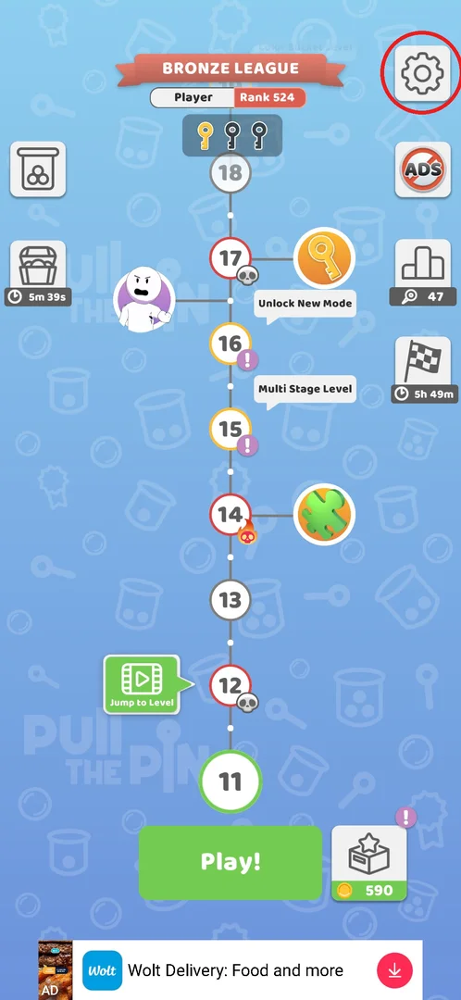
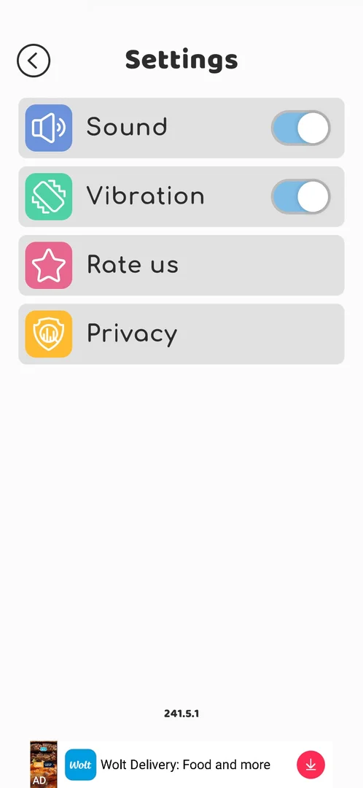
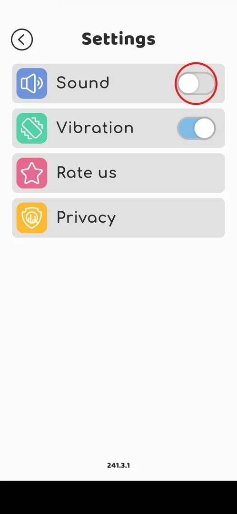
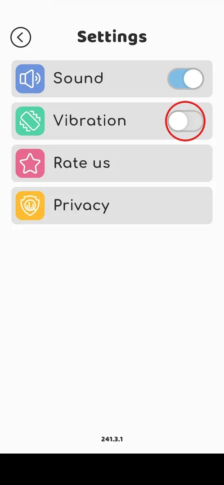
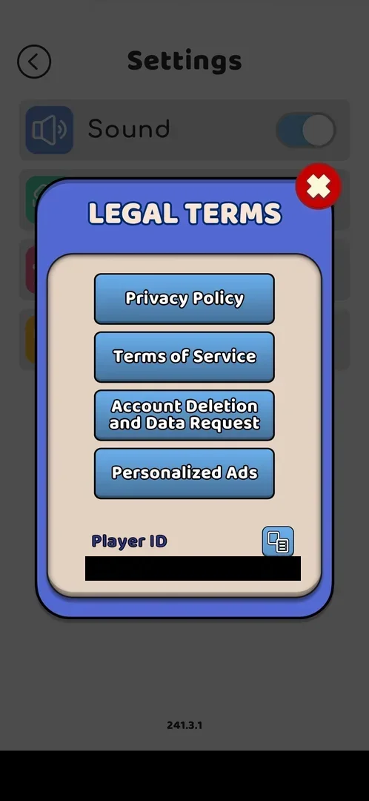
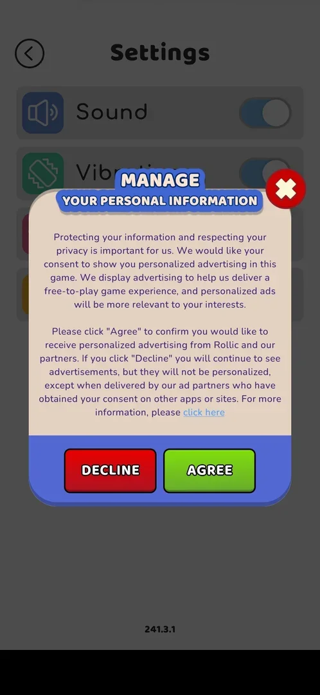

# Settings (gear)

Settings is the game's options screen behind the gear button: two switches (Sound and Vibration),
a Rate us link to the app store and a Privacy entry with the legal documents, the personalized-ads
consent and the Player ID. It has no rewards and no economy; the version label at the bottom is the
quickest way to see which build is installed [^s2] [^s10].

## Where to find it

On the level map the gear is the top-right button, above No ADS [^s1].

 [^s1]

Before the map opens (levels 1–3, the first launch goes straight into level 1 [^s14]), the gear sits at the
top left of the level screen, next to the level progress [^s10]. From level 5 on, the level screen has a
back arrow to the map there instead of the gear [^s15], and the top right shows the Pull Fest counter [^s16],
so the map is the way in.

## What it looks like

A white screen titled **Settings** with a back arrow at the top left (it returns to where you came
from: level 3 in the first session [^s13]). Four rows: **Sound** and **Vibration** with blue switches
(both on by default), **Rate us** and **Privacy**. The version label is at the bottom (241.3.1 on
2026-09-30, 241.5.1 on 2026-10-01, the rows unchanged [^s2] [^s10]); the banner ad stays below it.

 [^s2]

## What you can do

| Tab or button | What it does |
|---|---|
| [Sound](#sound) | Switches game sound off and on |
| [Vibration](#vibration) | Switches vibration off and on |
| [Rate us](#rate-us) | Opens the app store (system chooser), no in-game rating popup |
| [Privacy](#privacy) | Opens the LEGAL TERMS popup: policy, ToS, account deletion, personalized-ads consent, Player ID |

### Sound

Tapping the switch turns it grey with the knob on the left (off); tapping again turns it blue (on) [^s3] [^s4].

 [^s3]

### Vibration

Same switch as Sound: grey with the knob on the left is off, blue is on [^s6] [^s8].

 [^s6]

### Rate us

There is no in-game "rate us" popup: the tap goes straight to Android's **Open with** chooser with
Galaxy Store and Google Play Store (on the Samsung phone of the session); the system Back key closes it
and returns to Settings [^s5] [^s17].

<!-- no-frame: personal data (system chooser, status bar) -->

### Privacy

A **LEGAL TERMS** popup with four buttons — Privacy Policy, Terms of Service, Account Deletion and
Data Request, Personalized Ads — and the **Player ID** with a copy button; the red cross closes it [^s4].
Privacy Policy, Terms of Service and Account Deletion were not opened.

 [^s4]

### Personalized Ads

**Personalized Ads** opens **MANAGE YOUR PERSONAL INFORMATION**: a consent text for personalized
advertising "from Rollic and our partners" with **DECLINE** and **AGREE** buttons and a red cross [^s7].
Declining keeps the ads, only not personalized (the popup's own text). The choice was not changed: the
cross closed this window and Legal Terms together, straight back to Settings [^s9].

 [^s7]

## How it works

- Sound and Vibration are on by default (seen on the first launch, v241.3.1) [^s10].
- Nothing in Settings costs or gives coins; there are no timers.
- The screen did not change between 241.3.1 and 241.5.1 [^s2].

## Cases

| Case | What was done | Result | Source |
|---|---|---|---|
| Toggle Sound off and on | Tapped the switch twice | Off (grey) then on (blue) | [^s3] [^s4] |
| Toggle Vibration off and on | Tapped the switch twice | Off (grey) then on (blue) | [^s6] [^s8] |
| Rate us | Tapped | System "Open with" chooser (Galaxy Store / Google Play), no in-game popup | [^s5] |
| Privacy | Tapped, then Personalized Ads, then the cross | Legal Terms popup (Privacy Policy, ToS, Account Deletion, Personalized Ads, Player ID with copy); consent window with Decline/Agree; the cross returns to Settings | [^s4] [^s7] [^s9] |
| Settings on 241.5.1 | Opened from the map | Same four rows, version label 241.5.1 | [^s2] |
| Sound/Vibration state survives a game restart | — | not verified | |

## Not verified

- Whether Sound/Vibration keep their state after a restart.
- What Privacy Policy, Terms of Service and Account Deletion and Data Request open (in-game page or browser).
- What Decline / Agree change, and whether the Player ID copy button works.
- What Rate us does on a phone with Google Play only (the chooser is likely a Samsung artifact — inferred).

[^s1]: session 20261001-081207-chrono-2FYKPJ, step 14
[^s2]: session 20261001-081207-chrono-2FYKPJ, step 15
[^s3]: session 20260930-192115-chrono-2FYKPJ, step 11 — [video at 2:26](https://youtu.be/BVqoYRE5kRU?t=146)
[^s4]: session 20260930-192115-chrono-2FYKPJ, step 13 — [video at 2:44](https://youtu.be/BVqoYRE5kRU?t=164)
[^s5]: session 20260930-192115-chrono-2FYKPJ, step 16 — [video at 3:09](https://youtu.be/BVqoYRE5kRU?t=189)
[^s6]: session 20260930-192115-chrono-2FYKPJ, step 18 — [video at 3:23](https://youtu.be/BVqoYRE5kRU?t=203)
[^s7]: session 20260930-192115-chrono-2FYKPJ, step 14 — [video at 2:54](https://youtu.be/BVqoYRE5kRU?t=174)
[^s8]: session 20260930-192115-chrono-2FYKPJ, step 19 — [video at 3:34](https://youtu.be/BVqoYRE5kRU?t=214)
[^s9]: session 20260930-192115-chrono-2FYKPJ, step 15 — [video at 3:02](https://youtu.be/BVqoYRE5kRU?t=182)
[^s10]: session 20260930-192115-chrono-2FYKPJ, step 10 — [video at 2:14](https://youtu.be/BVqoYRE5kRU?t=134)
[^s13]: session 20260930-192115-chrono-2FYKPJ, step 20 — [video at 3:38](https://youtu.be/BVqoYRE5kRU?t=218)

[^s14]: session 20260930-192115-chrono-2FYKPJ, step 1 — [video at 0:09](https://youtu.be/BVqoYRE5kRU?t=9)
[^s15]: session 20260930-192115-chrono-2FYKPJ, step 59 — [video at 13:30](https://youtu.be/BVqoYRE5kRU?t=810)
[^s16]: session 20260930-192115-chrono-2FYKPJ, step 81 — [video at 18:13](https://youtu.be/BVqoYRE5kRU?t=1093)
[^s17]: session 20260930-192115-chrono-2FYKPJ, step 17 — [video at 3:16](https://youtu.be/BVqoYRE5kRU?t=196)
