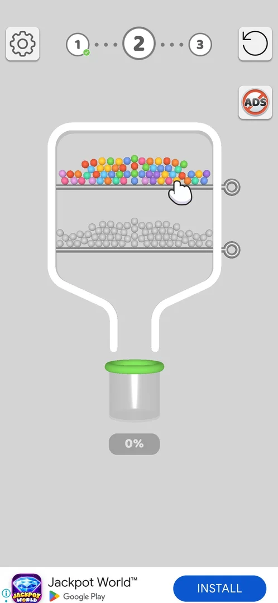
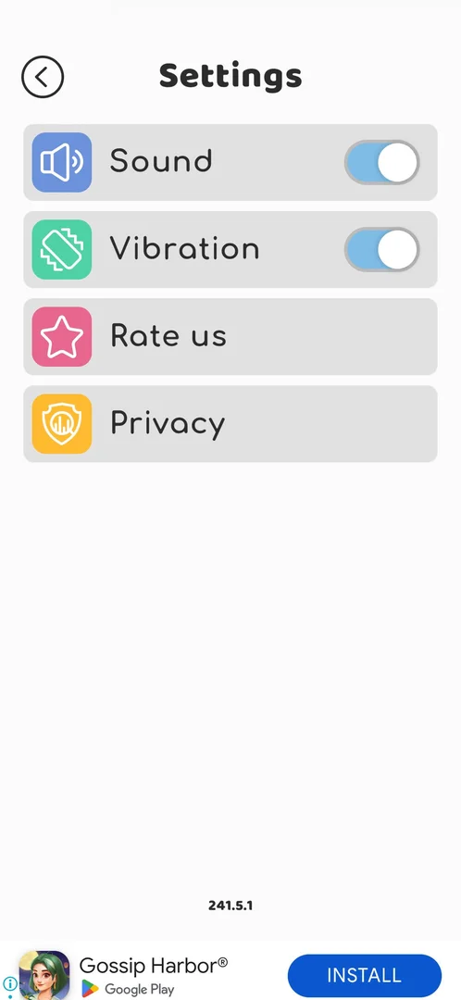

# Settings

A full-screen list of four options opened from the level screen: Sound and Vibration toggles, Rate us
and Privacy, with the game's version at the bottom [^s1].

## Why it appeared

Always on the level screen, gear top left [^s1].

## Where to find it

The gear button top left of the level screen; it is there from level 1 [^s1]. The game has no main menu,
so this is the only way in seen so far.

 [^s1]
*The gear button top left of the level screen opens Settings*

## What it looks like

 [^s1]
*Settings: a back arrow top left, four rows, the version number above the banner ad*

The title "Settings" with a round back arrow left of it; four rows, each with a coloured icon; the version
number 241.5.1 near the bottom; a banner ad along the bottom edge [^s1].

## What you can do

| Tab or button | What it does |
|---|---|
| [Sound](#sound) | A toggle, on by default |
| [Vibration](#vibration) | A toggle, on by default |
| [Rate us](#rate-us) | Not tapped |
| [Privacy](#privacy) | Not tapped |

Android back closes Settings and returns to the level [^s2].

### Sound

<!-- no-frame: the row is on the Settings frame above; not toggled this session -->
The first row, a speaker icon on blue, with a toggle on the right; on at a fresh install [^s1].

### Vibration

<!-- no-frame: the row is on the Settings frame above; not toggled this session -->
The second row, a vibrating-phone icon on green, with a toggle on the right; on at a fresh install [^s1].

### Rate us

<!-- no-frame: the row is on the Settings frame above; not tapped this session -->
The third row, a star icon on pink, no toggle [^s1]. What it opens is not verified.

### Privacy

<!-- no-frame: the row is on the Settings frame above; not tapped this session -->
The fourth row, a shield icon on yellow, no toggle [^s1]. What it opens is not verified.

## How it works

Version 241.5.1. Sound and Vibration are both on at a fresh install [^s1]. No other option (language,
restore purchases, account) is on the screen [^s1].

## Cases

| Case | What was done | Result | Source |
|---|---|---|---|
| Gear top left of the level screen <!-- case:chk-entry --> | Tapped the gear on level 2 | ✅ Settings opened | [^s1] |
| Settings: Sound, Vibration toggles, Rate us, Privacy, version 241.5.1 <!-- case:chk-screen --> | Opened Settings | ✅ Four rows and the version seen | [^s1] |
| Why it appeared <!-- case:chk-appeared --> | Level screen | ✅ The gear is on the level screen from level 1 | [^s1] |
| Every option and what it changes <!-- case:chk-options --> | — | not verified: no toggle was switched |  |
| Rate us prompt: what each answer does and whether it comes back <!-- case:chk-answers --> | — | not verified: Rate us not tapped |  |
| Links out (Privacy): where they lead <!-- case:chk-links --> | — | not verified: Privacy not tapped |  |

## Not verified

- Every option: what Sound and Vibration off change; each toggled once and set back <!-- case:chk-options -->
- Rate us: what it opens and what each answer does <!-- case:chk-answers -->
- Privacy: where it leads <!-- case:chk-links -->

[^s1]: session 20261003-193015-chrono-2FYKPJ, step 5 — [video at 1:53](https://youtu.be/JjeHh2uiLgE?t=113)
[^s2]: session 20261003-193015-chrono-2FYKPJ, step 6 — [video at 2:10](https://youtu.be/JjeHh2uiLgE?t=130)
