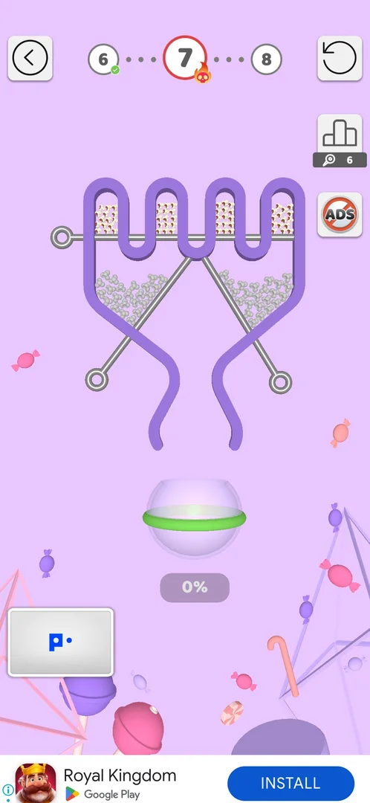

# Collections: skins tab

> Recheck on v241.5.1: documented on 241.3.1; Google Play has 241.5.1.

Brush tab of [Collections](collections.md): Themes, Trails, Walls, Pins, Balls [s:20260930-192115-chrono-2FYKPJ#42].

## Unlock sources (v241.3.1)
| Category | Sources | Source |
|---|---|---|
| Themes | Gift Boxes (15), seasonal events (12), Diamond League (1) | [s:20260930-192115-chrono-2FYKPJ#43] |
| Trails | Puzzles (7), chests (8), consecutive wins | [s:20260930-201034-chrono-2FYKPJ#22] |
| Walls | Daily Tasks (12), Special Events (about 27), Diamond League (1); not sold | [s:20260930-201034-chrono-2FYKPJ#9] [s:20260930-201034-chrono-2FYKPJ#11] |
| Pins | Gift Boxes (15), Special Events (about 20), consecutive wins (1), Diamond League (1); not sold | [s:20260930-201034-chrono-2FYKPJ#13] [s:20260930-201034-chrono-2FYKPJ#14] |
| Balls | 115 and 300 levels, coins 1000 / 3000 / 10000, gumball machine (9), events | [s:20260930-192115-chrono-2FYKPJ#49] [s:20260930-201034-chrono-2FYKPJ#19] |

## Cases
| Case | What was done | Result | Source |
|---|---|---|---|
| Buy without coins | Tapped the 1000-coin ball with 62 coins | Nothing happens | [s:20260930-192115-chrono-2FYKPJ#50] |
| Walls and Pins | Opened both lists | Sources as above, none for coins | [s:20260930-201034-chrono-2FYKPJ#14] |
| Equip | Tapped the Candy theme and the Popcorn ball | Equipped at once (yellow frame); level 7 showed the Candy background and popcorn balls | [s:20260930-201034-chrono-2FYKPJ#17] [s:20260930-201034-chrono-2FYKPJ#35] |

