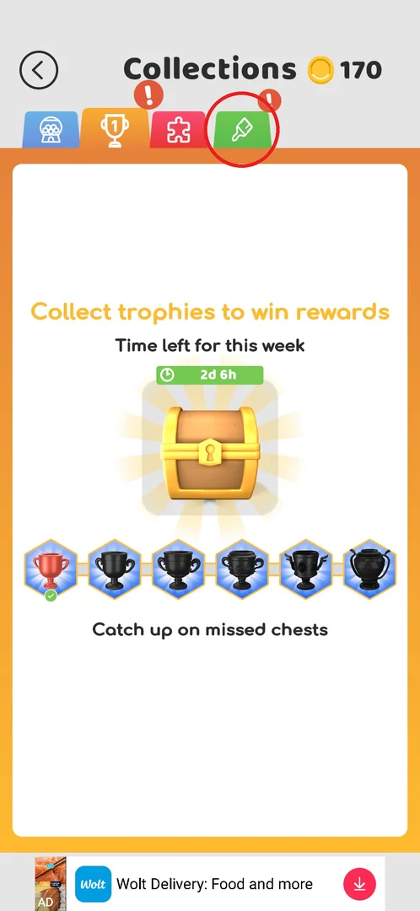
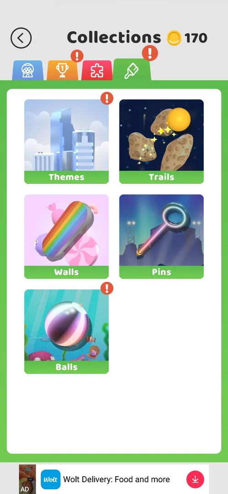
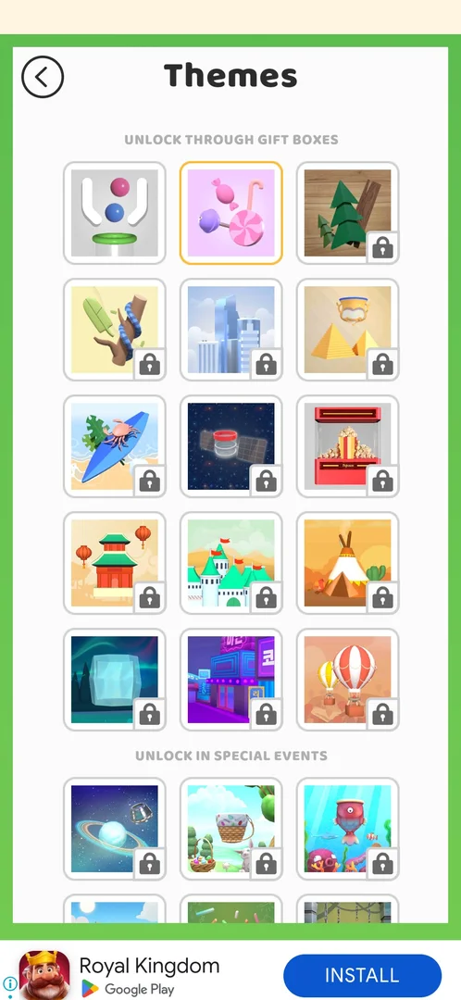
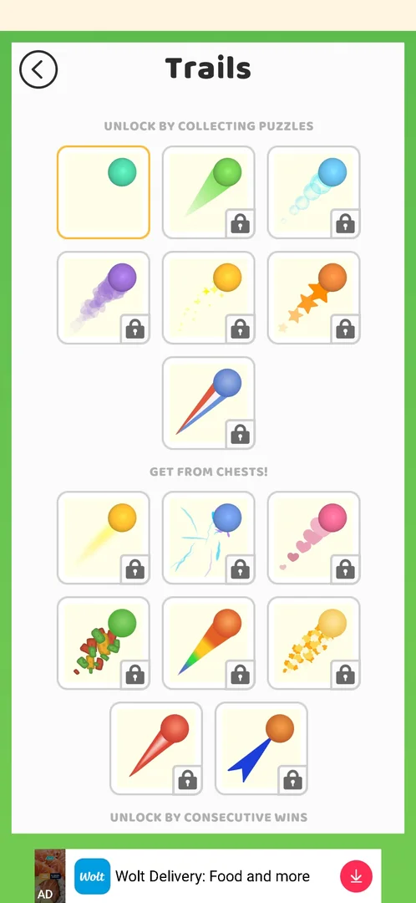
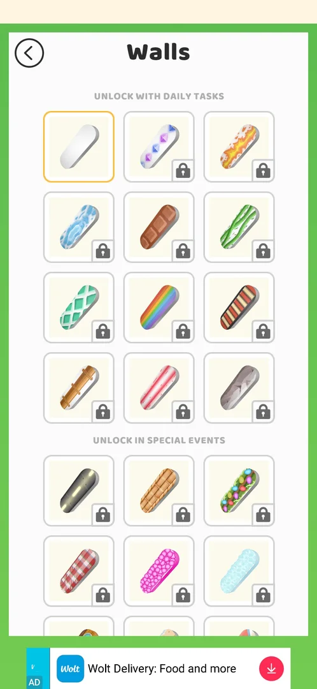
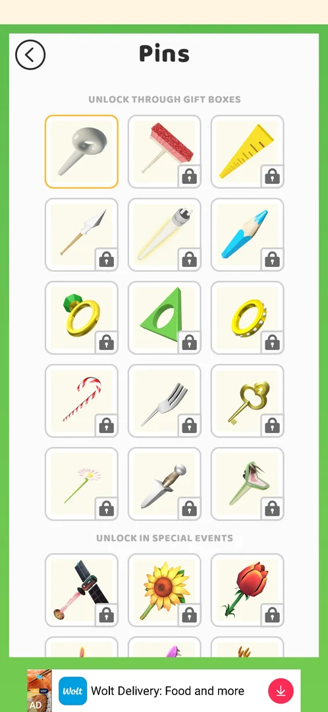
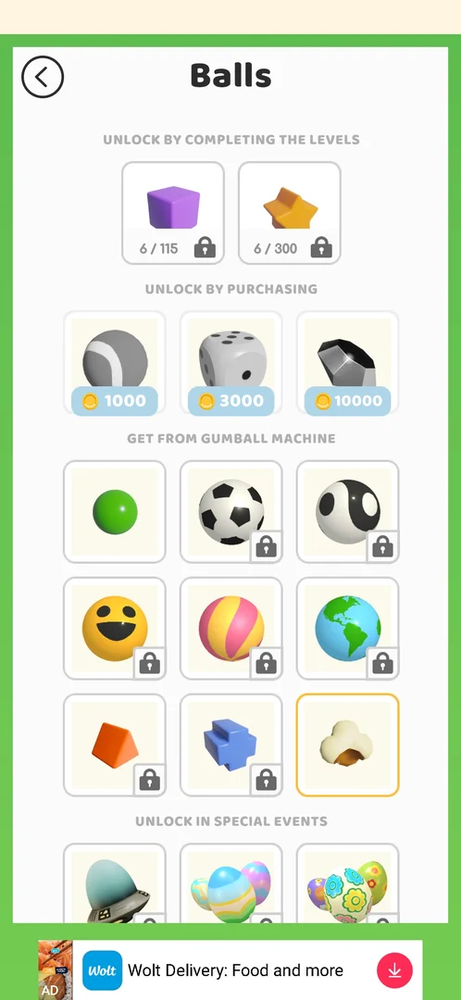

# Collections: skins tab (brush)

> Recheck on v241.5.1: documented on 241.3.1; Google Play has 241.5.1.

Skins are the game's cosmetics: the look of the level background (Themes), the trail behind a falling
ball (Trails), the walls, the pins and the balls themselves. They sit in the brush tab of
[Collections](collections.md) as five categories [^s1]. Items are unlocked
mostly by playing — gift boxes, puzzles, chests, daily tasks, events, the Diamond League — and only
three balls are sold for coins [^s2] [^s3]
[^s4]. An unlocked item is equipped with one tap and shows up in the
levels [^s5] [^s6].

## Where to find it

Level map → the box button with the coin balance right of **Play!** opens
[Collections](collections.md); there the green tab with a brush, the rightmost one (circled), opens the
skins menu [^s7]. A red **!** on the tab means something new inside
[^s7].

 [^s7]

## What it looks like

The Collections header (back arrow, title, coin balance) and the row of tabs stay on top; the white
card shows five picture tiles with green labels: Themes, Trails, Walls, Pins, Balls. A red **!** on a
tile marks a category with a new item — here Themes and Balls [^s8]. A
tile opens its category as a full list with a back arrow; the list is grouped by unlock source under
grey headings, the equipped item has a yellow frame and locked items a padlock
[^s9] [^s5]. A banner ad sits at the bottom
[^s8].

 [^s8]

## What you can do

| Tab or button | What it does |
|---|---|
| [Themes](#themes) | Level backgrounds: gift boxes, special events, Diamond League |
| [Trails](#trails) | The trail behind the balls: puzzles, chests, consecutive wins |
| [Walls](#walls) | Wall looks: daily tasks, special events, Diamond League; not sold |
| [Pins](#pins) | Pin looks: gift boxes, special events, consecutive wins, Diamond League; not sold |
| [Balls](#balls) | Ball looks: level milestones, coins, the gumball machine, special events |
| [Result](#result) | What an equipped theme and ball look like in a level |

### Themes

"UNLOCK THROUGH GIFT BOXES": 15 themes; at first only the default one was open and selected
[^s1]. Below, "UNLOCK IN SPECIAL EVENTS": 12 seasonal themes (space,
Easter, underwater, summer, school, Halloween, autumn, winter, Christmas, Valentine's Day and others),
and "UNLOCK BY REACHING DIAMOND LEAGUE": 1 theme [^s10]. Tapping a locked
theme shows nothing — no hint of the condition [^s11]. Tapping the
unlocked Candy theme equipped it at once, with no confirmation [^s5].

 [^s5]

### Trails

"UNLOCK BY COLLECTING PUZZLES": 7 trails (the default one selected, 6 locked); "GET FROM CHESTS!": 8
trails; below them "UNLOCK BY CONSECUTIVE WINS" [^s12]. Further down the
list there are seasonal trails (Halloween, autumn, Christmas, Valentine's Day)
[^s13]. That one puzzle album gives one trail is inferred: the
Landscapes album reward looks like a ball with a trail [^s14].

 [^s12]

### Walls

"UNLOCK WITH DAILY TASKS": 12 walls (the default one selected, 11 locked); "UNLOCK IN SPECIAL EVENTS":
about 27; "UNLOCK BY REACHING DIAMOND LEAGUE": 1. No wall is sold for coins
[^s9] [^s3]. Tapping a locked wall shows
nothing [^s15].

 [^s9]

### Pins

"UNLOCK THROUGH GIFT BOXES": 15 pins (the default one selected, 14 locked); "UNLOCK IN SPECIAL
EVENTS": about 20; "UNLOCK BY CONSECUTIVE WINS": 1; "UNLOCK BY REACHING DIAMOND LEAGUE": 1. No pin is
sold for coins [^s16] [^s4].

 [^s16]

### Balls

"UNLOCK BY COMPLETING THE LEVELS": a cube for 115 levels and a star for 300, each with a counter
(3/115 in the first session, 6/115 in the second); "UNLOCK BY PURCHASING": a tennis ball for 1000
coins, a die for 3000, a diamond for 10000; "GET FROM GUMBALL MACHINE": 9 balls (the green default
one and those won in the [gacha](gacha.md)); "UNLOCK IN SPECIAL EVENTS": eggs and others
[^s2] [^s17]. The Popcorn ball won in the
gacha came with a red **!**; tapping it equipped it at once (yellow frame)
[^s17] [^s18]. Tapping the 1000-coin ball
with 62 coins did nothing — no "not enough coins" popup [^s19].

 [^s18]

### Result

Level 7 after equipping the Candy theme and the Popcorn ball: a lilac background with sweets and
popcorn balls [^s6]. The first Play right after equipping gave a blank
beige screen with only the banner ad for more than 15 s; a tap and Back did not help, and the game had
to be closed from recent apps and restarted [^s20]. That the skin change
caused it is not established.

 [^s6]

## How it works

Unlock sources (v241.3.1):

| Category | Sources | Source |
|---|---|---|
| Themes | Gift Boxes (15), seasonal events (12), Diamond League (1) | [^s10] |
| Trails | Puzzles (7), chests (8), consecutive wins | [^s12] |
| Walls | Daily Tasks (12), Special Events (about 27), Diamond League (1); not sold | [^s9] [^s3] |
| Pins | Gift Boxes (15), Special Events (about 20), consecutive wins (1), Diamond League (1); not sold | [^s16] [^s4] |
| Balls | 115 and 300 levels, coins 1000 / 3000 / 10000, gumball machine (9), events | [^s2] [^s17] |

- One item per category is equipped (yellow frame); a tap on an unlocked item equips it at once
  [^s5] [^s18].
- Locked items show no condition when tapped; the condition is only the group heading
  [^s11] [^s15].
- The level counter on the milestone balls went 3 → 6 between the sessions although the player had
  reached level 7 in the first one; what it counts exactly is not known
  [^s17].

## Cases

| Case | What was done | Result | Source |
|---|---|---|---|
| Buy without coins | Tapped the 1000-coin ball with 62 coins | Nothing happens | [^s19] |
| Walls and Pins | Opened both lists | Sources as above, none for coins | [^s4] |
| Equip | Tapped the Candy theme and the Popcorn ball | Equipped at once (yellow frame); level 7 showed the Candy background and popcorn balls | [^s5] [^s6] |
| Themes ! badge | Open and equip the new theme | not verified | |

## Not verified

- Themes ! badge: which new theme it marks (Space?) and equipping it.
- What a gift box, a chest, a daily task or a consecutive-win streak gives in this menu, and how
  many puzzles open a trail.
- Buying a coin ball with enough coins.

[^s1]: session 20260930-192115-chrono-2FYKPJ, step 42 — [video at 9:08](https://youtu.be/BVqoYRE5kRU?t=548)
[^s2]: session 20260930-192115-chrono-2FYKPJ, step 49 — [video at 10:10](https://youtu.be/BVqoYRE5kRU?t=610)
[^s3]: session 20260930-201034-chrono-2FYKPJ, step 11 — [video at 2:53](https://youtu.be/JGEX3-Rfkdw?t=173)
[^s4]: session 20260930-201034-chrono-2FYKPJ, step 14 — [video at 3:25](https://youtu.be/JGEX3-Rfkdw?t=205)
[^s5]: session 20260930-201034-chrono-2FYKPJ, step 17 — [video at 3:53](https://youtu.be/JGEX3-Rfkdw?t=233)
[^s6]: session 20260930-201034-chrono-2FYKPJ, step 35 — [video at 7:53](https://youtu.be/JGEX3-Rfkdw?t=473)
[^s7]: session 20260930-201034-chrono-2FYKPJ, step 7 — [video at 2:16](https://youtu.be/JGEX3-Rfkdw?t=136)
[^s8]: session 20260930-201034-chrono-2FYKPJ, step 8 — [video at 2:26](https://youtu.be/JGEX3-Rfkdw?t=146)
[^s9]: session 20260930-201034-chrono-2FYKPJ, step 9 — [video at 2:35](https://youtu.be/JGEX3-Rfkdw?t=155)
[^s10]: session 20260930-192115-chrono-2FYKPJ, step 43 — [video at 9:19](https://youtu.be/BVqoYRE5kRU?t=559)
[^s11]: session 20260930-192115-chrono-2FYKPJ, step 44 — [video at 9:30](https://youtu.be/BVqoYRE5kRU?t=570)
[^s12]: session 20260930-201034-chrono-2FYKPJ, step 22 — [video at 4:38](https://youtu.be/JGEX3-Rfkdw?t=278)
[^s13]: session 20260930-192115-chrono-2FYKPJ, step 47 — [video at 9:54](https://youtu.be/BVqoYRE5kRU?t=594)
[^s14]: session 20260930-192115-chrono-2FYKPJ, step 38 — [video at 8:35](https://youtu.be/BVqoYRE5kRU?t=515)
[^s15]: session 20260930-201034-chrono-2FYKPJ, step 10 — [video at 2:46](https://youtu.be/JGEX3-Rfkdw?t=166)
[^s16]: session 20260930-201034-chrono-2FYKPJ, step 13 — [video at 3:14](https://youtu.be/JGEX3-Rfkdw?t=194)
[^s17]: session 20260930-201034-chrono-2FYKPJ, step 19 — [video at 4:09](https://youtu.be/JGEX3-Rfkdw?t=249)
[^s18]: session 20260930-201034-chrono-2FYKPJ, step 20 — [video at 4:23](https://youtu.be/JGEX3-Rfkdw?t=263)
[^s19]: session 20260930-192115-chrono-2FYKPJ, step 50 — [video at 10:22](https://youtu.be/BVqoYRE5kRU?t=622)
[^s20]: session 20260930-201034-chrono-2FYKPJ, step 27 — [video at 5:56](https://youtu.be/JGEX3-Rfkdw?t=356)
