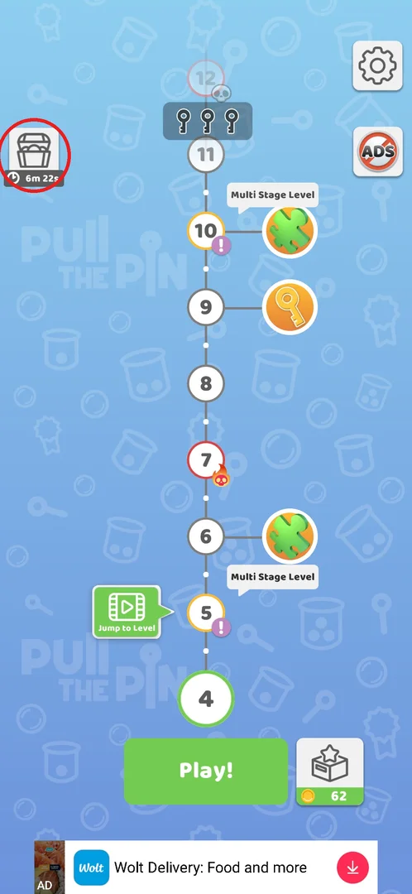
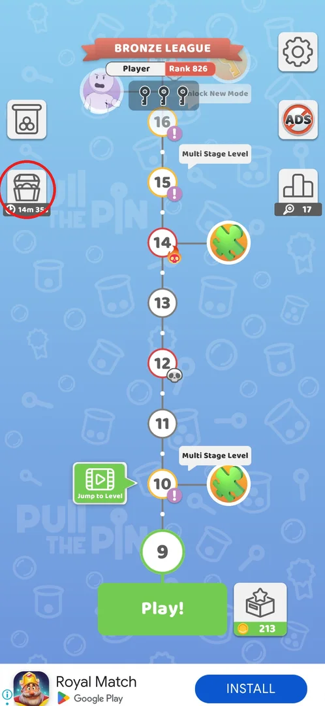
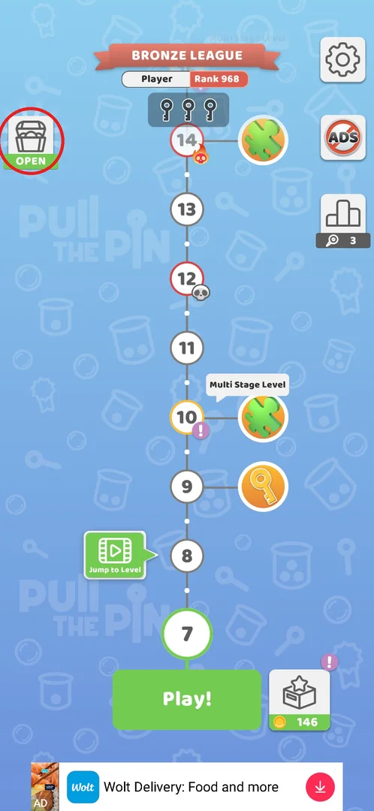
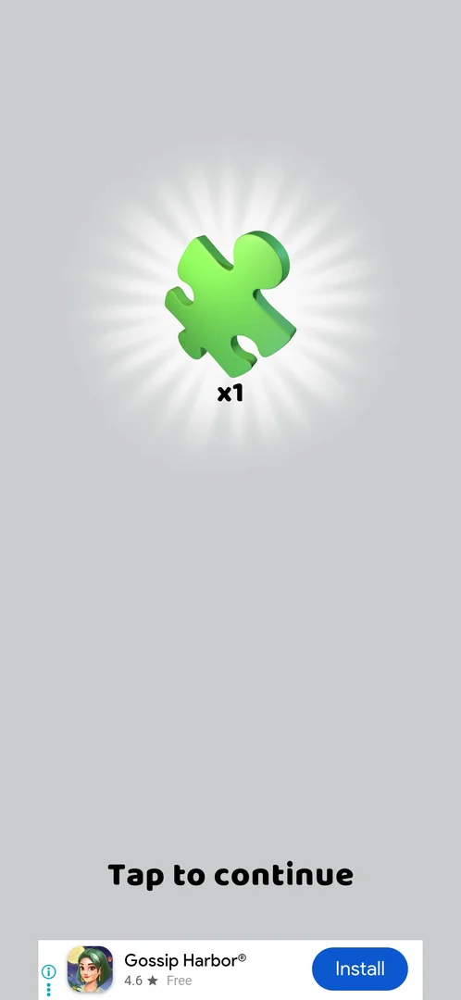

# Timed prize chest

> Recheck on v241.5.1: documented on 241.3.1; Google Play has 241.5.1.

A free prize chest that sits on the level map. A countdown runs under it in real time; while it runs the
chest cannot be opened, and when it ends the chest shows OPEN and one tap gives a reward — a theme
the first time, a puzzle piece the second time [^s1] [^s5] [^s4]. Opening it starts the next countdown [^s6].

## Where to find it

On the level map (the main screen with the Play! button), the chest button at the top left;
the countdown is written under the chest [^s1]. After level 8 a new jar button
(All You Can Play!) takes the top-left slot and the chest moves one button lower [^s3].

 [^s1]

## What it looks like

<!-- no-screen: the chest is a button on the level map and has no screen of its own; opening it shows only a full-screen reward reveal (see "Reward") -->

The chest is a grey chest icon on a white square button. Under it is either a dark label with a clock and
the time left (for example `6m 22s`, `14m 54s`) or, once the time is up, a green `OPEN` label [^s1] [^s2].
Opening it shows the reward alone on a grey screen with a light burst behind it and `Tap to continue`
below [^s5] [^s4].

*Clip 18 s · [original on YouTube from 20:42](https://youtu.be/BVqoYRE5kRU?t=1242)*

## What you can do

| Tab or button | What it does |
|---|---|
| [Locked chest](#locked-chest) | Shows the time left; tapping it does nothing [^s1] |
| [OPEN](#open) | Opens the chest and shows the reward [^s5] |
| [Reward](#reward) | `Tap to continue` takes the reward and returns to the map with a new countdown [^s6] |

### Locked chest

While the countdown runs, a tap on the chest gives no reaction — no popup, no offer to speed it up [^s1].
The countdown runs in real time: 10m 49s at minute 5.1 of the session, 6m 22s at minute 11.1 [^s1].

 [^s3]

### OPEN

When the countdown ends, the time label is replaced by a green `OPEN`; tapping the chest opens it at
once [^s2] [^s5].

 [^s2]

### Reward

The reward is shown on its own screen; `Tap to continue` closes it [^s5] [^s4]. The first chest gave the
Candy theme (a sweets icon), a theme that the Themes section lists as coming from gift boxes [^s5]. The
second chest gave one puzzle piece; it went into the lion puzzle as that puzzle's first piece, the puzzle
window followed, and after closing it an interstitial ad played [^s4] [^s7].

 [^s5]

 [^s4]

## How it works

Version 241.3.1.

- The countdown runs in real time: it kept going while the player was in other screens [^s1].
- The first chest was ready about 11 minutes after the map first appeared (10m 49s were left when it was
  first seen) [^s1] [^s5].
- Each opening starts the next countdown at once: 14m 54s after the first chest [^s6], 14m 35s after the
  second [^s3] (the second figure was read after an ad, so the countdown had already run a little).

| Chest | Timer | Reward | Source |
|---|---|---|---|
| 1 | 10m 49s when the map first appeared | Candy theme | [^s1] [^s5] |
| 2 | 14m 54s | Puzzle piece x1 (lion puzzle) | [^s6] [^s4] |
| 3 | 14m 35s | not seen yet | [^s3] |

## Cases

| Case | What was done | Result | Source |
|---|---|---|---|
| Tap while the timer runs | Tapped the chest with 6m 22s left | Nothing happens | [^s1] |
| Open after the timer | Tapped the chest showing OPEN | Candy theme | [^s5] |
| Next timer | Looked at the map right after opening | 14m 54s | [^s6] |
| Second chest | Opened it after about 15 min | Puzzle piece x1 (lion puzzle); an interstitial followed | [^s4] [^s7] |

## Not verified

- What the third and later chests give, and whether the timer keeps growing past about 15 minutes.
- Whether the countdown runs while the game is closed.
- Whether there is any way to speed the chest up (a video or coins); none was offered on tap [^s1].

[^s1]: session 20260930-192115-chrono-2FYKPJ, step 53 — [video at 10:47](https://youtu.be/BVqoYRE5kRU?t=647)
[^s2]: session 20260930-192115-chrono-2FYKPJ, step 89 — [video at 21:10](https://youtu.be/BVqoYRE5kRU?t=1270)
[^s3]: session 20260930-201034-chrono-2FYKPJ, step 77 — [video at 25:32](https://youtu.be/JGEX3-Rfkdw?t=1532)
[^s4]: session 20260930-201034-chrono-2FYKPJ, step 73 — [video at 23:23](https://youtu.be/JGEX3-Rfkdw?t=1403)
[^s5]: session 20260930-192115-chrono-2FYKPJ, step 90 — [video at 21:25](https://youtu.be/BVqoYRE5kRU?t=1285)
[^s6]: session 20260930-192115-chrono-2FYKPJ, step 91 — [video at 21:45](https://youtu.be/BVqoYRE5kRU?t=1305)
[^s7]: session 20260930-201034-chrono-2FYKPJ, step 75 — [video at 24:03](https://youtu.be/JGEX3-Rfkdw?t=1443)
