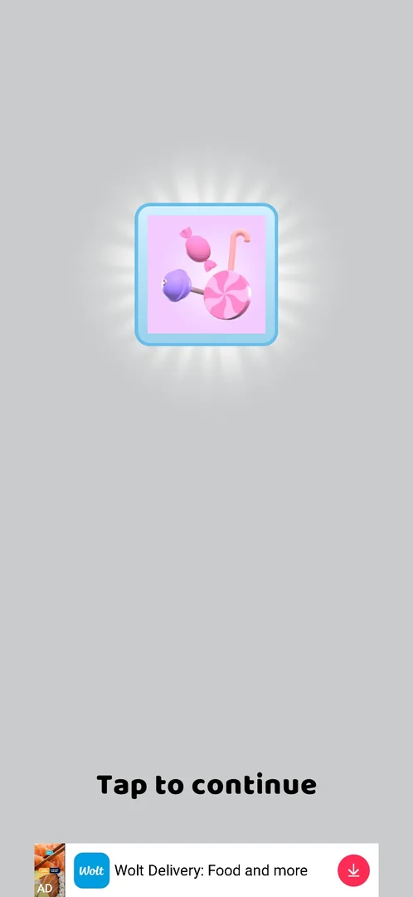
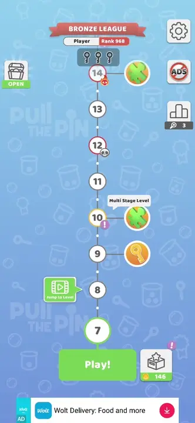

# Timed prize chest

> Recheck on v241.5.1: documented on 241.3.1; Google Play has 241.5.1.

A chest on the map (top left) opens when its timer ends [s:20260930-192115-chrono-2FYKPJ#90].

*Clip 18 s · [original on YouTube from 20:42](https://youtu.be/BVqoYRE5kRU?t=1242)*

## Cases
| Case | What was done | Result | Source |
|---|---|---|---|
| Tap while the timer runs | Tapped | Nothing happens | [s:20260930-192115-chrono-2FYKPJ#53] |
| Open after the timer | OPEN | Candy theme | [s:20260930-192115-chrono-2FYKPJ#90] |
| Next timer | Looked after opening | 14m54s | [s:20260930-192115-chrono-2FYKPJ#91] |
| Second chest | Opened after about 15 min | Puzzle piece x1 (lion puzzle); an interstitial followed | [s:20260930-201034-chrono-2FYKPJ#73] [s:20260930-201034-chrono-2FYKPJ#75] |

## Numbers (v241.3.1)
| Chest | Timer | Reward | Source |
|---|---|---|---|
| 1 | 10m49s when the map first appeared | Candy theme | [s:20260930-192115-chrono-2FYKPJ#53] [s:20260930-192115-chrono-2FYKPJ#90] |
| 2 | 14m54s | Puzzle piece | [s:20260930-192115-chrono-2FYKPJ#91] [s:20260930-201034-chrono-2FYKPJ#73] |
| 3 | 14m35s | not seen yet | [s:20260930-201034-chrono-2FYKPJ#77] |
