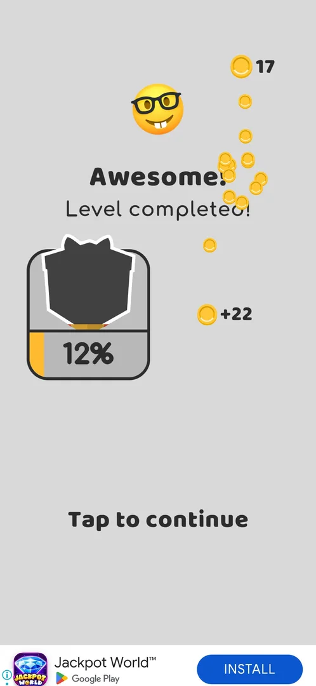
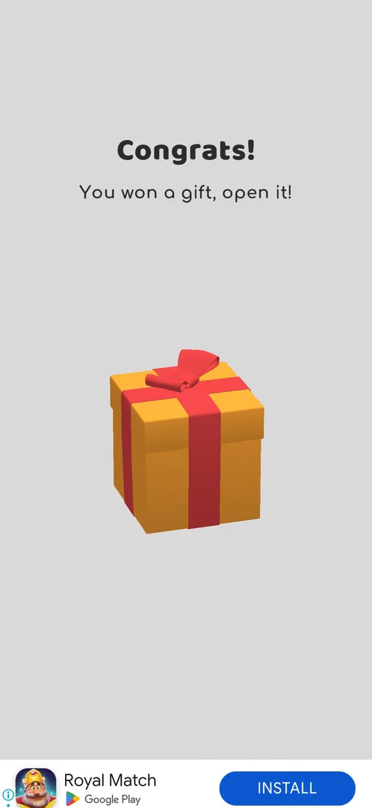
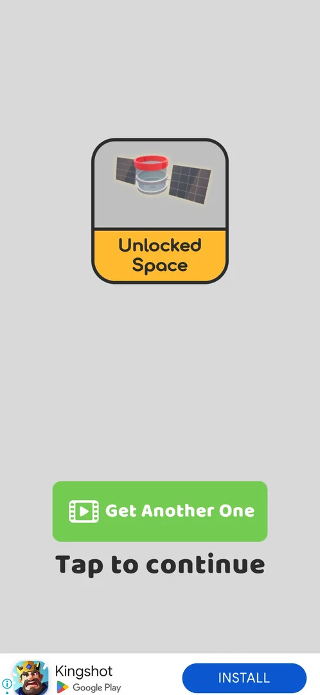

# Gift unlock progress bar

A card on the win screen with a dark silhouette of a gift and a percentage bar under it; each level won
fills the bar [^s1] [^s2]. When the bar filled, after the level 9 win, a gift box was opened and gave the cup
skin **Space** [^s3] [^s4]. The same meter keeps running in cycles of nine main-level wins: the second cycle
ended at level 18 and the third at level 27, each with a gift box; those gifts are on
[Post-win gift meter](post-win-gift.md) [^s7].

## Why it appeared

First level win screen: silhouette gift fills 12% per win [^s1].

## Where to find it

The win screen after each level: the card left of the coins earned [^s1]. No button on the level screen or
the map leads to it [^s1].

 [^s1]
*The level 1 win screen: the gift card on the left, bar at 12%*

## What it looks like

 [^s2]
*The level 2 win screen: bar at 23%; the lower edge of the gift shows red and yellow stripes*

A dark silhouette of a wrapped gift with a bow, a yellow bar along the bottom of the card and the
percentage on it. The silhouette is uncovered from the bottom as the bar fills: a thin yellow strip at
12%, red and yellow stripes at 23% [^s1] [^s2], the whole gift but the bow at 93%
[^s5]. On the level 2 win screen the bar counts up from 12% to 23% (19%
mid-way in the clip) [^s2].

 [^s2]
*Clip 10.9 s · [original on YouTube from 2:14](https://youtu.be/JjeHh2uiLgE?t=134); the bar counts up at the end*

### Popup

 [^s4]
*After the level 9 win: "Congrats! You won a gift, open it!" and a closed gift box*

When the bar fills, a screen "Congrats! You won a gift, open it!" with a closed gift box comes after the
win; a tap on the box opens it [^s4] [^s3].

### Result

 [^s3]
*The gift: "Unlocked Space", a cup with satellite panels; Get Another One (video), Tap to continue*

The gift was the cup skin **Space** (a cup with solar-panel wings), shown on a card "Unlocked Space", with
a green **Get Another One** button with a video icon and **Tap to continue** [^s3]. Tap to continue was used
[^s6].

## How it works

Version 241.5.1.

| Level won | Bar |
|---|---|
| 1 (first session) | 12% [^s1] |
| 2 (first session) | 23% [^s2] |
| 2 (replayed: the first win was not saved) | 32% |
| 3 | 40% |
| 4 | 52% |
| 5 | 62% |
| 6 | 74% |
| 7 | 85% |
| 8 | 93% |
| 9 | full: the gift [^s4] |

Source of the rows from the replayed level 2 on: [^s3]. Each win adds 7-12% [^s3]. The bar filled after ten
wins (the level 2 replay included) [^s3]. Inferred: the bar counts wins, not level numbers, as the replayed
level 2 also filled it.

Version 241.5.2: the meter runs in cycles of nine main-level wins, with the same steps [^s7].

| Cycle | Wins | Bar | At 100% |
|---|---|---|---|
| 1 | levels 1-9 | 12, 23, 32, 40, 52, 62, 74, 85, 93, full | the cup skin Space [^s3] |
| 2 | levels 10-18 | — | a gift box, declined ([Post-win gift meter](post-win-gift.md)) |
| 3 | levels 19-27 | 12 ... 74, 85, 94, 100 | a gift box: a puzzle piece, one more for Get Another One (video) [^s7] |

The step is about +12% early and +11, +9, +6 near the top [^s7]. The next box is due after level 36 (inferred
from the nine-win cycle).

## Cases

| Case | What was done | Result | Source |
|---|---|---|---|
| Shown only on the win screen, no button seen <!-- case:chk-entry --> | Won levels 1-9 | ✅ The card is on each win screen | [^s1] |
| Silhouette gift card with percent bar on the win screen <!-- case:chk-screen --> | Won levels 1-9 | ✅ Seen | [^s1] |
| Fills per level win: 12% after L1, 23% after L2 <!-- case:chk-progress --> | Won levels 1 and 2 | ✅ +12%, +11% | [^s2] |
| Gift bar per win: L2 32%, L3 40, L4 52, L5 62, L6 74, L7 85, L8 93, L9 full -> gift = cup skin Space <!-- case:gift-at-l9 --> | Won levels 2-9, opened the gift | ✅ Full at level 9; the cup skin Space | [^s3] |
| Why it appeared <!-- case:chk-appeared --> | Won level 1 | ✅ On the first win screen | [^s1] |
| The items <!-- case:chk-items --> | Filled the bar three times | ✅ Level 9: the cup skin Space; level 18: a gift box (declined); level 27: a gift box with a puzzle piece | [^s3] [^s7] |
| How a step is earned <!-- case:chk-earn --> | Won levels 1-9 and 19-27 | ✅ Each main-level win adds a step (about +12% early, +11, +9, +6 near the top); nine wins fill it | [^s7] |
| Using an item <!-- case:chk-use --> | Opened the level 27 box | ✅ A skin is equipped from Collections (by the map's record; the Space cup was not equipped here); a box is opened by Open (video) on "Congrats! You won a gift" | [^s8] |
| Completing the bar: the reward <!-- case:chk-complete --> | Filled the bar at levels 9 and 27 | ✅ At 100% the reward screen follows Level completed!: the skin at level 9; at level 27 a box with a puzzle piece, plus Get Another One (video) | [^s3] [^s7] |
| One meter with the post-win gift <!-- case:same-meter-as-post-win-gift --> | Compared the bar over levels 1-9 and 19-27 | ✅ The same win-screen meter, in cycles of nine main wins with the same steps; cycle 1 gave the cup skin Space, cycle 2 a box at level 18, cycle 3 a box at level 27 | [^s7] |

## Not verified

- Whether anything besides a main-level win fills the bar, and whether a lost level counts
- Equipping the Space cup and what it changes
- What Get Another One gives for the video after a skin (after a box it gives a second puzzle piece, [Post-win gift meter](post-win-gift.md))

[^s1]: session 20261003-193015-chrono-2FYKPJ, step 3 — [video at 1:22](https://youtu.be/JjeHh2uiLgE?t=82)
[^s2]: session 20261003-193015-chrono-2FYKPJ, step 7 — [video at 2:25](https://youtu.be/JjeHh2uiLgE?t=145)
[^s3]: session 20261003-203702-chrono-2FYKPJ, step 46 — [video at 17:59](https://youtu.be/cirqlD7KGWI?t=1079)
[^s4]: session 20261003-203702-chrono-2FYKPJ, step 45 — [video at 17:41](https://youtu.be/cirqlD7KGWI?t=1061)
[^s5]: session 20261003-203702-chrono-2FYKPJ, step 40 — [video at 14:37](https://youtu.be/cirqlD7KGWI?t=877)
[^s6]: session 20261003-203702-chrono-2FYKPJ, step 47 — [video at 18:21](https://youtu.be/cirqlD7KGWI?t=1101)
[^s7]: session 20261006-061608-chrono-2FYKPJ, step 28 — [video at 14:55](https://youtu.be/OfYU2WgEiQU?t=895)
[^s8]: session 20261006-061608-chrono-2FYKPJ, step 27 — [video at 13:31](https://youtu.be/OfYU2WgEiQU?t=811)
