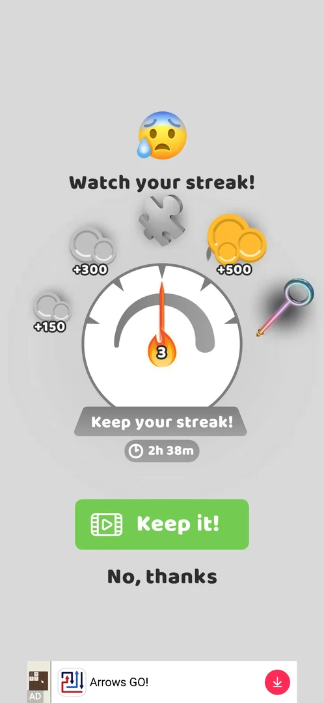

# Win streak (consecutive wins) rewards

The win streak counts levels won in a row and pays rewards along a gauge: coins, a puzzle piece and a
pin skin [^s1]. Losing a level breaks the streak unless the player watches a video to keep it [^s1]
[^s2]. The Trails list in [Skins](skins.md) also has a section "UNLOCK BY CONSECUTIVE WINS", so some
trails are win-streak rewards too.

## Where to find it

<!-- no-entry: the session saw the streak only on the popup that appears by itself after a loss; no map button for it was found -->

No map button for the streak was seen. Its screen opened by itself when a level was lost with a streak of
3 wins: losing level 27 brought up "Watch your streak!" before the defeat screen (v241.5.1) [^s1]. Where
the streak gauge shows after a win is not known yet.

## What it looks like

"Watch your streak!" with a worried face over a round gauge [^s1]. A needle with a flame shows the
current streak (3) [^s1]. Around the gauge are the rewards in order: +150 coins, +300 coins, a puzzle
piece, +500 coins and a pin skin; the ones not reached yet are greyed out [^s1]. Under the gauge are
"Keep your streak!" with a timer (2h 38m), a green **Keep it!** button with a video icon and **No,
thanks** [^s1].

 [^s1]

## What you can do

| Tab or button | What it does |
|---|---|
| [Keep it!](#keep-it) | Watch a video to keep the streak after a loss (not tried) |
| [No, thanks](#no-thanks) | Give the streak up; the defeat screen of the level follows |

### Keep it!

<!-- no-frame: not tapped in this session (task win-streak-keep) -->

The green button with a video icon offers to keep the streak for a video [^s1]. It was not tried.

### No, thanks

<!-- no-frame: the tap goes straight to the defeat screen, shown on the Core level page -->

Closes the popup and shows the [defeat screen](core-level.md#defeat) with Skip and Retry [^s2]; the
streak is lost [^s3].

## How it works

- Rewards on the gauge (v241.5.1): +150 coins, +300 coins, a puzzle piece, +500 coins, a pin skin [^s1].
  At which streak each one is paid is not shown in numbers; the gauge has tick marks between them.
- A loss with a streak (3 wins here) opens the streak-save popup before the defeat screen [^s1].
- The timer under "Keep your streak!" read 2h 38m; what it counts down (the offer, or a streak event) is
  not known (unverified) [^s1].
- After **No, thanks** the streak is lost (as the session recorded); passing the level afterwards with
  Skip for a video did not restore it [^s3].

## Cases

| Case | What was done | Result | Source |
|---|---|---|---|
| Loss with a streak | Lost level 27 on purpose with a streak of 3, then No, thanks | "Watch your streak!" popup with Keep it! (video) and a 2h 38m timer; No, thanks led to the defeat screen and the streak was lost | [^s1] [^s2] [^s3] |
| Rewards for consecutive wins | Not done | The gauge lists the rewards, none was received yet | [^s1] |

## Not verified

- Does **Keep it!** (video) keep the streak, and is the gauge then unchanged.
- Rewards for consecutive wins: at which streak each reward is paid, and where the gauge shows after a
  win.
- What the 2h 38m timer counts down.
- Which trails the "UNLOCK BY CONSECUTIVE WINS" section of Skins gives, and at which streak.

[^s1]: session 20261001-220948-chrono-2FYKPJ, step 2 — [video at 0:50](https://youtu.be/cPj7O98vvl0?t=50)
[^s2]: session 20261001-220948-chrono-2FYKPJ, step 3 — [video at 1:10](https://youtu.be/cPj7O98vvl0?t=70)
[^s3]: session 20261001-220948-chrono-2FYKPJ, step 8 — [video at 3:41](https://youtu.be/cPj7O98vvl0?t=221)
