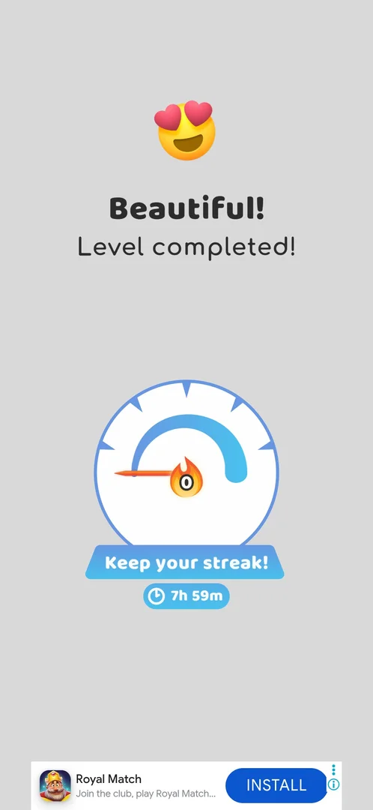
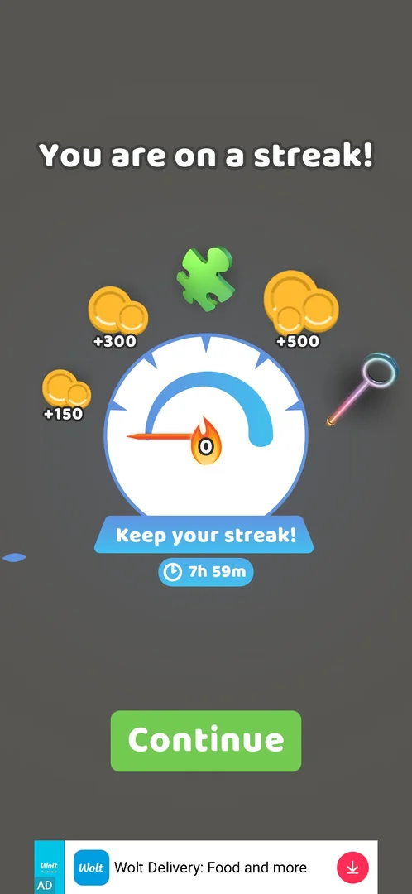
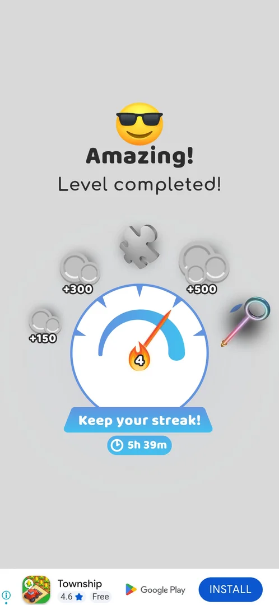
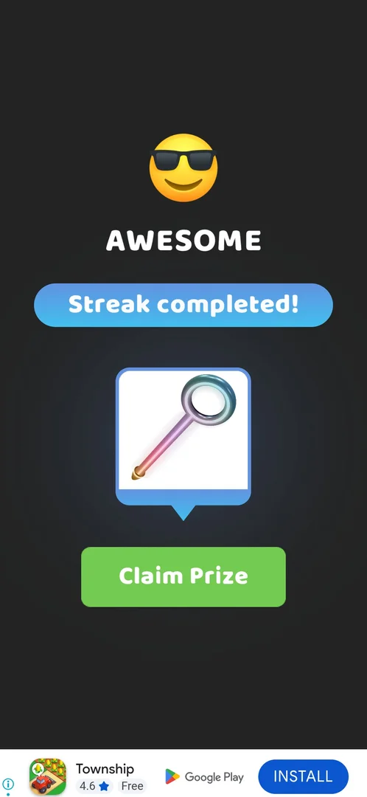
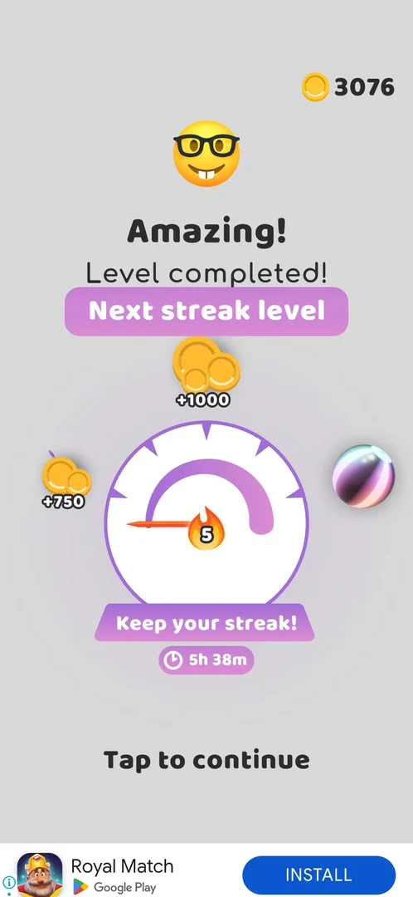
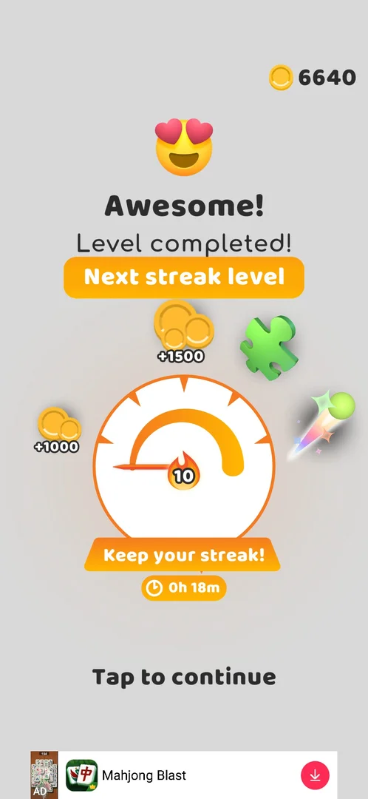
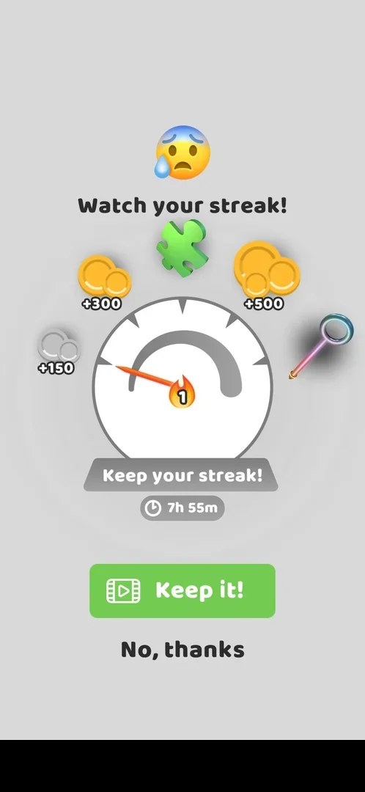
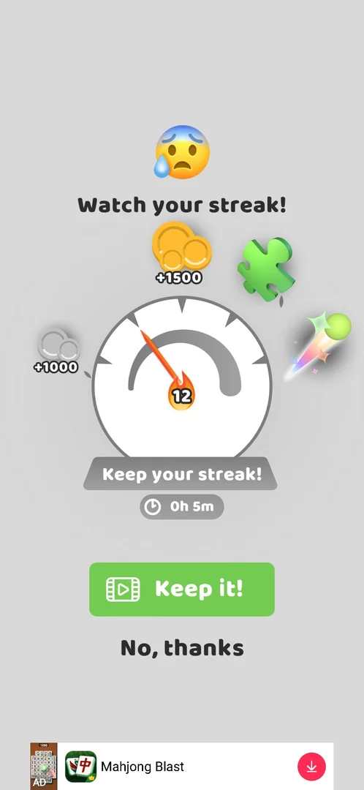
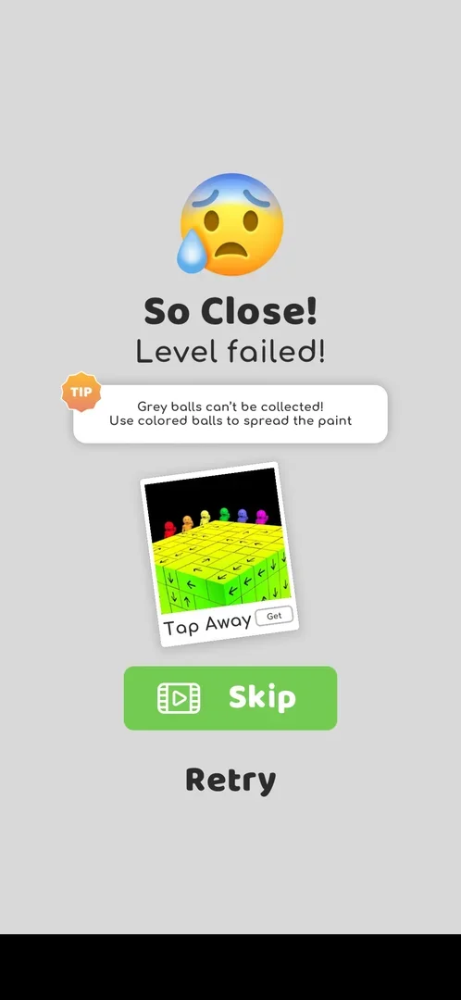

# Win streak meter

A dial with a flame counter that shows up in the win flow of the main levels: a popup "You are on a streak!"
with rewards placed around the dial (+150 coins, +300 coins, a puzzle piece, +500 coins and a pin) and a
"Keep your streak!" countdown, and the same dial on the "Level completed!" screen [^s1] [^s2]. The counter
went up by one with each win: 1, 2, 3 and 4 after four wins in a row on 6 October; at 4 the streak was
completed and paid its prize, a rainbow pin skin, and a **Next streak level** dial began with new rewards
(+750 coins, +1000 coins, a ball skin) [^s7] [^s8]
[^s9]. On a loss with the counter at 1 the same dial came as **Watch your
streak!**: keep the streak for a video, or go on to the fail screen [^s5] [^s6].

## Why it appeared

Popup 'You are on a streak!' right after the L16 board was cleared (2nd win this session, L15+L16) [^s1].

## Where to find it

It is not opened from a button. After the level 16 board was cleared the popup came by itself, before the
league board; after the league board the dial came again on the **Level completed!** screen, under
"Beautiful!", before the gift box and the coins [^s1] [^s2]. No dial was in the frames of the level 15 and
level 17 win screens of the same session [^s3] [^s4]. On 6 October the dial came after every main-level win,
between the league board and the coin screen [^s7]
[^s10].

 [^s2]
*Level completed! after level 16: the streak dial with the flame counter 0 and "Keep your streak!" 7h 59m*

## What it looks like

 [^s1]
*The popup after the level 16 board: the dial at 0 with five rewards around it, Keep your streak! 7h 59m, Continue*

The popup on a dark background: the title **You are on a streak!**, a round dial with a blue arc and a
needle pointing at its left end, a flame with **0** at the needle's base, and five rewards around the top of
the dial from left to right: +150 coins, +300 coins, a green puzzle piece, +500 coins and a pin. Under the
dial the ribbon **Keep your streak!** and a clock with **7h 59m**; at the bottom **Continue** [^s1].

The needle moves to the right with the counter: at 1 it points left, at 3 straight up, at 4 to the upper
right, toward the pin [^s7] [^s10]
[^s8].

## What you can do

| Tab or button | What it does |
|---|---|
| [Continue](#continue) | Closes the popup |
| [Keep your streak!](#keep-your-streak) | The dial on Level completed! after each win; Tap to continue goes on |
| [Claim Prize](#claim-prize) | On Streak completed!: takes the streak prize |
| [Keep it!](#keep-it) | On Watch your streak! after a loss: a video to keep the streak; not tapped |
| [No, thanks](#no-thanks) | On Watch your streak!: goes on to the fail screen |

### Continue

<!-- no-frame: Continue is the green button at the bottom of the popup frame under What it looks like -->

Closed the popup; the league board followed, then Level completed! with the dial [^s2].

### Keep your streak!

 [^s8]
*Level completed! after level 23: the counter at 4, the +150, +300, puzzle piece and +500 rewards drawn in grey, the rainbow pin in colour at the end of the dial, 5h 39m left*

The dial on the **Level completed!** screen, with the ribbon **Keep your streak!** and the countdown under it.
On 6 October it read [^s7] [^s11]
[^s10] [^s8]:

| Win | Counter | Countdown |
|---|---|---|
| Level 21 (this win was later lost to a restart, see below) | 1 | 5h 55m |
| Level 21, played again | 2 | 5h 51m |
| Level 22 | 3 | 5h 46m |
| Level 23 (a Multi Stage level) | 4 | 5h 39m |

In the frames at 1, 2 and 3 no rewards are drawn around the dial; at 4 the +150, +300, puzzle piece and +500
rewards are grey and the pin is in colour at the end of the arc [^s8].
Inferred: grey marks the rewards already reached. A tap on the screen went on to the coin screen
[^s12].

### Claim Prize

 [^s8]
*Streak completed! after the level 23 dial: the prize is a rainbow pin skin, Claim Prize*

After the dial at 4 came a dark screen: a face with sunglasses, **AWESOME**, the ribbon **Streak completed!**,
a card with a rainbow pin and a green **Claim Prize** button [^s8]. Claim
Prize stamped the card **Claimed** [^s9]:

*The tap on Claim Prize: the pin card is stamped Claimed and light rays turn behind it* (clip dropped: per-dream clip limit) [^s9]
*Clip 3 s · [original on YouTube from 17:37](https://youtu.be/j9sNlnJxE4Y?t=1057); Claim Prize and the Claimed stamp*

Then **Amazing! Level completed!** came with a purple **Next streak level** banner and a new dial: the
counter at 5, +750 coins on the left, +1000 coins at the top, a striped ball skin on the right, Keep your
streak! with **5h 38m**, and Tap to continue [^s9]:

 [^s9]
*The next streak level after the prize: counter 5, rewards +750, +1000 and a ball skin; the countdown runs on (5h 38m)*

Tap to continue led to **Puzzle Piece Found!** (one piece of a 3x3 picture, Get Another by video or Tap to
continue), then the level's coin screen, +17 coins with the gift meter at 62%
[^s13] [^s14].

A second streak was completed on the first level 28 win, on 6 October: **Streak completed!** again, the prize
the striped ball skin of the second dial, **Claim Prize**, then **Claimed** on the card [^s17] [^s18]. The
next dial read **10** under **Next streak level**, with +1000 coins, +1500 coins, a puzzle piece and a
rainbow ball trail around it and **0h 18m** left [^s18]:

 [^s18]
*The third streak level after the second prize: counter 10, rewards +1000, +1500, a puzzle piece and a ball trail; 0h 18m left*

That level 28 win was then lost to a restart out of an ad with no close; whether the ball skin was kept was
not checked [^s24].

### Keep it!

 [^s5]
*The popup that came first when level 20 was lost with the counter at 1 (a local banner ad blacked out)*

A level lost while the counter is at 1 opened **Watch your streak!** before the fail screen: a worried face,
the dial with its needle and the flame at **1**, the same five rewards around it (+150 coins drawn in grey,
the other four in colour), the ribbon **Keep your streak!** with **7h 55m**, a green **Keep it!** button
with a video icon and a plain **No, thanks** [^s5]. Keep it! was not tapped: what the video keeps was not seen.

 [^s19]
*The same popup on the level 30 loss, 6 October: counter 12, the third dial's rewards, 0h 5m left*

The second time, at level 30 (a Color Bucket level) with the counter at 12, the dial was grey and the
countdown read **0h 5m**; the rewards were those of the third dial (+1000, +1500, a puzzle piece, a ball
trail) [^s19].

### No, thanks

 [^s6]
*No, thanks led to the usual fail screen of the level (a local banner ad blacked out)*

Led to the level's fail screen: **So Close! Level failed!**, a tip card, **Skip** with a video icon and
**Retry** [^s6]. See [Pin-pull level](core-level.md#level-failed). Whether the counter went back to 0 was not
seen. At level 30 No, thanks led to "Almost! Level failed!" with the same tip, Skip and Retry [^s20]; the
level was won on the retry, and its win flow had no streak dial: the league board, then Level completed! with
the gift meter and the coin multiplier [^s21].

## How it works

Version 241.5.2.

- The counter read 0 on the popup and again on the Level completed! screen after the level 16 win [^s1]
  [^s2]. Level 15 had been won about 4 minutes before, in the same session [^s3].
- On 6 October four wins in a row took the counter from 1 to 4, one step per win (table above)
  [^s7] [^s8].
- A win that the game lost counted all the same: the first level 21 win was followed by an ad with no close,
  the game was restarted and the map was back at level 21, but the coins and pins of that win were kept
  [^s15], and the replayed win put the counter at 2, not 1
  [^s11].
- At 4 the streak was completed: the prize was the rainbow pin skin [^s8].
  The coin balance was 2194 on the map before level 23 and 3161 after its win flow, with +17 coins from the
  level [^s16] [^s14]: 950 coins more, the sum
  of the +150, +300 and +500 on the dial. Inferred: the dial's coin rewards were paid at the completion; the
  Puzzle Piece Found! screen in the same flow is inferred to be the dial's puzzle piece. The balance did not
  change at counters 1 to 3 beyond the level coins (2140 to 2156 to 2172 to 2194)
  [^s7] [^s16].
- The next streak level starts at 5 with +750 coins, +1000 coins and a ball skin
  [^s9].
- The countdown runs in real time and wins do not reset it: 5h 55m to 5h 38m over the four wins, about 17
  minutes, and on into the next streak level [^s7]
  [^s9]. On 5 October it read 7h 59m after the level 16 win and 7h 55m at
  the level 20 loss [^s2] [^s5].
- The level 16 win paid +21 coins on the Level completed! screen, with no multiplier bar this time [^s2].
- On a loss with the counter at 1 (level 20, a Color Bucket level) the countdown read 7h 55m [^s5].
- 6 October, next session: the second streak completed on the first level 28 win (the striped ball skin);
  the next dial read 10 with 0h 18m left [^s17] [^s18]. The Level completed! screens of the replayed level 28
  win and the level 29 win carried no dial [^s22] [^s23]. At the level 30 loss the counter read 12 with 0h 5m
  left [^s19]. Inferred: the two wins counted although no dial was shown.
- Declining Keep it! at 12 led to the fail screen; the retry's win flow showed no dial [^s20] [^s21]. Whether
  the streak was lost, or the countdown simply ran out at about the same time, is not verified.

## Cases

| Case | What was done | Result | Source |
|---|---|---|---|
| After the L16 win the streak gauge stayed at 0 (flame 0) on the win screen; +21 coins, no multiplier offer this time <!-- case:counter-after-win --> | Won level 16 | ✅ 0 on the popup and on Level completed! | [^s2] |
| Why it appeared <!-- case:chk-appeared --> | Won level 16 | ✅ The popup right after the board was cleared | [^s1] |
| Where to find it <!-- case:chk-entry --> | Won levels 16 and 21 to 23 | not verified: seen only in the win flow; no map button found for it | [^s2] |
| What it looks like <!-- case:chk-screen --> | Won level 16 | ✅ The popup You are on a streak!: the dial, counter 0, five rewards, Keep your streak! 7h 59m, Continue | [^s1] |
| The counter <!-- case:chk-counter --> | Won levels 21, 21 again, 22 and 23 | ✅ The dial on Level completed! after each main-level win; one step per win: 1, 2, 3, 4 | [^s10] |
| The reward for each step of the streak <!-- case:chk-rewards --> | Reached 4 | ✅ At 4 Streak completed!: a rainbow pin skin, Claim Prize; 950 coins more than the level paid (the +150, +300 and +500); the next streak level at 5 with +750, +1000 and a ball skin | [^s9] |
| A completed streak <!-- case:streak-complete --> | Won levels 21 to 23 in a row | ✅ Streak completed!, the rainbow pin skin, Claim Prize, then Next streak level | [^s8] |
| What shows during a level while the streak runs <!-- case:chk-in-level --> | Played levels 21 to 23 | not verified: no streak sign was looked for on the board |  |
| What breaks it <!-- case:chk-break --> | Lost level 20, declined Keep it! | not verified: a loss puts the streak at risk (Watch your streak!); the counter after it was not looked at | [^s6] |
| A loss with the counter at 1 <!-- case:on-loss --> | Lost level 20, tapped No, thanks | ✅ Watch your streak! came first: Keep it! (video) or No, thanks; No, thanks led to the fail screen | [^s6] |
| Offers to keep it after a break <!-- case:chk-save --> | Lost level 20 | not verified: Keep it! for a video is offered on a loss; not tapped, so what it keeps is not seen | [^s5] |
| The second streak <!-- case:second-streak-complete --> | Won level 28 (6 October) | ✅ Streak completed! with a striped ball skin, Claim Prize; the next dial at 10; that win was then reverted by a restart out of a stuck ad (the skin not checked) | [^s17] [^s18] [^s24] |
| Declined at 12 <!-- case:declined-at-12 --> | Lost level 30 with the counter at 12 and 0h 5m left, tapped No, thanks | ✅ Watch your streak! (dial +1000, +1500, a puzzle piece, a ball trail), Keep it! (video) or No, thanks; No, thanks led to the fail screen; the retry's win flow had no streak screen (league board, then Level completed!) | [^s19] [^s20] [^s21] |
| Win screen under Win streak meter <!-- case:under-win --> | Won level 16 | ✅ The base win screen (+21 coins, no multiplier offer) with the dial at 0 | [^s2] |
| Restart under Win streak meter <!-- case:under-restart --> | — | not verified |  |
| Quit under Win streak meter <!-- case:under-quit --> | — | not verified |  |
| Exit the app under Win streak meter <!-- case:under-exit-app --> | — | not verified |  |
| Balls fell out under Win streak meter <!-- case:under-balls-out --> | — | not verified |  |
| Colours mixed under Win streak meter <!-- case:under-colour-mix --> | Lost level 20 (a Color Bucket level) with the counter at 1 | ✅ Watch your streak! (Keep it! for a video / No, thanks) came before the fail screen | [^s6] |

## Not verified

- Where to find it: whether the dial can be opened from the map <!-- case:chk-entry -->
- In a level: whether the streak shows while playing <!-- case:chk-in-level -->
- What breaks it: whether the declined loss reset the counter to 0; a quit; the countdown running out <!-- case:chk-break -->
- Offers to keep it after a break: Keep it! costs a video; what it keeps (the counter, the timer) <!-- case:chk-save -->
- When the countdown started and what happens when it reaches 0
- Whether the dial's coin rewards are paid only at the completion (inferred from the balance)
- The level outcomes while a streak runs: restart, quit, exit the app, balls fell out <!-- case:under-restart --> <!-- case:under-quit --> <!-- case:under-exit-app --> <!-- case:under-balls-out -->

[^s1]: session 20261005-151039-chrono-2FYKPJ, step 25 — [video at 9:16](https://youtu.be/r5lFTdFC8_s?t=556)
[^s2]: session 20261005-151039-chrono-2FYKPJ, step 27 — [video at 9:59](https://youtu.be/r5lFTdFC8_s?t=599)
[^s3]: session 20261005-151039-chrono-2FYKPJ, step 17 — [video at 5:51](https://youtu.be/r5lFTdFC8_s?t=351)

[^s4]: session 20261005-151039-chrono-2FYKPJ, step 34 — [video at 15:10](https://youtu.be/r5lFTdFC8_s?t=910)

[^s5]: session 20261005-235042-chrono-2FYKPJ, step 38 — [video at 13:16](https://youtu.be/PZ3ujKA8euo?t=796)
[^s6]: session 20261005-235042-chrono-2FYKPJ, step 39 — [video at 13:40](https://youtu.be/PZ3ujKA8euo?t=820)

[^s7]: session 20261006-033538-chrono-2FYKPJ, step 7 — [video at 1:27](https://youtu.be/j9sNlnJxE4Y?t=87)
[^s8]: session 20261006-033538-chrono-2FYKPJ, step 50 — [video at 17:17](https://youtu.be/j9sNlnJxE4Y?t=1037)
[^s9]: session 20261006-033538-chrono-2FYKPJ, step 51 — [video at 17:39](https://youtu.be/j9sNlnJxE4Y?t=1059)
[^s10]: session 20261006-033538-chrono-2FYKPJ, step 28 — [video at 10:15](https://youtu.be/j9sNlnJxE4Y?t=615)
[^s11]: session 20261006-033538-chrono-2FYKPJ, step 18 — [video at 5:22](https://youtu.be/j9sNlnJxE4Y?t=322)
[^s12]: session 20261006-033538-chrono-2FYKPJ, step 29 — [video at 10:33](https://youtu.be/j9sNlnJxE4Y?t=633)
[^s13]: session 20261006-033538-chrono-2FYKPJ, step 52 — [video at 18:01](https://youtu.be/j9sNlnJxE4Y?t=1081)
[^s14]: session 20261006-033538-chrono-2FYKPJ, step 53 — [video at 18:24](https://youtu.be/j9sNlnJxE4Y?t=1104)
[^s15]: session 20261006-033538-chrono-2FYKPJ, step 11 — [video at 3:53](https://youtu.be/j9sNlnJxE4Y?t=233)
[^s16]: session 20261006-033538-chrono-2FYKPJ, step 30 — [video at 11:44](https://youtu.be/j9sNlnJxE4Y?t=704)

[^s17]: session 20261006-091133-chrono-2FYKPJ, step 6 — [video at 2:21](https://youtu.be/nKqzeXFw6rA?t=141)
[^s18]: session 20261006-091133-chrono-2FYKPJ, step 7 — [video at 2:38](https://youtu.be/nKqzeXFw6rA?t=158)
[^s19]: session 20261006-091133-chrono-2FYKPJ, step 34 — [video at 15:07](https://youtu.be/nKqzeXFw6rA?t=907)
[^s20]: session 20261006-091133-chrono-2FYKPJ, step 35 — [video at 15:27](https://youtu.be/nKqzeXFw6rA?t=927)
[^s21]: session 20261006-091133-chrono-2FYKPJ, step 45 — [video at 19:30](https://youtu.be/nKqzeXFw6rA?t=1170)
[^s22]: session 20261006-091133-chrono-2FYKPJ, step 18 — [video at 7:23](https://youtu.be/nKqzeXFw6rA?t=443)
[^s23]: session 20261006-091133-chrono-2FYKPJ, step 25 — [video at 11:22](https://youtu.be/nKqzeXFw6rA?t=682)
[^s24]: session 20261006-091133-chrono-2FYKPJ, step 12 — [video at 5:41](https://youtu.be/nKqzeXFw6rA?t=341)
