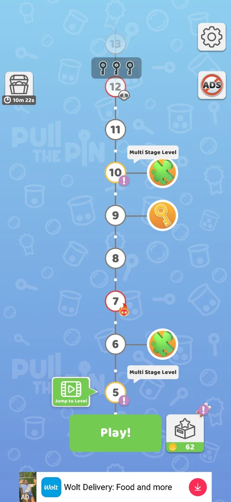

# Pull the Pin

[Google Play](https://play.google.com/store/apps/details?id=com.maroieqrwlk.unpin) · analysed on 241.3.1; Google Play has 241.5.1

A physics puzzle: pull pins so coloured balls paint the grey ones and fall into a cup. Around the
core: a level map with multi-stage and hard levels, coins, a gift bar, a timed chest, collections
(gacha, puzzles, skins, weekly trophies), daily rewards, leagues with a Pull Fest ranking, extra
modes from level 16, and banner, interstitial and rewarded ads.

## Coverage
- 2 sessions on 241.3.1, levels 1–8; discovery is open. The documented features need a recheck on
  241.5.1: the phone must be updated by a human.
- Feature pages: [core level](features/core-level.md), [multi-stage](features/multi-stage.md),
  [settings](features/settings.md), [no ads](features/no-ads.md), [ads](features/banner-ads.md),
  [timed chest](features/timed-chest.md), [collections](features/collections.md),
  [gacha](features/gacha.md), [puzzles](features/puzzle-collection.md), [skins](features/skins.md),
  [leagues](features/leagues.md), [daily rewards](features/daily-rewards.md),
  [jump to level](features/jump-to-level.md), [modes](features/game-modes.md).
- All features and cases: [features.md](features.md); tasks: [tasks.md](tasks.md).

## For the agent
[How to play](agent/playbook.md) · [routes](agent/routes.md) · [tactics](agent/tactics.md) ·
[lessons](agent/lessons.md) · [metrics](agent/metrics.md)
