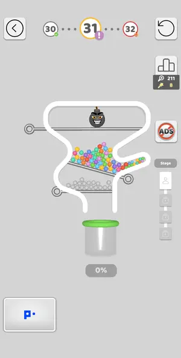
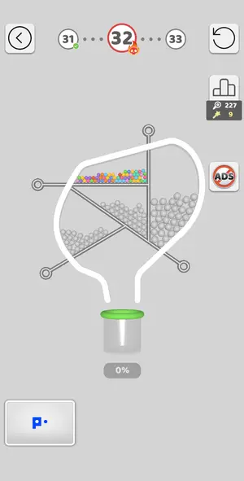
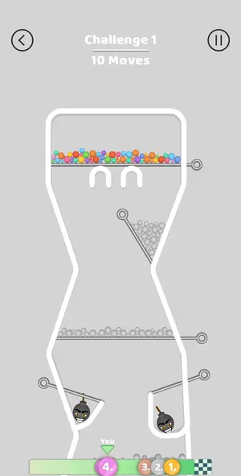
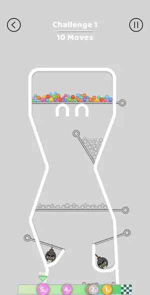
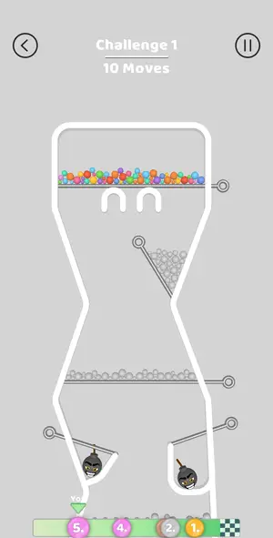
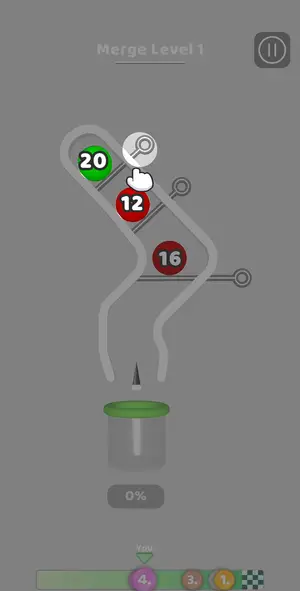
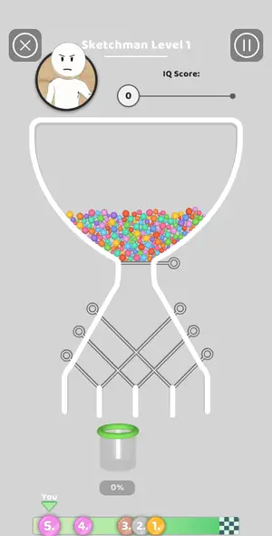
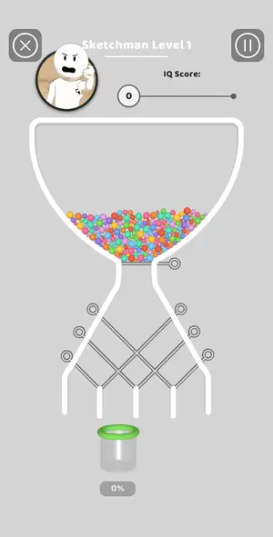

# Levels: Pull the Pin

Every level the agents met, as its board looked at the start (the ad strips cropped). The notes tell where a new element or rule appears.

| level 1 | level 2 | level 3 | level 4 | level 5 |
|---|---|---|---|---|
|  |  |  |  |  |

| level 6 | level 7 | level 8 | level 9 | level 10 |
|---|---|---|---|---|
|  |  |  |  |  |

| level 11 | level 12 | level 13 | level 14 | level 15 |
|---|---|---|---|---|
|  |  |  | no frame |  |

| level 16 | level 17 | level 18 | level 19 | level 20 |
|---|---|---|---|---|
|  |  |  |  |  |

| level 21 | level 22 | level 23 | level 24 | level 25 |
|---|---|---|---|---|
|  |  |  |  |  |

| level 26 | level 27 | level 28 | level 29 | level 30 |
|---|---|---|---|---|
|  |  | no frame | no frame | no frame |

| level 31 | level 32 | level 33 | challenge 1 | challenge 1 try 2 |
|---|---|---|---|---|
|  |  | no frame |  |  |

| challenge 1 try 3 | Merge Balls L1 | sketchman 1 replay | sketchman 1 try again | Sketchman L1 |
|---|---|---|---|---|
|  |  |  |  |  |

## Tries

| Level | Mechanic | Result | Time | Note |
|---|---|---|---|---|
| level 1 | pin-pull | 1 won | 20 s | one pin |
| level 2 | pin-pull | 2 won | 27 s | two pins, top first |
| level 3 | pin-pull | 1 won | 29 s | divider then slope pin |
| level 4 | pin-pull | 1 won | 17 s | lower pin only, bomb parked |
| level 5 | pin-pull | 1 won | 147 s | 4 stages first try: s1 right pin; s2 both top pins together; s3 colour, both mid, then crossed; s4 horizontal then both vertical rods |
| level 6 | pin-pull | 1 won | 38 s | bomb dropped out of the level first, colour shelf, then vertical rod; first try |
| level 7 | pin-pull | 1 won | 41 s | hard level 7: top pin, 6 s gap, crossed pins; first try (league screen = win) |
| level 8 | pin-pull | 1 won | 48 s | top pin (bombs met in the U), then bottom and middle pins |
| level 9 | pin-pull | 1 won | 44 s | library order, first try |
| level 10 | pin-pull | 2 won, 3 quit | 25 s | L10 now has 4 stages (library had 3): s1-s3 boards worked (s3 left its last pin to tap by hand); s4 by hand: upper-left diag, upper-right, middle floor, bottom. Interstitial after s1 and after s3; ski |
| level 11 | pin-pull | 1 won, 2 lost, 1 quit | 72 s | board L11-v2 (boards/L11-v2.json, written this session): order E C W F B gap 5 won first try. Fix: on 241.5.1 one grey stays on the C half of the V shelf after E (20261004-004411 shot 30); pulling C a |
| level 12 | pin-pull | 1 won | 97 s | L12 hard: solve --run round 1 recognised library L12 but played only A (ring B, now a golden star-wand pin, not found by the circle search); round 2 did not recognise the post-A frame (no memory match |
| level 13 | pin-pull | 1 quit | — | session ended (interrupted) |
| level 14 | pin-pull | 1 won, 1 lost | 129 s | Try 2: dividers 260/362/456, slants 118,422 + 592,404, then right lower slant 597,607 alone, then floor 595,610: left lower slant 116,628 kept steers balls to the centre. Board order for the library:  |
| level 15 | pin-pull | 1 won, 2 quit | 196 s | stages 2-4 by solver library; between-stage ad opened the store once, launch returned to stage 3 |
| level 16 | pin-pull | 1 won | 123 s | solver library order; 2 pulls by solver, rings shifted 15px up, RP GP F by hand |
| level 17 | pin-pull | 1 won | 129 s | by hand, first try: TL vertical (bomb to neck), right diagonal (bomb to centre), neck pin (bombs meet), TR vertical (greys), left diagonal (colours paint), bottom pin |
| level 18 | pin-pull | 1 won | 40 s | solver library order |
| level 19 | pin-pull | 1 won | 77 s | solver T, hook K needed a manual swipe after balls settled |
| level 20 | pin-pull | 1 won, 2 lost, 1 quit | 62 s | L20 color bucket won first try, 55 s: B, wait 6 s (blue all in its cup), M, 6 s gap, Y. The win flow opened straight on the Silver League board (pins 123, golden 7, score 158, rank 776). The 98% stall |
| level 21 | pin-pull | 2 won | 49 s | solver library order LP G RP |
| level 22 | pin-pull | 1 won | 63 s | solver library Y D B |
| level 23 | pin-pull | 1 won | 296 s | 4 stages by solver library; stage 4 last pin by hand after the view moved; between-stage interstitial after stage 2 closed by Back |
| level 24 | pin-pull | 1 won | 57 s | solver library L24, 3 rounds after V, first try; league board shown (rank 258 -> 230) |
| level 25 | pin-pull | 1 won | 34 s | solver library L25, 2 pulls; league board |
| level 26 | pin-pull | 1 won | 20 s | solver library L26, 1 pull |
| level 27 | pin-pull | 1 won | 79 s | New L27 board (Boss declined with No, thanks): T C V F won first try. Boards written: boards/L27.json and boards/L27-after-T.json (view moves ~ +5,-12 px after the bombs meet; solver refused the shift |
| level 28 | pin-pull | 2 won | 55 s | new board by hand: top diagonal pin first (bomb onto bomb, both gone, top balls painted), then shelf, lower diagonal, bottom pin |
| level 29 | pin-pull | 1 won | 57 s | single-colour bucket: top pin, wait 5 s, bottom pin |
| level 30 | pin-pull | 1 won, 1 lost | 168 s | retry won: top shelf 592, middle shelf 118, left divider 272, then right divider 442 last |
| level 31 | pin-pull | 1 won | 411 s | L31 multi stage 4 stages by hand: bomb-on-bomb pulls first, greys onto colours, floor last. Two between-stage interstitials left by launch, stage kept. |
| level 32 | pin-pull | 1 won, 2 quit | 84 s | hand order shelf 112,552; vertical 443,390; big diagonal 550,798; lower-left 136,818 |
| level 33 | pin-pull | 1 won | 93 s | Challenge popup declined (No, thanks). Pin 286,468, then hooks are drag-out gates: swipe lower hook 330,790->190,835, upper 553,615->350,590 |
| challenge 1 | pin-pull | 1 won, 1 lost | 117 s | solver C1 played the first pull(s), final floor pin by hand; 2 moves of 10 |
| challenge 1 try 2 | pin-pull | 1 lost | — | tapped ring (608,636) at 2 moves left: it was the triangle's vertical side, greys fell out. Rings at the triangle tip: the LOWER-LEFT one (588,668 on that frame) is the floor. Order that worked to the |
| challenge 1 try 3 | pin-pull | 1 lost | — | both rings at the triangle tip (upper-right and lower-left) dump the greys out of the level: Balls fell out. Next try: never touch the triangle; after bombs+E,F,G and colored shelf, pull gray shelf th |
| Merge Balls L1 | merge-balls | 1 quit | — | new mechanic merge-balls, handoff; first pull merged 20+12=32 |
| sketchman 1 replay | pin-pull | 1 won | 58 s | Deliberate bad play (all rods pulled, 71% in the cup) did not fail: Sketchman scores the share in the cup: IQ 122, Get 179 coins, Try again by video |
| sketchman 1 try again | pin-pull | 1 lost | — | 0% in the cup on purpose: Sketchman has no fail screen; the result screen shows IQ 50 (minimum) and Get 0 coins; Try again costs a video |
| Sketchman L1 | pin-pull | 1 won | 58 s | solver library IQ1, order T L1 L2 R1 |
