# Levels: Pull the Pin

Every level the agents met, as its board looked at the start (the ad strips cropped). The notes tell where a new element or rule appears.

| level 1 | level 2 | level 3 | level 4 | level 5 |
|---|---|---|---|---|
| 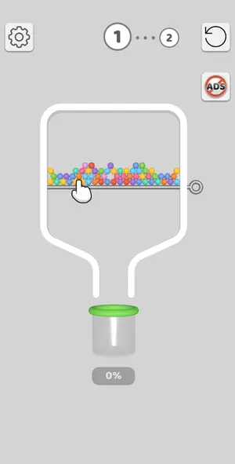 | 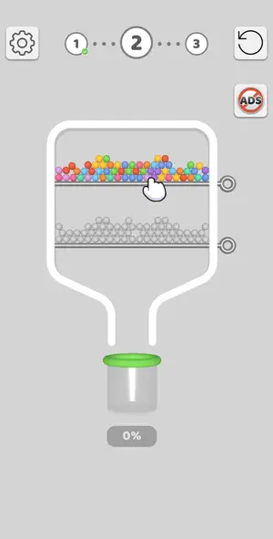 | 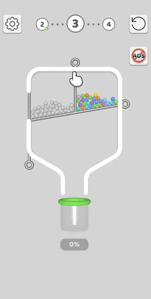 | 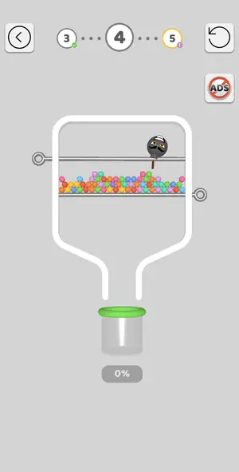 | 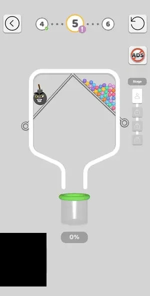 |

| level 6 | level 7 | level 8 | level 9 | level 10 |
|---|---|---|---|---|
| 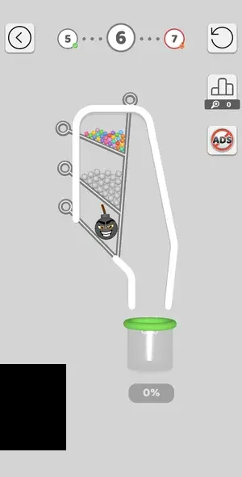 | 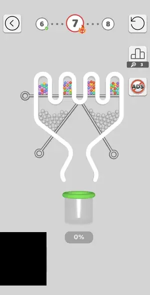 | 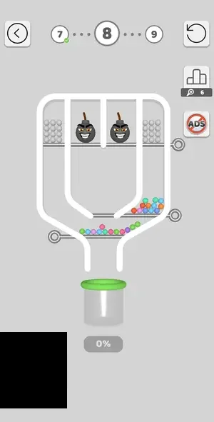 | 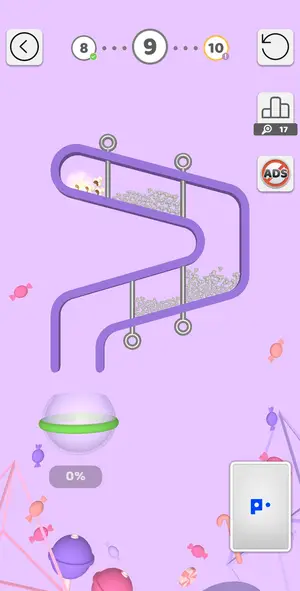 | 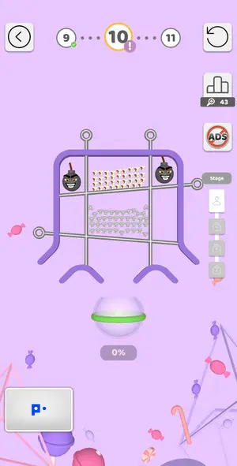 |

| level 11 | level 12 | level 13 | level 14 |
|---|---|---|---|
| 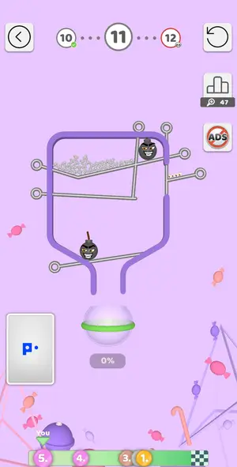 | 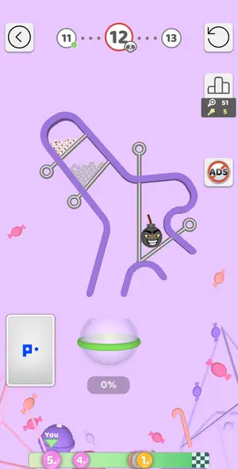 | 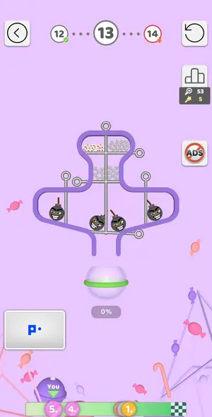 | no frame |

## Tries

| Level | Mechanic | Result | Time | Note |
|---|---|---|---|---|
| level 1 | pin-pull | 1 won | 20 s | one pin |
| level 2 | pin-pull | 2 won | 27 s | two pins, top first |
| level 3 | pin-pull | 1 won | 29 s | divider then slope pin |
| level 4 | pin-pull | 1 won | 17 s | lower pin only, bomb parked |
| level 5 | pin-pull | 1 won | 147 s | 4 stages first try: s1 right pin; s2 both top pins together; s3 colour, both mid, then crossed; s4 horizontal then both vertical rods |
| level 6 | pin-pull | 1 won | 38 s | bomb dropped out of the level first, colour shelf, then vertical rod; first try |
| level 7 | pin-pull | 1 won | 41 s | hard level 7: top pin, 6 s gap, crossed pins; first try (league screen = win) |
| level 8 | pin-pull | 1 won | 48 s | top pin (bombs met in the U), then bottom and middle pins |
| level 9 | pin-pull | 1 won | 44 s | library order, first try |
| level 10 | pin-pull | 2 won, 3 quit | 25 s | L10 now has 4 stages (library had 3): s1-s3 boards worked (s3 left its last pin to tap by hand); s4 by hand: upper-left diag, upper-right, middle floor, bottom. Interstitial after s1 and after s3; ski |
| level 11 | pin-pull | 1 won, 2 lost, 1 quit | 72 s | board L11-v2 (boards/L11-v2.json, written this session): order E C W F B gap 5 won first try. Fix: on 241.5.1 one grey stays on the C half of the V shelf after E (20261004-004411 shot 30); pulling C a |
| level 12 | pin-pull | 1 won | 97 s | L12 hard: solve --run round 1 recognised library L12 but played only A (ring B, now a golden star-wand pin, not found by the circle search); round 2 did not recognise the post-A frame (no memory match |
| level 13 | pin-pull | 1 quit | — | session ended (interrupted) |
| level 14 | pin-pull | 1 won, 1 lost | 129 s | Try 2: dividers 260/362/456, slants 118,422 + 592,404, then right lower slant 597,607 alone, then floor 595,610: left lower slant 116,628 kept steers balls to the centre. Board order for the library:  |
