# Levels: Pull the Pin

Every level the agents met, as its board looked at the start (the ad strips cropped). The notes tell where a new element or rule appears.

| level 9 | level 10 (multi stage) | level 11 | level 12 | level 13 |
|---|---|---|---|---|
|  |  |  |  |  |

| level 14 | level 15 stage 1 | level 16 | level 17 | level 18 |
|---|---|---|---|---|
| 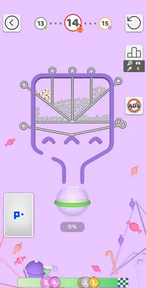 | 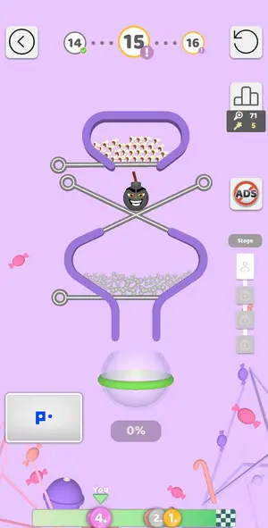 | 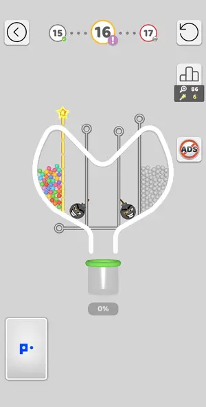 | 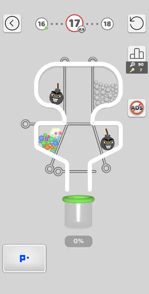 | 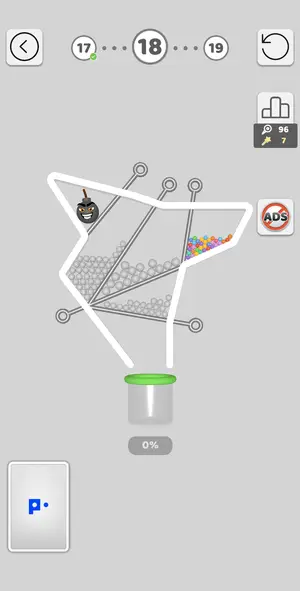 |

| level 19 | level 20 | level 21 challenge | level 22 | level 23 |
|---|---|---|---|---|
| 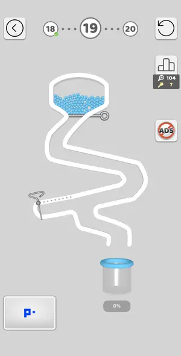 | 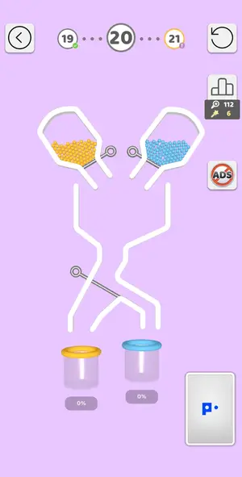 | 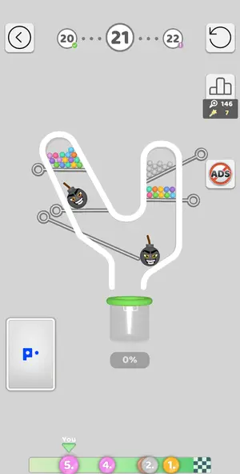 | 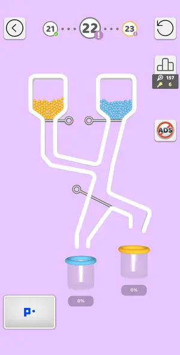 | 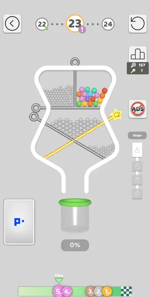 |

| level 24 | level 25 | level 26 | level 27 boss |
|---|---|---|---|
| 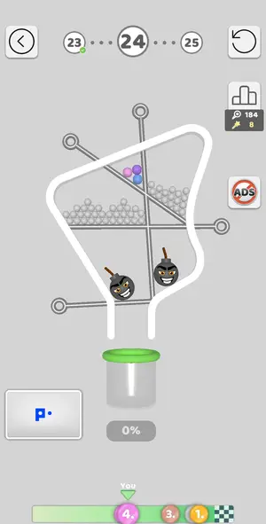 | 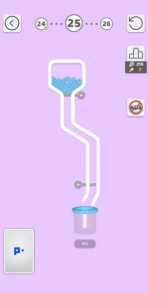 | 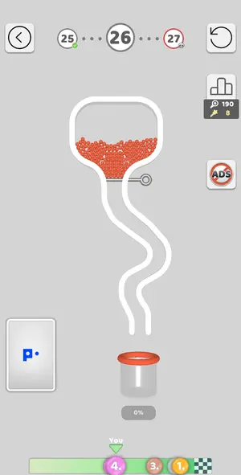 | 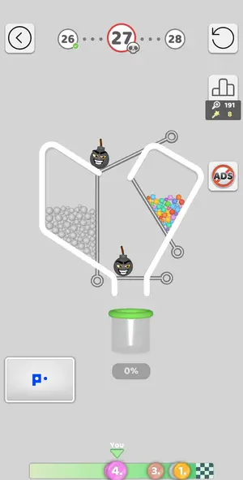 |

## Tries

| Level | Mechanic | Result | Time | Note |
|---|---|---|---|---|
| level 9 | pin-pull | 4 won | 48 s | 4 pins in order colour-source -> grey batches -> exit; one look per 2 pulls, 0.8 min |
| level 10 (multi stage) | pin-pull | 1 won, 1 lost, 2 quit | 29 s | Jump to Level restarted level 10 from stage 1 and the 2 pulls (top shelf right, floor left) won it |
| level 11 | pin-pull | 1 won, 2 lost, 2 quit | 137 s | 4 pulls: E (bombs collide and vanish), wall pin W (popcorn rolls in onto B), floor F (greys onto popcorn, all coloured), B. 2.1 min incl. thinking |
| level 12 | pin-pull | 1 won | 40 s | 2 pulls: coloured upper pin onto greys, then lower pin; bomb ignored. 0.5 min |
| level 13 | pin-pull | 2 won | 47 s | 4 pulls, 0.8 min: centre divider (bombs collided, all 4 vanished), top floor, middle floor, bottom |
| level 14 | pin-pull | 1 won, 1 lost | 49 s | 0.6 min: left diagonal, right diagonal + centre vertical, lower-right, H; left lower chute kept |
| level 15 stage 1 | pin-pull | 4 won | 34 s | stage 1: X1 (bomb rolled out left), X2, top, floor; 0.7 min of play |
| level 16 | pin-pull | 1 won, 2 lost, 1 quit | 177 s | inner pins drop both bombs to centre; greys released onto them detonate bombs and survive enough; then popcorn, then floor pin. The floor tap was eaten by a league popup. |
| level 17 | pin-pull | 1 won | 157 s | first try lost: greys onto a released bomb blew balls out. Won by leaving bombs parked: horizontal, left diagonal, right vertical, floor. |
| level 18 | pin-pull | 2 won | 25 s | bomb parked; colour first, then upper greys pin, lower diagonal, floor. ~1 min |
| level 19 | pin-pull | 2 won | 35 s | hook pin is a slider: swipe it along its dotted track to the right to clear the last balls |
| level 20 | pin-pull | 2 won, 4 lost | 78 s | blue first with middle pin in (it diverts blue right), then pull middle pin, then yellow |
| level 21 challenge | pin-pull | 2 won, 2 lost | 34 s | pull bomb1 pin (178,630): bomb1 falls on bomb2, both explode, bucket safe; then left popcorn (105,515), greys (600,470), right shelf (575,610) |
| level 22 | pin-pull | 1 won | 57 s | colour buckets: yellow (280,490) with diagonal in -> right cup; diagonal (310,768); blue (360,490) -> left cup |
| level 23 | pin-pull | 2 won, 1 lost, 2 quit | 220 s | level 23 won on 3rd try: stage 3 vertical pin first (bombs collide), stage 4 pull (620,645), (497,845), (203,835), last (503,445) |
| level 24 | pin-pull | 1 won | 64 s | vertical pin first: right bomb rolls onto left bomb, both explode; popcorn paints right greys. Then diagonal, horizontal, floor. First try |
| level 25 | pin-pull | 1 won | 27 s | trivial: bottom pin then top pin in one batch |
| level 26 | pin-pull | 2 won | 21 s | one pin, trivial |
| level 27 boss | pin-pull | 1 won, 2 lost | 190 s | lost on purpose (greys onto bomb), then Skip for a video passed the level; map moved to 28 |
