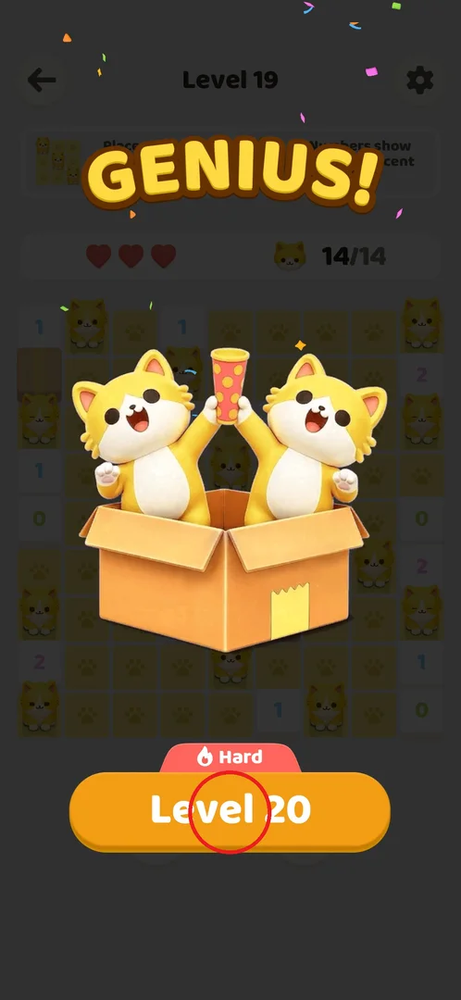
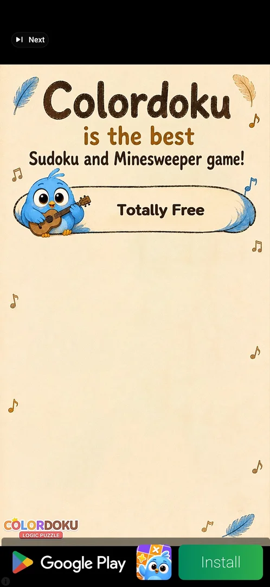
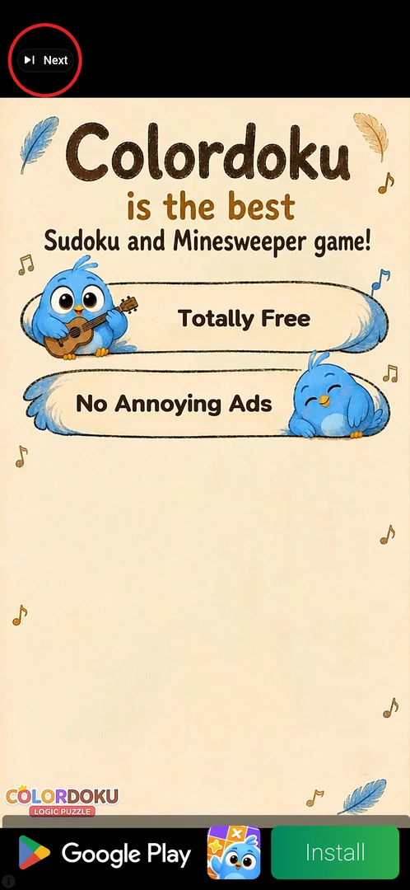
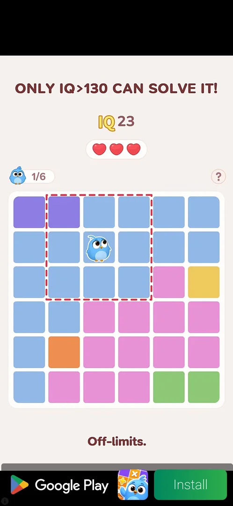
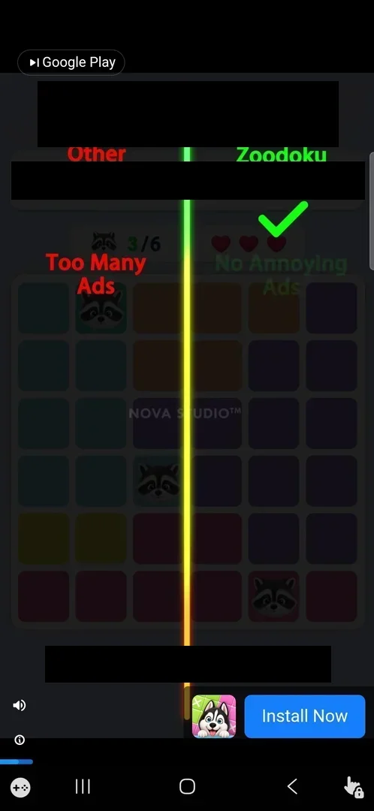
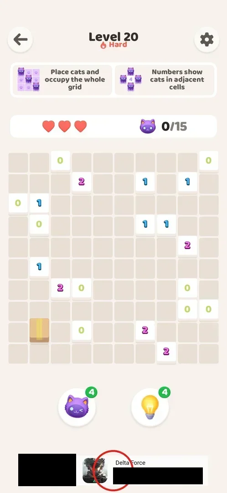

# Interstitial ads

A full-screen video ad that the game shows between levels, from level 16 on: it comes right after the
player taps the button that starts the next level (or Restart in a level), roughly on every second
level start [^s1] [^s3]. The player cannot avoid it and gets nothing for it; it can be skipped with
"Next" after a few seconds and usually ends on the Google Play page of the advertised game [^s7] [^s8].
From the same level on, a banner ad sits at the bottom of the level screen [^s9]. The game has no
remove-ads purchase [^s11].

## Where to find it

<!-- no-entry: an ad has no button of its own; it comes up after the button that starts a level -->

The interstitial is not opened by the player: it appears after tapping the orange "Level N" button on
the win screen of the previous level (here "Level 20", a Hard level, after winning level 19) [^s12],
or after Restart in the in-level Settings (see [Restart](#restart)) [^s20].

 [^s12]

## What it looks like

A video for another puzzle game fills the screen. At the top left, on a black bar, is a small skip
button ("Next"); at the bottom a Google Play bar with the advertised game's icon and a green
"Install" button [^s13]. The ads seen were mostly for "Colordoku: Logic Puzzle" [^s13] [^s14].

 [^s13]

## What you can do

| Tab or button | What it does |
|---|---|
| [Next](#next) | Skips the video after about 5 s [^s7] |
| [Playable ad](#playable-ad) | Levels 20–34: a second, playable ad after Next; its corner X opens the Play Store [^s7] |
| [Play Store](#play-store) | Where the ad ends; going back to the game returns to the level [^s8] |
| [Restart](#restart) | In-level Restart also shows an interstitial before the board reloads [^s20] |
| [Banner](#banner) | A bottom banner ad in levels [^s9] |

### Next

The skip button at the top left of the video. It appears after about 5 s [^s7]. In levels 20–34 it led
to a second, playable ad; from level 36 it opened the Play Store directly [^s3] [^s8]. In the first
session the two interstitials (before levels 16 and 18) played for about 40 s and opened the Play Store
by themselves, without a tap; the player did not find a way to skip them [^s1] [^s2].

 [^s16]

### Playable ad

After Next, in levels 20–34, a second ad came up: a small playable puzzle of the advertised game
("ONLY IQ>130 CAN SOLVE IT!") with the Google Play bar at the bottom. The system Back did not close it;
the X in the top right corner opened the Play Store [^s7] [^s14].

 [^s14]

### Play Store

Every interstitial ended on the Google Play page of the advertised game, shown over the ad. The player
left it without installing and reopened the game, which came back to the level that was about to
start [^s1] [^s7] [^s15]. The Play Store page has no frame here: it is another app.

<!-- no-frame: other app (Google Play) -->

### Restart

The green Restart button in the in-level Settings (gear at the top right of a level) shows an
interstitial too, even on an odd level (51): about 30 s, ending on the Play Store; then the board is
empty again and the hearts are back to 3 [^s17] [^s20]. This ad shifts the "every second level" phase
(see [How it works](#how-it-works)) [^s11].

 [^s17]

The ad after Restart was a different video; its skip button at the top left was labelled "Google Play"
[^s18].

 [^s18]

### Banner

A banner ad under the booster buttons at the bottom of the level screen, first seen in level 16, right
after the first interstitial [^s9]. It was there on levels 49 and 50, but not on level 51 [^s19].

 [^s15]

## How it works

Version 1.0.2.

- The first interstitial came on tapping "Level 16"; then on "Level 18" [^s1] [^s2].
- Levels 19–48: an ad after tapping the button of every even level and never before an odd one
  (16, 18, 20, 22 … 48) [^s21] [^s3].
- Levels 49–55 broke the pattern: ads before 50, after the Restart on 51, before 53 and 55; none
  before 49, 51, 54, and none on two starts of 52. Restart and Revive shift the phase. The rule is not
  known [^s4] [^s5] [^s6].
- The ad is a video with "Next" at the top left after about 5 s; in levels 20–34 Next led to a second
  playable ad whose corner X opened the Play Store; from level 36 Next opened the Play Store directly;
  reopening the game returns to the level [^s7] [^s8].
- A bottom banner is shown in levels from level 16 [^s9] [^s10]; none was seen on level 51 [^s19].
- No remove-ads purchase, shop or currency anywhere through level 55 [^s11].
- The ad comes after tapping the next level's button, not on the win screen itself (inferred: no ad was
  seen right after a win) [^s3].

> ⚠️ Previously (v1.0.2, 2026-10-01): "an interstitial before every even level start" (levels 16–48).
> Levels 52–54 showed this is not the rule.

## Cases

| Case | What was done | Result | Source |
|---|---|---|---|
| First ad | Level 15 → 16 | Interstitial (~40 s), ends on the Play Store by itself | [^s1] |
| Second ad | Level 17 → 18 | Interstitial, ends on the Play Store | [^s2] |
| Even levels | Levels 19–48 | An ad before every even level, none before odd | [^s3] |
| Skip | Next, then the corner X or the Play Store, then reopening the game | Back to the level | [^s3] |
| Restart | In-level Restart on level 51 | An interstitial (~30 s); fresh board, 3 hearts; the phase shifts | [^s20] [^s11] |
| Pattern breaks | Levels 49–55 | Ads before 50, 53, 55 and after Restart; none before 49, 51, 52, 54 | [^s6] |
| No-ads | Looked on Home, Settings, win and fail screens | No remove-ads purchase | [^s11] |

## Not verified

- The real rule (counter, timer, both); whether an ad ever comes after a win.
- Whether Revive (a rewarded ad) shifts the phase on its own, apart from Restart.
- When exactly the bottom banner is shown (it was missing on level 51).
- The Help Center "Ad Issues" articles were not read.

[^s1]: session 20261001-003641-chrono-2FYKPJ, step 32 — [video at 14:58](https://youtu.be/mebcb05OPmo?t=898)
[^s2]: session 20261001-003641-chrono-2FYKPJ, step 36 — [video at 18:14](https://youtu.be/mebcb05OPmo?t=1094)
[^s3]: session 20261001-024647-chrono-2FYKPJ, step 109
[^s4]: session 20261001-035425-chrono-2FYKPJ, step 45
[^s5]: session 20261001-035425-chrono-2FYKPJ, step 52
[^s6]: session 20261001-035425-chrono-2FYKPJ, step 58
[^s7]: session 20261001-024647-chrono-2FYKPJ, step 7
[^s8]: session 20261001-024647-chrono-2FYKPJ, step 64
[^s9]: session 20261001-003641-chrono-2FYKPJ, step 34 — [video at 16:40](https://youtu.be/mebcb05OPmo?t=1000)
[^s10]: session 20261001-035425-chrono-2FYKPJ, step 40
[^s11]: session 20261001-035425-chrono-2FYKPJ, step 61
[^s12]: session 20261001-024647-chrono-2FYKPJ, step 3
[^s13]: session 20261001-024647-chrono-2FYKPJ, step 4
[^s14]: session 20261001-024647-chrono-2FYKPJ, step 5
[^s15]: session 20261001-024647-chrono-2FYKPJ, step 8
[^s16]: session 20261001-035425-chrono-2FYKPJ, step 32
[^s17]: session 20261001-035425-chrono-2FYKPJ, step 41
[^s18]: session 20261001-035425-chrono-2FYKPJ, step 42
[^s19]: session 20261001-035425-chrono-2FYKPJ, step 37
[^s20]: session 20261001-035425-chrono-2FYKPJ, step 43
[^s21]: session 20261001-024647-chrono-2FYKPJ, step 12
