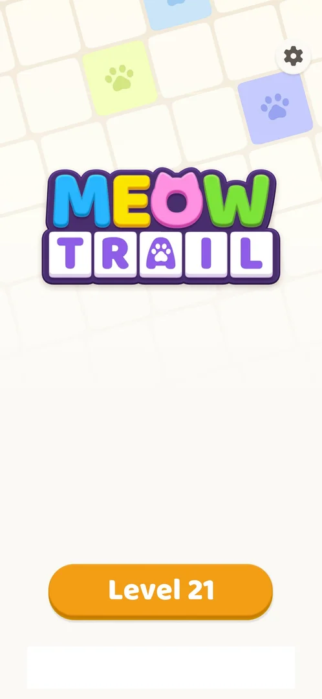
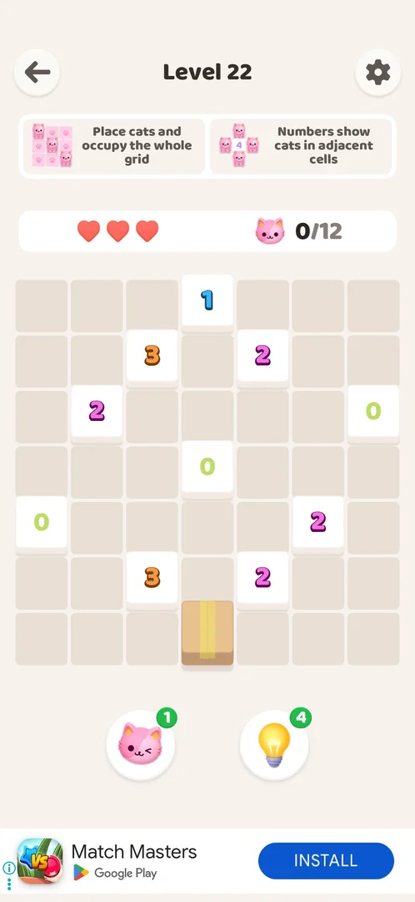

# Banner ad on the level screen

A strip ad along the bottom of the level screen, under the two booster buttons. It advertises another app with an install button; the player cannot close it and it gives nothing. It is shown on every level screen from Level 16 on and is gone on the win screen (version 1.0.2) [^s1] [^s4].

## Why it appeared

On the Level 16 screen, right after the first [interstitial ad](interstitial-ad.md); the level screens of Levels 15 and earlier had no banner [^s1]. Whether it is tied to Level 16 itself, to a count of levels won or to the first interstitial is not known.

## Where to find it

No control opens it: it is part of the level screen. The level screen opens from the orange Level N button on Home or on the previous level's win screen; the banner is at the bottom of the level screen that follows [^s2] [^s4].

 [^s2]
*Home screen: the orange Level 21 button opens the level screen; the banner is at the bottom of that screen*

The Home frame also has an empty white strip of the same width below the Level 21 button (inferred: a banner slot with no ad loaded at that moment; no ad was seen in it) [^s2].

## What it looks like

A white strip across the bottom of the screen, below the booster buttons and clear of the board. On Level 22 it showed an app icon, the app's name (Match Masters), a Google Play badge, a blue INSTALL button and the AdChoices "i" at the left edge [^s3].

 [^s3]
*The banner under the booster buttons; the INSTALL button is on the right, the AdChoices "i" at the far left*

The creative changes from level to level: a puzzle game with a green Install button and an AD badge on Level 21, Match Masters on Level 22, a "Tap to get $50" cash offer on Level 23 [^s4]. On the first sighting (Level 16) it was a Royal Kingdom banner with the same layout [^s1].

## What you can do

| Tab or button | What it does |
|---|---|
| [Install](#install) | Not tried |
| [AdChoices](#adchoices) | Not tried |

### Install

<!-- no-frame: the button is on the frame above -->

The INSTALL (or Install) button on the right of the strip. Not tapped: where it leads (inferred: the app's Play Store page, as with the interstitial) is not verified.

### AdChoices

<!-- no-frame: the "i" is on the frame above -->

The small "i" at the edge of the strip, the only other control. There is no close cross on the banner on Levels 21 to 23 [^s4]. Not tapped.

## How it works

- Shown on the level screen of every level from 16 on; on Levels 21, 22, 23 and 24 it was there every time, including Level 21 started from Home (version 1.0.2) [^s1] [^s4].
- Not shown on the win screen (the PERFECT! screen with the next Level N button) [^s4].
- No close control: only the AdChoices "i" [^s4].
- No reward: it is a plain ad strip.

## Cases

| Case | What was done | Result | Source |
|---|---|---|---|
| Why it appeared <!-- case:chk-appeared --> | Played Levels 4 to 16 | First on the Level 16 screen, after the first interstitial; none on Level 15 and earlier | ✅ [^s1] |
| Where to find it <!-- case:chk-entry --> | — | No entry: a strip at the bottom of the level screen from Level 16 | ✅ [^s1] |
| What it looks like <!-- case:chk-screen --> | Looked at the level screen | Bottom strip under the boosters: app icon, name, Google Play, INSTALL button, AdChoices "i" | ✅ [^s1] [^s3] |
| Kind of placement <!-- case:chk-kind --> | — | Banner on the level screen, below the boosters | ✅ [^s1] |
| Reward <!-- case:chk-reward --> | — | Does not apply: a banner gives nothing | ✅ [^s1] |
| How often <!-- case:chk-frequency --> | Played Levels 21 to 24 | On every level screen; a different creative each level; hidden on the win screen | ✅ [^s4] |
| Close <!-- case:chk-close --> | Looked for a close control on Levels 21 to 23 | None: only the AdChoices "i" | ✅ [^s4] |

## Not verified

- Install and AdChoices were not tapped: where each leads.
- Whether the banner shows on Home: the white strip at the bottom of Home stayed empty on the frame seen.
- What starts the banner at Level 16 (the level number, levels won, or the first interstitial).

[^s1]: session 20261005-080420-chrono-2FYKPJ, step 42 — [video at 14:05](https://youtu.be/bJ144EFaJEE?t=845)
[^s2]: session 20261005-141041-chrono-2FYKPJ, step 1 — [video at 0:28](https://youtu.be/Bb-2kjuzPgA?t=28)
[^s3]: session 20261005-141041-chrono-2FYKPJ, step 4 — [video at 2:28](https://youtu.be/Bb-2kjuzPgA?t=148)
[^s4]: session 20261005-141041-chrono-2FYKPJ, step 9 — [video at 4:36](https://youtu.be/Bb-2kjuzPgA?t=276)
