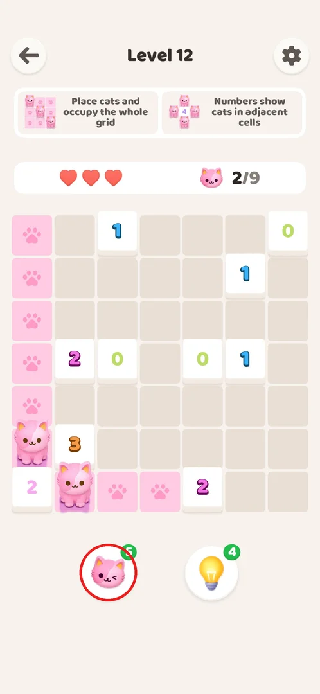
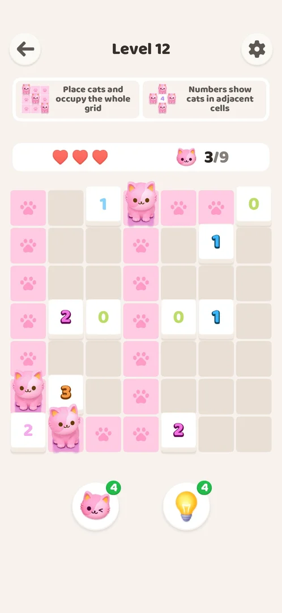
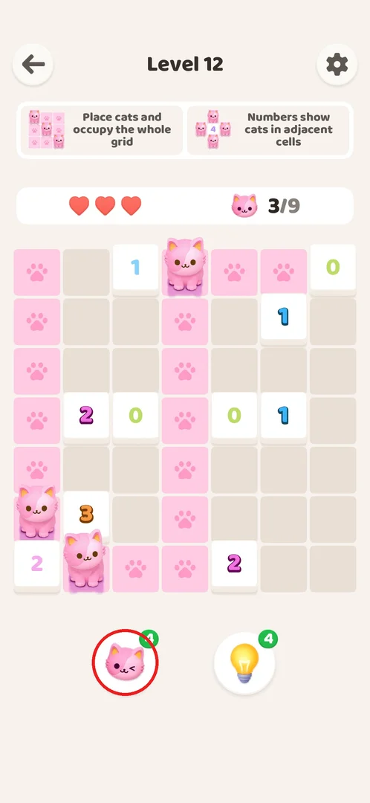
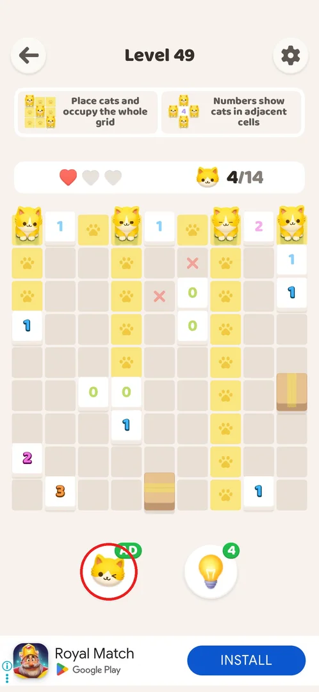
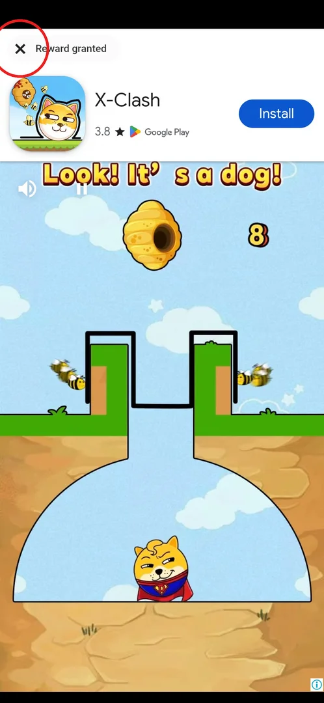
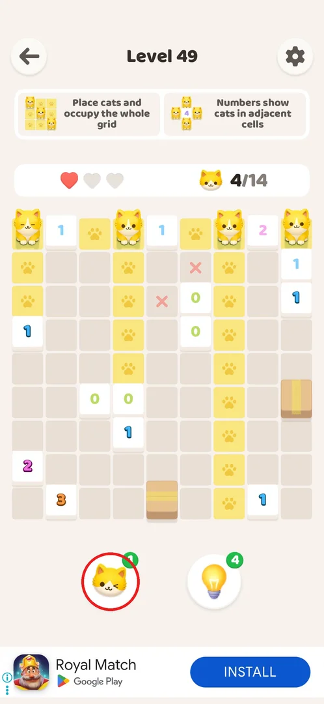

# Cat booster

The cat booster is a one-tap helper on every level: it puts one correct cat on the board for you, with
no explanation and no confirmation [^s2]. A fresh install starts with 5 [^s6]; winning levels does not
refill it [^s7] [^s8], and once it reaches 0 a rewarded video gives one more [^s5].

<!-- no-screen: the booster has no screen of its own; it is a button on the level screen, so "What it looks like" shows the board right after a use. -->

## Where to find it

On any level screen, under the board: the left of the two round buttons (a winking cat with a green
count badge, circled) [^s1]. The right button with the light bulb is the
[hint booster](booster-hint.md).

 [^s1]

## What it looks like

A tap changes the board at once: one cat appears in a correct cell, the cells it lights up in its row and
column turn pink, the cat counter above the board goes up by one and the badge goes down by one [^s2].

 [^s2]

## What you can do

| Tab or button | What it does |
|---|---|
| [Use](#use) | Badge shows a number: one tap places one correct cat, the number drops by 1 [^s2] |
| [AD badge](#ad-badge) | Badge shows AD at 0: a tap starts a rewarded video [^s3] [^s4] |
| [Rewarded video](#rewarded-video) | Watch the video to the end, close it with the X: the badge becomes 1 [^s5] |

### Use

With a number on the badge, one tap places one correct cat immediately — no popup, no explanation (unlike
the hint booster, which shows its reasoning and an Apply button) — and the number drops by one: 5 → 4 on
level 12 [^s2]. Four taps in a row on level 49 (a 14-cat board) each placed a cat at once [^s5].

 [^s2]

### AD badge

At 0 the badge shows a green **AD** instead of a number [^s3]. On level 49 the four cats the booster
placed all stood in the top row; whether it always fills from the top is not known (see "Not verified").

 [^s3]

### Rewarded video

Tapping the AD badge plays a rewarded video ad (an ad for another game). It cannot be closed for about
15–20 s; then the top-left corner shows "Reward granted" with an X that closes it and returns to the
level [^s4] [^s5].

 [^s4]

### Result

After the video the badge shows 1; the board, the hearts and the cat counter are as they were [^s5].

 [^s5]

## How it works

Version 1.0.2.

- Stock: 5 on a fresh install (level 1) [^s6]. The stock is shared across levels and is not refilled by
  winning: after one use on level 12 it was still 4 at level 48 [^s7] [^s8].
- Each use: −1, one correct cat placed at once, no confirmation [^s2].
- At 0: AD badge; one rewarded video (about 15–20 s before it can be closed) = +1 [^s5].
- No shop or purchase for boosters was found through level 55 [^s9].

## Cases

| Case | What was done | Result | Source |
|---|---|---|---|
| Use | Tapped the booster once on level 12 | One correct cat placed at once, no confirmation; 5 → 4 | [^s2] |
| Empty | Used it down to 0 on level 49, then tapped the AD badge | The badge shows AD; a rewarded video (about 20 s, "Reward granted", X top left) gives +1 | [^s3] [^s5] |

## Not verified

- Which cell the booster picks (the four cats on level 49 all landed in the top row — inferred, not
  tested).
- Whether a second video can be watched while the count is 1, or only at 0.
- Whether the stock is ever refilled by anything other than the video (daily rewards, level milestones).

[^s1]: session 20261001-003641-chrono-2FYKPJ, step 27 — [video at 11:37](https://youtu.be/mebcb05OPmo?t=697)
[^s2]: session 20261001-003641-chrono-2FYKPJ, step 28 — [video at 11:48](https://youtu.be/mebcb05OPmo?t=708)
[^s3]: session 20261001-035425-chrono-2FYKPJ, step 28
[^s4]: session 20261001-035425-chrono-2FYKPJ, step 29
[^s5]: session 20261001-035425-chrono-2FYKPJ, step 30
[^s6]: session 20261001-003641-chrono-2FYKPJ, step 6
[^s7]: session 20261001-024647-chrono-2FYKPJ, step 66
[^s8]: session 20261001-024647-chrono-2FYKPJ, step 109
[^s9]: session 20261001-035425-chrono-2FYKPJ, step 61
