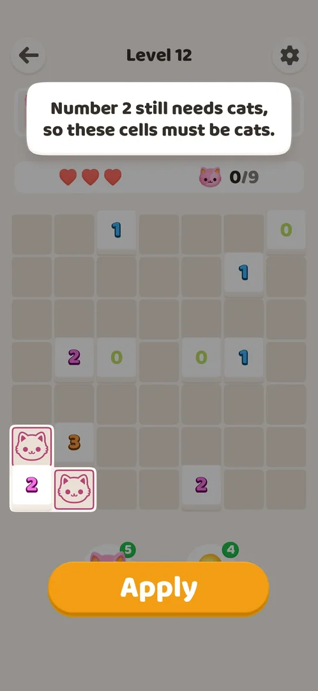

# Hint booster (bulb)

Button right under the board (482,1305); stock 5 on a fresh install [s:20261001-003641-chrono-2FYKPJ#26].

## Cases
| Case | What was done | Result | Source |
|---|---|---|---|
| Use | Tapped on level 12, then Apply (364,1347) | The next deduction with a text reason and highlighted cells; Apply placed both cats; 5 → 4 | [s:20261001-003641-chrono-2FYKPJ#26] [s:20261001-003641-chrono-2FYKPJ#27] |

## Not verified
- Hint at 0 (a Help article says a rewarded video gives more) [s:20261001-035425-chrono-2FYKPJ#11].
