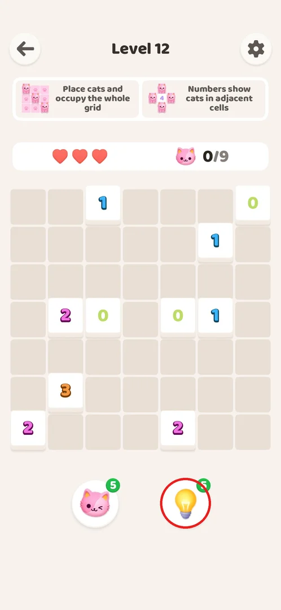
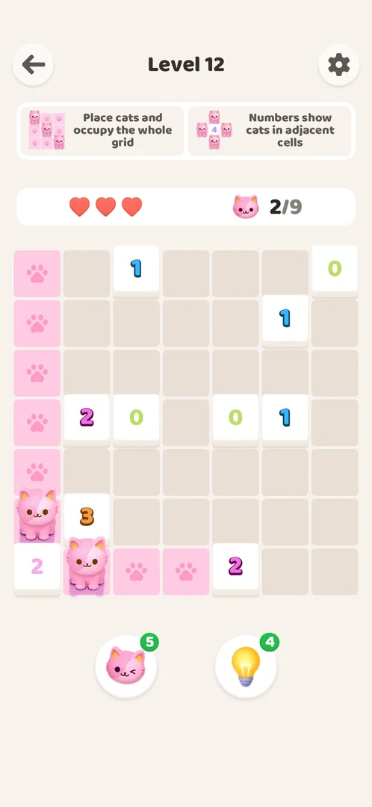
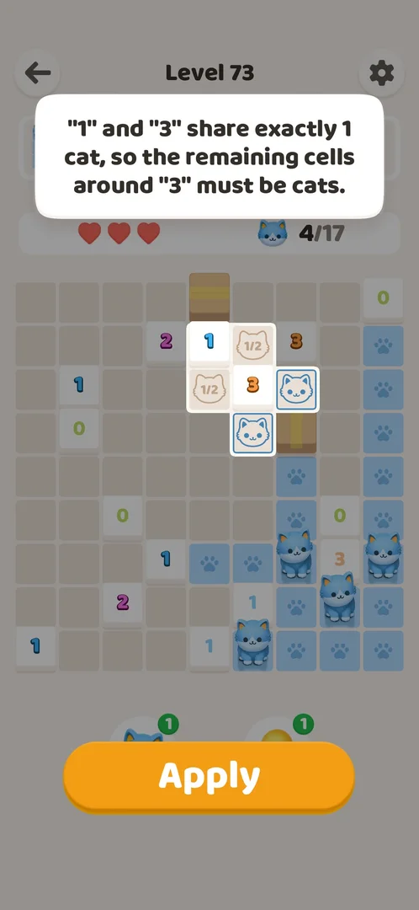
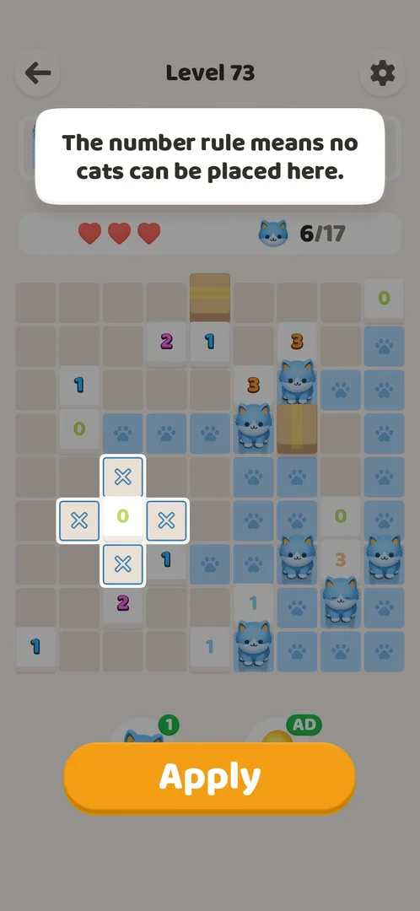
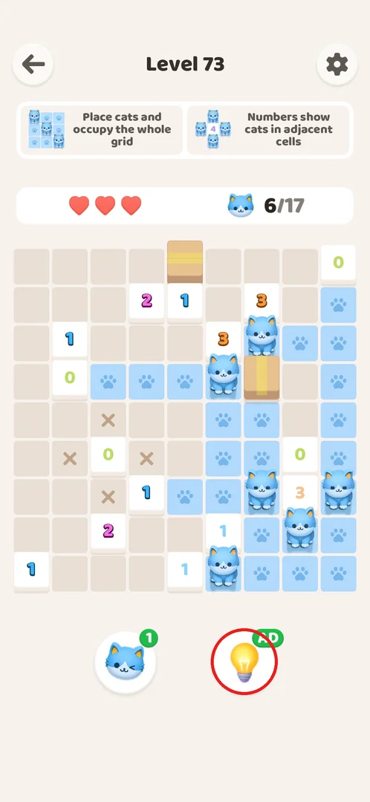
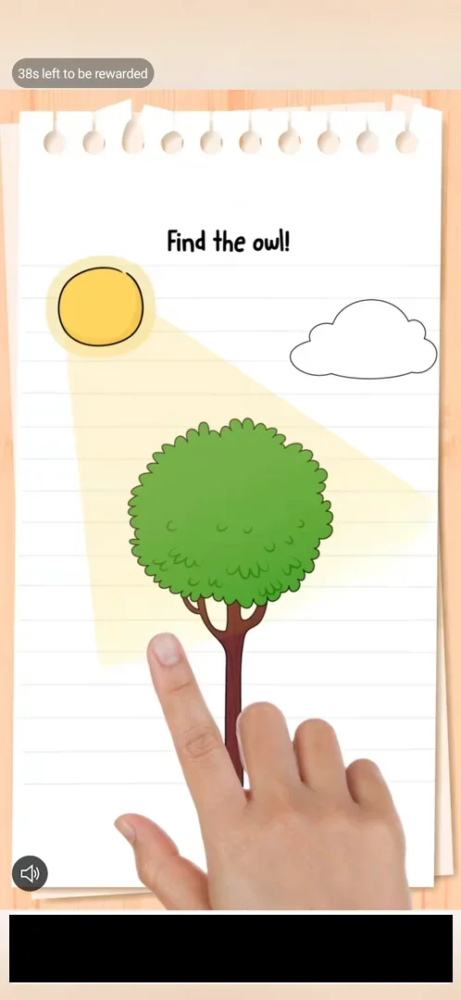
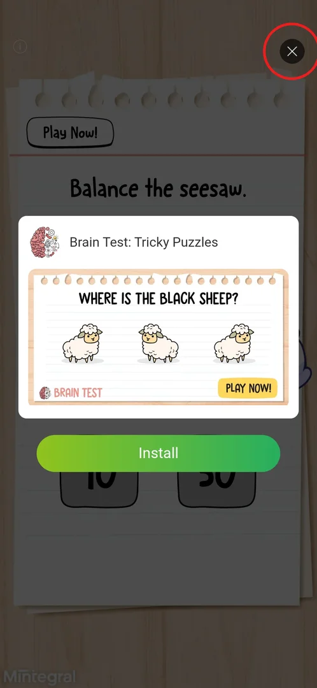
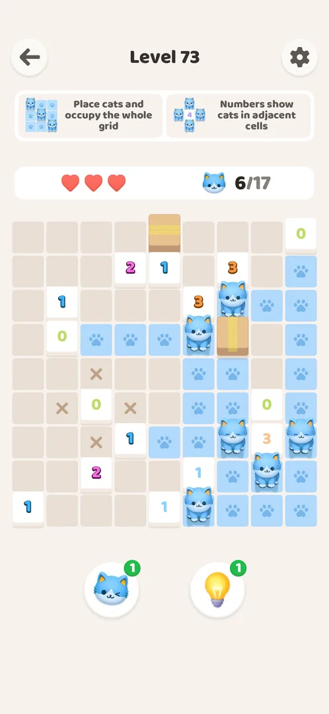

# Hint booster (bulb)

The hint booster is the light-bulb helper on every level: a tap shows the next logical deduction on the
board — a sentence explaining why, and the cells it concerns outlined — and an **Apply** button that
places those cats or X marks for you [^s2] [^s3]. A fresh install starts with 5 hints [^s11]; winning
levels does not refill them [^s12] [^s13], and at 0 a rewarded video gives one more [^s9].

<!-- no-screen: the booster has no screen of its own; it is a button on the level screen, and "What it looks like" shows the popup a tap opens over the board. -->

## Where to find it

On any level screen, under the board: the right of the two round buttons (a light bulb with a green
count badge, circled) [^s1]. The left button with the winking cat is the
[cat booster](booster-cat.md).

 [^s1]

## What it looks like

A tap dims the level screen and opens a white text bubble at the top with the reason for the deduction;
the cells it concerns are lifted out of the dimmed board and outlined, and a large orange **Apply** button
covers the boosters. The badge has already dropped by one (5 → 4) while the popup is open, before
Apply [^s2] [^s6].

 [^s2]

## What you can do

| Tab or button | What it does |
|---|---|
| [Apply](#apply) | Places what the hint shows (cats or X marks) and closes the popup [^s3] [^s6] |
| [Shared cells](#shared-cells) | A hint kind: two numbers share cells, so other cells must be cats [^s4] |
| [No-cat cells](#no-cat-cells) | A hint kind: a number rules out cells, which get X marks [^s5] |
| [AD badge](#ad-badge) | Badge shows AD at 0: a tap starts a rewarded video [^s6] [^s7] |
| [Rewarded video](#rewarded-video) | Watch the video to the end and close it: the badge becomes 1 [^s9] |

### Apply

**Apply** places the hinted cats in their cells and returns to the normal board: on level 12 it placed
both cats next to the 2, the cat counter went 0/9 → 2/9 and the cells they light up turned pink [^s3].
On level 73 four hints were applied in a row; they placed cats and X marks [^s6].

 [^s3]

### Shared cells

Hints are not only "this number still needs cats". On level 73 one hint reasoned over two numbers:
"\"1\" and \"3\" share exactly 1 cat, so the remaining cells around \"3\" must be cats." — the two shared
cells were marked 1/2 and the two remaining cells outlined as cats [^s4].

 [^s4]

### No-cat cells

A hint can also rule cells out: "The number rule means no cats can be placed here." with the four cells
around a 0 outlined with X; Apply leaves X marks in them [^s5] [^s6].

 [^s5]

### AD badge

After the last hint the badge shows a green **AD** instead of a number (level 73, after four uses from
4) [^s6]. The X marks the hints left stay on the board.

 [^s6]

### Rewarded video

Tapping the AD badge plays a rewarded video ad for another game, with a countdown "38s left to be
rewarded" in the top-left corner [^s7]. The whole video took about 40 s [^s9].

 [^s7]

### End card

The video ends on an end card (a Mintegral ad with an Install button) with an X at the top right (circled);
it took two taps on that corner — an arrow, then the X of the card — to get back to the level [^s8] [^s9].

 [^s8]

### Result

Back on the level the badge shows 1; the board, hearts and the 6/17 counter are as they were [^s9].

 [^s9]

## How it works

Version 1.0.2.

- Stock: 5 on a fresh install (level 1) [^s11]. The stock is shared across levels and not refilled by
  winning: 4 after one use on level 12 and still 4 on level 14 [^s12]; 1 after the refill on level 73 and
  still 1 at the start of level 74 [^s13]; still 1 at the start of every level from 108 to 120, with
  none used [^s16] [^s17].
- Each use: −1 at the tap, before Apply [^s6]; the hint shows one deduction with a text reason and the
  cells it concerns [^s2].
- At 0: AD badge; one rewarded video (about 40 s) = +1 hint [^s9] [^s10].
- The in-game Help Center confirms it: new players get a few free hints, and when they run out a rewarded
  video earns more [^s14] [^s15].

## Cases

| Case | What was done | Result | Source |
|---|---|---|---|
| Use | Tapped the bulb on level 12, then Apply | The next deduction with a text reason and highlighted cells; Apply placed both cats; 5 → 4 | ✅ [^s2] [^s3] |
| Use until 0 | Four hints in a row on level 73, each applied | Cats and X marks placed; count 4 → 0, dropping at each tap; badge AD | ✅ [^s6] |
| Not used | Played levels 108–120 without hints | 1 at the start of every level: no refill and no loss between levels | ✅ [^s16] [^s17] |
| Refill at 0 | Tapped the AD badge on level 73, watched the video, closed the end card | +1 hint; board unchanged | ✅ [^s9] [^s10] |

## Not verified

- What happens if the hint popup is closed without Apply (whether the hint is lost) — never tried.
- Whether more than one rewarded video can be watched in a row to stock up hints — only one was watched.
- Whether a hint can be wrong after the player has placed a wrong cat — hints were used only on boards
  without mistakes.

[^s1]: session 20261001-003641-chrono-2FYKPJ, step 25 — [video at 11:09](https://youtu.be/mebcb05OPmo?t=669)
[^s2]: session 20261001-003641-chrono-2FYKPJ, step 26 — [video at 11:25](https://youtu.be/mebcb05OPmo?t=685)
[^s3]: session 20261001-003641-chrono-2FYKPJ, step 27 — [video at 11:37](https://youtu.be/mebcb05OPmo?t=697)
[^s4]: session 20261001-100940-chrono-2FYKPJ, step 11
[^s5]: session 20261001-100940-chrono-2FYKPJ, step 12
[^s6]: session 20261001-100940-chrono-2FYKPJ, step 13
[^s7]: session 20261001-100940-chrono-2FYKPJ, step 14
[^s8]: session 20261001-100940-chrono-2FYKPJ, step 15
[^s9]: session 20261001-100940-chrono-2FYKPJ, step 16
[^s10]: session 20261001-100940-chrono-2FYKPJ, step 41
[^s11]: session 20261001-003641-chrono-2FYKPJ, step 6 — [video at 2:54](https://youtu.be/mebcb05OPmo?t=174)
[^s12]: session 20261001-003641-chrono-2FYKPJ, step 30 — [video at 13:25](https://youtu.be/mebcb05OPmo?t=805)
[^s13]: session 20261001-100940-chrono-2FYKPJ, step 20
[^s14]: session 20261001-035425-chrono-2FYKPJ, step 11
[^s15]: session 20261001-070939-chrono-2FYKPJ, step 5
[^s16]: session 20261001-221517-chrono-2FYKPJ, step 1 — [video at 0:16](https://youtu.be/LMacAS64JRE?t=16)
[^s17]: session 20261001-221517-chrono-2FYKPJ, step 41 — [video at 15:01](https://youtu.be/LMacAS64JRE?t=901)
