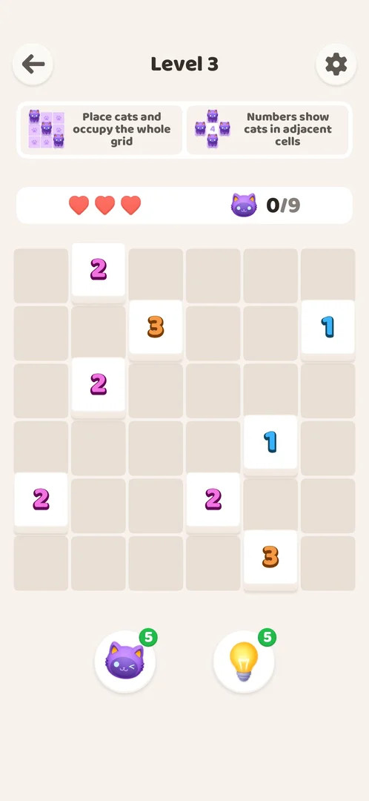
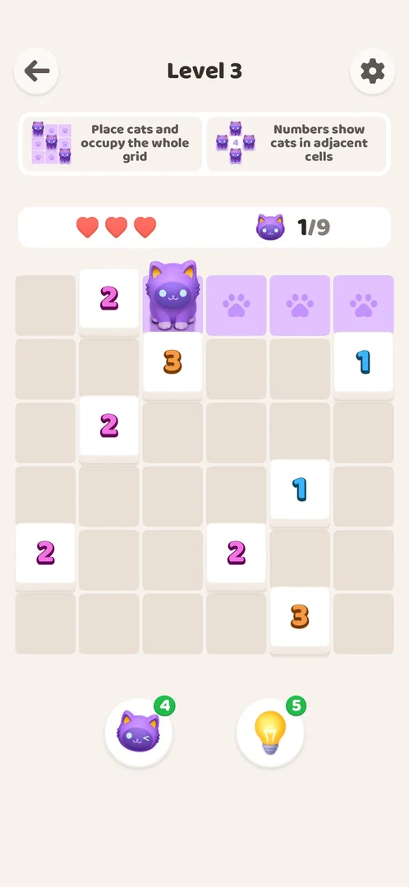
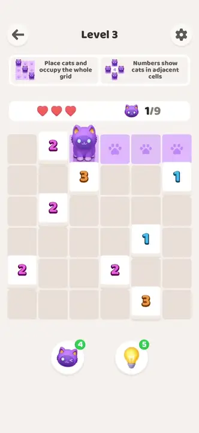
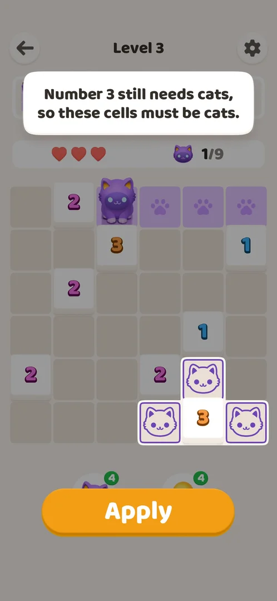
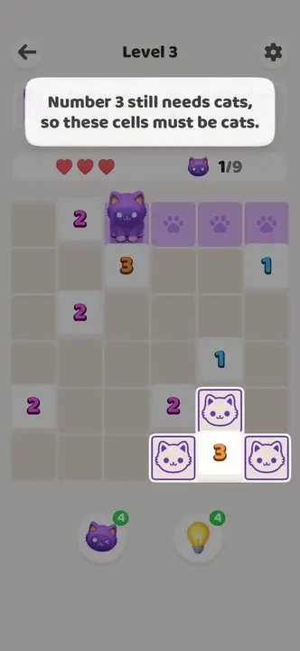
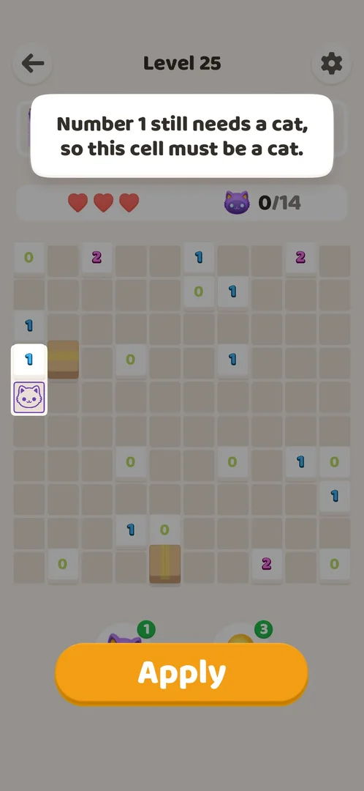
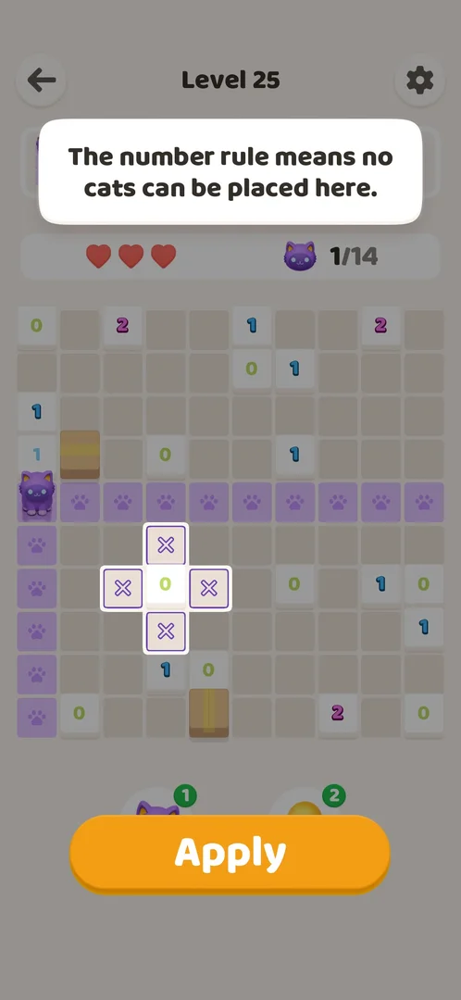
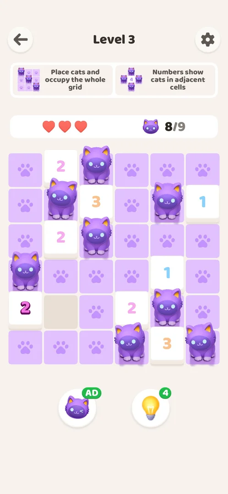
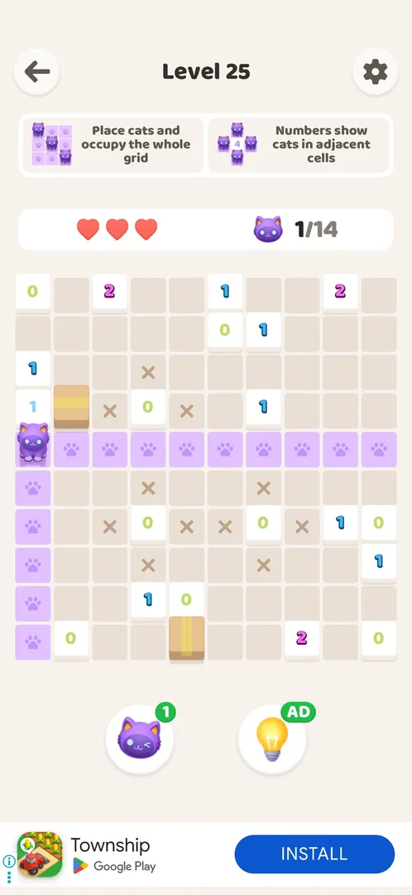

# Cat and bulb boosters

Two round buttons under the grid of every level: a winking cat and a light bulb, each with a green badge that shows how many are left. The cat booster places one correct cat on the board at once; the bulb booster shows one deduction step with the cells it proves and, when the player taps Apply, places those cats or marks those cells with X. Each use costs one unit; at zero the badge reads AD and a rewarded video gives one unit back [^s3] [^s5] [^s8] [^s20].

## Why it appeared

Level 1 shows two boosters with count 5 each [^s1] [^s6].

## Where to find it

On the [Akari level](core-level.md) screen, under the grid: the cat booster on the left, the bulb booster on the right. No other screen with them (a shop, a counter on Home) was seen through Level 4 [^s2] [^s7].

 [^s2]
*The cat booster left and the bulb booster right, under the grid; 5 each*

## What it looks like

Two white round buttons; the left shows a purple winking cat, the right a yellow light bulb. A green badge on the top right of each shows the balance [^s2]. On the first frame of Level 1 both were drawn pale; on later levels in full colour [^s6] [^s9].

 [^s3]
*After one tap on the cat booster: one cat on the board, the cat badge down to 4*

 [^s3]
*Clip 3 s · [original on YouTube from 0:40](https://youtu.be/94hgW4CXmbg?t=40)*

## What you can do

| Tab or button | What it does |
|---|---|
| [Cat booster](#cat-booster) | Places one correct cat at once; costs 1 |
| [Bulb booster](#bulb-booster) | Shows a hint with highlighted cells and an Apply button; Apply places cats or X marks; costs 1 when opened |
| [AD badge](#ad-badge) | Shown on either booster at zero; a tap plays a rewarded video for 1 unit |

### Cat booster

<!-- no-frame: the cat booster in use is the frame and clip under "What it looks like" -->

One tap placed one cat on a correct cell of Level 3 and took the badge from 5 to 4; the cat counter went from 0/9 to 1/9. The cells the cat covers (its row and column up to a wall) turned lilac with paw prints [^s3]. No confirmation was asked. Four more taps placed four more cats and took the badge to 0 [^s8].

### Bulb booster

A tap on the bulb dimmed the board and opened a hint: a white card at the top with one sentence of reasoning about a numbered cell (here: the 3 still needs cats, so the cells around it must be cats), the cells it proves drawn as outlined cat icons, and an orange Apply button over the boosters. The bulb badge already read 4 while the hint was open [^s5]. Apply placed the three highlighted cats; the counter went from 1/9 to 4/9 [^s10].

 [^s5]
*The bulb hint: one deduction in words, the cells it proves, Apply*

 [^s5]
*Clip 9.4 s · [original on YouTube from 0:48](https://youtu.be/94hgW4CXmbg?t=48)*

On Level 25 (10x10) the hints were of two kinds. The first said that a numbered 1 still needs a cat, so one cell must be a cat; one cell was outlined with a cat icon, and the bulb badge went from 4 to 3 as the hint opened [^s19]. The next three each said that the number rule means no cats can be placed in the cells around a 0; the empty cells around the 0 were outlined with an X (four, four, then three: the fourth neighbour of the last 0 was already covered by a cat's row), and Apply marked them with X instead of placing cats. After the four hints the cat counter read 1/14: one cat and eleven X marks [^s18] [^s20].

 [^s19]
*A cat hint: one cell next to the 1 must be a cat*

 [^s18]
*An X hint: the cells around the 0 get X marks, not cats*

The hint closes only with Apply. With the hint open, the phone's Back key, taps on the dimmed board, a tap below Apply and the back arrow at the top left did nothing; the frame stayed the same each time. The unit is already spent when the hint opens, so there is no way to cancel it and get the unit back [^s21].

### AD badge

When the cat booster reached 0, its green badge read AD instead of a number [^s8]. A tap played a rewarded video of about 40 s; the video ended on a Play Store page, and after returning to the game the cat badge read 1. The refill did not place a cat: the counter stayed at 8/9 [^s11] [^s12].

The bulb booster works the same way. After its fourth use on Level 25 its badge read AD [^s20]. A tap played a rewarded video that ended on a Play Store page; back in the game the bulb badge read 1, the cat badge was unchanged at 1 and the board was as before (1/14) [^s22] [^s23].

 [^s8]
*The cat booster at zero: the badge reads AD*

 [^s20]
*The bulb booster at zero: the badge reads AD too*

## How it works

Version 1.0.2:

- Starting balance: 5 cat boosters and 5 bulb boosters on a fresh install [^s6].
- Cost: 1 unit per use. The bulb is charged when the hint opens, before Apply, and the hint cannot be closed without Apply [^s5] [^s12] [^s19].
- The balance carries over between levels: Level 4 opened with the cat at 1 and the bulb at 4, as Level 3 had left them; Restart after a loss did not change them [^s7] [^s13].
- The balance is shown only on the badges; no counter on Home [^s14].
- Cat booster: one correct cat per use. Bulb booster: one deduction per use; on Level 3 it placed 3 cats, on Level 25 one hint placed 1 cat and three hints placed 4, 4 and 3 X marks [^s3] [^s10] [^s18] [^s20].
- At zero: the badge reads AD; one rewarded video gives 1 unit. Seen for both boosters: the cat on Level 3 (video about 40 s), the bulb on Level 25 [^s11] [^s12] [^s23].
- No refill timer and no other source were seen: the win screens of Levels 1 to 3 gave no boosters [^s15] [^s16].

## Cases

| Case | What was done | Result | Source |
|---|---|---|---|
| Level screen below the grid: cat booster and bulb booster, a green badge with 5 each at the start <!-- case:chk-balance --> | Opened Levels 1 and 2 on a fresh install | 5 and 5 | ✅ [^s6] |
| Why it appeared: the trigger that brought it up <!-- case:chk-appeared --> | Opened Level 1 | Boosters on the level screen | ✅ [^s1] |
| Where to find it <!-- case:chk-entry --> | Opened Levels 3 and 4; looked at Home | Only on the level screen, under the grid: cat left, bulb right | ✅ [^s17] |
| What it looks like <!-- case:chk-screen --> | Tapped each booster | Two round buttons with a green count badge; the bulb opens a hint card, the cat has no screen of its own | ✅ [^s17] |
| What it does: the effect of one use <!-- case:chk-effect --> | Tapped the cat once and the bulb once on Level 3, then Apply | Cat: one correct cat placed at once. Bulb: a deduction text with highlighted cells; Apply placed 3 cats | ✅ [^s17] |
| Sources: every way to get it <!-- case:chk-sources --> | Played Levels 1 to 4; watched the video at zero | 5 each at the start; the balance carries over; a rewarded video gives +1 at zero (cat); no booster from a win | ✅ [^s17] |
| Sinks: every way it is spent and the price <!-- case:chk-sinks --> | Used each booster | 1 unit per use; the bulb is charged when the hint opens | ✅ [^s17] |
| At zero: what happens and the refill offers <!-- case:chk-empty --> | Drained the cat booster to 0 and tapped it | Badge reads AD; a rewarded video of about 40 s refills 1 | ✅ [^s17] |
| Refill timer, if any <!-- case:chk-refill --> | Watched the badges over Levels 3 and 4; drained the bulb to 0 on Level 25 | not verified: no timer seen in one look; refill by video seen for both boosters; a timer or daily refill not ruled out | [^s17] |

## Not verified

- Refill timer: whether a timer or a daily refill adds boosters; the badges were watched only briefly <!-- case:chk-refill -->
- Whether a booster ever comes as a reward later in the game (none through Level 4).

[^s1]: session 20261003-200925-chrono-2FYKPJ, step 13 — [video at 1:39](https://youtu.be/JOMuD_cF8gM?t=99)
[^s2]: session 20261003-232850-chrono-2FYKPJ, step 2 — [video at 0:31](https://youtu.be/94hgW4CXmbg?t=31)
[^s3]: session 20261003-232850-chrono-2FYKPJ, step 3 — [video at 0:43](https://youtu.be/94hgW4CXmbg?t=43)
[^s5]: session 20261003-232850-chrono-2FYKPJ, step 4 — [video at 0:50](https://youtu.be/94hgW4CXmbg?t=50)
[^s6]: session 20261003-200925-chrono-2FYKPJ, step 9 — [video at 0:36](https://youtu.be/JOMuD_cF8gM?t=36)
[^s7]: session 20261003-232850-chrono-2FYKPJ, step 11 — [video at 3:08](https://youtu.be/94hgW4CXmbg?t=188)
[^s8]: session 20261003-232850-chrono-2FYKPJ, step 6 — [video at 1:07](https://youtu.be/94hgW4CXmbg?t=67)
[^s9]: session 20261003-200925-chrono-2FYKPJ, step 15 — [video at 2:04](https://youtu.be/JOMuD_cF8gM?t=124)
[^s10]: session 20261003-232850-chrono-2FYKPJ, step 5 — [video at 0:57](https://youtu.be/94hgW4CXmbg?t=57)
[^s11]: session 20261003-232850-chrono-2FYKPJ, step 7 — [video at 1:14](https://youtu.be/94hgW4CXmbg?t=74)
[^s12]: session 20261003-232850-chrono-2FYKPJ, step 8 — [video at 2:31](https://youtu.be/94hgW4CXmbg?t=151)
[^s13]: session 20261003-232850-chrono-2FYKPJ, step 19 — [video at 3:56](https://youtu.be/94hgW4CXmbg?t=236)
[^s14]: session 20261003-200925-chrono-2FYKPJ, step 14 — [video at 1:56](https://youtu.be/JOMuD_cF8gM?t=116)
[^s15]: session 20261003-200925-chrono-2FYKPJ, step 10 — [video at 0:55](https://youtu.be/JOMuD_cF8gM?t=55)
[^s16]: session 20261003-232850-chrono-2FYKPJ, step 9 — [video at 2:43](https://youtu.be/94hgW4CXmbg?t=163)
[^s17]: session 20261003-232850-chrono-2FYKPJ, step 26 — [video at 5:16](https://youtu.be/94hgW4CXmbg?t=316)
[^s18]: session 20261005-221436-chrono-2FYKPJ, step 10 — [video at 1:42](https://youtu.be/w-eepdKQSUc?t=102)
[^s19]: session 20261005-221436-chrono-2FYKPJ, step 4 — [video at 0:51](https://youtu.be/w-eepdKQSUc?t=51)
[^s20]: session 20261005-221436-chrono-2FYKPJ, step 15 — [video at 2:06](https://youtu.be/w-eepdKQSUc?t=126)

[^s21]: session 20261005-221436-chrono-2FYKPJ, step 8 — [video at 1:26](https://youtu.be/w-eepdKQSUc?t=86)
[^s22]: session 20261005-221436-chrono-2FYKPJ, step 16 — [video at 2:13](https://youtu.be/w-eepdKQSUc?t=133)
[^s23]: session 20261005-221436-chrono-2FYKPJ, step 17 — [video at 2:59](https://youtu.be/w-eepdKQSUc?t=179)
