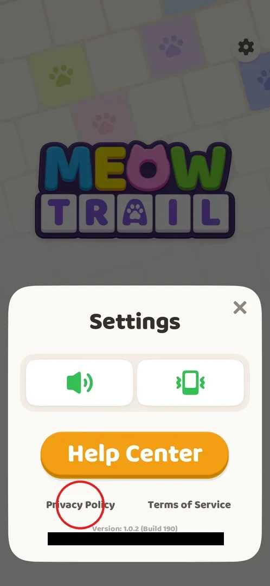
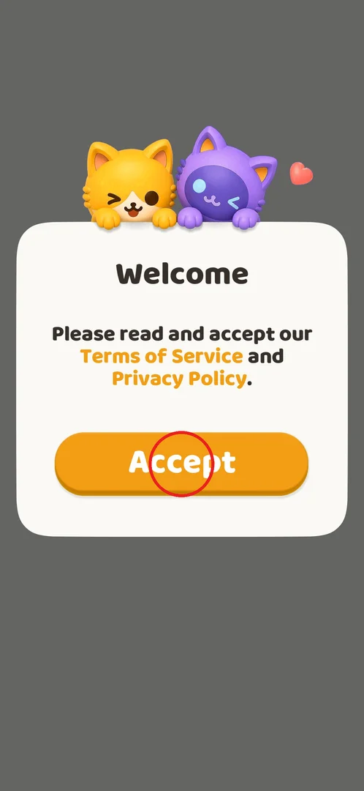
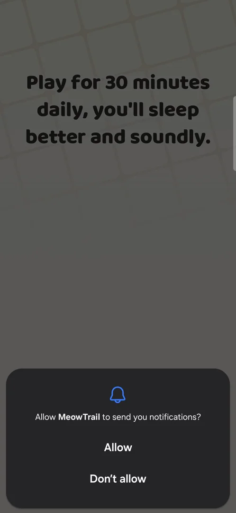

# Terms and privacy consent

The first thing MeowTrail (com.oakever.akari) shows on a fresh install is a "Welcome" card that asks the
player to accept the Terms of Service and the Privacy Policy. It has a single Accept button and no way to
decline or close it; Accept starts the game.[^s2][^s5] After first launch, the same two documents can be
opened again from the Settings popup, and they open in the phone's browser, outside the game.[^s3][^s4][^s7]

## Where to find it

<!-- no-entry: the Welcome card has no button that leads to it; it appears by itself on the first launch of a fresh install, before the splash screen and the tutorial -->

The consent card appears by itself on the first launch, before anything else.[^s2] Later, the documents
are reached from the home screen: the gear at the top right opens the Settings popup, where the
**Privacy Policy** (circled) and **Terms of Service** links sit under the Help Center button.[^s1]

 [^s1]

## What it looks like

A white card on a grey background with two cartoon cats on top, the title "Welcome" and the text "Please
read and accept our Terms of Service and Privacy Policy." The two document names are orange links. Below
is one orange Accept button. There is no Decline button and no close cross.[^s2]

 [^s2]

## What you can do

| Tab or button | What it does |
|---|---|
| [Accept](#accept) | Closes the card and starts the game: splash, loading screen, notification prompt, tutorial[^s5][^s6] |
| [Privacy Policy](#privacy-policy) | Opens the Privacy Policy in Chrome, outside the game (checked from Settings)[^s3][^s7] |
| [Terms of Service](#terms-of-service) | Opens the Terms of Service on oakevergames.com in Chrome (checked from Settings)[^s4][^s7] |

### Accept

The only button on the card (circled). Tapping it shows the Oakever Games splash, then a loading screen
with a tip, and then the Android system prompt "Allow MeowTrail to send you notifications?" (a system
dialog, not part of the game).[^s5][^s6] After the prompt the rules tutorial starts.[^s6]

 [^s2]

 [^s5]

### Privacy Policy

From the Settings popup, the Privacy Policy link leaves the game and opens the external Chrome browser on
oakevergames.com. The only frame of it shows Chrome still loading, so its content was not
seen; the page has no frame because Chrome is another app.[^s3][^s7] Reopening the game brings back the Settings popup, still open.[^s7]

<!-- no-frame: other app (Chrome) -->

### Terms of Service

From the Settings popup, the Terms of Service link opens Chrome on oakevergames.com: "Terms of Service,
Last updated: January 1, 2026", starting with a notice about binding individual arbitration and a class
action waiver for disputes with Oakever Games Pte. Ltd. (no frame here: Chrome is another app).[^s4][^s7] Returning to the game brings back the
Settings popup, still open.[^s7]

<!-- no-frame: other app (Chrome) -->

## How it works

- Version 1.0.2: shown once, on the first launch of a fresh install; Accept is the only choice.[^s2][^s6]
- Both documents are web pages on oakevergames.com opened in the external browser, not inside the
  game.[^s7]
- The Terms of Service seen in 1.0.2 were last updated on January 1, 2026.[^s4]

## Cases

| Case | What was done | Result | Source |
|---|---|---|---|
| Accept on first launch leads into the game | First launch, Accept | Oakever splash, a loading screen with a tip, then the Android notification prompt and the tutorial | [^s5] [^s6] |
| Terms of Service and Privacy Policy links open the documents | Privacy Policy and Terms of Service from the Settings popup | Open in Chrome (oakevergames.com); reopening the game returns to it with the Settings popup still open | [^s3] [^s4] [^s7] |
| After Accept: Oakever splash and a loading screen with a tip; the Android notification permission prompt (system, not the game) comes next | Waited 4 s after Accept, then Don't allow | The tutorial's first step opened | [^s5] [^s6] |

## Not verified

- The Terms of Service and Privacy Policy links on the Welcome card itself were not tapped; only the
  Settings links were (inferred to open the same pages).
- The Privacy Policy page content (it had not loaded in the frame).
- Whether the card comes back after clearing the app data or reinstalling, and whether there is any
  other consent (ads personalisation, age gate) later.

[^s1]: session 20261001-035425-chrono-2FYKPJ, step 13
[^s2]: session 20261001-003641-chrono-2FYKPJ, step 0 — [video at 0:00](https://youtu.be/mebcb05OPmo?t=0)
[^s3]: session 20261001-035425-chrono-2FYKPJ, step 14
[^s4]: session 20261001-035425-chrono-2FYKPJ, step 16
[^s5]: session 20261001-003641-chrono-2FYKPJ, step 1 — [video at 0:11](https://youtu.be/mebcb05OPmo?t=11)
[^s6]: session 20261001-003641-chrono-2FYKPJ, step 2 — [video at 0:29](https://youtu.be/mebcb05OPmo?t=29)
[^s7]: session 20261001-035425-chrono-2FYKPJ, step 17
