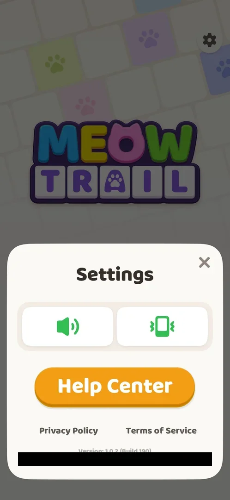
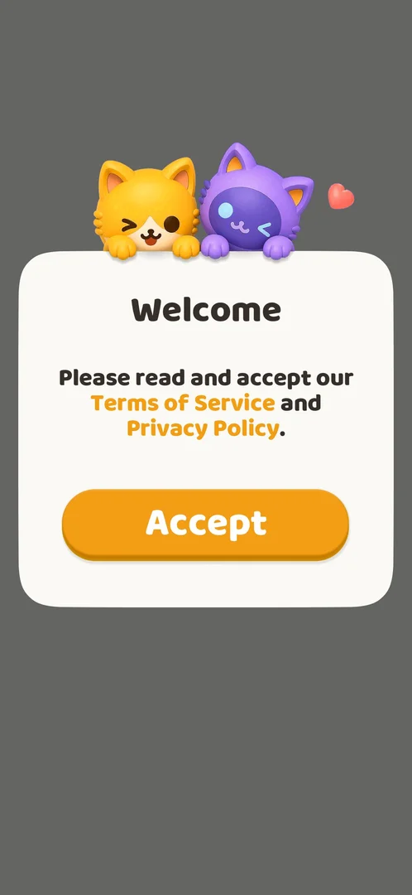

# Terms consent

The first screen of a fresh install: a "Welcome" card that asks the player to accept the Terms of Service and the Privacy Policy before the game starts. It has one button, Accept; the game goes on only after it [^s1]. Once accepted it was not shown again on later launches; the same documents stay reachable from [Settings](settings.md) [^s4] [^s5] [^s2].

## Why it appeared

First launch of a fresh install: it is the first screen the game shows [^s1].

## Where to find it

The card opens by itself on the first launch of a fresh install; no control leads back to it [^s1] [^s6]. After that, the Terms of Service and the Privacy Policy are two text links at the bottom of the [Settings](settings.md) sheet (the gear on Home, top right): Privacy Policy on the left, Terms of Service on the right, under the Help Center button [^s2].

 [^s2]
*Settings: the Terms of Service link bottom right, Privacy Policy bottom left*

## What it looks like

A white card titled "Welcome" over a dark background, with two cartoon cats and a heart above it. One sentence asks the player to read and accept the Terms of Service and Privacy Policy; both names are in orange (links). Under it the orange Accept button [^s1].

 [^s1]
*The Welcome card: Terms of Service and Privacy Policy in orange, the Accept button below*

## What you can do

| Tab or button | What it does |
|---|---|
| [Accept](#accept) | Closes the card; the publisher's splash screen and the notification prompt follow |
| [Terms of Service and Privacy Policy](#terms-of-service-and-privacy-policy) | Links to the documents; the Terms of Service opens in the browser |

### Accept

<!-- no-frame: the Accept button is on the Welcome frame above -->

Tapping Accept closed the card; the next frame is the Oakever Games splash screen, then the Android notification permission prompt ([Notification permission prompt](notifications.md)) [^s3]. There is no button to decline. In the next session the game opened on Home without the card, also after it was force-stopped and started again [^s4] [^s5].

### Terms of Service and Privacy Policy

<!-- no-frame: the document opens in Chrome, outside the game; frames of other apps are not used -->

The links on the Welcome card were not opened. The Terms of Service link in Settings left the game and opened the terms in Chrome, on the publisher's site (oakevergames.com): the terms of Oakever Games Pte. Ltd, dated 2026-01-01 [^s6] [^s7]. Bringing the game back returned to it [^s8]. The Privacy Policy link was not opened.

## How it works

- One button only: Accept. No decline option is on the card (version 1.0.2) [^s1].
- Shown once: not on later launches of the same install [^s4] [^s5].
- The documents are web pages on oakevergames.com opened in the browser; they are reached afterwards from [Settings](settings.md) [^s2] [^s7].

## Cases

| Case | What was done | Result | Source |
|---|---|---|---|
| Welcome screen: Terms of Service and Privacy Policy, Accept button <!-- case:chk-screen --> | Fresh install, first launch | The Welcome card with the two links and Accept | ✅ [^s1] |
| Why it appeared: the trigger that brought it up <!-- case:chk-appeared --> | First launch of a fresh install | Shown as the first screen | ✅ [^s1] |
| Where to find it: the screen and the button that open it <!-- case:chk-entry --> | Launched the game again; opened Settings | Only on the first launch of a fresh install; the terms are reachable from Settings | ✅ [^s8] |
| Every option or button and what it changes <!-- case:chk-options --> | Tapped Accept (fresh install); Terms of Service from Settings | not verified: Accept leads on into the game [^s3]; a decline path and what Back does on the card were not tried | [^s1] [^s3] |
| For a prompt: what each answer does and whether it comes back <!-- case:chk-answers --> | Accepted, then launched the game again and force-stopped it | not verified: Accept leads on; the card did not come back on this install; only one answer was seen | [^s4] [^s5] |
| Links out (privacy, terms): where they lead <!-- case:chk-links --> | Tapped Terms of Service in Settings | Chrome opens the terms on oakevergames.com; bringing the game back returns to it | ✅ [^s8] |

## Not verified

- Every option on the card <!-- case:chk-options -->: one Accept button was seen on the first launch [^s1];
  whether there is a decline path and what Back does on the card were not tried (a fresh install is
  needed, task fresh-consent).
- What each answer does and whether the card comes back <!-- case:chk-answers -->: after Accept it was not
  shown again on this install, also after a force-stop [^s4] [^s5]; any other answer was not seen (task
  fresh-consent).

  > ⚠️ **Previously** (corrected 2026-10-06): the Cases table showed both cases as verified (✅), citing the
  > Terms of Service step in Settings [^s8]. That step shows the links, not the card's options: only Accept
  > was ever tapped, on a single fresh install.

- The links on the Welcome card itself, and the Privacy Policy link: where they lead (inferred: the same oakevergames.com pages).
- The card in motion on a fresh install (follow-up task fresh-consent).

[^s1]: session 20261003-200925-chrono-2FYKPJ, step 0 — [video at 0:00](https://youtu.be/JOMuD_cF8gM?t=0)
[^s2]: session 20261003-232850-chrono-2FYKPJ, step 24 — [video at 4:50](https://youtu.be/94hgW4CXmbg?t=290)
[^s3]: session 20261003-200925-chrono-2FYKPJ, step 1 — [video at 0:00](https://youtu.be/JOMuD_cF8gM?t=0)
[^s4]: session 20261003-232850-chrono-2FYKPJ, step 1 — [video at 0:07](https://youtu.be/94hgW4CXmbg?t=7)
[^s5]: session 20261003-232850-chrono-2FYKPJ, step 23 — [video at 4:33](https://youtu.be/94hgW4CXmbg?t=273)
[^s6]: session 20261003-200925-chrono-2FYKPJ, step 13 — [video at 1:39](https://youtu.be/JOMuD_cF8gM?t=99)
[^s7]: session 20261003-232850-chrono-2FYKPJ, step 25 — [video at 4:59](https://youtu.be/94hgW4CXmbg?t=299)
[^s8]: session 20261003-232850-chrono-2FYKPJ, step 26 — [video at 5:16](https://youtu.be/94hgW4CXmbg?t=316)
