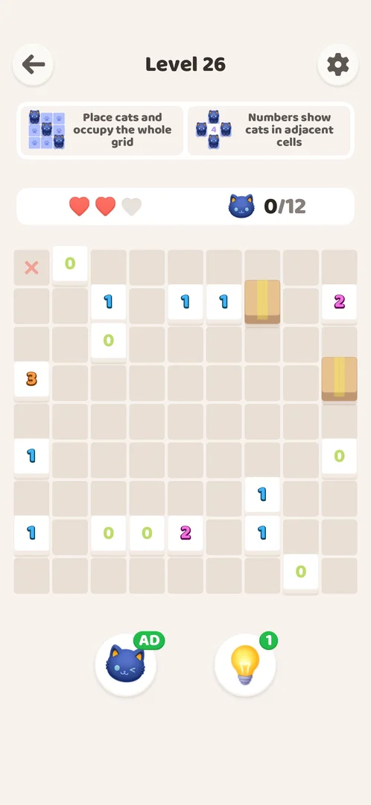
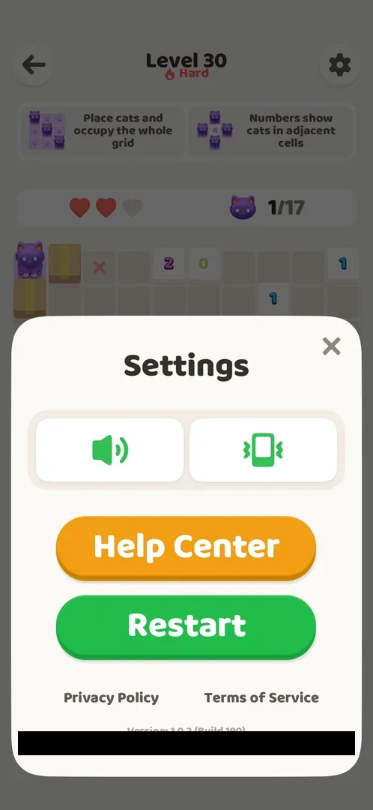

# Akari level

The core puzzle of MeowTrail: a grid of cells, some of them white numbered cells, where the player places cats with a double tap until the cats cover the whole grid; a number tells how many cats sit in the cells next to it. Levels are numbered and played one after another from the Home screen. Each level screen shows three hearts, a cat counter and two boosters; a wrong cat costs a heart, and losing all three ends the level on the "Almost!" screen [^s3] [^s4] [^s11].

## Why it appeared

First launch, after the tutorial: Got it! on the last tutorial card opened Level 1 directly [^s1] [^s4].

## Where to find it

From the [Home screen](home.md): the orange "Level N" button at the bottom opens the next level (here "Level 3") [^s2]. The win screen of a level has a "Level N+1" button that opens the next level directly [^s1] [^s12]. After the tutorial Level 1 opens without Home [^s4].

 [^s2]
*Home: the orange Level 3 button at the bottom opens the next level*

## What it looks like

From top to bottom [^s3]:

- a back arrow (left), the title "Level N" and a settings gear (right);
- two rule cards: "Place cats and occupy the whole grid" and "Numbers show cats in adjacent cells";
- a bar with three red hearts ([Hearts](hearts.md)) and a cat counter "0/6" (cats placed / cats needed);
- the grid: beige cells and white numbered cells; on later levels also white 0 cells (from Level 6) and cardboard boxes (from Level 11) [^s31];
- two round boosters under the grid, a cat and a bulb, each with a green badge "5" ([Cat and bulb boosters](boosters.md)).

 [^s3]
*Level 2 at the start: 5x5 grid with three numbered cells, counter 0/6*

Grids seen: Level 1 is a 4x4 grid without its four corner cells, with two cells numbered 4 (6 cats) [^s4]; Level 2 a 5x5 grid with 3, 2 and 1 (6 cats) [^s3]; Level 3 a 6x6 grid with nine numbered cells (9 cats) [^s13]; Level 4 a 6x6 grid with 2, 2 and 1 (6 cats) [^s14]. Later boards are larger: Level 44 an 8x8 grid (15 cats) [^s32], Level 45 10x10 (20 cats) [^s33], Level 46 9x9 (14 cats) [^s34].

## What you can do

| Tab or button | What it does |
|---|---|
| [Grid cell](#grid-cell) | A double tap places a cat; a wrong cat costs a heart |
| [Back arrow](#back-arrow) | Leads to the Home screen at once; the board is kept |
| [Settings gear](#settings-gear) | Opens Settings, with a Restart button that resets the level after an interstitial ad |
| [Boosters](#boosters) | Cat and bulb boosters under the grid |
| [Result](#result) | The win screen, or "Almost!" when the hearts run out |

### Grid cell

A double tap on a cell places a cat (taught by the tutorial) [^s5]. A correct cat stays; the cells it covers — its row and its column up to a numbered cell or the edge of the grid — turn lilac with paw prints, and the counter goes up by one [^s15] [^s14]. A numbered cell turns pale once it has all its cats [^s16].

A wrong cat is drawn with an angry mark on a red cell, one heart turns grey and the counter does not change; a red X was later seen on one such cell [^s14] [^s11]. On Level 4, eight deliberate guesses gave two correct cats, three wrong ones (the three hearts), and three that placed no cat and cost no heart [^s11]. How a placed cat is removed was not tried.

 [^s11]
*A wrong cat (red cell, right) and an earlier wrong cell marked with a red X (left); no hearts left*

### Back arrow

<!-- no-frame: the back arrow is on the level frame above (top left) -->

Top left. On Level 2 before any move and on Level 4 right after a Restart it led straight to the [Home screen](home.md); no confirmation was shown, and Home still offered the same level [^s7] [^s9]. On Level 26, left with one wrong cat and 2 of 3 hearts, the back arrow went to Home at once and reopening the level showed the board as it was left: the red X of the wrong cat and 2 hearts; nothing was charged [^s19]. Sending the game to the background for 30 s and returning kept the board the same way [^s19].

 [^s19]
*Level 26 reopened from Home: the board as it was left*

**Closing the game.** After a force-stop and relaunch mid-level (Level 26, one cat placed by the cat booster, one wrong cat, 2 hearts), the game opened on Home with the same Level N button, and the level reopened reset: empty board, 3 hearts. The cat booster used before the exit was not given back (it still showed AD) [^s19].

### Settings gear

Top right; opens the [Settings](settings.md) sheet [^s8]. From a level the sheet has one more button, a green Restart under Help Center, which the Home sheet lacks [^s20]. The Help Center says it restarts the level and clears its progress [^s21].

 [^s23]
*The in-level Settings sheet: the green Restart button under Help Center*

**Restart, tested on Level 30** (one correct cat, one wrong cat, 2 of 3 hearts, counter 1/17, cat booster at AD, bulb booster at 1): tapping Restart showed no confirmation and went straight to a full-screen interstitial video ad ([Interstitial ads](interstitial-ad.md)). The ad ended by itself in the Play Store; opening the game again showed Level 30 reset: an empty board, 3 hearts, counter 0/17, and the boosters unchanged (cat AD, bulb 1) [^s23] [^s24]. Level 30 itself had been opened from Home without an ad, so the ad came with the Restart [^s24].

### Boosters

<!-- no-frame: shown on the level screen frame above; see the boosters page for their frames -->

The cat booster places one correct cat; the bulb booster shows one deduction step and places its cats on Apply. Each use costs 1; at zero a rewarded video gives 1 back. See [Cat and bulb boosters](boosters.md).

### Result

**Win.** When the last cat is placed, the board dims, a praise title appears over it, two cats celebrate in a cardboard box with confetti, and an orange "Level N+1" button appears. No reward (coins, items) is shown. The title differed: "BRILLIANT!" after Level 1, "PERFECT!" after Level 2, "AWESOME!" after Level 3 [^s1] [^s6] [^s12]. Neither hearts left nor boosters set it: Level 35 (three hearts, no booster) and Level 36 (two hearts) gave "INCREDIBLE!", Level 37 (three hearts, the cat booster used) and Level 38 (three hearts, no booster) gave "PERFECT!"; Levels 35 and 38 were won the same way and got different titles [^s25] [^s26] [^s27] [^s28]. Inferred: the title is picked at random from a set (BRILLIANT, PERFECT, AWESOME and INCREDIBLE seen).

 [^s1]
*The win screen: no rewards, only the Level 2 button*

 [^s1]
*Clip 10.5 s · [original on YouTube from 0:47](https://youtu.be/JOMuD_cF8gM?t=47)*

**Out of hearts.** When the third heart is lost, the board dims and "Almost!" appears with a broken heart over the hearts bar, two crying cats in a grey box, the cat counter as it stood (2/6), and two buttons: an orange "Revive" with an AD clapperboard icon and a green "Restart" [^s11]. Restart reopened the same board with three hearts and the counter at 0/6; the booster balances were unchanged [^s10]. Revive plays a video ad and gives back one heart with the board kept, and is offered again on the next loss (see [Hearts](hearts.md)) [^s29] [^s30].

 [^s11]
*Almost!: Revive (with an AD icon) and Restart*

 [^s11]
*Clip 4.2 s · [original on YouTube from 3:39](https://youtu.be/94hgW4CXmbg?t=219)*

## How it works

Version 1.0.2:

- Goal: cover the whole grid with cats; a numbered cell shows how many cats are in its adjacent cells (the rule cards and the tutorial) [^s3] [^s17].
- A cat covers its row and its column up to a numbered cell or the edge (the lilac paw-print cells) [^s14].
- The cat counter shows cats placed and cats needed: 6 on Levels 1, 2 and 4, 9 on Level 3. Wrong cats are not counted [^s4] [^s13] [^s14].
- Hearts: 3 per attempt. Each wrong cat costs one; at zero the level ends on "Almost!" [^s11] [^s18].
- After a loss: Restart is free and gives the same board with 3 hearts; Revive plays a rewarded video ad, then one heart of three comes back and the board is kept [^s10] [^s11] [^s29].
- Restart: on the "Almost!" screen (free, same board, 3 hearts) [^s10], and in the Settings sheet opened from a level: no confirmation, an interstitial ad first, then an empty board with 3 hearts and the boosters unchanged [^s24]; there is no restart button on the level screen itself [^s7].
- Leaving: the back arrow and the background keep the board; a force-stop resets it, and a booster spent before it is lost [^s19].
- Cat colour: the cats change colour with the level number in a cycle of five: purple on Levels 20, 25 and 30; blue on 21 and 26; pink on 22 and 27; grey-blue on 23 and 28; yellow on 24 and 29. The colour shows on the cats on the board, the counter, the cat booster and the cats in the win box. A relaunch did not change it. There is no collection or album of cats on Home, the level screen or the win screens [^s22].
- Board elements: numbered cells from Level 1; 0 cells from Level 6, with a tip popup about the X marking; boxes from Level 11, with a tip popup that boxes block cats [^s31]. Nothing else appeared through Level 46: the Level 44, 45 and 46 boards hold only boxes and numbered cells, 0 included [^s34].
- Win: no reward shown; the only button leads to the next level [^s1] [^s12].
- Times: Levels 1 and 2 about 30 s each with six cats and no heart lost [^s1] [^s6]; Level 3 about 2 min 13 s with both boosters used [^s12].
- Levels are played in order from a single "Level N" button on Home; no level map was seen through Level 4 [^s2] [^s9].

## Outcomes

| Outcome | What happens | Source |
|---|---|---|
| Win | Board dims, praise title, cats in a box, "Level N+1" button; no reward | [^s1] |
| Out of hearts <!-- case:out-of-hearts --> | Third wrong cat: "Almost!" with Revive (AD icon) and Restart (free, same board, 3 hearts) | ✅ [^s11] |

## Cases

| Case | What was done | Result | Source |
|---|---|---|---|
| Home: the orange 'Level N' button; also the 'Level N+1' button on the win screen <!-- case:chk-entry --> | Opened levels from Home and from the win screens | Both open the next level | ✅ [^s3] |
| Level screen: title, two rule cards, hearts and cat counter bar, the grid, two boosters below <!-- case:chk-screen --> | Opened Levels 1 to 4 | The layout above | ✅ [^s4] |
| Back arrow (to Home), 'Level N', settings gear; rule cards; 3 hearts; cat counter 0/N; cat and bulb boosters with count 5 <!-- case:chk-hud --> | Read the HUD of Levels 1 and 2 | Every element listed | ✅ [^s4] |
| Win: dimmed board, praise title, cats in a box, 'Level N+1' button; no rewards shown <!-- case:chk-win --> | Won Levels 1, 2 and 3 | BRILLIANT!, PERFECT!, AWESOME!; no rewards | ✅ [^s1] |
| Why it appeared: the trigger that brought it up <!-- case:chk-appeared --> | Finished the tutorial | Level 1 opened directly | ✅ [^s1] |
| Out of hearts <!-- case:out-of-hearts --> | Three wrong cats on Level 4 | "Almost!" with Revive (video) and Restart | ✅ [^s11] |
| Each loss <!-- case:chk-loss --> | Deliberate wrong double taps on Level 4 | Loss after 3 wrong cats; red X on the wrong cells; the counter keeps the correct cats | ✅ [^s11] |
| After a loss: the retry and continue offers <!-- case:chk-retry --> | Tapped Restart on "Almost!" | Revive (rewarded video) and Restart (free, same board, hearts back to 3) | ✅ [^s10] |
| Restart <!-- case:chk-restart --> | Looked for a restart control on the level screen; on Level 30 placed one correct and one wrong cat, then tapped Restart in the in-level Settings sheet | No button on the level screen. In-level Restart: no confirmation; an interstitial video ad played first (ended in the Play Store, the game reopened on the level); then an empty board, 3 hearts, boosters unchanged (cat AD, bulb 1). The Restart on "Almost!" is free | ✅ [^s7] [^s23] [^s24] |
| Win title <!-- case:win-title --> | Won Levels 35 to 38 with three hearts, two hearts, a booster and none | INCREDIBLE! (3 hearts; 2 hearts), PERFECT! (booster; no booster): the title follows neither hearts nor boosters; inferred random | ✅ [^s28] |
| Cat colours <!-- case:cat-skins --> | Played Levels 20 to 30, noted the cats' colour | A cycle of five by level number (purple, blue, pink, grey-blue, yellow), on the board, counter, booster and win box; no collection | ✅ [^s22] |
| Rules: the goal, the controls, what blocks a move and how the level is lost <!-- case:chk-rules --> | Played Levels 1 to 4 | A wrong cat costs a heart; 3 hearts lost ends the level on "Almost!" | ✅ [^s18] |
| Level elements <!-- case:chk-elements --> | Played Levels 1 to 46 | Numbered cells from Level 1; 0 cells from Level 6 (tip popup about the X marking); boxes from Level 11 (tip popup: boxes block cats); nothing else through Level 46 (Level 44 8x8, Level 45 10x10, Level 46 9x9: only boxes and numbered or 0 cells) | ✅ [^s18] [^s31] [^s34] |
| Quit <!-- case:chk-quit --> | Back arrow on Level 2 before any move, on Level 4 after Restart, and on Level 26 with a wrong cat and 2 hearts | Home at once, no confirmation, no cost; reopening the level keeps the board (the X and 2 hearts) | ✅ [^s7] [^s19] |
| Exit the app <!-- case:chk-exit-app --> | Force-stopped mid-level on Level 4 and on Level 26 (a booster cat, a wrong cat, 2 hearts), relaunched, reopened the level; also sent the game to the background for 30 s | After a force-stop: Home with the same Level N; the board reset (empty, 3 hearts), the spent booster not returned. After the background: the board kept | ✅ [^s19] |

## Not verified

- How a placed cat is removed, and why three guesses on Level 4 placed no cat and cost no heart.

[^s1]: session 20261003-200925-chrono-2FYKPJ, step 10 — [video at 0:55](https://youtu.be/JOMuD_cF8gM?t=55)
[^s2]: session 20261003-232850-chrono-2FYKPJ, step 1 — [video at 0:07](https://youtu.be/94hgW4CXmbg?t=7)
[^s3]: session 20261003-200925-chrono-2FYKPJ, step 15 — [video at 2:04](https://youtu.be/JOMuD_cF8gM?t=124)
[^s4]: session 20261003-200925-chrono-2FYKPJ, step 9 — [video at 0:36](https://youtu.be/JOMuD_cF8gM?t=36)
[^s5]: session 20261003-200925-chrono-2FYKPJ, step 2 — [video at 0:00](https://youtu.be/JOMuD_cF8gM?t=0)
[^s6]: session 20261003-200925-chrono-2FYKPJ, step 16 — [video at 2:20](https://youtu.be/JOMuD_cF8gM?t=140)
[^s7]: session 20261003-232850-chrono-2FYKPJ, step 23 — [video at 4:33](https://youtu.be/94hgW4CXmbg?t=273)
[^s8]: session 20261003-200925-chrono-2FYKPJ, step 13 — [video at 1:39](https://youtu.be/JOMuD_cF8gM?t=99)
[^s9]: session 20261003-232850-chrono-2FYKPJ, step 20 — [video at 4:05](https://youtu.be/94hgW4CXmbg?t=245)
[^s10]: session 20261003-232850-chrono-2FYKPJ, step 19 — [video at 3:56](https://youtu.be/94hgW4CXmbg?t=236)
[^s11]: session 20261003-232850-chrono-2FYKPJ, step 18 — [video at 3:42](https://youtu.be/94hgW4CXmbg?t=222)
[^s12]: session 20261003-232850-chrono-2FYKPJ, step 9 — [video at 2:43](https://youtu.be/94hgW4CXmbg?t=163)
[^s13]: session 20261003-232850-chrono-2FYKPJ, step 2 — [video at 0:31](https://youtu.be/94hgW4CXmbg?t=31)
[^s14]: session 20261003-232850-chrono-2FYKPJ, step 14 — [video at 3:20](https://youtu.be/94hgW4CXmbg?t=200)
[^s15]: session 20261003-232850-chrono-2FYKPJ, step 3 — [video at 0:43](https://youtu.be/94hgW4CXmbg?t=43)
[^s16]: session 20261003-232850-chrono-2FYKPJ, step 5 — [video at 0:57](https://youtu.be/94hgW4CXmbg?t=57)
[^s17]: session 20261003-200925-chrono-2FYKPJ, step 8 — [video at 0:22](https://youtu.be/JOMuD_cF8gM?t=22)
[^s18]: session 20261003-232850-chrono-2FYKPJ, step 26 — [video at 5:16](https://youtu.be/94hgW4CXmbg?t=316)

[^s19]: session 20261006-002027-chrono-2FYKPJ, step 10 — [video at 2:21](https://youtu.be/u0n3VnemzrQ?t=141)
[^s20]: session 20261006-002027-chrono-2FYKPJ, step 47 — [video at 9:42](https://youtu.be/u0n3VnemzrQ?t=582)
[^s21]: session 20261006-002027-chrono-2FYKPJ, step 41 — [video at 8:53](https://youtu.be/u0n3VnemzrQ?t=533)
[^s22]: session 20261006-002027-chrono-2FYKPJ, step 20 — [video at 6:15](https://youtu.be/u0n3VnemzrQ?t=375)
[^s23]: session 20261006-023308-chrono-2FYKPJ, step 4 — [video at 1:01](https://youtu.be/bbcco3ENaxU?t=61)
[^s24]: session 20261006-023308-chrono-2FYKPJ, step 5 — [video at 2:39](https://youtu.be/bbcco3ENaxU?t=159)

[^s25]: session 20261006-044907-chrono-2FYKPJ, step 3 — [video at 0:56](https://youtu.be/KJek5sX1toU?t=56)
[^s26]: session 20261006-044907-chrono-2FYKPJ, step 7 — [video at 2:45](https://youtu.be/KJek5sX1toU?t=165)
[^s27]: session 20261006-044907-chrono-2FYKPJ, step 22 — [video at 10:06](https://youtu.be/KJek5sX1toU?t=606)
[^s28]: session 20261006-044907-chrono-2FYKPJ, step 25 — [video at 11:46](https://youtu.be/KJek5sX1toU?t=706)
[^s29]: session 20261006-044907-chrono-2FYKPJ, step 14 — [video at 6:11](https://youtu.be/KJek5sX1toU?t=371)
[^s30]: session 20261006-044907-chrono-2FYKPJ, step 16 — [video at 6:36](https://youtu.be/KJek5sX1toU?t=396)

[^s31]: session 20261005-080420-chrono-2FYKPJ, step 30 — [video at 9:41](https://youtu.be/bJ144EFaJEE?t=581)
[^s32]: session 20261006-124837-chrono-2FYKPJ, step 4 — [video at 2:52](https://youtu.be/eGSIAaZUSrA?t=172)
[^s33]: session 20261006-124837-chrono-2FYKPJ, step 7 — [video at 4:54](https://youtu.be/eGSIAaZUSrA?t=294)
[^s34]: session 20261006-124837-chrono-2FYKPJ, step 13 — [video at 7:52](https://youtu.be/eGSIAaZUSrA?t=472)
