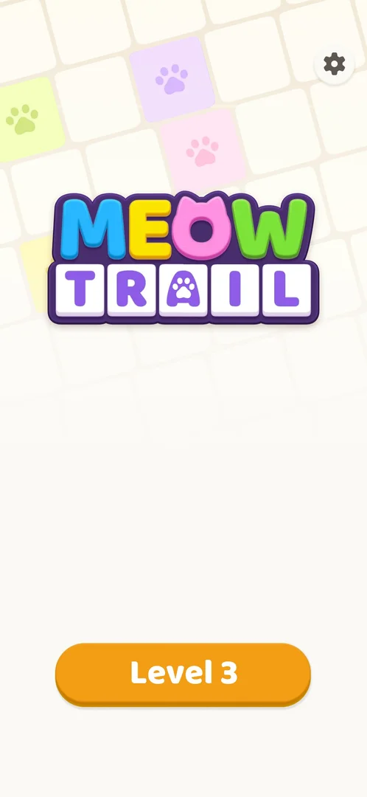
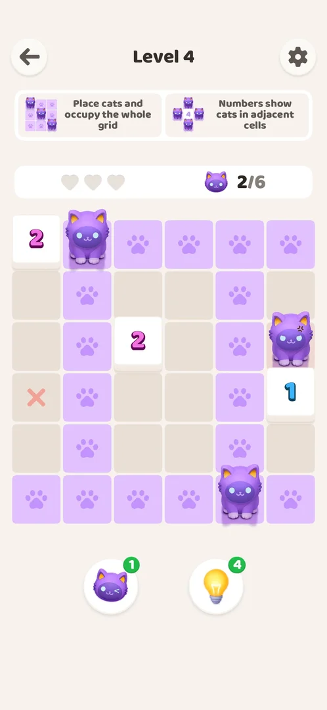
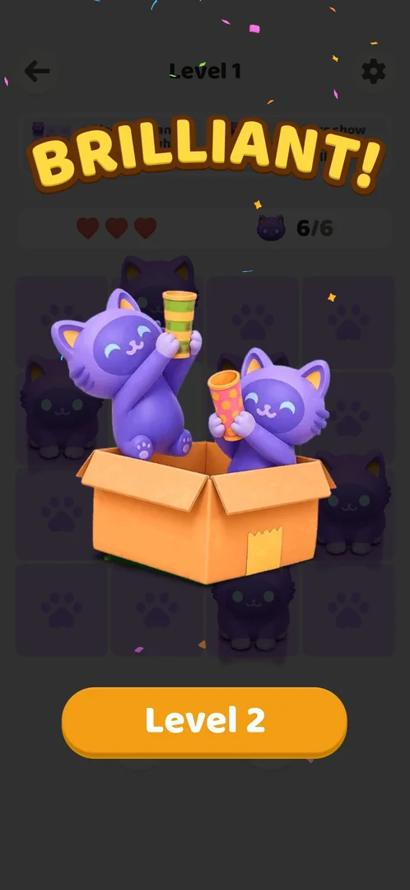
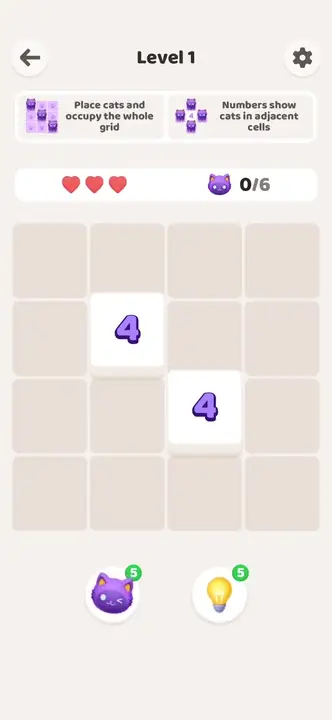
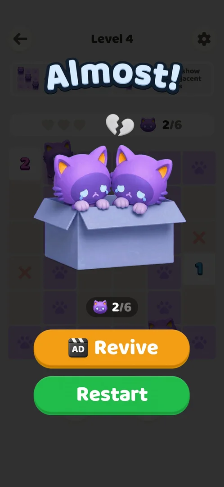

# Akari level

The core puzzle of MeowTrail: a grid of cells, some of them white numbered cells, where the player places cats with a double tap until the cats cover the whole grid; a number tells how many cats sit in the cells next to it. Levels are numbered and played one after another from the Home screen. Each level screen shows three hearts, a cat counter and two boosters; a wrong cat costs a heart, and losing all three ends the level on the "Almost!" screen [^s3] [^s4] [^s11].

## Why it appeared

First launch, after the tutorial: Got it! on the last tutorial card opened Level 1 directly [^s1] [^s4].

## Where to find it

From the [Home screen](home.md): the orange "Level N" button at the bottom opens the next level (here "Level 3") [^s2]. The win screen of a level has a "Level N+1" button that opens the next level directly [^s1] [^s12]. After the tutorial Level 1 opens without Home [^s4].

 [^s2]
*Home: the orange Level 3 button at the bottom opens the next level*

## What it looks like

From top to bottom [^s3]:

- a back arrow (left), the title "Level N" and a settings gear (right);
- two rule cards: "Place cats and occupy the whole grid" and "Numbers show cats in adjacent cells";
- a bar with three red hearts ([Hearts](hearts.md)) and a cat counter "0/6" (cats placed / cats needed);
- the grid: beige cells and white numbered cells;
- two round boosters under the grid, a cat and a bulb, each with a green badge "5" ([Cat and bulb boosters](boosters.md)).

 [^s3]
*Level 2 at the start: 5x5 grid with three numbered cells, counter 0/6*

Grids seen: Level 1 is a 4x4 grid without its four corner cells, with two cells numbered 4 (6 cats) [^s4]; Level 2 a 5x5 grid with 3, 2 and 1 (6 cats) [^s3]; Level 3 a 6x6 grid with nine numbered cells (9 cats) [^s13]; Level 4 a 6x6 grid with 2, 2 and 1 (6 cats) [^s14].

## What you can do

| Tab or button | What it does |
|---|---|
| [Grid cell](#grid-cell) | A double tap places a cat; a wrong cat costs a heart |
| [Back arrow](#back-arrow) | Leads to the Home screen at once |
| [Settings gear](#settings-gear) | Opens Settings |
| [Boosters](#boosters) | Cat and bulb boosters under the grid |
| [Result](#result) | The win screen, or "Almost!" when the hearts run out |

### Grid cell

A double tap on a cell places a cat (taught by the tutorial) [^s5]. A correct cat stays; the cells it covers — its row and its column up to a numbered cell or the edge of the grid — turn lilac with paw prints, and the counter goes up by one [^s15] [^s14]. A numbered cell turns pale once it has all its cats [^s16].

A wrong cat is drawn with an angry mark on a red cell, one heart turns grey and the counter does not change; a red X was later seen on one such cell [^s14] [^s11]. On Level 4, eight deliberate guesses gave two correct cats, three wrong ones (the three hearts), and three that placed no cat and cost no heart [^s11]. How a placed cat is removed was not tried.

 [^s11]
*A wrong cat (red cell, right) and an earlier wrong cell marked with a red X (left); no hearts left*

### Back arrow

<!-- no-frame: the back arrow is on the level frame above (top left) -->

Top left. On Level 2 before any move and on Level 4 right after a Restart it led straight to the [Home screen](home.md); no confirmation was shown, and Home still offered the same level [^s7] [^s9]. Whether leaving mid-level costs anything was not checked.

### Settings gear

<!-- no-frame: the gear is on the level frame above (top right) -->

Top right; opens the [Settings](settings.md) sheet. It was opened from Home, not from a level [^s8].

### Boosters

<!-- no-frame: shown on the level screen frame above; see the boosters page for their frames -->

The cat booster places one correct cat; the bulb booster shows one deduction step and places its cats on Apply. Each use costs 1; at zero a rewarded video gives 1 back. See [Cat and bulb boosters](boosters.md).

### Result

**Win.** When the last cat is placed, the board dims, a praise title appears over it, two cats celebrate in a cardboard box with confetti, and an orange "Level N+1" button appears. No reward (coins, items) is shown. The title differed: "BRILLIANT!" after Level 1, "PERFECT!" after Level 2, "AWESOME!" after Level 3 [^s1] [^s6] [^s12]. What sets the title is not known.

 [^s1]
*The win screen: no rewards, only the Level 2 button*

 [^s1]
*Clip 10.5 s · [original on YouTube from 0:47](https://youtu.be/JOMuD_cF8gM?t=47)*

**Out of hearts.** When the third heart is lost, the board dims and "Almost!" appears with a broken heart over the hearts bar, two crying cats in a grey box, the cat counter as it stood (2/6), and two buttons: an orange "Revive" with an AD clapperboard icon and a green "Restart" [^s11]. Restart reopened the same board with three hearts and the counter at 0/6; the booster balances were unchanged [^s10]. Revive was not tapped.

 [^s11]
*Almost!: Revive (with an AD icon) and Restart*

 [^s11]
*Clip 4.2 s · [original on YouTube from 3:39](https://youtu.be/94hgW4CXmbg?t=219)*

## How it works

Version 1.0.2:

- Goal: cover the whole grid with cats; a numbered cell shows how many cats are in its adjacent cells (the rule cards and the tutorial) [^s3] [^s17].
- A cat covers its row and its column up to a numbered cell or the edge (the lilac paw-print cells) [^s14].
- The cat counter shows cats placed and cats needed: 6 on Levels 1, 2 and 4, 9 on Level 3. Wrong cats are not counted [^s4] [^s13] [^s14].
- Hearts: 3 per attempt. Each wrong cat costs one; at zero the level ends on "Almost!" [^s11] [^s18].
- After a loss: Restart is free and gives the same board with 3 hearts; Revive carries an AD icon (inferred: a rewarded video; not tapped) [^s10] [^s11].
- There is no restart button on the level screen; Restart is only on the "Almost!" screen [^s7].
- Win: no reward shown; the only button leads to the next level [^s1] [^s12].
- Times: Levels 1 and 2 about 30 s each with six cats and no heart lost [^s1] [^s6]; Level 3 about 2 min 13 s with both boosters used [^s12].
- Levels are played in order from a single "Level N" button on Home; no level map was seen through Level 4 [^s2] [^s9].

## Outcomes

| Outcome | What happens | Source |
|---|---|---|
| Win | Board dims, praise title, cats in a box, "Level N+1" button; no reward | [^s1] |
| Out of hearts <!-- case:out-of-hearts --> | Third wrong cat: "Almost!" with Revive (AD icon) and Restart (free, same board, 3 hearts) | ✅ [^s11] |

## Cases

| Case | What was done | Result | Source |
|---|---|---|---|
| Home: the orange 'Level N' button; also the 'Level N+1' button on the win screen <!-- case:chk-entry --> | Opened levels from Home and from the win screens | Both open the next level | ✅ [^s3] |
| Level screen: title, two rule cards, hearts and cat counter bar, the grid, two boosters below <!-- case:chk-screen --> | Opened Levels 1 to 4 | The layout above | ✅ [^s4] |
| Back arrow (to Home), 'Level N', settings gear; rule cards; 3 hearts; cat counter 0/N; cat and bulb boosters with count 5 <!-- case:chk-hud --> | Read the HUD of Levels 1 and 2 | Every element listed | ✅ [^s4] |
| Win: dimmed board, praise title, cats in a box, 'Level N+1' button; no rewards shown <!-- case:chk-win --> | Won Levels 1, 2 and 3 | BRILLIANT!, PERFECT!, AWESOME!; no rewards | ✅ [^s1] |
| Why it appeared: the trigger that brought it up <!-- case:chk-appeared --> | Finished the tutorial | Level 1 opened directly | ✅ [^s1] |
| Out of hearts <!-- case:out-of-hearts --> | Three wrong cats on Level 4 | "Almost!" with Revive (video) and Restart | ✅ [^s11] |
| Each loss <!-- case:chk-loss --> | Deliberate wrong double taps on Level 4 | Loss after 3 wrong cats; red X on the wrong cells; the counter keeps the correct cats | ✅ [^s11] |
| After a loss: the retry and continue offers <!-- case:chk-retry --> | Tapped Restart on "Almost!" | Revive (rewarded video) and Restart (free, same board, hearts back to 3) | ✅ [^s10] |
| Restart <!-- case:chk-restart --> | Looked for a restart control on the level screen | None; only Restart on "Almost!" (free). The back arrow quits without confirmation | ✅ [^s7] |
| Rules: the goal, the controls, what blocks a move and how the level is lost <!-- case:chk-rules --> | Played Levels 1 to 4 | A wrong cat costs a heart; 3 hearts lost ends the level on "Almost!" | ✅ [^s18] |
| Level elements <!-- case:chk-elements --> | Played Levels 1 to 4 | Plain and numbered cells only; no other element met yet | ✅ [^s18] |
| Quit <!-- case:chk-quit --> | Back arrow on Level 2 before any move and on Level 4 after Restart | Home at once, no confirmation, the same level offered; cost mid-level not checked | not verified |
| Exit the app <!-- case:chk-exit-app --> | One cat placed on Level 4, then the game was force-stopped and started again | The game opened on Home with "Level 4"; the level was not reopened, so whether the cat was kept is not known | not verified |

## Not verified

- Quit: leaving mid-level with cats placed or hearts lost, and whether it costs anything; the session saw no confirmation and no cost, but the case was not closed in the map <!-- case:chk-quit -->
- Exit the app mid-level and come back: after a relaunch the game opened on Home with the same level; whether the board was kept was not checked <!-- case:chk-exit-app -->
- What Revive gives (hearts back, the board kept) and whether it is a rewarded video.
- How a placed cat is removed, and why three guesses on Level 4 placed no cat and cost no heart.

[^s1]: session 20261003-200925-chrono-2FYKPJ, step 10 — [video at 0:55](https://youtu.be/JOMuD_cF8gM?t=55)
[^s2]: session 20261003-232850-chrono-2FYKPJ, step 1 — [video at 0:07](https://youtu.be/94hgW4CXmbg?t=7)
[^s3]: session 20261003-200925-chrono-2FYKPJ, step 15 — [video at 2:04](https://youtu.be/JOMuD_cF8gM?t=124)
[^s4]: session 20261003-200925-chrono-2FYKPJ, step 9 — [video at 0:36](https://youtu.be/JOMuD_cF8gM?t=36)
[^s5]: session 20261003-200925-chrono-2FYKPJ, step 2 — [video at 0:00](https://youtu.be/JOMuD_cF8gM?t=0)
[^s6]: session 20261003-200925-chrono-2FYKPJ, step 16 — [video at 2:20](https://youtu.be/JOMuD_cF8gM?t=140)
[^s7]: session 20261003-232850-chrono-2FYKPJ, step 23 — [video at 4:33](https://youtu.be/94hgW4CXmbg?t=273)
[^s8]: session 20261003-200925-chrono-2FYKPJ, step 13 — [video at 1:39](https://youtu.be/JOMuD_cF8gM?t=99)
[^s9]: session 20261003-232850-chrono-2FYKPJ, step 20 — [video at 4:05](https://youtu.be/94hgW4CXmbg?t=245)
[^s10]: session 20261003-232850-chrono-2FYKPJ, step 19 — [video at 3:56](https://youtu.be/94hgW4CXmbg?t=236)
[^s11]: session 20261003-232850-chrono-2FYKPJ, step 18 — [video at 3:42](https://youtu.be/94hgW4CXmbg?t=222)
[^s12]: session 20261003-232850-chrono-2FYKPJ, step 9 — [video at 2:43](https://youtu.be/94hgW4CXmbg?t=163)
[^s13]: session 20261003-232850-chrono-2FYKPJ, step 2 — [video at 0:31](https://youtu.be/94hgW4CXmbg?t=31)
[^s14]: session 20261003-232850-chrono-2FYKPJ, step 14 — [video at 3:20](https://youtu.be/94hgW4CXmbg?t=200)
[^s15]: session 20261003-232850-chrono-2FYKPJ, step 3 — [video at 0:43](https://youtu.be/94hgW4CXmbg?t=43)
[^s16]: session 20261003-232850-chrono-2FYKPJ, step 5 — [video at 0:57](https://youtu.be/94hgW4CXmbg?t=57)
[^s17]: session 20261003-200925-chrono-2FYKPJ, step 8 — [video at 0:22](https://youtu.be/JOMuD_cF8gM?t=22)
[^s18]: session 20261003-232850-chrono-2FYKPJ, step 26 — [video at 5:16](https://youtu.be/94hgW4CXmbg?t=316)
