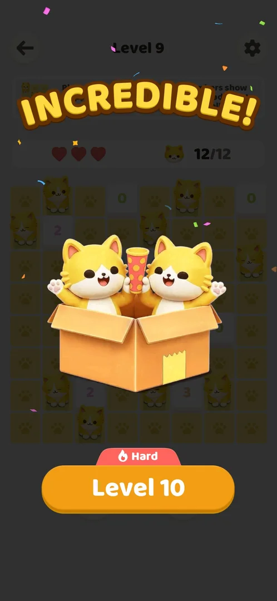
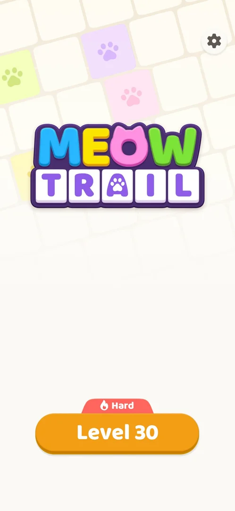
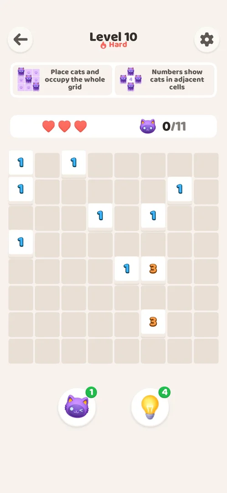
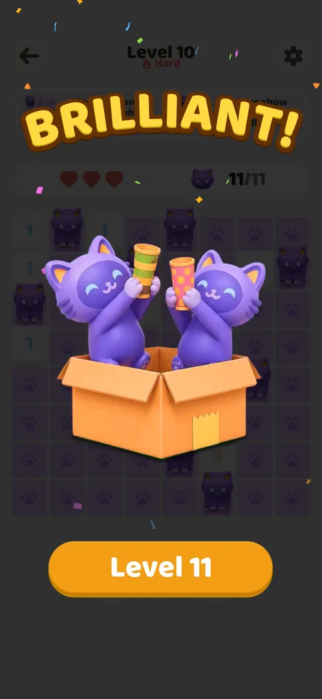
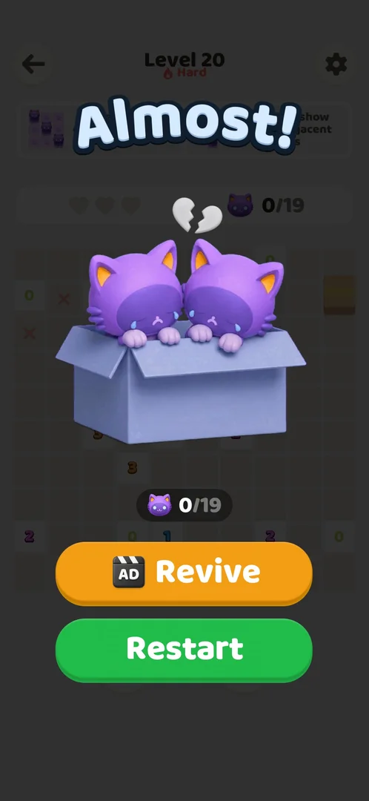
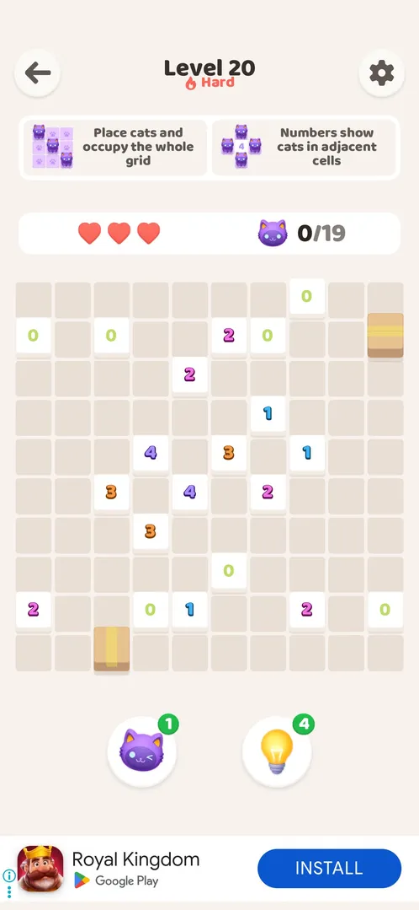

# Hard levels

Every 10th level of the [Akari level](core-level.md) sequence is marked Hard: a red flame "Hard" badge announces it on the previous level's win screen, and a red "Hard" label sits under the level title while it is played. The rules, the three hearts and the boosters are the same as on a normal level, and the boards (Level 10: 8x8, 11 cats; Level 20: 10x10, 19 cats; Level 30: 10x10, 17 cats) are of the sizes normal levels around them have (version 1.0.2) [^s1] [^s2] [^s5].

## Why it appeared

Level 10 is the first Hard level. It is announced by a red flame "Hard" badge above the Level 10 button on the win screen of Level 9 [^s1]. Levels 4 to 9 and 11 to 19 had no badge; Level 20 was the next Hard level [^s5], and Level 30 the one after it (Levels 21 to 29 had none) [^s9].

## Where to find it

From the win screen of the level before it, or from [Home](home.md): the orange "Level N" button that starts the next level carries a red tab with a flame and the word "Hard" on its top edge. Tapping the button opens the Hard level [^s1] [^s2] [^s10].

 [^s1]
*The Hard tab on the Level 10 button, on the Level 9 win screen*

The Level N button on Home carries the same red flame "Hard" tab (Level 30) [^s10].

 [^s10]
*The Hard tab on the Level 30 button on Home*

The [Help Center](help-center.md) article also names a "Hard" badge on the level entry [^s6].

## What it looks like

The usual level screen with one addition: a red flame and the word "Hard" under the "Level N" title. Above the board the two rule cards, then the hearts (3) and the cat counter (0/11 on Level 10); below it the cat booster and the bulb booster with their counts. Level 10's board is 8x8 with numbered tiles (1 and 3) [^s2].

 [^s2]
*Level 10, the first Hard level*

The Help Center says a Hard banner with a short animation comes up on entering a hard level [^s6]. The session recorded the entry of Level 10, but the banner had already gone by the time the frame was taken; it is not on any frame [^s2].

## How it works

- Which levels: 10, 20 and 30 were Hard; 4 to 9, 11 to 19 and 21 to 29 were not. Every 10th level (seen up to Level 30; version 1.0.2) [^s5] [^s9].
- Rules: the same as a normal level: cats placed with a double tap, numbers count cats in adjacent cells, 3 hearts, a wrong cat costs a heart [^s4] [^s3].
- Board size: Level 10 is 8x8 with 11 cats; Level 20 is 10x10 with 19 cats, two boxes and several 0 tiles [^s2] [^s5]. Normal levels nearby are of the same sizes: Level 8 is 8x8 with 11 cats [^s7], Levels 15 and 17 are 10x10 with 18 cats [^s8]. Level 30 is 10x10 with 17 cats, five boxes and several 0 tiles [^s9]. A larger board is not what makes a level Hard; whether the puzzle itself is harder was not measured.
- Boosters: the same cat booster and bulb booster, with the counts carried over (1 and 4 on Level 10; AD and 1 on Level 30) [^s2] [^s9].
- Cat colour: Levels 20 and 30 used purple cats, as Level 25, which is not Hard; the cat colour follows the level number in a cycle of five, so Hard levels share a colour with every fifth level and it does not mark them (inferred from Levels 20 to 30) [^s9].
- Reward: the Level 10 win screen showed no extra reward compared with a normal level [^s4].

## Outcomes

| Outcome | As the base or what differs | Frame |
|---|---|---|
| Win <!-- case:under-win --> | As the base: the cats celebrate in a box with a banner (BRILLIANT on Level 10, INCREDIBLE on Level 20), the counter full (11/11), and the orange Level N button; no extra reward [^s4] [^s5] |  |
| Out of moves <!-- case:under-out-of-moves --> | not verified: no move limit was seen on any level | — |
| Out of hearts: 3 wrong cats show Almost! with Revive (video) and Restart <!-- case:under-out-of-hearts --> | As the base: three wrong cats on Level 20 emptied the hearts and showed "Almost!" with two crying cats in a box, a broken heart, the counter (0/19), the orange "AD Revive" button and the green "Restart" button [^s3] |  |
| Restart <!-- case:under-restart --> | As the base: Restart is free and reopens the same Hard board with 3 hearts and the counter at 0/19; on Level 20 a full-screen video ad came first, then the board [^s5] |  |
| Quit <!-- case:under-quit --> | As the base: the back arrow on Level 30 went to Home at once, no confirmation, and Home still offered Hard Level 30; the board was empty, so keeping placed cats was not seen on a Hard level [^s11] |  |
| Exit app <!-- case:under-exit-app --> | not verified on a Hard level; on a normal level a force-stop and relaunch emptied the board and gave back 3 hearts [^s12] | — |

The loss animation on a normal level is on the [Hearts](hearts.md) page as a clip; on Level 20 it looked the same [^s3].

## Cases

| Case | What was done | Result | Source |
|---|---|---|---|
| How it is announced: the badge, the banner <!-- case:chk-announce --> | Won Level 9; opened Level 10 | A red flame Hard tab on the Level 10 button of the Level 9 win screen; a Hard label under the title of Level 10; the Hard banner from the Help Center was not caught on a frame | ✅ [^s1] [^s2] |
| What differs in play from the base level <!-- case:chk-differs --> | Played Levels 10 and 20 | Same rules, hearts and boosters; Level 10 8x8 with 11 cats, Level 20 10x10 with 19 cats, boxes and 0 tiles: the same sizes as normal levels nearby (Level 8: 8x8, 11 cats; Levels 15 and 17: 10x10, 18 cats); only the Hard label differs on the screen | ✅ [^s5] |
| Its win: the win screen and the reward <!-- case:chk-win --> | Solved Level 10 | BRILLIANT banner, 11/11, the same win screen as a normal level; no extra reward | ✅ [^s4] |
| Where and how often it comes up <!-- case:chk-frequency --> | Played Levels 4 to 20 | Hard at 10 and 20, none on 4 to 9 and 11 to 19: every 10th level | ✅ [^s5] |
| Why it appeared: the first Hard level <!-- case:chk-appeared --> | Won Level 9 | Level 10 is the first Hard level (earlier, only the Help Center article named Hard levels [^s6]) | ✅ [^s4] |
| Where to find it: the button that opens it <!-- case:chk-entry --> | Looked at the Level 9 win screen | The Hard tab on the Level N button of the win screen, and the same tab on the Home Level N button (Level 30) | ✅ [^s4] [^s10] |
| What it looks like: its screen <!-- case:chk-screen --> | Opened Level 10 | The level screen with a Hard label under the title | ✅ [^s4] |
| Each loss: its fail screen and what the loss costs <!-- case:chk-loss --> | Placed 3 wrong cats next to 0 tiles on Level 20 | Almost! with broken-heart cats in a box, Revive (AD) and Restart; the same as a normal level | ✅ [^s5] |
| Retry and continue offers after a loss and their price <!-- case:chk-retry --> | Tapped Restart on Almost! | Restart is free and reopens the same Hard board with 3 hearts (a video ad came first); Revive is marked AD (a video), not tapped | ✅ [^s5] |

## Not verified

- Out of moves under Hard levels: no move limit was seen in the game; the map holds a stray record for this case with no content <!-- case:under-out-of-moves -->
- Exit app mid-level under Hard levels: on a normal level (26) a force-stop and relaunch reset the board (empty, 3 hearts) while backgrounding the app kept it [^s12]; not tried on a Hard level (Level 30 is next) <!-- case:under-exit-app -->
- The Hard banner on entering (named by the Help Center; a clip): not on any frame of Levels 10, 20 or 30

[^s1]: session 20261005-080420-chrono-2FYKPJ, step 27 — [video at 7:19](https://youtu.be/bJ144EFaJEE?t=439)
[^s2]: session 20261005-080420-chrono-2FYKPJ, step 28 — [video at 7:32](https://youtu.be/bJ144EFaJEE?t=452)
[^s3]: session 20261005-080420-chrono-2FYKPJ, step 53 — [video at 18:04](https://youtu.be/bJ144EFaJEE?t=1084)
[^s4]: session 20261005-080420-chrono-2FYKPJ, step 29 — [video at 8:05](https://youtu.be/bJ144EFaJEE?t=485)
[^s5]: session 20261005-080420-chrono-2FYKPJ, step 56 — [video at 19:49](https://youtu.be/bJ144EFaJEE?t=1189)
[^s6]: session 20261005-002947-chrono-2FYKPJ, step 6 — [video at 0:53](https://youtu.be/5odRuC4Mzak?t=53)

[^s7]: session 20261005-080420-chrono-2FYKPJ, step 23 — [video at 6:12](https://youtu.be/bJ144EFaJEE?t=372)
[^s8]: session 20261005-080420-chrono-2FYKPJ, step 40 — [video at 12:38](https://youtu.be/bJ144EFaJEE?t=758)

[^s9]: session 20261006-002027-chrono-2FYKPJ, step 20 — [video at 6:15](https://youtu.be/u0n3VnemzrQ?t=375)
[^s10]: session 20261006-002027-chrono-2FYKPJ, step 45 — [video at 9:22](https://youtu.be/u0n3VnemzrQ?t=562)
[^s11]: session 20261006-002027-chrono-2FYKPJ, step 21 — [video at 6:33](https://youtu.be/u0n3VnemzrQ?t=393)
[^s12]: session 20261006-002027-chrono-2FYKPJ, step 10 — [video at 2:21](https://youtu.be/u0n3VnemzrQ?t=141)
