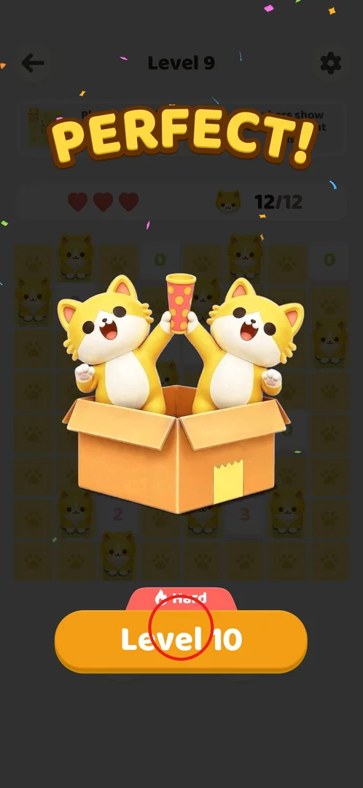
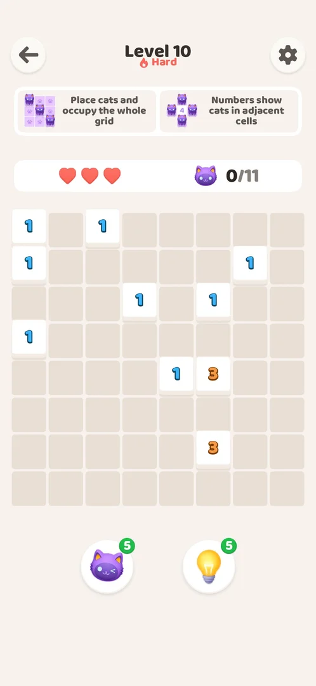
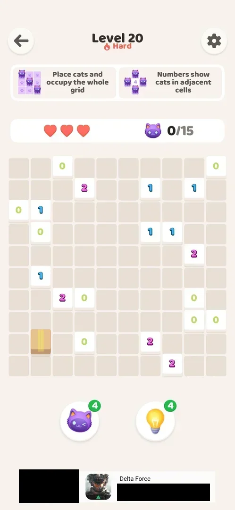
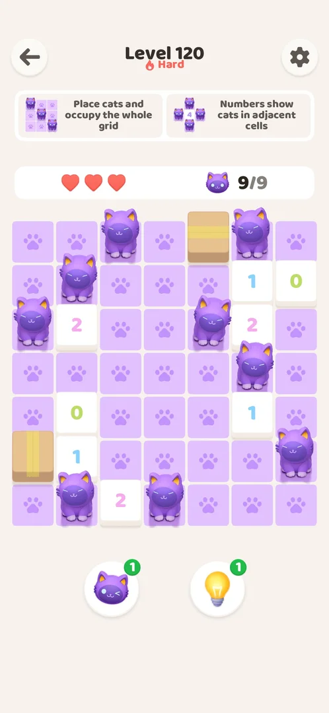
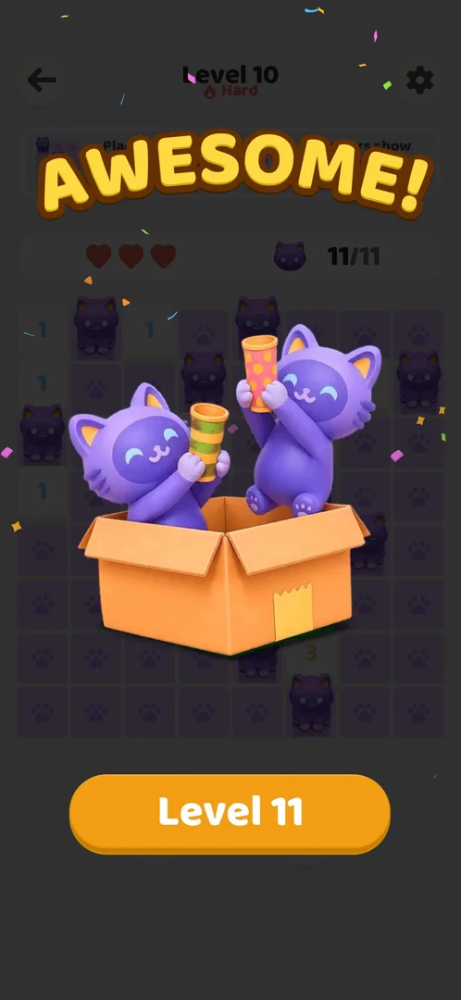

# Hard levels

Every 10th level of the main level sequence is a Hard level: 10, 20, 30, 40 and 50 were all marked
Hard [^s1] [^s4] [^s5], and so were 110 and 120 [^s6] [^s7]. A Hard level is an ordinary puzzle with a red "Hard" label. It has the same rules,
the same 3 hearts and the same boosters as other levels, and no extra reward was seen for winning one [^s2].

## Where to find it

There is no menu or button of its own. When the player wins the level before a Hard one, the win
screen's next-level button (circled) has a red flame tag that reads "Hard" above it. Tapping that button
starts the Hard level [^s1].

 [^s1]

## What it looks like

<!-- no-screen: a Hard level uses the normal level screen; only the label under the title differs -->

The normal level screen. Under the title "Level 10" there is a red flame and the word "Hard". The rest
of the screen is the same as on any level: the two rule cards ("Place cats and occupy the whole grid",
"Numbers show cats in adjacent cells"), 3 hearts, a cat counter (0/11 here), and the cat and hint
boosters [^s2]. Level 10's grid is 8x8, the same size as level 9's (seen in the frames) [^s1] [^s2].

 [^s2]

## What you can do

A Hard level has no buttons of its own: the player solves it like any other level.

| Tab or button | What it does |
|---|---|
| [10x10 board](#10x10-board) | Later Hard levels (20 to 50) are played on a 10x10 grid |
| [Level 120](#level-120) | A late Hard level on a small 7x7 grid |
| [Result](#result) | The win screen after a Hard level: only the next-level button |

### 10x10 board

Level 20, a Hard level: 10x10 grid, 15 cats to place, one cell holding a box. It still has 3 hearts and
the same two boosters [^s3]. Hard levels 20, 30, 40 and 50 were all 10x10 [^s4] [^s5].

 [^s3]

### Level 120

Level 120, Hard, just solved: a 7x7 grid with two boxes and 9 cats, smaller than the normal levels
around it (level 119 was 9x9 with 14 cats, level 114 was 12x12 with 25) [^s7] [^s8] [^s9]. Level 110,
also Hard, was 8x8 with 13 cats [^s6]. So late Hard levels are not 10x10 and not the largest boards.

 [^s7]

### Result

Winning level 10 shows the usual win screen ("AWESOME!", 11/11 cats) with only a "Level 11" button.
No coins, chest or extra reward appeared [^s2].

 [^s2]

## How it works

Version 1.0.2.

- Every 10th level is Hard: 10, 20, 30, 40, 50, 110 and 120 were checked [^s1] [^s4] [^s5] [^s6] [^s7].
- The level before it announces it with a red "Hard" tag on the next-level button [^s1]. The level itself
  has a red "Hard" label under its title [^s2].
- The rules and the 3 hearts are the same as on other levels, and no extra reward was seen [^s2].
- Level 10: 8x8 grid, 11 cats [^s2]. Levels 20 to 50: 10x10 grids [^s4] [^s5]; level 20 had 15 cats [^s3].
  Level 110: 8x8, 13 cats [^s6]; level 120: 7x7, 9 cats [^s7].

## Cases

| Case | What was done | Result | Source |
|---|---|---|---|
| Label | Won level 9 | The Level 10 button has a red "Hard" tag | [^s1] |
| Difference | Played level 10 | 8x8 grid, 11 cats, a "Hard" label under the title; same rules and 3 hearts; no extra reward | [^s2] |
| Every 10th | Played to level 50 | Hard on 10, 20, 30, 40 and 50; 10x10 grids on 20 to 50 | [^s4] [^s5] |
| Late Hard levels | Played levels 108–120 | Hard on 110 (8x8, 13 cats) and 120 (7x7, 9 cats), smaller than the normal levels around them | [^s6] [^s7] |

## Not verified

- Whether a Hard level gives anything besides the label (no reward was seen on level 10).
- Whether a Hard level is harder than the levels around it, or only labelled differently: by size it is
  not (levels 110 and 120 were smaller than their neighbours); how hard the logic is was not measured.
- Whether losing a Hard level works differently from losing a normal level.

[^s1]: session 20261001-003641-chrono-2FYKPJ, step 21 — [video at 9:17](https://youtu.be/mebcb05OPmo?t=557)
[^s2]: session 20261001-003641-chrono-2FYKPJ, step 22 — [video at 9:27](https://youtu.be/mebcb05OPmo?t=567)
[^s3]: session 20261001-024647-chrono-2FYKPJ, step 8
[^s4]: session 20261001-024647-chrono-2FYKPJ, step 80
[^s5]: session 20261001-035425-chrono-2FYKPJ, step 31
[^s6]: session 20261001-221517-chrono-2FYKPJ, step 9 — [video at 2:38](https://youtu.be/LMacAS64JRE?t=158)
[^s7]: session 20261001-221517-chrono-2FYKPJ, step 41 — [video at 15:01](https://youtu.be/LMacAS64JRE?t=901)
[^s8]: session 20261001-221517-chrono-2FYKPJ, step 39 — [video at 14:32](https://youtu.be/LMacAS64JRE?t=872)
[^s9]: session 20261001-221517-chrono-2FYKPJ, step 22 — [video at 6:43](https://youtu.be/LMacAS64JRE?t=403)
