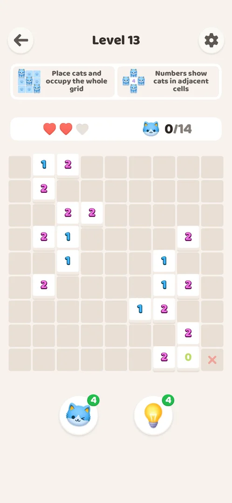
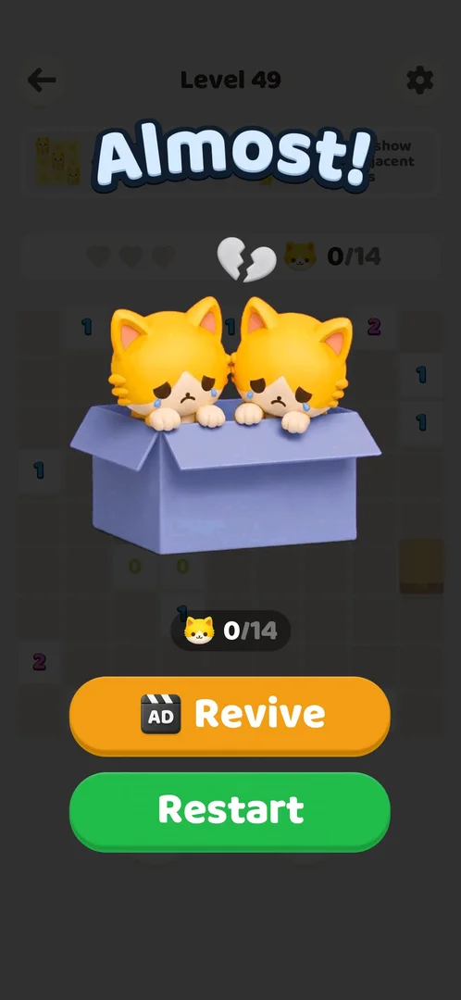

# Hearts (mistakes per level)

Three hearts per level, reset to 3 on every level [s:20261001-003641-chrono-2FYKPJ#30]. The game checks each cat against its
own solution [s:20261001-003641-chrono-2FYKPJ#29].

## Cases
| Case | What was done | Result | Source |
|---|---|---|---|
| Wrong cat | Double tap next to a 0 wall | No cat, −1 heart, red X on the cell | [s:20261001-003641-chrono-2FYKPJ#29] |
| One chance | Second wrong cat | Bubble "Meow! Only one chance left!" | [s:20261001-035425-chrono-2FYKPJ#21] |
| Zero hearts | Third wrong cat | "Almost!" popup: Revive (AD), Restart | [s:20261001-035425-chrono-2FYKPJ#23] |
| Revive | Revive (rewarded video, Next after about 5 s, the end card opens the Play Store, then `launch`) | Same board, 1 of 3 hearts, X marks kept | [s:20261001-035425-chrono-2FYKPJ#24] [s:20261001-035425-chrono-2FYKPJ#26] |

## Not verified
- Restart on the "Almost!" popup.
- The "ad not ready" toast (named in a Help article).
