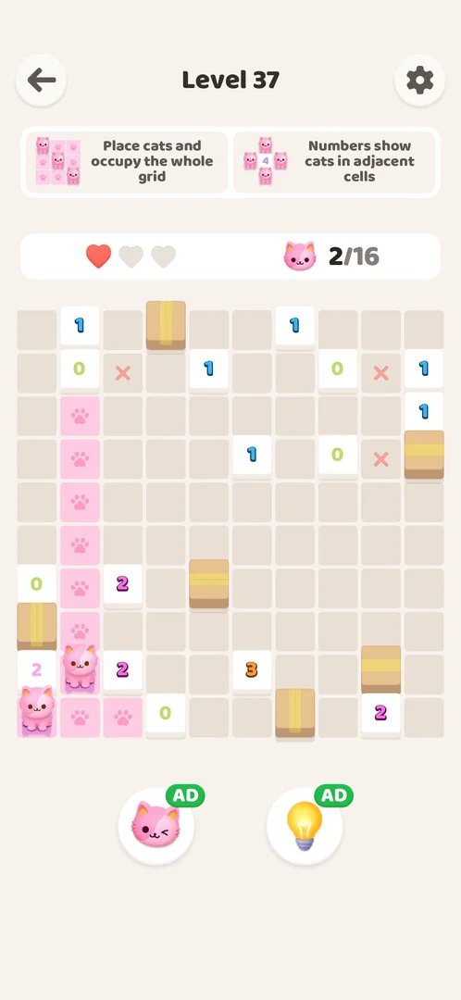
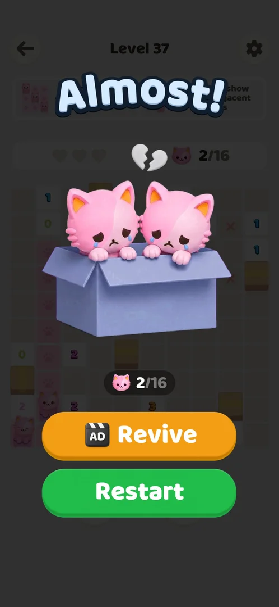

# Hearts (3 per level)

Three red hearts on the bar above the grid of every level, left of the cat counter. Each wrong cat costs one heart; when the third is lost the level ends on the "Almost!" screen, where Revive (a video ad, gives back one heart and keeps the board) or Restart (free, an empty board with three hearts) are offered. Every level and every restart begins with three hearts again [^s3] [^s5] [^s2] [^s9].

## Why it appeared

Level 1 HUD shows 3 hearts [^s1]. They are on the level screen from Level 1 on; the tutorial does not mention them [^s3].

## Where to find it

On the [Akari level](core-level.md) screen, in the white bar under the two rule cards, left of the cat counter. The hearts are not a separate screen and no control opens them [^s4].

<!-- no-entry: part of the level screen HUD; no control or screen leads to them -->

## What it looks like

Three red hearts on the left of a white bar; the cat counter ("0/6") is on the right of the same bar. Under the grid are the two boosters, the cat (count 1) and the bulb (count 4) [^s2].

 [^s2]
*The hearts bar on Level 4: three hearts, then the cat counter*

A lost heart turns grey; the cat counter does not change for a wrong cat (see the [Akari level](core-level.md) page for the frame with all three hearts grey) [^s5].

## What you can do

The hearts themselves take no taps. When the last one is lost, the "Almost!" screen offers two buttons:

| Tab or button | What it does |
|---|---|
| [Revive](#revive) | Plays a video ad, then returns to the same board with one heart |
| [Restart](#restart) | Free; the same level from an empty board with three hearts (an interstitial ad may come first) |

### Revive

The orange button with an AD icon on "Almost!". On Level 37 it played a video ad for another game (about 65 s), which ended by itself in the Play Store; opening the game again showed the level with one red heart and two grey, the two cats placed before and the three red X still on the board, and the counter at 2/16 as before [^s10] [^s9].

 [^s9]
*After Revive: one heart of three back, the board as it was*

Losing that heart brought "Almost!" up again with Revive and Restart both offered a second time [^s11].

 [^s11]
*The second "Almost!" on the same level: Revive is offered again*

### Restart

<!-- no-frame: the button is on the Almost! frames above; the frame after it is another app's ad -->

The green button under Revive. On Level 37 (after one Revive) it played an interstitial ad first (see [Interstitial ads](interstitial-ad.md)), then opened the level with an empty board, three hearts and the counter at 0/16 [^s12] [^s13].

## How it works

- Three hearts at the start of every level seen (Levels 1, 2 and 4) and after Restart (version 1.0.2) [^s3] [^s5] [^s2].
- Each wrong cat (a double tap on a cell that is not in the solution) costs one heart and leaves a red X on the cell; correct cats cost nothing [^s5].
- Losing the third heart ends the level on "Almost!": a broken heart over the hearts bar, the cat counter as it stood, an orange Revive button with an AD icon and a green Restart button [^s5].
- Restart is free and reopens the same board with three hearts [^s5].
- Revive: the game's Help Center says that after a failed level, Revive plays a reward video ad, restores a life and continues the level with its progress kept; if the ad is not ready, a toast message is shown [^s8]. Tapped on Level 37: one heart of three came back and the board was kept, cats and red X included (version 1.0.2) [^s9].
- A second Revive was offered on the same level after the revived heart was lost; a third was not tried [^s11].
- Restart from "Almost!" is free but was preceded by an interstitial ad; it gives an empty board and three hearts [^s12] [^s13].
- Hearts left do not set the win screen's title: Level 36 won with two hearts and Level 35 with three both showed "INCREDIBLE!", Level 38 with three showed "PERFECT!" [^s14] [^s15] [^s16].
- Levels 1 and 2 were won without a wrong move; all three hearts were still drawn on the win screens [^s7].

 [^s5]
*Clip 4 s · Level 4: the third heart is lost and "Almost!" appears*

## Outcomes

| Outcome of the base level | Under hearts | Source |
|---|---|---|
| Win | The same as the base level; the hearts left stay on the dimmed bar behind the win screen, and the title does not follow them (two hearts and three both gave "INCREDIBLE!") | [^s7] [^s15] |
| Loss (out of hearts) | The hearts are the loss: the third wrong cat ends the level on "Almost!" with Revive (ad: one heart back, board kept, offered again on the next loss) and Restart (free, 3 hearts again) | [^s5] [^s9] [^s11] |

## Cases

| Case | What was done | Result | Source |
|---|---|---|---|
| Shown from level 1 on the HUD (3 hearts), not mentioned by the tutorial <!-- case:chk-first-level --> | Played the tutorial and Level 1 | Hearts first on Level 1 | ✅ [^s3] |
| Hearts bar above the grid: 3 red hearts, left of the cat counter <!-- case:chk-screen --> | Opened Levels 1, 2 and 4 | Three hearts each time | ✅ [^s3] |
| Not a screen: the hearts bar on the level HUD, left of the cat counter; no button opens it <!-- case:chk-entry --> | Looked for a control that opens the hearts | None; they are part of the level HUD | ✅ [^s4] |
| Each wrong cat costs one heart and leaves a red X; correct cats cost nothing; 3 hearts per level, refilled on Restart and on a new level <!-- case:chk-rules --> | Deliberate wrong double taps on Level 4, then Restart | One heart per wrong cat; 3 hearts after Restart | ✅ [^s5] |
| Losing the 3rd heart ends the level with Almost! (broken heart, Revive with an ad, Restart) <!-- case:chk-loss --> | Three wrong cats on Level 4 | "Almost!" with Revive and Restart | ✅ [^s5] |
| Why it appeared: the trigger that brought it up <!-- case:chk-appeared --> | Opened Level 1 | Hearts on the HUD | ✅ [^s1] |
| Revive <!-- case:revive --> | Lost all three hearts on Level 37, tapped Revive, then lost the revived heart | A video ad of about 65 s that ended in the Play Store; back in the game one heart of three, the 2 cats and 3 red X kept, counter 2/16; "Almost!" again offered Revive a second time | ✅ [^s9] [^s11] [^s13] |
| How it interacts with the other pieces: Revive restores a life (Help Center article); bar beside the cat counter, above the boosters; Level 4 starts at 3/3 again <!-- case:chk-interactions --> | Read the Help Center's Revive article; opened Level 4; lost all hearts on Level 37 and tapped Revive, lost the last heart again, then Restart | As described; Revive gave one heart and kept the board, was offered a second time; Restart came after an interstitial | ✅ [^s2] [^s8] [^s9] [^s11] |

## Not verified

- How many times Revive is offered on one level (two were seen).
- Whether the boosters (cat, bulb) can place a wrong cat or cost a heart.

[^s1]: session 20261003-200925-chrono-2FYKPJ, step 13 — [video at 1:39](https://youtu.be/JOMuD_cF8gM?t=99)
[^s2]: session 20261005-002947-chrono-2FYKPJ, step 10 — [video at 1:22](https://youtu.be/5odRuC4Mzak?t=82)
[^s3]: session 20261003-200925-chrono-2FYKPJ, step 9 — [video at 0:36](https://youtu.be/JOMuD_cF8gM?t=36)
[^s4]: session 20261003-232850-chrono-2FYKPJ, step 11 — [video at 3:06](https://youtu.be/94hgW4CXmbg?t=186)
[^s5]: session 20261003-232850-chrono-2FYKPJ, step 18 — [video at 3:47](https://youtu.be/94hgW4CXmbg?t=227)
[^s7]: session 20261003-200925-chrono-2FYKPJ, step 10 — [video at 0:57](https://youtu.be/JOMuD_cF8gM?t=57)

[^s8]: session 20261005-002947-chrono-2FYKPJ, step 3 — [video at 0:34](https://youtu.be/5odRuC4Mzak?t=34)

[^s9]: session 20261006-044907-chrono-2FYKPJ, step 14 — [video at 6:11](https://youtu.be/KJek5sX1toU?t=371)
[^s10]: session 20261006-044907-chrono-2FYKPJ, step 13 — [video at 4:44](https://youtu.be/KJek5sX1toU?t=284)
[^s11]: session 20261006-044907-chrono-2FYKPJ, step 16 — [video at 6:36](https://youtu.be/KJek5sX1toU?t=396)
[^s12]: session 20261006-044907-chrono-2FYKPJ, step 17 — [video at 6:56](https://youtu.be/KJek5sX1toU?t=416)
[^s13]: session 20261006-044907-chrono-2FYKPJ, step 18 — [video at 7:55](https://youtu.be/KJek5sX1toU?t=475)
[^s14]: session 20261006-044907-chrono-2FYKPJ, step 3 — [video at 0:56](https://youtu.be/KJek5sX1toU?t=56)
[^s15]: session 20261006-044907-chrono-2FYKPJ, step 7 — [video at 2:45](https://youtu.be/KJek5sX1toU?t=165)
[^s16]: session 20261006-044907-chrono-2FYKPJ, step 25 — [video at 11:46](https://youtu.be/KJek5sX1toU?t=706)
