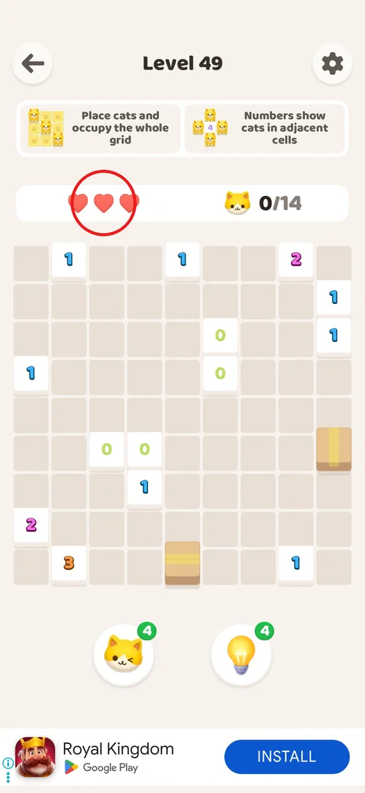
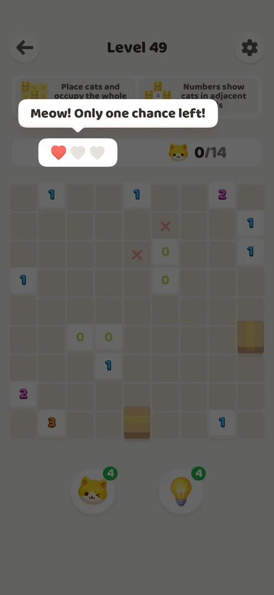
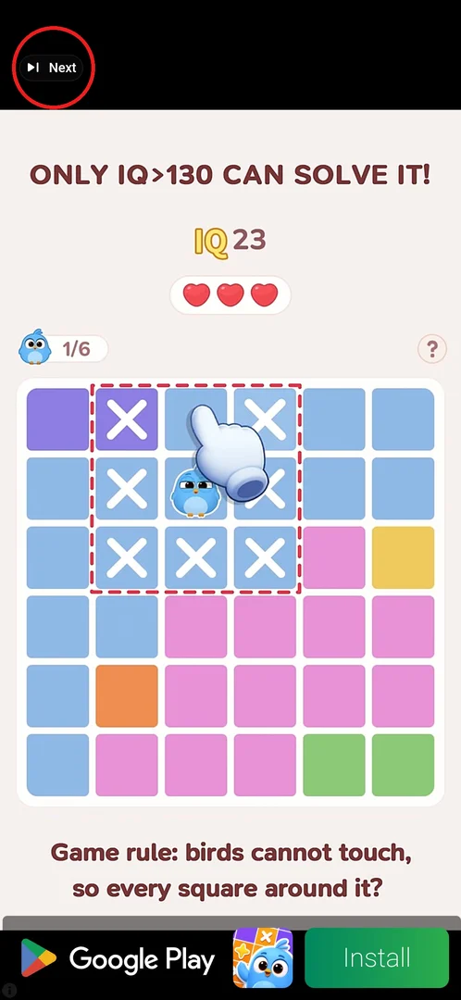
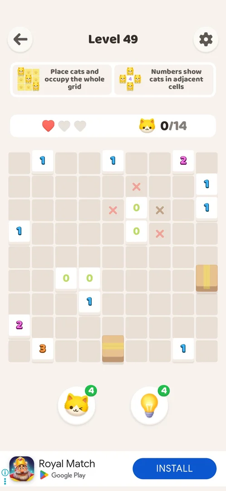

# Hearts (mistakes per level)

Hearts are the number of mistakes you may make on a level. Every level starts with three [^s7]; each cat
placed in a wrong cell is rejected and costs one heart, because the game checks every cat against its own
solution [^s2]. When the last heart is gone the level is failed, and you can either watch an ad to get one
heart back and keep the board, or restart [^s4] [^s6].

<!-- no-screen: hearts have no screen of their own; they are an indicator on every level screen, so "Where to find it" circles the indicator and "What it looks like" shows a level after a lost heart. -->

## Where to find it

On any level screen, in the white bar between the rule cards and the board: three hearts on the left
(circled), the cat counter (here 0/14) on the right [^s1].

 [^s1]

## What it looks like

A wrong cat does not appear at all: the double-tapped cell gets a red X, and the rightmost red heart turns
grey (3 → 2) [^s2]. A single tap on a cell leaves a grey X mark instead, which is the player's own note and
costs nothing [^s6].

 [^s2]

## What you can do

| Tab or button | What it does |
|---|---|
| [One chance left](#one-chance-left) | Warning after the 2nd wrong cat: one heart left [^s3] |
| [Almost!](#almost) | The fail popup at 0 hearts, with Revive and Restart [^s4] |
| [Restart](#restart) | Green button on the fail popup; what it does was not tested |
| [Revive](#revive) | Orange button with an AD icon: a rewarded video, then the same board with 1 heart [^s5] [^s6] |

### One chance left

After the second wrong cat the screen dims and a speech bubble from the hearts says "Meow! Only one
chance left!" [^s3].

 [^s3]

### Almost!

The third wrong cat opens the "Almost!" popup over the dimmed level: a broken heart, two crying cats in a
box, the cat counter of the level (0/14), an orange **Revive** button with an AD icon and a green
**Restart** button [^s4].

 [^s4]

### Restart

The green Restart button under Revive (circled). It was never tapped: whether it restarts the level with
3 hearts and whether an ad comes first is not known.

 [^s4]

### Revive

Revive plays a full-screen rewarded video ad for another game, with no way to skip at the start [^s5]. After
about 5 s a **Next** button appears top left (circled); after it an end card opened the Play Store, and the
player reopened the game [^s5] [^s6].

 [^s5]

### Result

Back in the game the level continues on the same board with 1 of 3 hearts; the red X marks of the wrong
cats stay [^s6].

 [^s6]

## How it works

Version 1.0.2.

- 3 hearts per level, reset to 3 on every new level [^s7].
- A cat in a wrong cell: no cat, −1 heart, a red X on the cell; each cat is checked against the level's
  solution at once [^s2].
- At 1 heart: the "Only one chance left!" warning [^s3]. At 0: the "Almost!" popup [^s4].
- Revive: one rewarded video = 1 heart, board and marks kept [^s6].

## Cases

| Case | What was done | Result | Source |
|---|---|---|---|
| Wrong cat | Double tap next to a 0 wall (level 13) | No cat, −1 heart, red X on the cell | [^s2] |
| One chance | Second wrong cat (level 49) | Bubble "Meow! Only one chance left!" | [^s3] |
| Zero hearts | Third wrong cat (level 49) | "Almost!" popup: Revive (AD), Restart | [^s4] |
| Revive | Revive (rewarded video, Next after about 5 s, the end card opens the Play Store, then reopening the game) | Same board, 1 of 3 hearts, X marks kept | [^s5] [^s6] |

## Not verified

- Restart on the "Almost!" popup: is there an ad first, are hearts reset to 3, is the board cleared.
- The "ad not ready" toast (named in a Help article).
- Whether Revive can be used again after losing the revived heart.

[^s1]: session 20261001-035425-chrono-2FYKPJ, step 20
[^s2]: session 20261001-003641-chrono-2FYKPJ, step 29 — [video at 12:24](https://youtu.be/mebcb05OPmo?t=744)
[^s3]: session 20261001-035425-chrono-2FYKPJ, step 21
[^s4]: session 20261001-035425-chrono-2FYKPJ, step 23
[^s5]: session 20261001-035425-chrono-2FYKPJ, step 24
[^s6]: session 20261001-035425-chrono-2FYKPJ, step 26
[^s7]: session 20261001-003641-chrono-2FYKPJ, step 30 — [video at 13:25](https://youtu.be/mebcb05OPmo?t=805)
