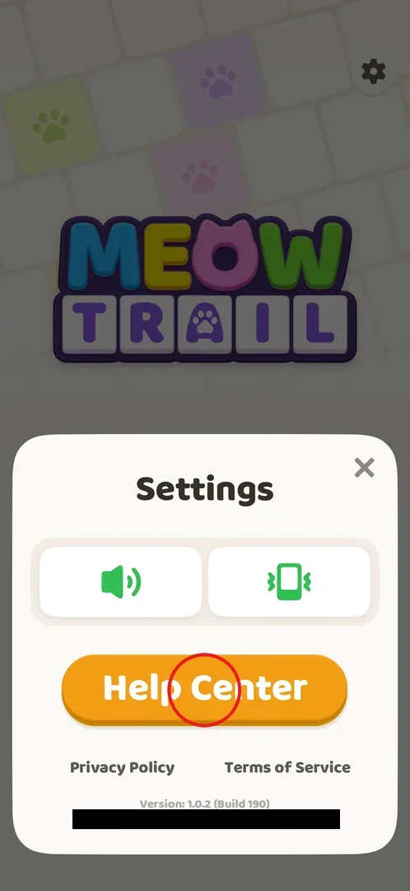
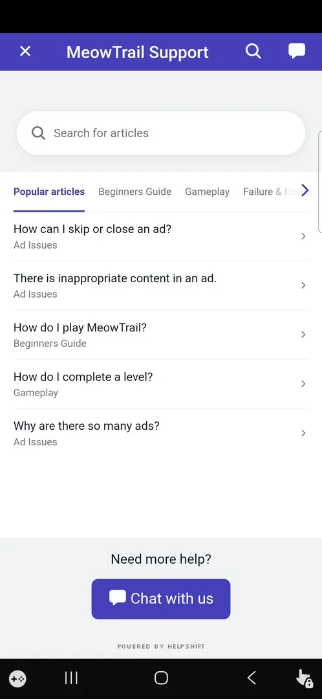
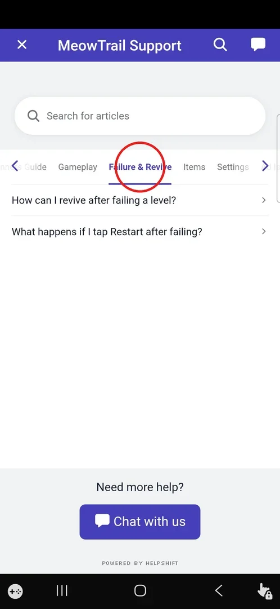
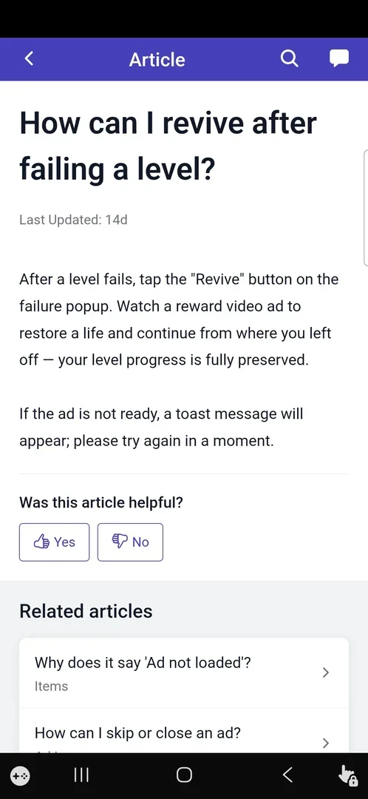
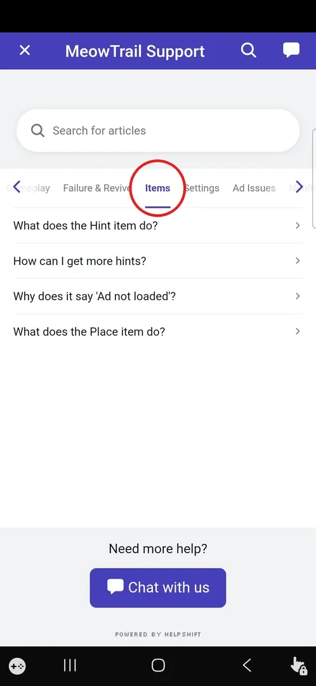
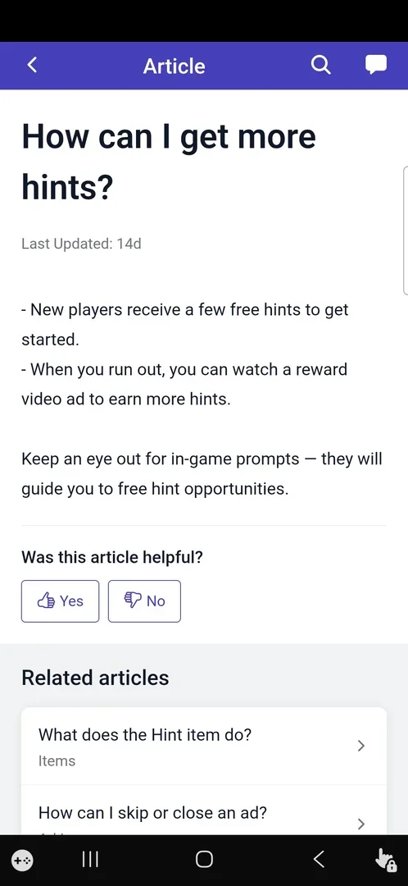
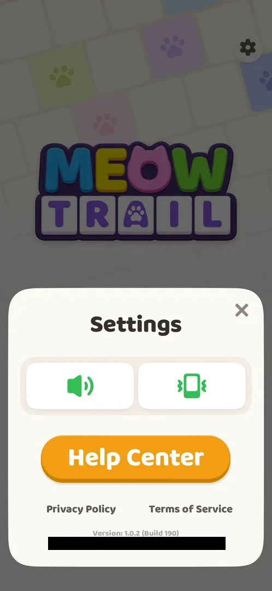

# Help Center (Helpshift)

The Help Center is the game's built-in support section, "MeowTrail Support". It is a Helpshift view that
opens inside the app. The player can search or browse short FAQ articles sorted into category tabs, such as
how revive works or how to get more hints, and can open a chat with support [^s2] [^s4] [^s6]. It has no
rewards and no prices.

## Where to find it

On Home, tap the gear at the top right to open the Settings popup. In that popup, tap the orange
**Help Center** button (circled), which sits under the sound and vibration toggles [^s1] [^s2].

 [^s1]

## What it looks like

The screen has a purple header with three icons: X (close) on the left, the title "MeowTrail Support" in
the middle, and a search icon and a chat icon on the right. Below the header is a "Search for articles"
field. Under it is a strip of category tabs that scrolls sideways with < and > arrows: Popular articles,
Beginners Guide, Gameplay, Failure & Revive, Items, Settings, Ad Issues and Notifications. The list of
articles for the selected tab follows. At the bottom are "Need more help?" with a **Chat with us** button
and the line "Powered by Helpshift" [^s2] [^s3] [^s5].

The Popular articles tab opens first. It shows five titles, each with its category: "How can I skip or
close an ad?" (Ad Issues), "There is inappropriate content in an ad." (Ad Issues), "How do I play
MeowTrail?" (Beginners Guide), "How do I complete a level?" (Gameplay) and "Why are there so many ads?"
(Ad Issues) [^s2].

 [^s2]

## What you can do

| Tab or button | What it does |
|---|---|
| [Failure & Revive](#failure--revive) | Category tab with 2 articles about failing a level [^s3] |
| [Items](#items) | Category tab with 4 articles about the Hint and Place items and ads [^s5] |
| [Article](#article) | Tapping a title opens the article: its text, "Was this article helpful?" and related articles [^s4] |
| [How can I get more hints?](#how-can-i-get-more-hints) | The article "How can I get more hints?" [^s6] |
| [Result](#result) | X in the header closes the Help Center and returns to Settings [^s7] |

Other tabs (Beginners Guide, Gameplay, Settings, Ad Issues, Notifications), the search field and icon, and
**Chat with us** were seen but not opened [^s2] [^s5].

### Failure & Revive

The Failure & Revive tab (circled) has two articles: "How can I revive after failing a level?" and "What
happens if I tap Restart after failing?" [^s3]. Only the first one was opened (see [Article](#article)).

 [^s3]

### Article

An article replaces the list. The header now says "Article" and has a back arrow < in place of the X.
Below the title are "Last Updated: 14d", the text, the question "Was this article helpful?" with **Yes**
and **No** buttons, and a "Related articles" list [^s4]. The tab strip is hidden while an article is open,
so a tap where the tabs used to be does nothing [^s4].

The revive article says: "After a level fails, tap the "Revive" button on the failure popup. Watch a
reward video ad to restore a life and continue from where you left off — your level progress is fully
preserved. If the ad is not ready, a toast message will appear; please try again in a moment." [^s4]
See [Hearts](hearts.md) for the fail popup in play.

 [^s4]

### Items

The Items tab (circled) has four articles: "What does the Hint item do?", "How can I get more hints?", "Why
does it say 'Ad not loaded'?" and "What does the Place item do?" [^s5]. Only "How can I get more hints?"
was opened (see [How can I get more hints?](#how-can-i-get-more-hints)).

 [^s5]

### How can I get more hints?

The article "How can I get more hints?" says: "New players receive a few free hints to get started. When
you run out, you can watch a reward video ad to earn more hints. Keep an eye out for in-game prompts —
they will guide you to free hint opportunities." [^s6] See [Hint booster](booster-hint.md).

 [^s6]

### Result

The back arrow < in an article returns to the article list. The X on the list screen closes the Help
Center, and the game shows the Settings popup again [^s7].

 [^s7]

## How it works

- Version 1.0.2 (Build 190): the Help Center is an in-app Helpshift FAQ, with no rewards, timers or prices
  [^s1] [^s2].
- The articles describe the ad-based economy: one rewarded video gives back a life after a fail, and
  another gives more hints once the free ones run out [^s4] [^s6].
- Back moves one level up, from an article to the list. X on the list leaves the Help Center [^s7].

> ⚠️ Previously (v1.0.2, 2026-10-01): "Why does it say 'Ad not loaded'?" was listed among the Ad Issues
> titles. The frames show it under Items (in the Items tab and in the related articles) [^s4] [^s5].

## Cases

| Case | What was done | Result | Source |
|---|---|---|---|
| Open the Help Center | Home → gear → Settings → Help Center | MeowTrail Support opens on Popular articles | [^s2] |
| Read the revive article | Failure & Revive → "How can I revive after failing a level?" | Revive on the fail popup → reward video → one life back, progress kept; a toast if no ad is ready | [^s4] |
| Read the hints article | Items → "How can I get more hints?" | A few free hints at the start, then a reward video for more | [^s6] |
| Leave | Back from the article, then X | Back on the Settings popup | [^s7] |

## Not verified

- The articles in Beginners Guide, Gameplay, Settings, Ad Issues and Notifications. Whether an Ad Issues
  article offers to remove ads for money.
- "What happens if I tap Restart after failing?", "What does the Hint item do?", "Why does it say 'Ad not
  loaded'?" and "What does the Place item do?".
- The search field and the search and chat icons. **Chat with us** was not opened, and no messages should
  be sent.
- What the Yes/No helpfulness buttons do.

[^s1]: session 20261001-035425-chrono-2FYKPJ, step 4
[^s2]: session 20261001-035425-chrono-2FYKPJ, step 5
[^s3]: session 20261001-035425-chrono-2FYKPJ, step 6
[^s4]: session 20261001-035425-chrono-2FYKPJ, step 7
[^s5]: session 20261001-035425-chrono-2FYKPJ, step 10
[^s6]: session 20261001-035425-chrono-2FYKPJ, step 11
[^s7]: session 20261001-035425-chrono-2FYKPJ, step 13
