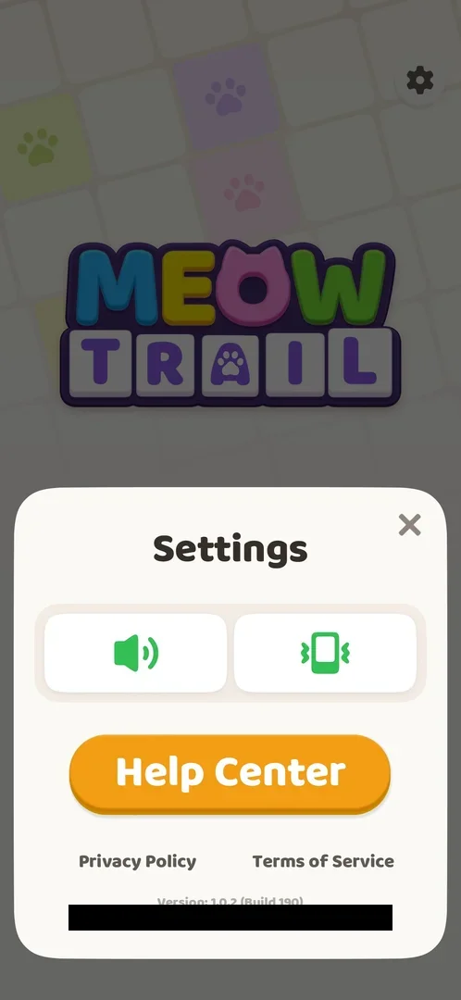
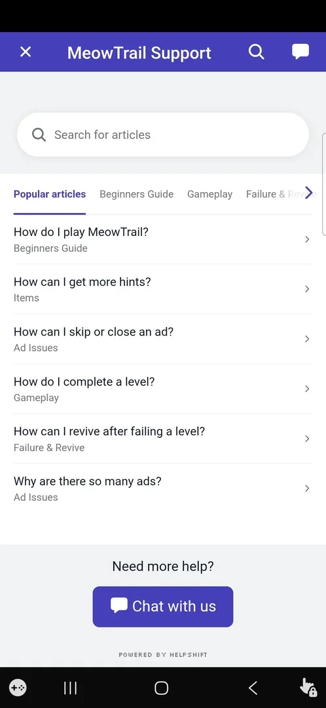
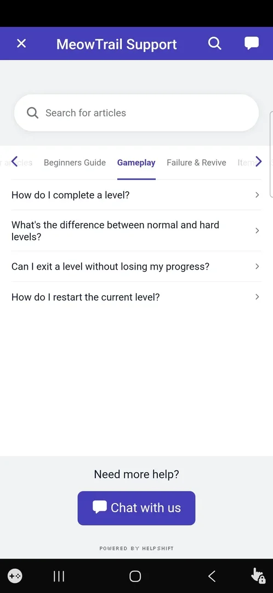
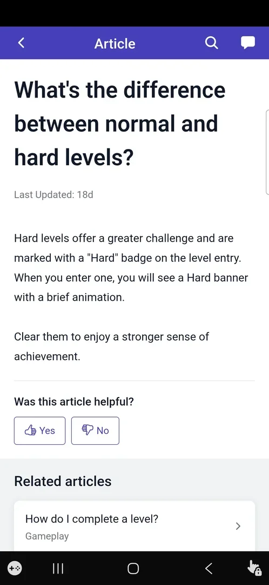

# Help Center

The game's support pages, opened from the orange Help Center button in [Settings](settings.md). It is a HelpShift page titled "MeowTrail Support" shown inside the game: a search field, a strip of article categories, lists of short help articles and a "Chat with us" button. The articles describe the game's rules and features, including some not yet met in play, such as Revive and [Hard levels](hard-level.md) [^s3] [^s7] [^s4].

## Why it appeared

It is a button in Settings, there from the first visit to Settings [^s1].

## Where to find it

[Home screen](home.md) or a level, the gear at the top right, then the orange Help Center button in the middle of the Settings sheet, under the sound and vibration buttons [^s2]. The support page took a few seconds to load after the tap [^s3].

 [^s2]
*The Help Center button in the Settings sheet*

## What it looks like

A white page with a purple header: an X on the left, the title "MeowTrail Support", a search icon and a chat icon on the right. Below: the "Search for articles" field; a horizontal strip of category tabs with arrows to scroll it; the list of articles of the chosen tab, each with its category under the title; at the bottom "Need more help?" with a purple "Chat with us" button and "Powered by Helpshift" [^s3].

 [^s3]
*The Help Center's first page: Popular articles*

## What you can do

| Tab or button | What it does |
|---|---|
| [Popular articles](#popular-articles) | The default tab: six articles from several categories |
| [Gameplay](#gameplay) | Four articles on levels |
| [Other categories](#other-categories) | Beginners Guide, Failure & Revive, Items, Ad Issues: further category tabs |
| [Article](#article) | An article page with its text, a helpfulness vote and related articles |
| [Search for articles](#search-for-articles) | A search field over the articles |
| [Chat with us](#chat-with-us) | A support chat |
| [X](#x) | Closes the Help Center |

### Popular articles

<!-- no-frame: the tab is on the Help Center frame above -->

Selected when the page opens. Six articles: how to play MeowTrail (Beginners Guide), how to get more hints (Items), how to skip or close an ad (Ad Issues), how to complete a level (Gameplay), how to revive after failing a level (Failure & Revive), why there are so many ads (Ad Issues) [^s3].

### Gameplay

Four articles: how to complete a level; the difference between normal and hard levels; whether a level can be exited without losing progress; how to restart the current level [^s5]. Only the hard-levels article was opened.

 [^s5]
*The Gameplay tab*

### Other categories

<!-- no-frame: these tabs were not opened; their names are on the tab strip in the frames above -->

Beginners Guide, Failure & Revive, Items and Ad Issues are further tabs on the strip (the last ones scroll into view) [^s3] [^s5]. They were not opened.

### Article

A page headed "Article" with a back arrow, search and chat icons. It shows the article title, "Last Updated: 18d", the text, "Was this article helpful?" with Yes and No buttons, and "Related articles" [^s4]. Two articles were read:

- **How can I revive after failing a level?** After a failed level, the Revive button on the failure popup plays a reward video ad, restores a life and continues the level with its progress kept; if the ad is not ready, a toast message appears ([Hearts](hearts.md)) [^s7].
- **What's the difference between normal and hard levels?** Hard levels are harder, carry a "Hard" badge on the level entry and show a Hard banner with a short animation when entered ([Hard levels](hard-level.md)) [^s4].

 [^s4]
*An article page: the difference between normal and hard levels*

The phone's back key on an article returned to the article list [^s8]. Yes and No were not tapped.

### Search for articles

<!-- no-frame: the search field is on the Help Center frame above; it was not used -->

The field at the top of the page and the search icon in the header. Not used.

### Chat with us

<!-- no-frame: the button is on the Help Center frame above; it was not tapped -->

The purple button at the bottom of the article lists and the chat icon in the header. Not tapped (the study does not open support chats).

### X

<!-- no-frame: the X is at the top left of the Help Center frame above -->

From the article page, two taps at the top left (the back arrow there) closed the support page; the [Settings](settings.md) sheet was on screen again, and its X led to Home [^s9] [^s10].

## How it works

- An in-game web page by HelpShift ("Powered by Helpshift"); the game stayed in the foreground, no browser opened (version 1.0.2) [^s3].
- Six category tabs: Popular articles, Beginners Guide, Gameplay, Failure & Revive, Items, Ad Issues [^s3] [^s5].
- Both articles read were marked "Last Updated: 18d" [^s7] [^s4].
- The Privacy Policy and Terms of Service are separate links in Settings, not in the Help Center ([Settings](settings.md)) [^s2].

## Cases

| Case | What was done | Result | Source |
|---|---|---|---|
| Settings: the orange Help Center button <!-- case:chk-entry --> | Opened Settings | The button is there | ✅ [^s1] |
| Why it appeared: the trigger that brought it up <!-- case:chk-appeared --> | Opened Settings | Seen in Settings | ✅ [^s1] |
| Its screen: HelpShift MeowTrail Support with search, category tabs, popular articles, Chat with us <!-- case:chk-screen --> | Tapped Help Center | The support page opened in the game | ✅ [^s6] |
| Every option or button: tabs Popular articles / Beginners Guide / Gameplay / Failure & Revive / Items / Ad Issues, search, article Yes / No, chat; no toggles <!-- case:chk-options --> | Opened Popular articles, Gameplay and two articles | As listed; chat not used | ✅ [^s6] |
| For a prompt: what each answer does <!-- case:chk-answers --> | Read two articles | No prompt; the article's Yes / No vote was not tapped and is not a game choice | ✅ [^s6] |
| Links out: where they lead <!-- case:chk-links --> | Opened the Help Center from Settings and closed it | An in-game page; closing it returned to the Settings sheet. Privacy and Terms are separate Settings links | ✅ [^s6] |

## Not verified

- The Beginners Guide, Failure & Revive, Items and Ad Issues tabs and the articles not opened (exit a level without losing progress, restart, hints, ads).
- Search and Chat with us.

[^s1]: session 20261003-200925-chrono-2FYKPJ, step 13 — [video at 1:39](https://youtu.be/JOMuD_cF8gM?t=99)
[^s2]: session 20261005-002947-chrono-2FYKPJ, step 1 — [video at 0:10](https://youtu.be/5odRuC4Mzak?t=10)
[^s3]: session 20261005-002947-chrono-2FYKPJ, step 2 — [video at 0:18](https://youtu.be/5odRuC4Mzak?t=18)
[^s4]: session 20261005-002947-chrono-2FYKPJ, step 6 — [video at 0:53](https://youtu.be/5odRuC4Mzak?t=53)
[^s5]: session 20261005-002947-chrono-2FYKPJ, step 5 — [video at 0:46](https://youtu.be/5odRuC4Mzak?t=46)
[^s6]: session 20261005-002947-chrono-2FYKPJ, step 10 — [video at 1:22](https://youtu.be/5odRuC4Mzak?t=82)

[^s7]: session 20261005-002947-chrono-2FYKPJ, step 3 — [video at 0:34](https://youtu.be/5odRuC4Mzak?t=34)
[^s8]: session 20261005-002947-chrono-2FYKPJ, step 4 — [video at 0:42](https://youtu.be/5odRuC4Mzak?t=42)
[^s9]: session 20261005-002947-chrono-2FYKPJ, step 8 — [video at 1:10](https://youtu.be/5odRuC4Mzak?t=70)
[^s10]: session 20261005-002947-chrono-2FYKPJ, step 9 — [video at 1:13](https://youtu.be/5odRuC4Mzak?t=73)
