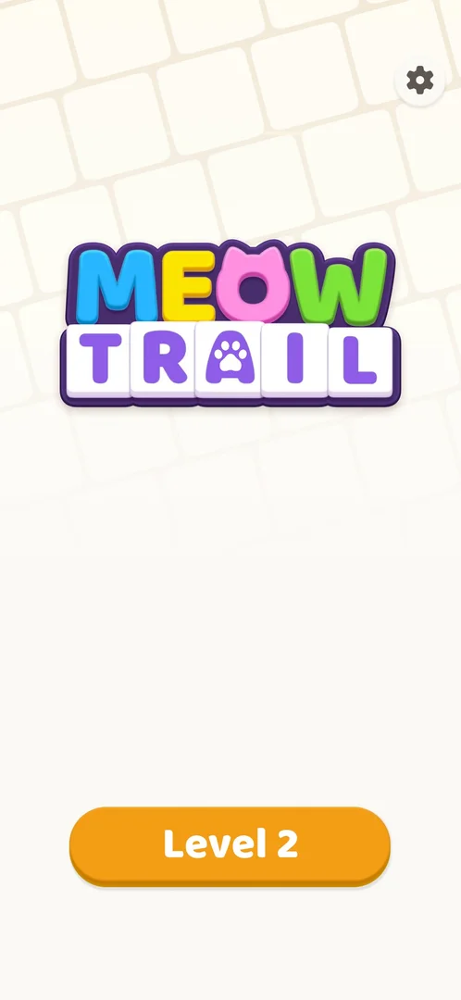

# Home screen

The game's main screen: the MeowTrail logo, one orange "Level N" button that opens the next level, and a settings gear. Through Level 2 it had nothing else: no level map, shop, daily reward or currency [^s1] [^s3].

## Why it appeared

The back arrow on a level screen led to it; the game has no map [^s1]. On the first launch it is not shown: the tutorial opens Level 1 directly [^s4].

## Where to find it

From a level: the back arrow at the top left of the level screen [^s1].

 [^s2]
*The back arrow at the top left of the level screen*

## What it looks like

A light background of tilted tiles, the MeowTrail logo in the upper half, the settings gear at the top right and the orange "Level 2" button at the bottom [^s3].

 [^s3]
*Home through Level 2: only the Level button and the gear*

## What you can do

| Tab or button | What it does |
|---|---|
| [Level N](#level-n) | Opens the next level |
| [Settings gear](#settings-gear) | Opens Settings |

### Level N

<!-- no-frame: the button is on the Home frame above -->

The orange button at the bottom, labelled with the next level ("Level 2"); it opened Level 2 ([Akari level](core-level.md)) [^s5].

### Settings gear

<!-- no-frame: the button is on the Home frame above -->

Top right; it opened the [Settings](settings.md) sheet [^s6].

## How it works

- Two controls only through Level 2: the Level N button and the gear (version 1.0.2) [^s1] [^s3].
- No badges, timers or counters on it [^s3].

## Cases

| Case | What was done | Result | Source |
|---|---|---|---|
| MeowTrail logo, 'Level N' button, settings gear; nothing else through level 2 <!-- case:chk-screen --> | Opened Home from Level 2 | Logo, Level 2 button, gear | ✅ [^s1] |
| Back arrow on the level screen; not shown at launch after the tutorial <!-- case:chk-entry --> | Tapped the back arrow on Level 2 | Home opened | ✅ [^s1] |
| Two entry points, both mapped: Level N button (core-level), gear (settings); later entries are the experiment exp-late-entries <!-- case:chk-entries --> | Tapped both | Level 2 and Settings opened | ✅ [^s1] |
| Why it appeared: the trigger that brought it up <!-- case:chk-appeared --> | Back arrow on a level | Home opened | ✅ [^s1] |
| Badges, timers and counters on it <!-- case:chk-badges --> | Looked at Home at Level 2 | None seen; whether any appear later is open |  |
| What changes on it with progress <!-- case:chk-changes --> | — | not verified: seen only at Level 2 |  |

## Not verified

- Badges, timers and counters: none at Level 2; later levels not seen <!-- case:chk-badges -->
- What changes with progress (new buttons such as a shop or a daily challenge) <!-- case:chk-changes -->

[^s1]: session 20261003-200925-chrono-2FYKPJ, step 12 — [video at 1:31](https://youtu.be/JOMuD_cF8gM?t=91)
[^s2]: session 20261003-200925-chrono-2FYKPJ, step 11 — [video at 1:20](https://youtu.be/JOMuD_cF8gM?t=80)
[^s3]: session 20261003-200925-chrono-2FYKPJ, step 14 — [video at 1:59](https://youtu.be/JOMuD_cF8gM?t=119)

[^s4]: session 20261003-200925-chrono-2FYKPJ, step 9 — [video at 0:36](https://youtu.be/JOMuD_cF8gM?t=36)
[^s5]: session 20261003-200925-chrono-2FYKPJ, step 15 — [video at 2:06](https://youtu.be/JOMuD_cF8gM?t=126)
[^s6]: session 20261003-200925-chrono-2FYKPJ, step 13 — [video at 1:42](https://youtu.be/JOMuD_cF8gM?t=102)
