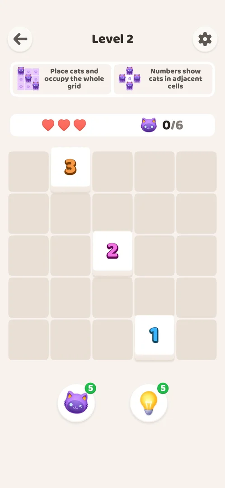
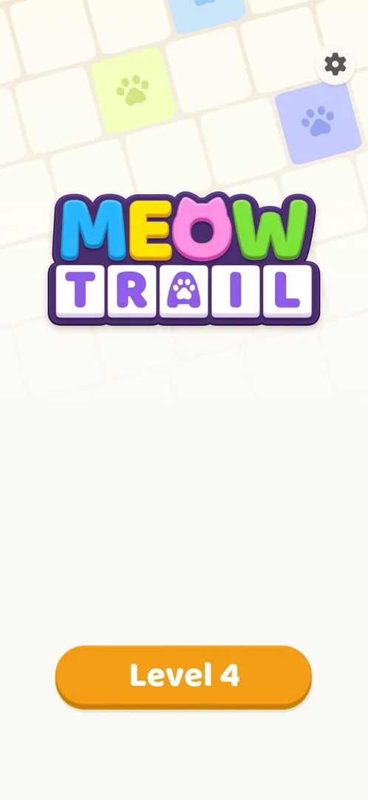

# Home screen

The game's main screen: the MeowTrail logo, one orange "Level N" button that opens the next level, and a settings gear. Through Level 4 it had nothing else: no level map, shop, daily reward, currency, badges or timers [^s1] [^s3] [^s4].

## Why it appeared

The back arrow on a level screen led to it; the game has no map [^s1]. On the first launch it is not shown: the tutorial opens Level 1 directly [^s5].

## Where to find it

From a level: the back arrow at the top left of the level screen [^s1]. After a relaunch of the game it is the first screen [^s6].

 [^s2]
*The back arrow at the top left of the level screen*

## What it looks like

A light background of tilted tiles, a few of them coloured with a paw print; the MeowTrail logo in the upper half; the settings gear at the top right; the orange "Level 4" button at the bottom [^s3]. Which tiles are coloured, and their colours, differed between visits [^s4]. Right after the session started, the logo was caught with the TRAIL letters only partly drawn, so the logo is animated (inferred from that frame) [^s6].

 [^s3]
*Home at Level 4: still only the Level button and the gear*

## What you can do

| Tab or button | What it does |
|---|---|
| [Level N](#level-n) | Opens the next level |
| [Settings gear](#settings-gear) | Opens Settings |

### Level N

<!-- no-frame: the button is on the Home frame above -->

The orange button at the bottom, labelled with the next level ("Level 2", later "Level 4"); it opens that level ([Akari level](core-level.md)) [^s7] [^s4].

### Settings gear

<!-- no-frame: the button is on the Home frame above -->

Top right; it opens the [Settings](settings.md) sheet over Home, with the [Help Center](help-center.md) button [^s8].

## How it works

- Two controls only through Level 4: the Level N button and the gear (version 1.0.2) [^s1] [^s4].
- With progress only the number on the Level button changes; no new buttons or map appeared through Level 4 [^s4].
- No badges, timers or counters on it [^s4].

## Cases

| Case | What was done | Result | Source |
|---|---|---|---|
| MeowTrail logo, 'Level N' button, settings gear; nothing else through level 2 <!-- case:chk-screen --> | Opened Home from Level 2 | Logo, Level 2 button, gear | ✅ [^s1] |
| Back arrow on the level screen; not shown at launch after the tutorial <!-- case:chk-entry --> | Tapped the back arrow on Level 2 | Home opened | ✅ [^s1] |
| Two entry points, both mapped: Level N button (core-level), gear (settings); later entries are the experiment exp-late-entries <!-- case:chk-entries --> | Tapped both | Level 2 and Settings opened | ✅ [^s1] |
| Why it appeared: the trigger that brought it up <!-- case:chk-appeared --> | Back arrow on a level | Home opened | ✅ [^s1] |
| Badges, timers and counters on it <!-- case:chk-badges --> | Looked at Home at Level 4 | None: only the logo, the gear and the Level N button; the coloured background tiles change between visits | ✅ [^s4] |
| What changes on it with progress <!-- case:chk-changes --> | Compared Home at Level 2 and Level 4 | Only the Level button number; no new buttons or map | ✅ [^s4] |

## Not verified

- Whether buttons, badges or timers appear on Home after Level 4 (the map's experiment exp-late-entries).

[^s1]: session 20261003-200925-chrono-2FYKPJ, step 12 — [video at 1:29](https://youtu.be/JOMuD_cF8gM?t=89)
[^s2]: session 20261003-200925-chrono-2FYKPJ, step 11 — [video at 1:18](https://youtu.be/JOMuD_cF8gM?t=78)
[^s3]: session 20261005-002947-chrono-2FYKPJ, step 9 — [video at 1:13](https://youtu.be/5odRuC4Mzak?t=73)
[^s4]: session 20261005-002947-chrono-2FYKPJ, step 10 — [video at 1:22](https://youtu.be/5odRuC4Mzak?t=82)

[^s5]: session 20261003-200925-chrono-2FYKPJ, step 9 — [video at 0:36](https://youtu.be/JOMuD_cF8gM?t=36)
[^s6]: session 20261005-002947-chrono-2FYKPJ, step 0 — [video at 0:00](https://youtu.be/5odRuC4Mzak?t=0)
[^s7]: session 20261003-200925-chrono-2FYKPJ, step 15 — [video at 2:04](https://youtu.be/JOMuD_cF8gM?t=124)
[^s8]: session 20261005-002947-chrono-2FYKPJ, step 1 — [video at 0:10](https://youtu.be/5odRuC4Mzak?t=10)
