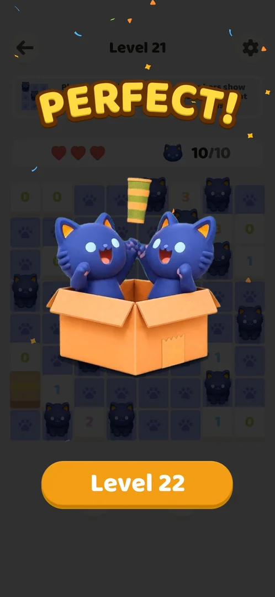
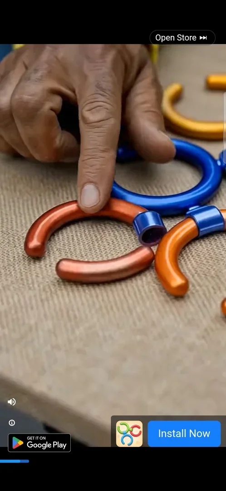

# Interstitial ads

A full-screen video ad for another app that plays by itself between the win screen and the next level. From Level 16 on it came on every second level start over most runs, counting starts from the win screen, from Home and the Restart button in a level's Settings, and kept that alternation across a force-stop, a quit to Home, a 3.5-minute gap and a booster's rewarded video, though one run had it on four starts in a row; it has no close cross, ends on its own in the Play Store, and gives nothing (version 1.0.2) [^s1] [^s5] [^s11].

## Why it appeared

First on tapping Level 16 on the win screen of Level 15; the level starts of Levels 4 to 15 had none. That first one was a Flyfox Game video ad with an Open Store button, after which Level 16 opened [^s1].

## Where to find it

No control opens it on purpose. It plays when a level starts, on every second start (from Level 16 on): after the orange Level N button on a win screen, the Level N button on Home, or Restart in the Settings sheet opened from a level ([Akari level](core-level.md)); it was also seen after Restart on the Almost! screen (see [Hearts](hearts.md)) [^s1] [^s5] [^s10] [^s11].

 [^s2]
*The win screen's Level 22 button: tapping it played an interstitial before Level 22*

## What it looks like

A full-screen video of another game (here a ring puzzle). An "Open Store" button sits at the top right; at the bottom are a sound icon, an "i", a Google Play badge, the app's icon with a blue Install Now button, and a thin blue progress bar along the very bottom [^s3].

 [^s3]
*The ad a few seconds in; Open Store at the top right, the progress bar at the bottom. The phone's navigation bar is blacked out*

Later ads were for other games too: a block puzzle ("Block Color Mania") before Levels 36 and 38, a spot-the-difference game after Restart on Level 37; these had a black band at the top and a Google Play / Install strip at the bottom [^s12] [^s13] [^s14].

The ad before Level 24 was the same advertiser with a different video ("IQ = ?" over coloured rings) and a full-width Google Play / Install strip at the bottom [^s5].

## What you can do

| Tab or button | What it does |
|---|---|
| [Open Store](#open-store) | Not tapped |
| [Install Now](#install-now) | Not tapped |

### Open Store

<!-- no-frame: the button is on the frame above -->

The button at the top right with a skip-like arrow. Not tapped; the ad reached the Play Store by itself anyway (see How it works) [^s5].

### Install Now

<!-- no-frame: the button is on the frame above -->

The blue button next to the advertised app's icon. Not tapped.

## How it works

- Starts from the win screen's Level N button, in session 20261005-141041 and the one before: Levels 16, 18, 20, 22 and 24 had an ad; Levels 17, 19, 21 and 23 had none. Every even level, over five pairs (version 1.0.2) [^s5].
- Level 21 started from Home's Level 21 button had no ad [^s5]; Level 21 is odd, so this does not show whether Home starts are exempt.
- A later session started Level 26 from Home, then Levels 27 to 30 from the win screens: Levels 27 and 29 (odd) had an ad, Levels 28 and 30 none [^s6] [^s7] [^s8] [^s9]. So the rule is not the level's parity.
- Restart in a level's Settings sheet counts as a start: on Level 30 (opened from Home without an ad) the Restart tap went straight to an interstitial, with no confirmation before it [^s10].
- After that Restart ad, the next starts went: Level 31 from the win screen, no ad; Level 32, ad; Level 33, none; Level 34, ad; Level 34 again from Home (after the back arrow), none; Level 35 from the win screen, ad [^s11]. The Home start took a place in the alternation: had only win-screen starts counted, Level 35 would have had no ad. Rule seen: an ad on every second level start of any route, never two in a row (version 1.0.2).
- The starts in that run were 1 to 2 minutes apart; a time cooldown was not separated from the start count [^s11].
- After a force-stop and relaunch (the previous session had ended on an ad before Level 35): Level 35 from Home, no ad; Level 36 from the win screen, ad [^s15] [^s16]. This fits a start count kept across the relaunch, and equally a count that starts again at launch (inference: the two are not told apart by this run).
- The same run then broke the alternation: Level 37 from the win screen, ad (about 110 s after the Level 36 start, no other ad between); Restart on the Almost! screen of Level 37, ad; Level 38 from the win screen, ad. Four level starts in a row had an ad (version 1.0.2) [^s17] [^s13] [^s14].
- Between those starts the player watched two rewarded videos: Revive on Level 37 and the cat booster's AD badge before Level 38 [^s18] [^s19]. Between Level 36 and Level 37 there was none, so rewarded videos do not explain the Level 37 ad.
- Later runs went back to the alternation. Level 39, no ad; Level 40, ad; the game force-stopped mid-level on Level 40 and Level 40 opened again, no ad; Level 41, ad [^s21].
- Level 42, no ad; Level 43, ad; then about 3.5 minutes on Home (the level quit), and Level 43 again, no ad; Level 44, ad [^s22]. A wait of 3.5 minutes did not bring an ad on the next start, so the ad does not follow the time since the last one in this run.
- Level 44, no ad; the cat booster's rewarded video (its AD badge) on Level 44; Level 45 from the win screen, ad (an Open Store video); Level 46, no ad [^s23]. The booster's rewarded video neither reset the count nor shifted it (version 1.0.2).
- Each of these ads also ended by itself in the Play Store; opening the game returned to the level [^s16] [^s20].
- No close cross appeared in about 20 to 28 s on either of the two ads watched (before Levels 22 and 24) [^s5].
- Both times the ad ended by itself in the Play Store, outside the game; opening the game again returned to the level that was about to start [^s5].
- One earlier ad (the Level 20 start) also ended in the Play Store and needed the game to be opened again [^s4].
- Not rewarded and no offer before it; the game's rewarded videos are the AD badge on the [Boosters](boosters.md) and Revive on the Almost! screen [^s1].

## Cases

| Case | What was done | Result | Source |
|---|---|---|---|
| Why it appeared <!-- case:chk-appeared --> | Played Levels 4 to 16 | First on tapping Level 16 after winning Level 15; none on level starts 4-15 | ✅ [^s1] |
| Where to find it <!-- case:chk-entry --> | — | No entry: it plays on its own when a level opens from the win screen's Level N button (16, 18, 20) and after Restart on the Almost! screen | ✅ [^s1] |
| What it looks like <!-- case:chk-screen --> | Watched the ad | Full-screen video ad, Open Store top right, Install Now and Google Play badges, progress bar at the bottom | ✅ [^s1] [^s3] |
| Kind of placement <!-- case:chk-kind --> | Watched the Level 20 start | Interstitial video before a level starts; this one ended in the Play Store and needed the game opened again | ✅ [^s4] |
| Reward <!-- case:chk-reward --> | — | Does not apply: not rewarded, no offer screen before it | ✅ [^s1] |
| How often <!-- case:chk-frequency --> | Started Levels 16 to 24 from the win screen; later Levels 27 to 30; then a Restart from Settings on Level 30, Levels 31 to 35 from the win screen and Level 34 once more from Home; then force-stopped the game and started Levels 35 to 38 and a Restart on Almost!; later Levels 39 to 41 with a force-stop and a reopen of Level 40; Levels 42 to 44 with 3.5 minutes on Home and a reopen of Level 43; Levels 44 to 46 with the cat booster's rewarded video on Level 44 | Ad before 16, 18, 20, 22, 24, 27, 29; none before 17, 19, 21, 23, 28, 30. After the Restart ad: 31 none, 32 ad, 33 none, 34 ad, 34 from Home none, 35 ad. Every second level start of any route (win screen, Home, in-level Restart); not the level's parity. After a force-stop: Level 35 from Home none, Level 36 ad, then Level 37 ad, Restart on Almost! ad, Level 38 ad: four in a row, so the every-second rule did not hold in that run. Later: 39 none, 40 ad, 40 reopened after a force-stop none, 41 ad; 42 none, 43 ad, 43 again after 3.5 min on Home none, 44 ad; 44 none, cat booster rewarded video, 45 ad, 46 none. A level-start count, not time: it survives a force-stop, a quit to Home, a 3.5-minute gap and a booster's rewarded video | ✅ [^s5] [^s6] [^s7] [^s10] [^s11] [^s16] [^s14] [^s21] [^s22] [^s23] |
| Close <!-- case:chk-close --> | Waited through the ads before Levels 22 and 24 | No close cross in about 20-28 s; the ad ends by itself in the Play Store; opening the game returns to the level | ✅ [^s5] |

## Not verified

- Open Store and Install Now were not tapped.
- The rule behind the four ads in a row after the relaunch (Levels 36, 37, the Restart on Level 37, 38). A time since the last ad does not fit the 3.5-minute gap with no ad after it, and a booster's rewarded video did not shift the count; a lost level, the Revive video or the Restart on Almost! were not tested apart (goal exp-interstitial-after-loss).
- Whether the start count survives a force-stop or starts again at launch with no ad: both force-stops seen came right after a start with an ad, so the first start after the relaunch had no ad under either reading (inference).

[^s1]: session 20261005-080420-chrono-2FYKPJ, step 41 — [video at 13:08](https://youtu.be/bJ144EFaJEE?t=788)
[^s2]: session 20261005-141041-chrono-2FYKPJ, step 2 — [video at 0:51](https://youtu.be/Bb-2kjuzPgA?t=51)
[^s3]: session 20261005-141041-chrono-2FYKPJ, step 3 — [video at 1:12](https://youtu.be/Bb-2kjuzPgA?t=72)
[^s4]: session 20261005-080420-chrono-2FYKPJ, step 51 — [video at 17:08](https://youtu.be/bJ144EFaJEE?t=1028)
[^s5]: session 20261005-141041-chrono-2FYKPJ, step 9 — [video at 4:36](https://youtu.be/Bb-2kjuzPgA?t=276)

[^s6]: session 20261006-002027-chrono-2FYKPJ, step 12 — [video at 3:00](https://youtu.be/u0n3VnemzrQ?t=180)
[^s7]: session 20261006-002027-chrono-2FYKPJ, step 17 — [video at 4:57](https://youtu.be/u0n3VnemzrQ?t=297)
[^s8]: session 20261006-002027-chrono-2FYKPJ, step 15 — [video at 4:19](https://youtu.be/u0n3VnemzrQ?t=259)
[^s9]: session 20261006-002027-chrono-2FYKPJ, step 20 — [video at 6:15](https://youtu.be/u0n3VnemzrQ?t=375)
[^s10]: session 20261006-023308-chrono-2FYKPJ, step 4 — [video at 1:01](https://youtu.be/bbcco3ENaxU?t=61)
[^s11]: session 20261006-023308-chrono-2FYKPJ, step 20 — [video at 8:59](https://youtu.be/bbcco3ENaxU?t=539)

[^s12]: session 20261006-044907-chrono-2FYKPJ, step 4 — [video at 1:11](https://youtu.be/KJek5sX1toU?t=71)
[^s13]: session 20261006-044907-chrono-2FYKPJ, step 17 — [video at 6:56](https://youtu.be/KJek5sX1toU?t=416)
[^s14]: session 20261006-044907-chrono-2FYKPJ, step 23 — [video at 10:26](https://youtu.be/KJek5sX1toU?t=626)
[^s15]: session 20261006-044907-chrono-2FYKPJ, step 2 — [video at 0:27](https://youtu.be/KJek5sX1toU?t=27)
[^s16]: session 20261006-044907-chrono-2FYKPJ, step 5 — [video at 2:02](https://youtu.be/KJek5sX1toU?t=122)
[^s17]: session 20261006-044907-chrono-2FYKPJ, step 8 — [video at 3:00](https://youtu.be/KJek5sX1toU?t=180)
[^s18]: session 20261006-044907-chrono-2FYKPJ, step 13 — [video at 4:44](https://youtu.be/KJek5sX1toU?t=284)
[^s19]: session 20261006-044907-chrono-2FYKPJ, step 19 — [video at 8:09](https://youtu.be/KJek5sX1toU?t=489)
[^s20]: session 20261006-044907-chrono-2FYKPJ, step 9 — [video at 3:53](https://youtu.be/KJek5sX1toU?t=233)

[^s21]: session 20261006-080945-chrono-2FYKPJ, step 11 — [video at 6:56](https://youtu.be/8G_AQiotBBU?t=416)
[^s22]: session 20261006-102842-chrono-2FYKPJ, step 14 — [video at 6:20](https://youtu.be/lTda8PGd_d0?t=380)
[^s23]: session 20261006-124837-chrono-2FYKPJ, step 8 — [video at 5:06](https://youtu.be/eGSIAaZUSrA?t=306)
