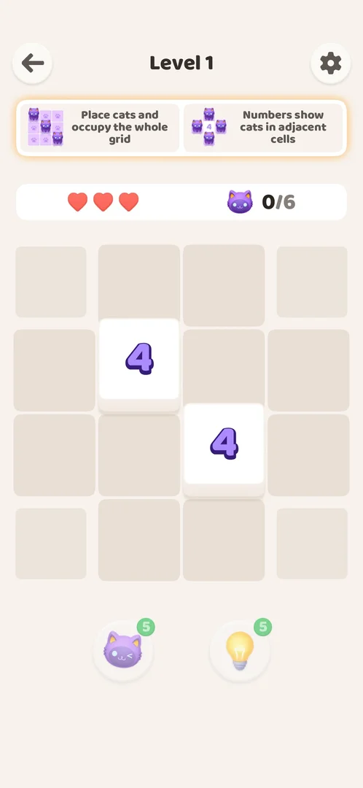

# Level progression

Home has a single "Level N" button; the back arrow in a level returns Home [s:20261001-003641-chrono-2FYKPJ#16].

## How it works
- Level screen: back arrow, gear, two rule cards, 3 hearts, a counter "0/N" (the exact number of cats
  in the solution) and two boosters [s:20261001-003641-chrono-2FYKPJ#6].
- Boards grow from 4x4 (level 1) to 10x10 (from level 15); boxes appear from level 11; level 36 was
  diamond-shaped, not a full grid [s:20261001-003641-chrono-2FYKPJ#31] [s:20261001-024647-chrono-2FYKPJ#66].
- Win screen: a praise word (Brilliant, Perfect, Incredible, ...), cats in a box, "Level N+1"; no
  reward or currency through level 55 [s:20261001-003641-chrono-2FYKPJ#37] [s:20261001-035425-chrono-2FYKPJ#31].

## Cases
| Case | What was done | Result | Source |
|---|---|---|---|
| Back | Back arrow in a level | Home with "Level N" | [s:20261001-003641-chrono-2FYKPJ#16] |
| Win screen | Won levels 1–55 | Praise word, Level N+1, no reward | [s:20261001-003641-chrono-2FYKPJ#37] |
| Irregular board | Level 36 | Diamond-shaped board | [s:20261001-024647-chrono-2FYKPJ#66] |

## Not verified
- Where the content ends (played to level 55).
