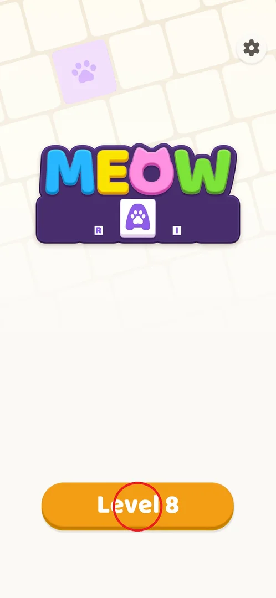
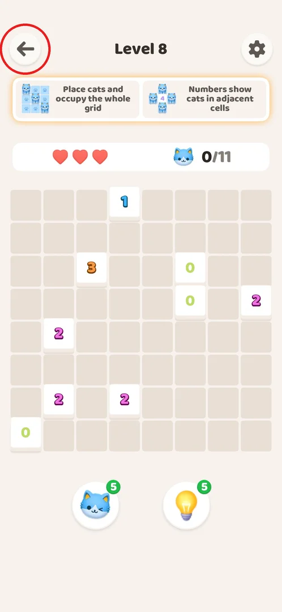
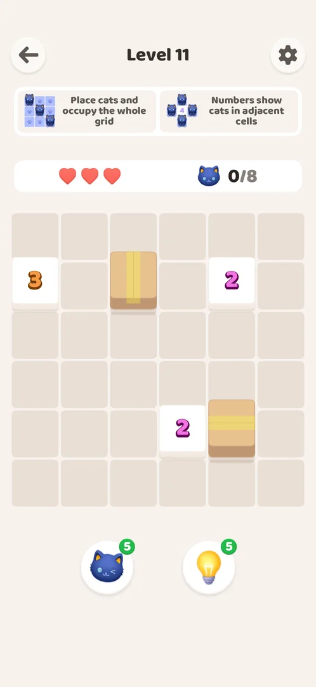
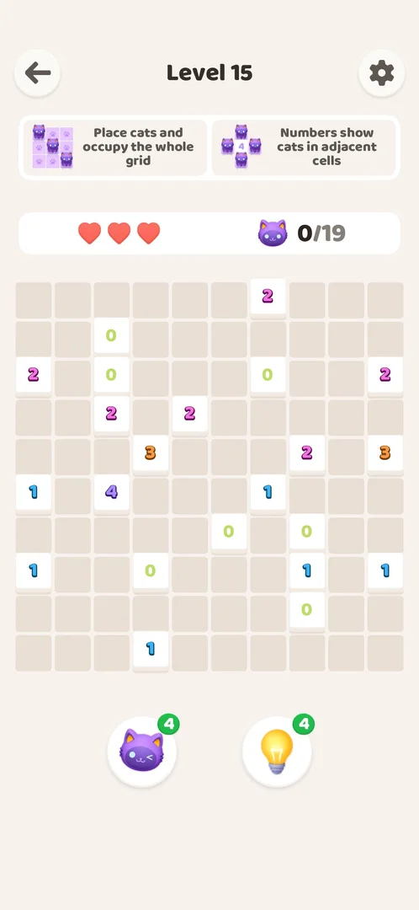
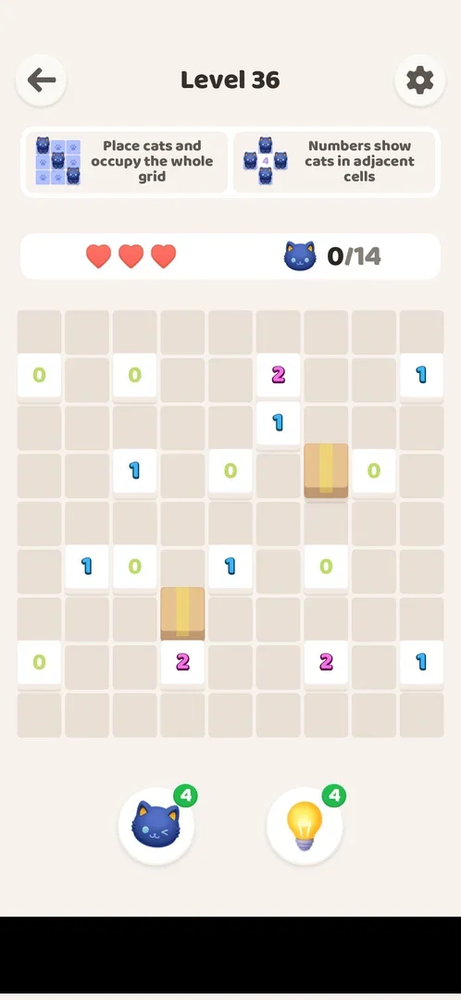
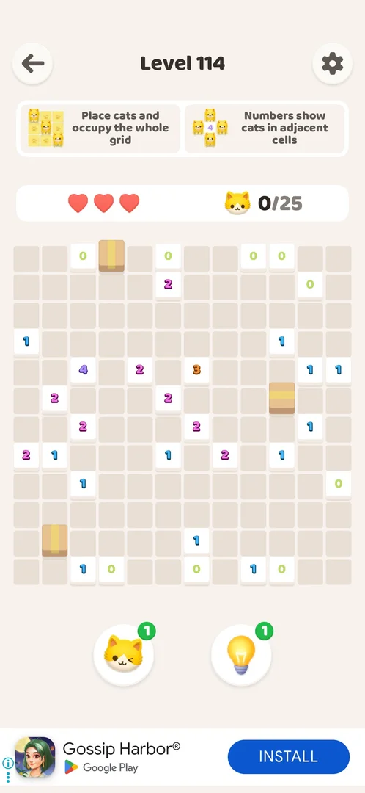
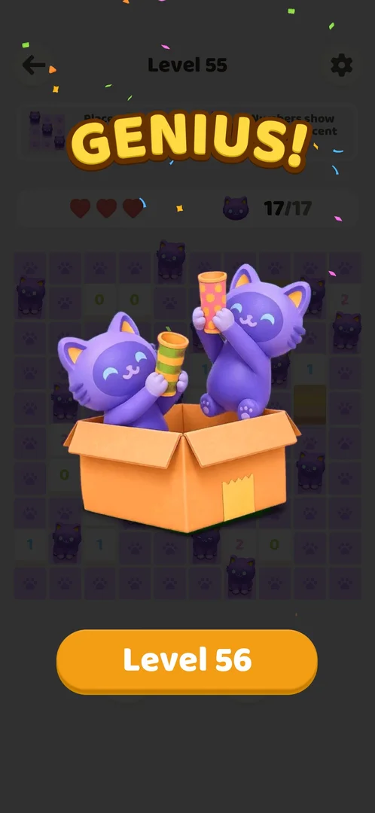
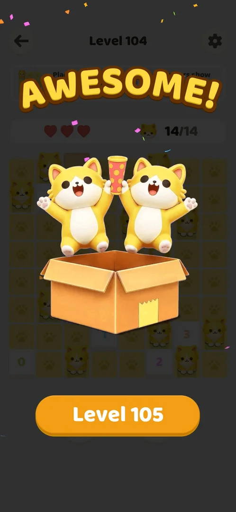

# Level progression

The game is one numbered sequence of logic puzzles: the player places cats on a grid until the whole
grid is covered, and each win opens the next level. There is no level map and no level select: Home has
a single "Level N" button for the next unbeaten level [^s1]. Winning a level gives no reward or currency,
only a praise word and the button to the next level; this held through level 55 [^s7] [^s8]. The
sequence goes on past level 120 with no new feature on the way [^s10].

## Where to find it

Home screen: the orange "Level N" button at the bottom (circled) starts the next unbeaten level. Home
also has the MEOW logo and the settings gear, and nothing else to tap for levels [^s1].

 [^s1]

## What it looks like

The level screen. From top to bottom: a back arrow, the title "Level N" and a gear; two rule cards
("Place cats and occupy the whole grid", "Numbers show cats in adjacent cells"); 3 hearts and a cat
counter "0/N", where N is the exact number of cats in the solution; the grid with numbered walls; the
cat and hint boosters, each with a count badge (5 at the start) [^s2]. Level 1 is a 4x4 grid with two
"4" walls and 6 cats to place [^s2].

 [^s2]

The hearts and the boosters have their own pages: [Hearts](hearts.md), [Cat booster](booster-cat.md),
[Hint booster](booster-hint.md). Every 10th level is a [Hard level](hard-levels.md).

## What you can do

| Tab or button | What it does |
|---|---|
| [Back arrow](#back-arrow) | Leaves the level for Home; Home still offers the same level |
| [Boxes](#boxes) | From level 11, cardboard boxes sit on some cells |
| [10x10 board](#10x10-board) | Level 15 is the first 10x10 board |
| [Level 36](#level-36) | A later board: 9x9 with boxes |
| [12x12 board](#12x12-board) | Level 114, the largest board seen: 12x12 |
| [Result](#result) | The win screen: praise word and the next-level button |

### Back arrow

The back arrow in the top-left corner of a level leads Home. Home then shows "Level N" for the same
level, so the player can resume it [^s1]. The frame is level 8 just before the back arrow was tapped; the
Home frame above is where it led [^s3].

 [^s3]

### Boxes

Level 11 is the first level with cardboard boxes on some cells: a 6x6 grid with two boxes, three number
walls and 8 cats [^s4]. A tip introduces boxes at level 11 [^s8]. The player's solver treated a box as a
wall, and it solved the level [^s4]. That boxes block cats like walls is inferred from this, not stated by
the game.

 [^s4]

### 10x10 board

Level 15 is the first 10x10 board, with 19 cats to place [^s5]. Boards grow from 4x4 on level 1 to
10x10 on level 15 [^s2] [^s5]. After that they do not stay 10x10: level 36 is 9x9 [^s6].

 [^s5]

### Level 36

Level 36 is a full 9x9 grid with two boxes and 14 cats. A banner ad is shown at the bottom of the
screen (blacked out in the frame: it showed a real person's photo and handle) [^s6].

> ⚠️ Previously (v1.0.2, 2026-10-01): "level 36 was diamond-shaped, not a full grid". The level 36
> frame at that step shows a full 9x9 grid, so the statement does not match the frame.

 [^s6]

### 12x12 board

Level 114 is a 12x12 grid with three boxes, many number walls and 25 cats to place, the largest board
seen so far [^s9]. Board sizes keep varying late in the game: in levels 108–120 they ranged from 7x7
(108, 120) through 8x8, 9x9, 10x10 and 11x11 (113) to 12x12 (114) [^s12] [^s11] [^s9] [^s10]. Apart from
level 115 (lost once and revived), each of these levels took the player 12–40 s [^s12] [^s9] [^s10].

 [^s9]

### Result

The win screen covers the board with a praise word (BRILLIANT!, PERFECT!, AWESOME!, INCREDIBLE!,
GENIUS!, ...) and an animation of cats in a box, with the full cat counter (17/17 here). The only button
is "Level N+1". No coins, chest or other reward appeared through level 55 [^s7] [^s8].

 [^s7]

The win screen of level 104 had the same layout with AWESOME!. Its "Level 105" button spans about
y 1225–1345 of the 730x1583 frame (centre about 1285); taps at y 1200–1210, just above it, the back arrow,
system Back, a swipe and a tap away from the button all left the win screen up, and a relaunch while the
game was in front kept it; a force restart landed on Home [^s13] [^s14] [^s15].

 [^s13]

## How it works

Version 1.0.2.

- Home has one "Level N" button for the next unbeaten level; the back arrow in a level returns Home [^s1].
- Level screen: back arrow, gear, two rule cards, 3 hearts, a counter "0/N" (the exact number of cats
  in the solution) and two boosters [^s2].
- Boards grow from 4x4 (level 1) to 10x10 (first at level 15) [^s2] [^s5]; later boards vary in size
  (level 36: 9x9) [^s6]; in levels 83–107 from 7x7 to 12x12 (level 102, 25 cats) [^s16]; in levels
  108–120 from 7x7 up to 12x12 (level 114, 25 cats) [^s9] [^s10].
  Boxes appear from level 11 [^s4] [^s8].
- Win screen: a praise word, cats in a box, "Level N+1"; no reward or currency through level 55
  [^s8] [^s7].

## Cases

| Case | What was done | Result | Source |
|---|---|---|---|
| Back | Tapped the back arrow in level 8 | Home with "Level 8" to resume | [^s1] |
| Win screen | Won levels 1–55 | Praise word, cats in a box, "Level N+1"; no reward or currency | [^s8] [^s7] |
| Boxes | Played level 11 | First level with boxes; solved with boxes treated as walls | [^s4] |
| Board size | Played levels 1–55 | 4x4 on level 1, first 10x10 on level 15, 9x9 on level 36 | [^s2] [^s5] [^s6] |
| Board size, late | Played levels 108–120 | 7x7 to 12x12; 11x11 on level 113, 12x12 on level 114 | [^s11] [^s9] |
| Content end | Played on to level 120 | Not reached: "Level 121" is next, no new feature appeared | [^s10] |

## Not verified

- Where the content ends (the furthest level won is 120).
- Whether boards ever get larger than 12x12.
- Whether any level has a board that is not a full rectangle (the old claim about level 36 does not
  match its frame).
- Whether boxes behave exactly like walls without a number (inferred from the solver).

[^s1]: session 20261001-003641-chrono-2FYKPJ, step 16 — [video at 7:31](https://youtu.be/mebcb05OPmo?t=451)
[^s2]: session 20261001-003641-chrono-2FYKPJ, step 6 — [video at 2:54](https://youtu.be/mebcb05OPmo?t=174)
[^s3]: session 20261001-003641-chrono-2FYKPJ, step 15 — [video at 7:27](https://youtu.be/mebcb05OPmo?t=447)
[^s4]: session 20261001-003641-chrono-2FYKPJ, step 24 — [video at 10:31](https://youtu.be/mebcb05OPmo?t=631)
[^s5]: session 20261001-003641-chrono-2FYKPJ, step 31 — [video at 14:08](https://youtu.be/mebcb05OPmo?t=848)
[^s6]: session 20261001-024647-chrono-2FYKPJ, step 66
[^s7]: session 20261001-035425-chrono-2FYKPJ, step 61
[^s8]: session 20261001-003641-chrono-2FYKPJ, step 37 — [video at 19:31](https://youtu.be/mebcb05OPmo?t=1171)
[^s9]: session 20261001-221517-chrono-2FYKPJ, step 19 — [video at 5:54](https://youtu.be/LMacAS64JRE?t=354)
[^s10]: session 20261001-221517-chrono-2FYKPJ, step 41 — [video at 15:01](https://youtu.be/LMacAS64JRE?t=901)
[^s11]: session 20261001-221517-chrono-2FYKPJ, step 18 — [video at 5:50](https://youtu.be/LMacAS64JRE?t=350)
[^s12]: session 20261001-221517-chrono-2FYKPJ, step 2 — [video at 0:42](https://youtu.be/LMacAS64JRE?t=42)
[^s13]: session 20261001-175856-chrono-2FYKPJ, step 3
[^s14]: session 20261001-175856-chrono-2FYKPJ, step 13
[^s15]: session 20261001-175856-chrono-2FYKPJ, step 14
[^s16]: session 20261001-174614-chrono-2FYKPJ, step 10
