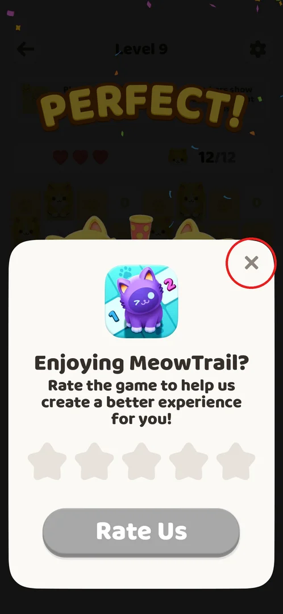
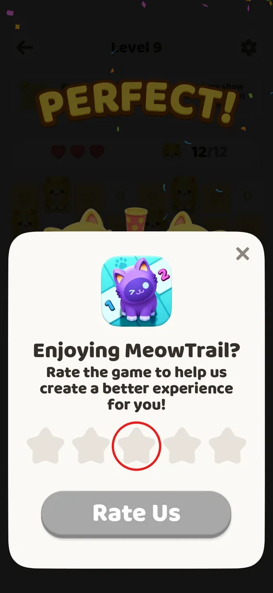
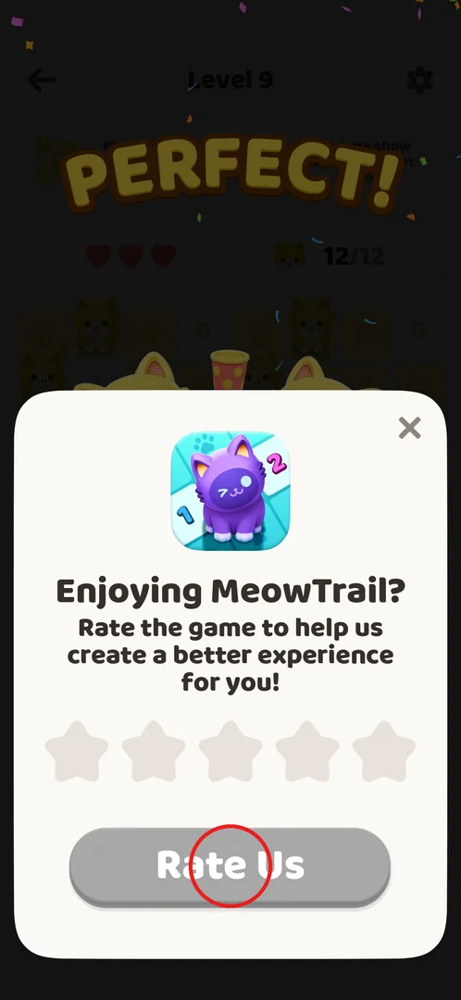
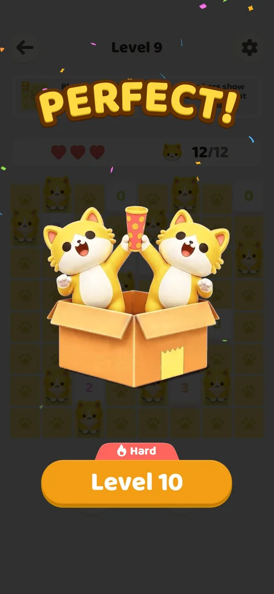

# Rate us prompt

A one-time popup that asks the player to rate the game ("Enjoying MeowTrail?") with one to five
stars. It pops up by itself over the win screen of level 9 on a fresh install; closing it with the X
costs nothing and lets play go on.[^s1][^s2]

## Where to find it

<!-- no-entry: the popup has no button that opens it; it appears on its own over the "PERFECT!" win screen right after level 9 is won, so the route is "win level 9" -->

There is no button to open it: it appears on its own over the "PERFECT!" win screen as soon as
level 9 is won (here on a fresh install, first run).[^s1] The level 9 board before the win:
8×8, 12 cats to place.[^s1]

## What it looks like

 [^s1]

A white sheet over the bottom half of the dimmed win screen: the game icon (a purple cat), the title
"Enjoying MeowTrail?", the line "Rate the game to help us create a better experience for you!", a row
of five empty stars, a grey **Rate Us** button and a close **X** in the top right corner.[^s1]

## What you can do

| Tab or button | What it does |
|---|---|
| [Close](#close) | Closes the popup; the win screen with the next-level button is back |
| [Stars](#stars) | Picks a rating of 1–5 stars (not tapped) |
| [Rate Us](#rate-us) | Sends the rating; grey until a star is chosen (not tapped) |

### Close

 [^s1]

The X at the popup's top right closes the popup with no further question.[^s2] Behind it is the level 9 win
screen with the orange **Level 10** button tagged "Hard" (see [Result](#result)).[^s2]

### Stars

 [^s1]

Five empty stars in a row. They were not tapped, so what a low or a high rating leads to is not
known (see [Not verified](#not-verified)).

### Rate Us

 [^s1]

The **Rate Us** button is grey while no star is chosen.[^s1] That it turns active once a star is
picked is inferred from the grey state; it was not tapped.

### Result

 [^s2]

## How it works

- Version 1.0.2: shown once, after winning level 9, on a fresh install.[^s1]
- Closed with the X, it did not come back while levels 19–48 were won in the next session.[^s3]
  The session after that won levels 49–55 and recorded no rate-us popup either (inferred from its
  summary, which does not mention one).[^s4]
- No reward is offered for rating.[^s1]

## Cases

| Case | What was done | Result | Source |
|---|---|---|---|
| Appear | Won level 9 | The popup appears over the win screen | [^s1] |
| Close | X | Closed; back on the win screen with Level 10 (Hard); it did not come back through level 48 (no record of it through level 55) | [^s2] [^s3] [^s4] |
| Stars | — | Not verified: low vs high rating (feedback form vs Play Store review) | |

## Not verified

- What a low and a high star rating lead to (a feedback form or a Play Store review); needs a fresh
  install, since the popup was shown only once.
- Whether Rate Us turns active after a star is chosen.

[^s1]: session 20261001-003641-chrono-2FYKPJ, step 20 — [video at 8:39](https://youtu.be/mebcb05OPmo?t=519)
[^s2]: session 20261001-003641-chrono-2FYKPJ, step 21 — [video at 9:17](https://youtu.be/mebcb05OPmo?t=557)
[^s3]: session 20261001-024647-chrono-2FYKPJ, step 109
[^s4]: session 20261001-035425-chrono-2FYKPJ, step 61
