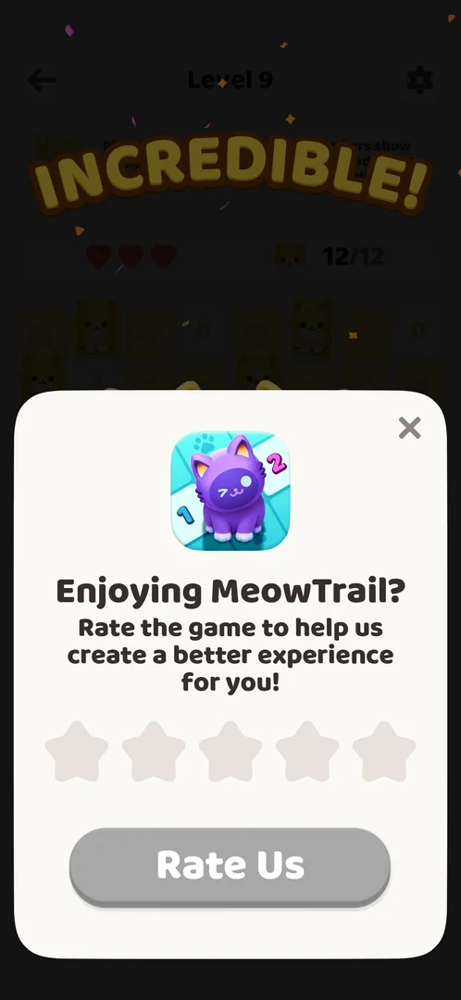

# Rate us prompt

A card that asks the player to rate the game with one to five stars. It came up by itself over the win screen of Level 9; it was closed with its X, so what the stars and the Rate Us button do is not known yet (version 1.0.2) [^s1] [^s2].

## Why it appeared

After winning Level 9: the "Incredible!" win banner came first, then the card rose over it [^s1]. Whether it is tied to Level 9, to a count of wins or to play time is not known.

## Where to find it

<!-- no-entry: it opens by itself over the Level 9 win screen; no control leads to it -->

It opens by itself over the win screen of Level 9; no button in the game was seen that opens it (the [Settings](settings.md) sheet has no Rate us link) [^s1].

## What it looks like

A white card over the lower two thirds of the dimmed win screen. From top to bottom: a close X at the top right; the game's icon (a purple cat on a numbered board); the title "Enjoying MeowTrail?" and a line asking for a rating to help improve the game; a row of five grey stars; and a wide grey "Rate Us" button. The button stays grey while no star is chosen (inferred: disabled until a star is tapped) [^s1].

 [^s1]
*The card as it first appears; the X at the top right closes it*

## What you can do

| Tab or button | What it does |
|---|---|
| [Close](#close) | Closes the card and shows the win screen |
| [Stars and Rate Us](#stars-and-rate-us) | Not tried |

### Close

<!-- no-frame: the X is on the frame above; the frame after it is the Hard levels entry frame -->

The X at the top right closed the card; the Level 9 win screen came back with its Level 10 button, which carried the Hard badge (see [Hard levels](hard-level.md)) [^s2].

### Stars and Rate Us

<!-- no-frame: not tried -->

Not tried: what a low or a high rating leads to (the Play Store, a feedback form, nothing), and whether Rate Us leaves the game.

## How it works

- Seen once, after the win of Level 9, in a session that played Levels 4 to 20; no second rate card was recorded after Levels 10 to 20 (version 1.0.2) [^s1] [^s3].

## Cases

| Case | What was done | Result | Source |
|---|---|---|---|
| Why it appeared: the trigger that brought it up <!-- case:chk-appeared --> | Won Level 9 | The card came up after the Incredible! banner | ✅ [^s1] |
| Where to find it: the screen and the button that open it <!-- case:chk-entry --> | — | not verified: opens by itself; no button seen |  |
| What it looks like: its screen <!-- case:chk-screen --> | — | not verified in the map; the frame above shows it |  |
| Every option or button and what it changes <!-- case:chk-options --> | Tapped the X | not verified: stars and Rate Us not tried |  |
| For a prompt: what each answer does and whether it comes back <!-- case:chk-answers --> | Closed with X, played on to Level 20 | not verified: did not come back through Level 20; a rating not given |  |
| Links out: where they lead <!-- case:chk-links --> | — | not verified: Rate Us not tapped |  |

## Not verified

- Where to find it: whether any control opens it again; seen only by itself after Level 9 <!-- case:chk-entry -->
- What it looks like: the frame is on this page, the map case is still open <!-- case:chk-screen -->
- What each star count does, and whether Rate Us is disabled until a star is chosen <!-- case:chk-options -->
- What each answer does and whether the card comes back (after X it did not return through Level 20) <!-- case:chk-answers -->
- Where Rate Us leads (the Play Store or an in-app review) <!-- case:chk-links -->

[^s1]: session 20261005-080420-chrono-2FYKPJ, step 26 — [video at 6:46](https://youtu.be/bJ144EFaJEE?t=406)
[^s2]: session 20261005-080420-chrono-2FYKPJ, step 27 — [video at 7:19](https://youtu.be/bJ144EFaJEE?t=439)
[^s3]: session 20261005-080420-chrono-2FYKPJ, step 56 — [video at 19:49](https://youtu.be/bJ144EFaJEE?t=1189)
