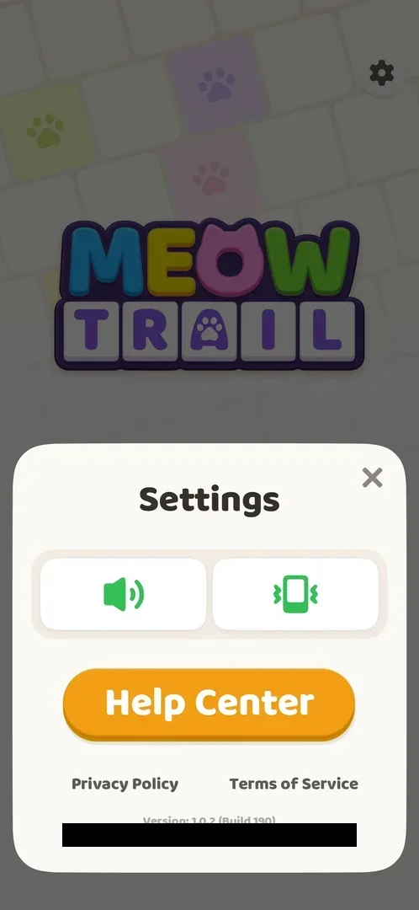

# Settings

A sheet over the lower half of the screen, opened by the settings gear: sound and vibration toggles, a Help Center button, links to the Privacy Policy and the Terms of Service, and the game's version and the player's user ID [^s2].

## Why it appeared

The gear is on the Home and level screens [^s1].

## Where to find it

The gear at the top right of the [Home screen](home.md) [^s1]; the same gear is at the top right of every level screen [^s3].

 [^s1]
*The gear at the top right of Home*

## What it looks like

A white sheet in the lower half of the screen, the rest dimmed. From top to bottom: the title "Settings" with a close X at the right; two large toggles, a speaker (sound) and a vibrating phone (vibration), both green; the orange Help Center button; the links Privacy Policy and Terms of Service; and in small grey text "Version: 1.0.2 (Build 190)" and the user ID (blacked out on the frame) [^s2].

 [^s2]
*The Settings sheet over Home*

## What you can do

| Tab or button | What it does |
|---|---|
| [Sound](#sound) | A toggle; not tried |
| [Vibration](#vibration) | A toggle; not tried |
| [Help Center](#help-center) | Opens the Help Center; not opened |
| [Privacy Policy and Terms of Service](#privacy-policy-and-terms-of-service) | Links; not opened |
| [Close](#close) | Closes the sheet |

### Sound

<!-- no-frame: on the Settings frame above; not toggled -->

The left toggle with a speaker icon, green when the session opened the sheet (inferred: on) [^s2].

### Vibration

<!-- no-frame: on the Settings frame above; not toggled -->

The right toggle with a vibrating phone icon, green (inferred: on) [^s2].

### Help Center

<!-- no-frame: on the Settings frame above; not opened -->

See [Help Center](help-center.md).

### Privacy Policy and Terms of Service

<!-- no-frame: on the Settings frame above; not opened -->

Two grey text links under the Help Center button. The same documents are linked from the [Terms consent](consent.md) card.

### Close

<!-- no-frame: on the Settings frame above -->

The X at the top right of the sheet; it closed the sheet and showed Home again [^s4].

## How it works

- Version shown: 1.0.2 (Build 190) [^s2].
- No notification, language or account options on the sheet (version 1.0.2) [^s2].

## Cases

| Case | What was done | Result | Source |
|---|---|---|---|
| Gear on Home and on the level screen <!-- case:chk-entry --> | Tapped the gear on Home | The sheet opened | ✅ [^s2] |
| Bottom sheet: sound and vibration toggles, Help Center, Privacy Policy, Terms of Service, version 1.0.2 (Build 190), user id, close X <!-- case:chk-screen --> | Opened Settings | The sheet as described | ✅ [^s2] |
| Why it appeared: the trigger that brought it up <!-- case:chk-appeared --> | — | The gear on Home and levels | ✅ [^s1] |
| Every option or button and what it changes <!-- case:chk-options --> | Closed with X | not verified: the toggles were not tried |  |
| For a prompt: what each answer does <!-- case:chk-answers --> | — | not verified: no prompt in Settings |  |
| Links out: where they lead <!-- case:chk-links --> | — | not verified |  |

## Not verified

- What the sound and vibration toggles change, and whether opening Settings from a level pauses it <!-- case:chk-options -->
- Answers: Settings has no prompt; nothing to check unless a toggle asks for confirmation <!-- case:chk-answers -->
- Where the Help Center, Privacy Policy and Terms of Service lead <!-- case:chk-links -->

[^s1]: session 20261003-200925-chrono-2FYKPJ, step 12 — [video at 1:31](https://youtu.be/JOMuD_cF8gM?t=91)
[^s2]: session 20261003-200925-chrono-2FYKPJ, step 13 — [video at 1:42](https://youtu.be/JOMuD_cF8gM?t=102)

[^s3]: session 20261003-200925-chrono-2FYKPJ, step 9 — [video at 0:36](https://youtu.be/JOMuD_cF8gM?t=36)
[^s4]: session 20261003-200925-chrono-2FYKPJ, step 14 — [video at 1:59](https://youtu.be/JOMuD_cF8gM?t=119)
