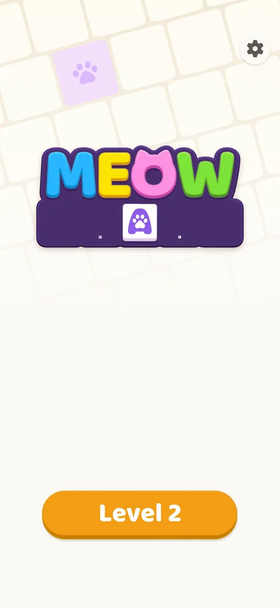
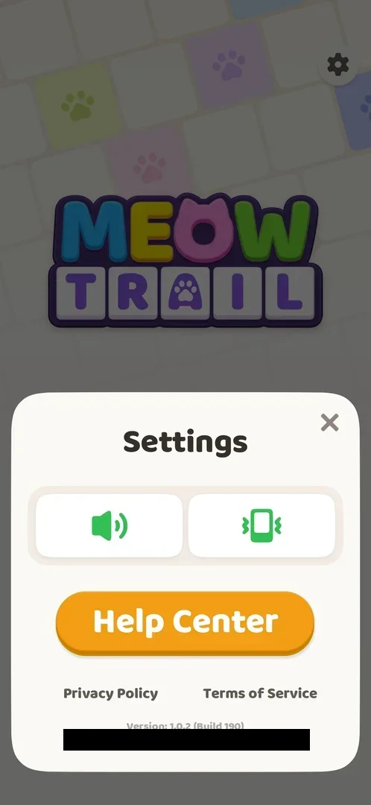
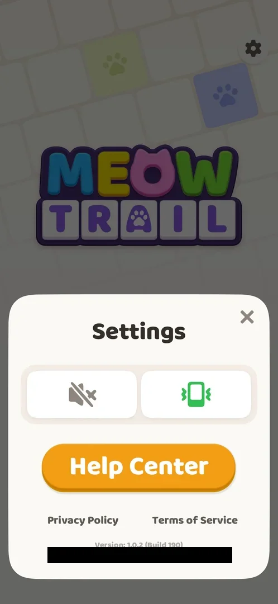
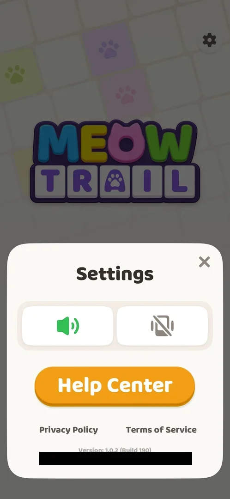
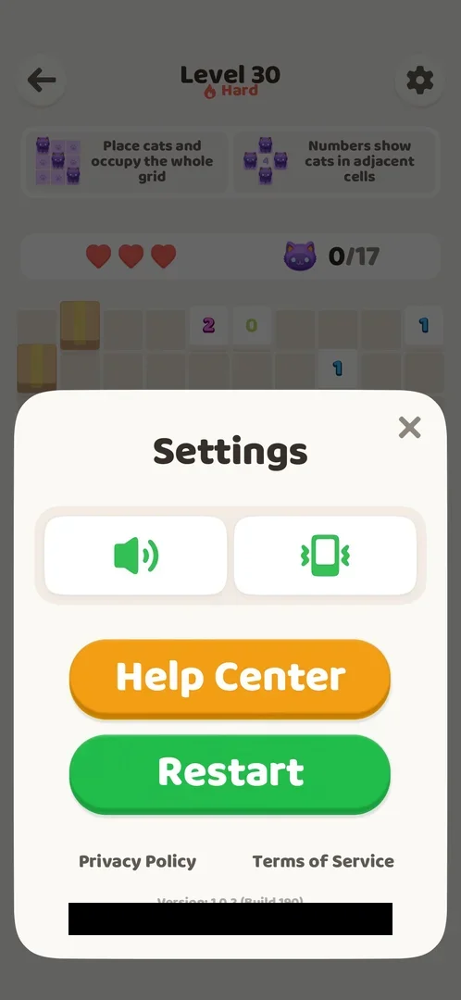

# Settings

A sheet over the lower half of the screen, opened by the settings gear: a sound toggle and a vibration toggle, a Help Center button, links to the Privacy Policy and the Terms of Service, and the game's version and the player's user ID; opened from inside a level, it also has a green Restart button. There is no notification, language or account option (version 1.0.2) [^s2] [^s6].

## Why it appeared

The gear is on the Home and level screens [^s1].

## Where to find it

The gear at the top right of the [Home screen](home.md) [^s1]; the same gear is at the top right of every level screen [^s8]. The sheet opened from a level has one more button, Restart (see [Restart](#restart)) [^s9].

 [^s1]
*The gear at the top right of Home*

## What it looks like

A white sheet in the lower half of the screen, the rest dimmed. From top to bottom: the title "Settings" with a close X at the right; two large toggles, a speaker (sound) and a vibrating phone (vibration), both green when on; the orange Help Center button; the links Privacy Policy and Terms of Service; and in small grey text "Version: 1.0.2 (Build 190)" and the user ID (blacked out on the frames) [^s2].

 [^s2]
*The Settings sheet over Home, both toggles on*

## What you can do

| Tab or button | What it does |
|---|---|
| [Sound](#sound) | Turns the game's sound off and on |
| [Vibration](#vibration) | Turns vibration off and on |
| [Help Center](#help-center) | Opens the Help Center |
| [Restart](#restart) | Only on the sheet opened from a level; resets the level after an interstitial ad |
| [Privacy Policy and Terms of Service](#privacy-policy-and-terms-of-service) | Open the documents in the phone's browser |
| [Close](#close) | Closes the sheet |

### Sound

The left toggle. One tap turned the green speaker into a grey speaker with a cross (off); a second tap turned it green again (on) [^s3] [^s6].

 [^s3]
*Sound off: the grey speaker on the left*

### Vibration

The right toggle. One tap turned the green vibrating phone into a grey crossed-out phone (off); a second tap turned it green again (on) [^s4] [^s6].

 [^s4]
*Vibration off: the grey phone on the right*

### Help Center

<!-- no-frame: on the Settings frame above; the Help Center's own screen is on its page -->

Opens the HelpShift support page; see [Help Center](help-center.md) [^s6].

### Restart

The gear inside a level opens the same sheet with a green Restart button between Help Center and the document links; the sheet opened from Home has no such button (seen on Level 30, a [Hard level](hard-level.md), with the board still empty) [^s9]. The level behind the sheet stays visible, dimmed. The Help Center's article on restarting says this button restarts the level and clears its progress [^s10]. Tapped on Level 30 with one correct and one wrong cat and 2 of 3 hearts: no confirmation, a full-screen [interstitial ad](interstitial-ad.md) first (it ended in the Play Store), then the level empty with 3 hearts and the booster balances unchanged (see [Akari level](core-level.md#settings-gear)) [^s11].

 [^s9]
*The Settings sheet over a level, with Restart*

### Privacy Policy and Terms of Service

<!-- no-frame: the documents open in another app (the browser) -->

Two grey text links under the Help Center button. Privacy Policy opened the document in Chrome, outside the game; returning to the game showed the Settings sheet again [^s6]. Terms of Service opens the same way (an earlier session, see [Terms consent](consent.md)). The same documents are linked from the Terms consent card.

### Close

<!-- no-frame: on the Settings frame above -->

The X at the top right of the sheet; it closed the sheet and showed Home again [^s7].

## How it works

- Version shown: 1.0.2 (Build 190) [^s2].
- Two toggles only, sound and vibration, both on by default (green on the first opening) [^s5]; each toggles with one tap and shows its state by colour and a crossed icon [^s6].
- No notification, language or account options on the sheet, and no link to the phone's notification permission (version 1.0.2) [^s2] [^s6].
- Two variants of the sheet: from Home without Restart, from a level with Restart (version 1.0.2) [^s9].
- Whether opening Settings from a level pauses it was not checked.

## Cases

| Case | What was done | Result | Source |
|---|---|---|---|
| Gear on Home and on the level screen <!-- case:chk-entry --> | Tapped the gear on Home | The sheet opened | ✅ [^s5] |
| Bottom sheet: sound and vibration toggles, Help Center, Privacy Policy, Terms of Service, version 1.0.2 (Build 190), user id, close X <!-- case:chk-screen --> | Opened Settings | The sheet as described | ✅ [^s5] |
| Why it appeared: the trigger that brought it up <!-- case:chk-appeared --> | — | The gear on Home and levels | ✅ [^s1] |
| Every option or button and what it changes <!-- case:chk-options --> | Tapped each toggle off and back on | Sound: green speaker to grey muted icon and back; vibration: green to grey crossed phone and back; both left on. No notification toggle | ✅ [^s6] |
| For a prompt: what each answer does <!-- case:chk-answers --> | Looked through the sheet | No prompt in Settings; no notification toggle or permission link | ✅ [^s6] |
| The sheet opened from a level <!-- case:in-level-sheet --> | Opened the gear on Home and inside Level 30 | The same sheet; from the level it has a green Restart button under Help Center, from Home not | ✅ [^s9] |
| Links out: where they lead <!-- case:chk-links --> | Tapped Privacy Policy, then returned to the game | Privacy Policy opens in Chrome; the game comes back on the Settings sheet; Terms of Service the same (earlier session); Help Center opens the HelpShift page | ✅ [^s6] |

## Not verified

- Whether opening Settings from a level pauses the level (not a map case)

[^s1]: session 20261003-200925-chrono-2FYKPJ, step 12 — [video at 1:29](https://youtu.be/JOMuD_cF8gM?t=89)
[^s2]: session 20261005-080420-chrono-2FYKPJ, step 1 — [video at 0:16](https://youtu.be/bJ144EFaJEE?t=16)
[^s3]: session 20261005-080420-chrono-2FYKPJ, step 2 — [video at 0:26](https://youtu.be/bJ144EFaJEE?t=26)
[^s4]: session 20261005-080420-chrono-2FYKPJ, step 4 — [video at 0:39](https://youtu.be/bJ144EFaJEE?t=39)
[^s5]: session 20261003-200925-chrono-2FYKPJ, step 13 — [video at 1:39](https://youtu.be/JOMuD_cF8gM?t=99)
[^s6]: session 20261005-080420-chrono-2FYKPJ, step 7 — [video at 1:09](https://youtu.be/bJ144EFaJEE?t=69)
[^s7]: session 20261003-200925-chrono-2FYKPJ, step 14 — [video at 1:59](https://youtu.be/JOMuD_cF8gM?t=119)

[^s8]: session 20261003-200925-chrono-2FYKPJ, step 9 — [video at 0:36](https://youtu.be/JOMuD_cF8gM?t=36)

[^s9]: session 20261006-002027-chrono-2FYKPJ, step 47 — [video at 9:42](https://youtu.be/u0n3VnemzrQ?t=582)
[^s10]: session 20261006-002027-chrono-2FYKPJ, step 41 — [video at 8:53](https://youtu.be/u0n3VnemzrQ?t=533)
[^s11]: session 20261006-023308-chrono-2FYKPJ, step 5 — [video at 2:39](https://youtu.be/bbcco3ENaxU?t=159)
